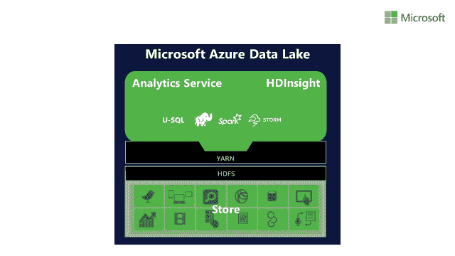
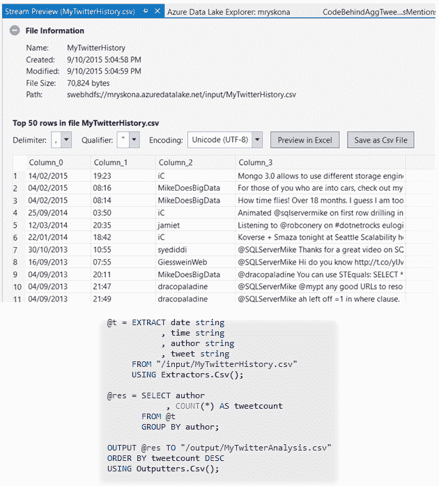

# 认识一下 U-SQL:微软的大数据新语言

> 原文：<https://thenewstack.io/meet-u-sql-microsofts-new-language-big-data/>

微软展示了其新兴云堆栈的另一部分，用于大数据分析。

周一，该公司宣布已经制定了一种新的查询语言，称为 U-SQL，旨在运行在 Azure [数据湖存储](https://azure.microsoft.com/en-us/solutions/data-lake/)上，微软计划在年底前以预览模式推出。

微软将数据湖商店定位为分析大规模非结构化数据的服务。它旨在支持为 Hadoop 文件系统(HDFS)构建的工具，但承诺比在内部运行 Hadoop 或 Spark 集群更容易管理。

微软[在四月份宣布了](https://azure.microsoft.com/en-us/blog/introducing-azure-data-lake/)Azure 数据湖，但 U-SQL 最终回答了如何从数据湖收集的数 Pb 企业数据中提取有用信息的问题。这是该公司开始思考简化大数据分析流程的方法的地方。

U-SQL 适合 Azure 数据湖存储的地方

大多数组织已经拥有某种大数据，如日志文件、客户购买记录、视频片段，但并不真正具备利用这些大数据的高级内部编程能力。然而，许多人确实有微软的技术人员。

“微软的目标是让大数据技术变得更简单，让尽可能多的人更容易使用，”微软 Hadoop、大数据和数据仓库产品营销经理 Oliver Chiu 在电子邮件中写道。

因此，微软构建了 U-SQL，将 SQL 的声明式熟悉性与编程语言的表达能力相融合，在这种情况下是微软的 C#。理论上，它结合了两个世界的优点。

“我们听说许多数据工程师难以用当今的工具处理数据。基于代码的解决方案提供了强大的功能，但是学习起来很复杂；基于 SQL 的工具易于开始，但难以扩展，”Chiu 写道。

微软大数据首席项目经理 Michael Rys 的博客文章对此进行了更详细的描述。

U-SQL 提供了一种将 SQL 关键字与语法 C#表达式混合在一起的方法，这样，在一个脚本中，程序员可以将来自非结构化源的数据模式化，使用 SQL 将数据聚合成所需的形式，然后将输出写入文件或表中。U-SQL 的编程能力提供了一种在多个步骤中处理数据的方法，为复杂的分析奠定了基础。

对 Twitter 用户网络中每个作者的帖子进行计数所需的 U-SQL 代码，保存在 CSV 文件中。来自微软 Visual Studio 博客。

只有时间才能证明 U-SQL 的方法是否会让大数据分析更受欢迎。然而，一些微软商店已经开始尝试了。

比利时 IT 服务公司 [Codit](http://www.codit.eu/) 一直在测试这项技术，并考虑到大数据工作:它正在开发一个系统，将智能家居电表的使用数据与能源现货市场价格结合起来，以强调回调电力可以节省最多资金的时间。

Codit 首席技术官萨姆·范霍特(Sam Vanhoutte)在一封电子邮件中写道，对于 Codit 来说，Azure Data Lake 有望让该公司能够测试和构建这样的大数据服务，而无需担心底层基础设施。

同样节省时间的是，那些已经知道 SQL 和 C#的人应该熟悉 U-SQL，从而最大限度地减少开发人员学习其他语言所需的时间。“如果你懂两种语言，那就很容易跟上进度，”范霍特写道。

用一个工具来查询 SQL、NoSQL 和其他非结构化数据源也很方便。

澳大利亚 IT 写道:“我喜欢拥有一个标准工具的想法，它将允许我查询各种基于 NoSQL 或 Hadoop 的大数据服务。”。网络顾问迈克尔·派恩在推特上直接留言说。他指出，越来越多的公司正在将他们的数据转移到云端，因此像 U-SQL 这样的技术可能具有潜在的价值。

Pine 写道:“对我来说，关键的需求是一种工具，它允许我以一致的方式跨各种数据源获取数据。”

Vanhoutte 警告说，U-SQL 和 Azure Data Lake Store 的结合不能解决所有大数据用例。如果你想在微软云中进行一些机器学习或流处理，你必须熟悉其他 Azure 技术，例如分别为[机器学习](https://azure.microsoft.com/en-us/services/machine-learning/)和[流分析](https://azure.microsoft.com/en-us/services/stream-analytics/)。

另一个潜在的限制是 U-SQL 的特殊性质:微软没有说明 U-SQL 是否可用于非 Azure，甚至非微软平台。“我们正在围绕 U-SQL 收集客户和市场反馈，以确定我们未来的行动，”Chiu 写道。

该公司确实指出，除了数据湖存储，U-SQL 还可以用于查询 Azure SQL 数据库和 Azure SQL 数据仓库中的数据。

可以肯定的是，还有其他将 SQL 与编程语言挂钩相结合的替代方案，比如 [Spark SQL](http://spark.apache.org/sql/) 和 Teradata 的 SQL-MapReduce。

“基本上，这听起来像是微软在它有围墙的花园里种花，以模仿外面已经生长了一段时间的东西，”IT 分析公司 [Monash Research](http://www.monash.com/) 的负责人 Curt Monash 发电子邮件说。

<svg xmlns:xlink="http://www.w3.org/1999/xlink" viewBox="0 0 68 31" version="1.1"><title>Group</title> <desc>Created with Sketch.</desc></svg>