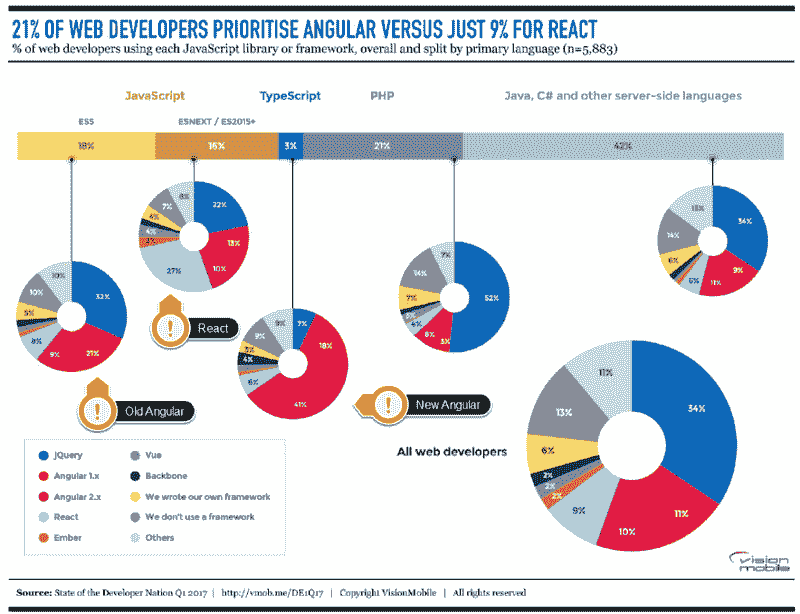

# 了解 Vue.js，灵活的 JavaScript 框架

> 原文：<https://thenewstack.io/meet-vue-js-flexible-javascript-framework/>

基于 JavaScript 的 [Vue.js](https://vuejs.org/) 前端框架自 2014 年首次发布以来就越来越受欢迎。最近的一个 [Quora 问题](https://www.quora.com/How-popular-is-VueJS-in-the-industry)追踪了框架的成长，并将其与 [Angular](https://angularjs.org/) 和 [React](https://facebook.github.io/react/) 进行了比较。今年，这个框架继续受欢迎，即使在大多数其他非谷歌、非脸书前端框架 JavaScript 框架都在走下坡路的时候。

这种流行和增长的原因似乎是框架的灵活性。Vue.js 不像其他流行的 JavaScript 框架那样，试图强迫你用一种特定的方式做事。这意味着小框架在成为一个更大的应用程序的一个小部分时，就像它是整个前端一样。

上个月， [Vue.js](https://github.com/vuejs/vue) 社区的中心在波兰举行了 [VueConf](https://conf.vuejs.org/) ，在那里，最优秀和最聪明的人谈论了这个框架，以及它是如何发展的。我们采访了会议组织者之一的 Damian Dulisz，他是波兰“rendezvous”之后 Vue.js 框架的贡献者(懂了吗？)，并向他询问了一些关于项目及其用户的问题。

**vue conf 怎么样？**

VueConf 是一次独一无二的经历，对我来说可能是我作为开发人员所面临的最大挑战。来自世界各地的大约 350 人来到波兰弗罗茨瓦夫。我认为这是一个巨大的成功，因为对于大多数与会者来说，这是一个陌生的城市。我可以说“大多数”，因为大约 3/4 的与会者不是来自波兰。

我觉得每一场讲座都很好，但我作为组织者可能会有偏见。然而，我真的很喜欢罗曼库巴关于测试的演讲——他与观众有着难以置信的联系。[菲利帕·拉塞达](https://twitter.com/filipalacerda)也[就 GitLab](https://www.youtube.com/watch?v=-69tKcl1oTE) 将其应用程序迁移到 Vue 的方法发表了非常有见地的讲话。大部分的谈话已经在我们的 YouTube 频道上了。还有一个非常酷的电影！

[https://www.youtube.com/embed/TsgdiXGWlIY?feature=oembed](https://www.youtube.com/embed/TsgdiXGWlIY?feature=oembed)

视频

**你过去在前端开发中遇到的问题有哪些是通过使用 Vue 解决的？**

我认为这真的取决于你想追溯到过去多久，因为所有现代前端框架都试图解决类似的问题。

我认为 Vue 真正闪光的地方是让复杂的事情变得更容易理解。它不像 React 那样冗长，因为它自动化了可重复的东西，但与 Angular 和 [Ember](https://www.emberjs.com/) 等框架相比，它仍然保持了很小的 API 面。由于 API 的设计方式，这也使得编写次优代码或糟糕的代码变得更加困难。

此外，我真正喜欢的是单文件组件的想法，它将模板(它只是一种用于呈现功能的领域特定语言[DSL]——不像一些流行的观点)、JavaScript 部分和样式连接成一个自包含的组件。这使得代码更容易理解和推理。在开发代理模型中尤其如此，在这种模型中，项目内部的人员往往会更频繁地轮换。这使得向项目中引入新人变得更加容易，并且大大缩短了这个人高效工作所需的时间。

**您为什么选择在客户工作中使用 Vue？是否有特定的好处、投资回报率或其他因素让你选择了它？**

有几个原因，但我认为最重要的是 Vue 的灵活性。它真的配得上“进步框架”这个名字！我认为这对于一个机构来说非常重要，因为我们的项目范围很广。不是每个项目都需要一个完整的单页应用程序。

不是每个项目都是从零开始的。当然，一个人应该总是根据项目需求选择正确的工具。然而，有时你只想从小处着手，快速行动。Vue 可以以同样有效的方式使用，既可以作为一个简单的没有构建步骤的 jQuery 替换，也可以作为一个服务器端呈现的同构应用程序以及两者之间的任何东西。只要看看上面提到的关于 GitLab 的演讲，就能了解更多关于他们从 jQuery 到 Vue 的转变。所有这些都不需要大规模的重构。它可以随着您的项目一起成长，并很容易根据项目需求进行调整。

此外，能够在多个用例中使用同一个工具有助于整个公司内部的整体知识交流。跨项目的代码审查也容易得多。

**社区有多大？Vue 动作快吗？太快了？稳定吗？**

我得说它实际上已经很大了。VueConf 可能就是一个很好的例子。这个社区也在 Vue 官方论坛和 Gitter 频道等地方蓬勃发展。最近还有一个官方的[不和频道](https://discord.me/)。一个大的社区也意味着广泛的支持库，这就是它目前的样子——看看 [awesome-vue](https://github.com/vuejs/awesome-vue) 就知道了。此外，Vue 核心团队正在开发由 Vue 管理的库，这是一个针对不同问题的经过实战检验的推荐库列表，应该可以解决一些“疲劳”我已经感觉到在生态系统中有一个图书馆可以满足你的一切需求。

Vue 动作快吗？当然可以。太快了？不会这么说。稳定吗？肯定是的！

[尤雨溪](http://evanyou.me/) , (Vue 创建者)和核心团队都非常清楚哪些特性应该加入核心库(不仅仅是 Vue 本身，还有 [vue 路由器](https://router.vuejs.org/en/)、 [vuex](https://github.com/vuejs/vuex) 等等)。尽管 2.0 版本完全重写了，但迁移并不费力，因为大多数 API(超过 90%)保持不变。该团队还发布了 vue-migration-helper ,它可以分析你的应用程序，并生成所需更改的列表，如何实现它们，以及为什么经常建议已经迁移的代码。不仅仅是对 Vue 本身，对支持库也是如此。

**你希望在 Vue 的未来看到什么？新增内容、新功能？修复的问题？**

实际上，我认为现在的 API 很棒。我希望看到的新增内容大多与测试体验有关——目前还可以，但可以改进。令人欣慰的是，正如我们所说的，一些贡献者和核心团队的成员正在努力工作。我认为我们可以期待一个真正有用的测试库和一个易懂的指南。

然而，我希望得到一些爱的是最近转移到 Apache 基金会的[Weex](https://weex.incubator.apache.org/)(Vue 的一个类似 React-native 的解决方案)。从技术上来说，它已经可以投入生产，几家中国公司已经在使用它(其中包括[阿里巴巴](https://www.alibaba.com/))，遗憾的是，由于学习资源有限，它在亚洲以外仍然是一个谜。希望未来几个月情况会有所好转。

通过 Pixabay 的特征图像。

<svg xmlns:xlink="http://www.w3.org/1999/xlink" viewBox="0 0 68 31" version="1.1"><title>Group</title> <desc>Created with Sketch.</desc></svg>