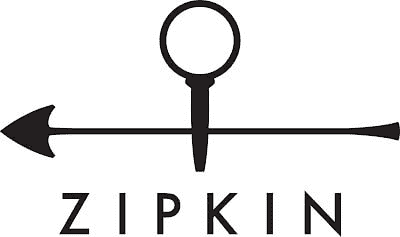
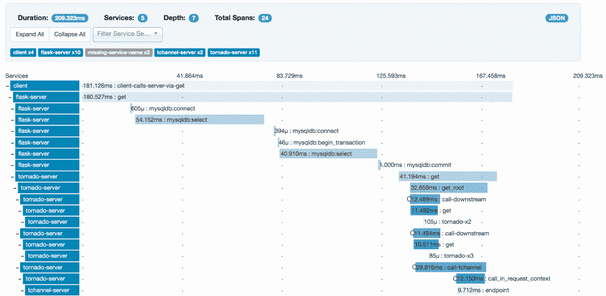

# 了解 Zipkin:调试微服务的跟踪器

> 原文：<https://thenewstack.io/meet-zipkin-tracer-debugging-microservices/>

对于开发人员来说，调试一个复杂的应用程序是一项非常困难的任务，但是跟踪一个跨越组成分布式应用程序的一组微服务的延迟问题就更加困难了。传统的跟踪工具，如 [DTrace](http://dtrace.org/blogs/about/) ，是为跟踪单个 CPU 上的单个进程而构建的。

【T2

为了帮助微服务调试，许多组织转向了 Zipkin，这是一款开源的微服务跟踪器，最初由 Twitter 开发，用于跟踪 Web 请求在不同服务器上的反弹。

Pivotal Labs 的高级软件工程师 Mike Gehard 说:“社区开始围绕 Zipkin 进行标准化。我们在 2016 年 Cloud Foundry 欧洲峰会上与 Gehard 进行了交谈，他在会上给出了一个包含 Zipkin 的 Spring Boot 教程。

AirBnb 和优步也在使用 Zipkin。在商业方面，至少有一家名为 [LightStep](http://lightstep.com/) 的公司为这项技术提供企业支持。

本周，[云计算原生计算基金会](https://www.cncf.io/)正在考虑其旗下的下一个项目，Zipkin 也在考虑之列。Zipkin 对 CNCF 产品组合有意义，这是一个不断增长的用于运行云原生工作负载的开源工具堆栈，从[Kubernetes](/category/kubernetes/)orchestrator 开始。

“Zipkin 帮助我们找到了一系列尚未开发的性能优化，例如删除 memcached 请求，重写缓慢的 MySQL 选择，以及修复不正确的服务超时，”当时的 Twitter 工程师 [Chris Aniszczyk](https://twitter.com/cra) (现在在 CNCF 工作)在 2012 年的博客文章[中写道，他宣布了该技术的开源](https://blog.twitter.com/2012/distributed-systems-tracing-with-zipkin)。

Twitter 利用谷歌的一篇论文开发了这项技术，该论文描述了谷歌内部构建的分布式应用调试器 [Dapper](https://research.google.com/pubs/pub36356.html) 。

理论上，调试是一件容易的事情。一般的方法是找到问题，然后解决问题。在许多情况下，这可以通过将调试器附加到进程并观察发生的事件流、正在进行的调用、正在移动的数据等等来实现。

然而，调试分布式系统并不容易，Gehard 解释道。当用户报告服务很慢，或者根本不起作用时，新的挑战是找出问题发生在哪里。一个用户请求将启动多个微服务，甚至可能不止一次地返回一个微服务。每个微服务(有些组织可能有数百个微服务)都会生成自己的日志。

当然，开发人员可以使用 Splunk 或 Elasticsearch 等工具搜索这些日志，跨多个服务跟踪用户请求。如果您知道一个请求是在凌晨 4:52 收到的，您可以搜索从凌晨 4:52 到 4:55 的所有日志。但同时还有许多其他事件在发生，因此通过动态的微服务迷宫跟踪一个请求是非常困难的。

输入 Zipkin。该软件汇总了可用于跟踪延迟问题的计时数据。

当一个请求从前门进来时，一个基于 Java 的应用程序 Zipkin 会在它通过系统时跟踪它。每个请求都有一个唯一的标识符，这个标识符和请求一起传递给每个微服务。为了让 Zipkin 工作，每个微服务都配备了 Zipkin 库，然后服务使用它来识别请求的入口和出口。库可用于 C#、Java、JavaScript、Python、Go、Scala 和 Ruby。

这些数据被传输回 Zipkin 服务器，由 Node.js 捕获并存储在 Cassandra 中。由用户来建立发射器和收集器之间的通信协议；对于他的类，Gehard 使用 [RabbitMQ](https://www.rabbitmq.com/) 。 [Scribe](https://github.com/facebookarchive/scribe) ，HTTP，Kafka 也是推荐的传输机制。

Zipkin 带有一个 Web 界面，显示每个微服务实例获得的流量。可以按应用程序、跟踪长度、注释或时间戳过滤日志数据。

这种方法确实给微服务架构增加了一些延迟，也增加了微服务本身的大小。“微服务是一组权衡，”Gehard 说。“如果我可以扩展服务，我愿意增加一些成本。”

Zipkin 并不是市场上唯一的微服务监控工具。感兴趣的人还应该看看 [OpenTracing](http://opentracing.io/) (也是基于 Google Dapper)和 RisingStack 的 [Trace](https://trace.risingstack.com/) ，这是一个包括[分布式跟踪功能](https://thenewstack.io/risingstack-trace-microservice-monitoring-heats-closed-beta/)的全栈监控服务。

<svg xmlns:xlink="http://www.w3.org/1999/xlink" viewBox="0 0 68 31" version="1.1"><title>Group</title> <desc>Created with Sketch.</desc></svg>