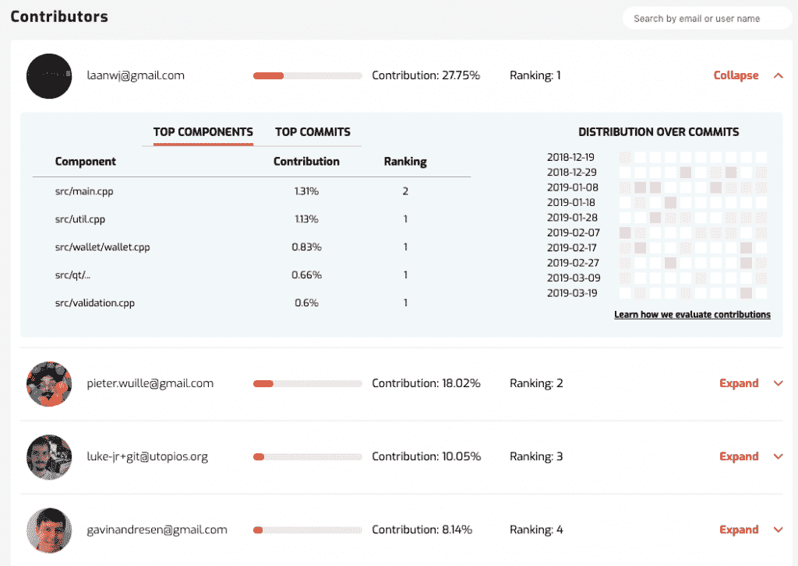

# Merico 设计分析来评估开发者代码贡献

> 原文：<https://thenewstack.io/merico-devises-analytics-to-assess-developer-code-contributions/>

您如何确定您团队中的开发人员是否符合标准？你计算过他们贡献的代码行数吗？类似地，当你雇佣开发人员时，你如何确定他们是否是前团队中有贡献和有生产力的成员？

这些都是很难的问题，开发人员经常面临[个有争议的编码面试](https://daedtech.com/deploying-guerrilla-tactics-combat-stupid-tech-interviews/)和[个其他方法](https://www.roberthalf.com/blog/evaluating-job-candidates/avoid-a-bad-hire-how-to-assess-a-software-developers-resume)来决定它们的相对价值。 [Merico](https://meri.co/) ，一家“代码库分析公司”，由来自微软研究院、加州大学伯克利分校和斯坦福大学的团队创建，最近推出来解决这些问题，使用“高级程序分析和机器学习的混合来评估代码库，并提供关于个人开发者对项目贡献的公平可靠的见解，”根据该公司网站。

根据公司声明，该公司的主要目标是提供代码评估，“不受政治、个人偏见或其他团队动态的影响”，这是通过对代码库的分析来实现的。

Merico 首席执行官井磊·任在一份声明中说:“代码库是软件公司最有价值的资产，还有为它们做出贡献的人们。”。“Merico Analytics 是首个面向企业的开发人员绩效和人才管理解决方案，该解决方案由数据驱动并基于深入的代码分析。”

Merico 使用研究支持的指标和分析代码库来确定个人贡献的价值，无论是看似简单的漏洞修复还是其他功能，并使用机器学习来确定这些贡献的相对价值。目前，该公司专注于使用这些信息的几个主要领域——开发人员招聘、人力资源和团队管理、求职者和开源项目贡献者——稍后将详细介绍最后一个领域。

在接受 New Stack 的采访时，Merico 的首席技术官 Hezheng Yin 解释说，公司经常使用误导性或可玩性的指标来评估编码器的贡献。

“非常令人惊讶的是，他们现在使用什么标准来评估开发者的贡献。脸书，至少在几年前，还在使用代码行。研究表明，团队发布的代码行与团队的长期增长呈正相关，因此[公司]使用这一指标来评估他们将给予团队领导者多少奖金，”尹说。“那真是令人惊讶。它鼓励人们编写臃肿的代码，这是一个非常容易游戏的度量标准。但这就是人们正在使用的——甚至是硅谷的一些最好的公司。我相信我们可以做得更好。”

尹继续解释说，除了被误导的指标，公司经常使用其他方法，这些方法更多地考虑了开发人员的个性或内部政治，而不是实际的能力和影响。

“目前，许多评估都是基于同行评议。这很大程度上取决于你的性格，无论你是内向还是外向，如果你能与你的经理保持良好的关系，”尹说。“但如果你的作品能自己说话呢？这是我们开发这个算法时的理念。你已经完成了工作。我们为什么不直接从您的代码中分析，而不是纯粹依靠主观的同行评审？”

回到开源贡献者的想法，尹提出，Merico 可以通过确定一种向多个核心维护团队分配财务贡献的方式来帮助实现资金分配的民主化。

“为开源项目筹集资金很难，我们并不声称我们可以解决这个问题。但无论你如何筹集资金(无论是从大公司还是从个人)，你都会面临第二个问题:你如何公平地分配奖励，”尹说。“这正是我们的切入点。我觉得总的趋势是，人们对开源可持续的意识在增强，资助状况在变好。这在一定程度上得到了最近出现的各种开源融资解决方案的支持，包括 OpenCollective、Linux Foundation 的 Community Bridge、Tidelift、Gitcoin 等。

通过 Pixabay 的特征图像。

<svg xmlns:xlink="http://www.w3.org/1999/xlink" viewBox="0 0 68 31" version="1.1"><title>Group</title> <desc>Created with Sketch.</desc></svg>