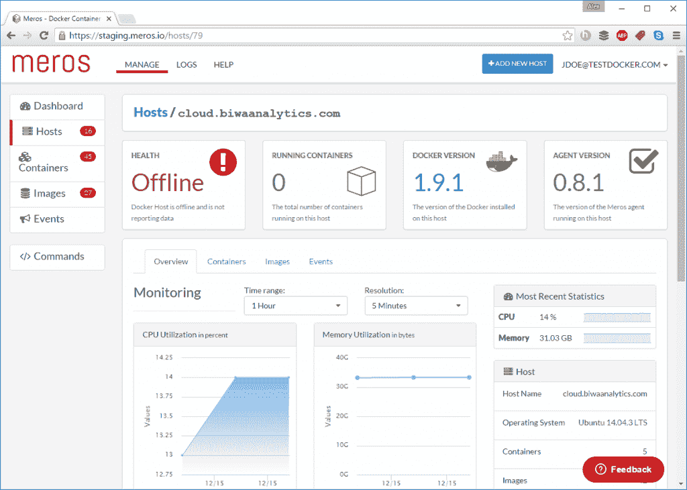
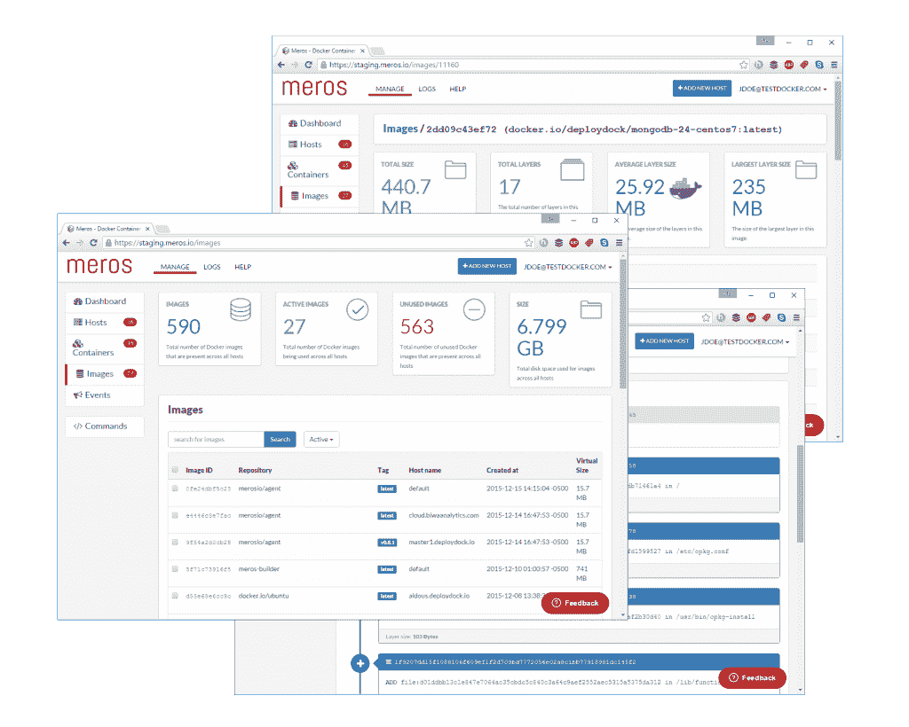

# Meros 的集装箱监视器是 Docker 的“完整 GUI”

> 原文：<https://thenewstack.io/meros-container-monitoring-aims-high-public-beta/>

使用容器有其独特的挑战，这对任何开发人员来说都是令人望而生畏的。继续困扰使用容器进行大规模工作的企业的问题包括可见性、服务发现和容器健康——这只是水中众多鲨鱼中的一小部分。Meros 刚刚发布了软件即服务(SaaS)的公测版，承诺在提供所需性能的同时解决这些棘手问题。

“Meros 是 Docker 的完整 GUI 以及更多,”该公司的网站大胆承诺。

## 将碎片拼在一起

“Meros 收集容器日志、Docker 配置、关于容器和图像的 Docker inspect 信息、Docker 事件、容器磁盘空间使用情况等，”Meros 首席技术官 Eric Sites 说。用户可以启动和停止他们的容器，查看图像历史，并访问各种功能，这些功能旨在确保他们正在运行的容器不仅健康，而且安全。

开发人员不仅可以查看网络上的传入和传出流量，还可以查看图像文件历史记录，报告在容器内创建或打开的文件，检测恶意进程，以及获取活动推送通知。Meros 还提供双因素身份验证，这对于那些拥有分布式团队或敏感内部数据的人来说是至关重要的。SAML 集成和用于 Meros API 的 [JWT 令牌](https://jwt.io/introduction/)完善了其安全特性，允许用户轻松验证内容签名和传输敏感数据，如密钥对。

Meros 仪表板

Meros 可在多种平台上使用，包括 Kubernetes 和 Docker Swarm。对于那些在本地机器上运行 Docker 的用户，Sites 指出，他们可以使用 Meros 通过 Docker 产品的仪表板来跟踪他们的系统。作为一个基于 web 的终端，设计用来控制用户如何与容器交互，标准命令是适用的。用户除了能够从基于云的堆栈或本地数据中心访问映像之外，还可以停止、启动、暂停、重启和删除映像。

对于那些使用 Kubernetes 或 [Docker Swarm](https://docs.docker.com/swarm/) 运行大型 Docker 集群的人来说，自动化 Meros 代理将显著简化设置和配置过程。那些运行小型基础设施的人可以在他们的 Docker 主机上用一个命令行安装 Meros 客户端，同时它还集成了流行的团队协作和生产力工具，如 Slack、HipChat、WebHooks 和 PagerDuty。

## 进入更精细的细节

Sites 强调了 [Go](https://golang.org/) 的灵活性和性能是 Meros 团队的一大优势。Meros 代理及其后端是用 Go 编写的，包括它的所有工作器、web socket 服务器、索引和度量管道。对于那些担心其服务器占用空间的人来说，Meros 代理是非常轻量级的——总共只有 17 MB。尽管它看起来很小，梅罗斯却拥有强大的力量。

Meros Docker 管理用户界面

该软件使用 AWS Elastic Beanstalk 为其工作集群处理传入的指标，日志和元数据都是用 Go 编写的。Sites 指出，Meros 依靠 [AWS Kinesis](https://aws.amazon.com/kinesis/) 来扩展其度量、日志和元数据摄取。它依靠 [Redis](http://redis.io/) 来存储集群分布式状态和连接到其服务器的发布/订阅消息，以及 [ElasticSearch](https://www.elastic.co/products/elasticsearch) 来存储和搜索日志。AWS Beanstalk 上的 Ruby on Rails 完善了前端，而 Meros 团队也利用 AWS RDS Postgres 进行用户管理。

“在考虑新功能时，我们首先关注性能，并不断重新审视功能和代码，以使其速度更快，使用的资源更少。更好的性能可以带来 10 倍的回报，让客户满意，主机成本更低，用户体验更好，”Sites 说。

随着越来越多的公司转向混合基础设施，重组整体应用程序，并转向以微服务为中心的应用程序产品，基于容器的架构已经成为事实上的标准。集装箱监控服务也必须脱颖而出，否则他们无疑会迷失在人群中。

去这里报名公测。

Docker 是新堆栈的赞助商。

<svg xmlns:xlink="http://www.w3.org/1999/xlink" viewBox="0 0 68 31" version="1.1"><title>Group</title> <desc>Created with Sketch.</desc></svg>