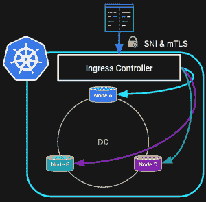
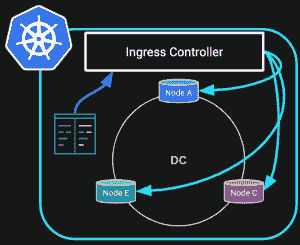
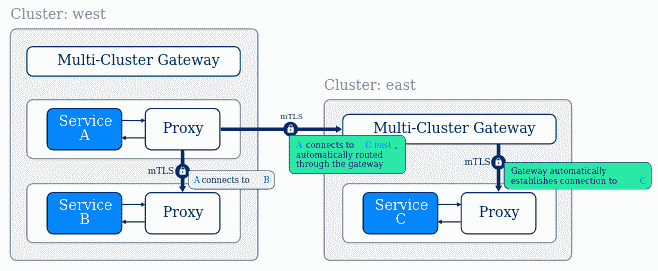

# 网状和快乐与 Kubernetes 入口

> 原文：<https://thenewstack.io/meshy-and-happy-with-kubernetes-ingress/>

 [帕特里克·麦克法丁

帕特里克是 DataStax 的开发者关系副总裁，他领导的团队致力于让 Apache Cassandra 的用户获得成功。他还担任过 Apache Cassandra 的首席布道者和 DataStax 的顾问，在那里他帮助构建了一些最大、最激动人心的生产部署。](https://www.linkedin.com/in/patrick-mcfadin-53a8046/) 

云计算依赖于一个关键因素:可靠的网络。不仅在 A 点和 B 点之间的可用连接中是可靠的，而且是安全的、可观察的，并具有可定义的服务质量。

网络已经是计算领域的一个经典难题。你听说过网络管理员用一个错误的配置关闭 YouTube 的故事吗？它[发生](https://www.cnet.com/news/how-pakistan-knocked-youtube-offline-and-how-to-make-sure-it-never-happens-again/)！安全性并没有好到哪里去，因为对规模和连接性的需求让我们更容易受到攻击。安全研究员詹姆斯·米肯斯在他 2015 年的[演讲](https://www.youtube.com/watch?v=tF24WHumvIc)中敲响了警钟，这在今天仍然适用。更多的 IP 和端口？更多的问题。让我们面对现实吧，安全性可能是我们在构建应用程序时想到的最后一件事。对更多分布式应用程序的需求不断增长，这意味着我们可能会越过网络悬崖。

围绕这个复杂的话题，我花了几天时间尝试不同的选择。希望这将有助于你更快地学习真正的解决方案。在本文中，我们将了解:

*   Kubernetes 给网络管理带来了什么
*   为什么 Ingress 是在 Kubernetes 中使用的工具
*   其中这被用来创建服务网格
*   如何将它与 Apache Cassandra 的一些例子结合起来

## Kubernetes 来拯救？

 [克里斯托弗·布拉德福德

Christopher 热衷于通过自动化提高效率。从通过 Cassandra 促进轻松扩展到使用基础设施自动化和容器的 DevOps 管道，他在这里完成工作并让运营商高枕无忧。](https://www.linkedin.com/in/bradfordcp/) 

当您为您的应用程序选择一个部署平台时，您希望那些困难的事情能够被管理，或者至少变得更容易。Kubernetes 正试图兑现构建具有可伸缩性、复原力和弹性的应用程序的承诺，这不仅包括计算，还包括网络。Kubernetes 项目选择了一种可以说是最明智的方式来管理安全性。直接说“不”。没有外部入口和内部出口。当您在集群中部署 pod 时，Kubernetes 使用一个专用网络，该网络在唯一的 pod 网络之外完全不可路由。这意味着，作为第一次使用的用户，您发现自己想知道是否有任何方法可以访问您新创建的服务，因为您意识到默认情况下没有外部 IP 或端口。毫不奇怪，这就是云提供商多年来通过显式端口访问和 VPC(虚拟私有云)运营的方式。

到目前为止，有四种方法可以访问您新创建的服务。Kubernetes 提供有限数量的本地方式将流量路由到控制平面内的 IP 和端口。

1.  **Pod IP:** 这类似于为特定的私有 IP 和端口在防火墙上打孔。但是，该配置不是动态的，并且不会在节点 IP 发生变化时做出响应。非常适合您的笔记本电脑，但不适合生产。
2.  **服务节点端口:**当创建服务时，每个节点将创建一个随机端口号，该端口号将流量定向到后端服务，每个服务将获得自己的端口号。这意味着如果您部署大量服务，需要记住大量端口号。运行服务的目的地 pods 是由节点而不是请求者选择的，所以服务应该是无状态的，否则您可能会感到惊讶。
3.  **服务负载平衡器:**在您的部署 YAML 中，您可以配置特定的负载平衡器服务。通常，这将是一个云提供商负载平衡器，如 AWS 的 ELB 或 GCP 的 NetworkLB。外部 IP 是静态的，负载平衡策略由实施控制。这更接近于网络负载平衡的经典版本，如 F5 设备或 HAProxy 软件。
4.  **入口:**类似于服务负载平衡器，但仅限于 HTTP 流量。云提供商有类似的实现，但是，ingress 可以在本地与几个 Ingress 控制器项目一起使用。由于在 Kubernetes 控制平面中，Ingress 为流量控制和可观察性提供了更多的选项。

## 救援入口！

入口是 Kubernetes 网络最有趣的地方。Kubernetes 中 Ingress API 的加入改变了我们管理网络的方式——不仅在集群外部，而且在集群内部。Kubernetes 的最终用户只需要最少的专业知识就可以解决大规模网络的所有棘手问题，如路由、自动服务连接、安全性和故障转移。

现在有几种控制器实现可供选择。Istio、Kong、Traefik、Skipper、NGinx……这个[列表](https://kubernetes.io/docs/concepts/services-networking/ingress-controllers/)真的很长，这应该不仅仅是受欢迎程度的某种指示，而且是控制器实现之间的微妙差异的某种指示。选择入口控制器时，用例非常重要，因此让我们看一个例子，看看何时需要控制器以及如何部署控制器。

 在这个例子中，我们有一个运行在 Kubernetes 中的三节点 Apache Cassandra 集群。需要访问数据的应用程序在集群之外，所以根据 Kubernetes 的默认规则，抱歉，不允许访问。为了提供连接，我们还包括了一个 Kong 入口控制器，它在我们的部署中。

结果是一个静态 IP 地址供外部服务使用。当节点联机时，它们会自动添加到入口控制器目标 IP 列表中。这种部署最好的部分是，默认情况下，与 SNI ( [服务器名称指示](https://en.wikipedia.org/wiki/Server_Name_Indication))和 mTLS ( [相互传输层安全性](https://en.wikipedia.org/wiki/Mutual_authentication))的通信是安全的。后者对于入口控制器至关重要，不仅可以确保请求访问的应用程序拥有访问权限，还可以确保应用程序正在与它想要安全通信的集群进行对话。

## 很酷的防火墙，但是网格在哪里…

前面的例子是关于提供对内部资源的外部访问，但是网格不就是一堆互相通信的东西吗？Ingress 的另一个特性是将内部服务路由到其他后端服务，其控制级别与我们看到的路由外部服务相同。

 这个例子与上图类似，但是，现在服务都在同一个 Kubernetes 集群内部。既然 pod 之间的流量是可路由的，为什么还要添加像 Kong 这样的入口控制器呢？仅仅因为我们的流量在集群内部，并不意味着我们可以放松警惕。默认情况下，SNI 和 mTLS 将提供相同的安全性。此外，当服务改变 IP 或变得不可用时，我们可以管理集群内部的变化。我们以前不得不忍受的网络管理的所有痛苦现在都在一个部署中得到管理。

如果您将这个例子扩展到 Kubernetes 中运行的所有服务，您可以看到 mesh 名称在哪里得到了正确的使用。相互对话的微服务现在被赋予相同的默认安全和网络管理级别。随着服务的添加和删除，网络管理员无需参与配置的更改。开发人员可以放心地进行构建，因为他们知道他们部署的微服务能够以最佳的安全性正常通信。

## 卡珊德拉将何去何从？

所示的两个例子是关于如何让应用程序与正在运行的 Cassandra 集群通信，但是这对运行在 Kubernetes 中的 Cassandra 意味着什么呢？Cassandra 的第一个也是最迫切的需求是支持多数据中心 Cassandra 通信。因为这是 Cassandra 部署的常见用例，所以使用入口控制器来保护和路由集群之间的数据将进一步简化部署。

Cassandra 用户感兴趣的另一个领域是入口的可观察性。像 Kong 和 Istio 这样的控制器已经提供了网络流量的详细统计数据。Cassandra 社区对提供 CQL 流量的第 7 层统计数据非常感兴趣。进出 Cassandra 集群的所有 CQL 流量的错误率和延迟将增加一层现在不可用的可观察性。

## 啮合还是不啮合

如果你刚刚开始使用 Kubernetes，你应该在你需要学习的东西的清单上有 Ingress。Kubernetes 网络可能很难理解，所以跳过除入口之外的所有内容，直接进入项目的未来。Service mesh 提供了太多简单包含的东西，很难再在 Kubernetes 之外部署应用程序。对于微服务，几乎没有其他方法像它一样可靠。这就是我们在云原生应用中想要的:规模、弹性和弹性。依靠服务网格技术构建您的应用程序是完成正确工作的正确工具。

*如果你想了解更多关于 DataStax 如何为你成功所需的主题提供大量免费学习的信息，请点击[我们的 Kubernetes 技能页面](https://www.datastax.com/dev/kubernetes)。*

<svg xmlns:xlink="http://www.w3.org/1999/xlink" viewBox="0 0 68 31" version="1.1"><title>Group</title> <desc>Created with Sketch.</desc></svg>