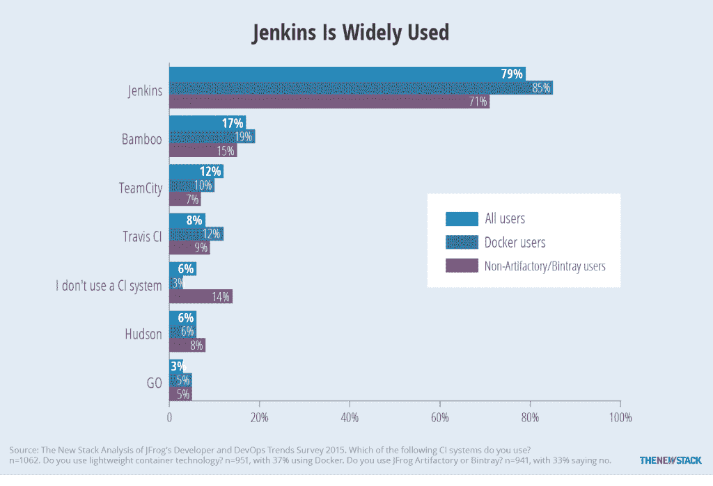

# 中间层马拉松 1.0 首次亮相，支持有状态容器

> 原文：<https://thenewstack.io/mesophere-marathon-1-0-newly-released-supports-stateful-containers/>

为了巩固在数据中心工作负载编排市场的突出地位， [Mesosphere](https://mesosphere.com/) 正式发布了其马拉松编排平台的 1.0 版本。

该公司还宣布，它已经获得了 7350 万美元的 C 轮融资，由 HPE 和微软牵头。是的，这两个名字曾经是旧的“Wintel”服务器架构的同义词，现在支持为 Linux 和 Windows 编排容器的数据中心操作系统(DCOS)的制造商。

但这还不是故事中最大的转折:随着 1.0 版本的发布，Marathon 现在将支持有状态服务，启用去年 7 月在 Apache Mesos 中引入的持久卷特性，并使该系统与[后起之秀牧场主](https://thenewstack.io/rancher-labs-building-os-docker-containers/)展开正面竞争。

“你不仅可以部署 12 因素无状态应用，还可以部署携带状态的应用，如 MySQL 或 Postgres 数据库，”Mesosphere 高级副总裁 Matt Trifiro 在接受新堆栈采访时表示。

## 坚持终于有了回报

Apache Mesos 调度程序最初是为了促进无状态服务而设计的，这种服务具有高度的可伸缩性，最适合微服务架构。起初，Mesos 因被无国籍支持者描述为有意的设计选择而受到称赞。但是在必须持久维护巨大数据集的数据中心中，开发人员继续采用诸如发布所谓的“动态预留”(确保框架获得对它所请求的资源的有保证的、独占的访问)或让容器在退出之前将它们的状态写入分布式文件系统中的公共可访问卷的变通办法是没有意义的。

该公司表示，现在在 Mesosphere 1.0 下，持久卷将由 DCOS 和调度程序直接支持和负责。事实证明，以这种方式管理服务会产生一个附带的好处，正如特里费罗解释的那样:“马拉松是多租户的，这意味着不同的团队可以根据他们的身份验证和授权部署不同的应用程序，所有这些应用程序都可以在同一个集群上运行多租户。”

我们必须小心使用我们的术语，因为 Mesos 可以在多租户云平台上运行调度。Trifiro 的意思是，Marathon 现在可以根据不同租户的需求和授权定制不同的工作负载环境。这消除了数据中心为不同的组安排多个马拉松实例或实施人工网络隔离的需要。

## 中间层拥抱詹金斯和 CI/CD

我们还在周四了解到，中间层计划推出一个新的补充马拉松和 DCOS 的组件，名为 Velocity。Velocity 将把 Mesosphere 带入持续集成/持续部署(CI/CD)领域，使其与自动化部署平台[如 DCHQ](https://thenewstack.io/dchq-automating-container-deployment-in-similar-ways-to-vms/) ，与 Jenkins 结盟的平台[如 CloudBees 自己的](https://thenewstack.io/cloudbees-offers-jenkins-private-saas-self-service-model/)，以及与 Jenkins 无关的平台[如 shippible](https://thenewstack.io/shippable-formations-is-a-container-cicd-without-devops-style-scripts/)竞争。

你听说过这句话“灵感来自一个真实的故事。”在 Velocity 的例子中，它的灵感来自于 [Mesos 用户使用 Jenkins 实例作为“构建奴隶”的现实。](https://www.cloudbees.com/blog/apache-mesos-and-jenkins-elastic-build-slaves)

正如 Mesosphere 的首席架构师(也是 Mesos 的共同创建者)Benjamin Hindman 向新堆栈解释的那样，Velocity 将充当一种“Jenkins 即服务”，或者确切地说是一种“短暂的 Jenkins”，在这种情况下，临时环境会根据特定项目的需要而启动和关闭(或者“构建奴隶”，如果你更喜欢一个政治上不太正确的比喻的话)。

Mesosphere 正在与 Jenkins 集成，因为它的许多客户已经在使用它进行持续集成。

“许多组织最终建立 CI/CDs 的方式是，他们基本上为每个团队部署一个 Jenkins，”Hindman 说。“事实上，在一些组织中，他们为每个开发人员部署一个 Jenkins。当他们这样做时，他们的数据中心中运行着所有这些微小的集群，从管理的角度来看，这是一种极其静态的分区方式。”

“这意味着，如果您为一个组织调配了三个节点，为另一个组织调配了另外三个节点，依此类推，在任何时间点，当一个组织有大量等待运行的作业，而另一部分没有作业时，不幸的是，您无法利用之前调配的其他资源，”Hindman 详细阐述道。

然而，这种部署方案的优点是在组织和他们的用户之间提供了必要的网络隔离。正如 Hindman 所言，在 DCOS 上运行的 Velocity 将在任何时间点主动为共享数据中心的所有组织中的每个 Jenkins 实例提供必要的资源。DCOS 将维护用户之间的服务划分，给他们持续的资源隔离，即使他们的实例可能共享同一个多租户集群。

Hindman 还表示，他的团队已经为 Jenkins 构建了一个与 Marathon 通信的部署模块，实现了测试和试运行环境与生产环境之间的直接接口。

他解释说，随着 Velocity 即将与 **git** 集成，有一个新的 Jenkins 插件将识别每个推送请求。这个请求触发了一个构建，这个构建可能会从 [JFrog 的 Artifactory](https://thenewstack.io/jfrog-announces-artifactory-4-0/) 中拉出依赖组件，或者将构建好的组件推入 Artifactory。构建好的组件随后被推送到 Marathon，然后可以指示 Marathon 使用[蓝/绿策略](https://thenewstack.io/from-monolith-to-microservices/)部署基于该组件的容器，其中新旧版本共存一段时间。

“在手术的任何一个环节，它都不需要使用者去踢任何东西，”亨德曼说。"它可以完全由 git 中的特定分支或存储库启动."

当我们提到容器编排和大规模持续集成时，我们不再看或谈论替代堆栈或实验堆栈。Mesos 风格和 Kubernetes 风格的调度现在是我们数据中心的核心原则，微软和 HPE 的最新一轮投资就是证明。

<svg xmlns:xlink="http://www.w3.org/1999/xlink" viewBox="0 0 68 31" version="1.1"><title>Group</title> <desc>Created with Sketch.</desc></svg>