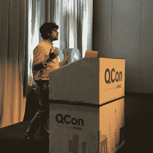

# Mesos 如何帮助扩大 Quant 公司二适马

> 原文：<https://thenewstack.io/mesos-helped-scale-quant-firm-two-sigma/>

扩展系统可能是一个巨大的挑战，即使使用专门为此任务构建的软件。

“扩展是痛苦的，”David Greenberg 承认道，他在本周于纽约举行的 [QCon 开发者大会](https://qconnewyork.com/ny2016/schedule/tabular)的 [a talk](https://qconnewyork.com/ny2016/presentation/how-two-sigma-scaled-their-research-platform) 上分享了他在对冲基金投资公司 [Two 适马](https://www.twosigma.com/)实现 Apache Mesos 集群管理器的经历。格林伯格现在是 Mesosphere 的顾问，该公司为 Mesos 提供商业支持。

五年前，两个适马需要建立一个高度可扩展的系统来测试新的预测模型。在查看了为分布式计算设计的软件包(如 Hadoop 和 OpenStack)后，该公司选定了基于 Mesos 容器的系统，并在此过程中获得了一些来之不易的经验。

为什么对冲基金需要集群计算？原来预测未来需要大量的处理能力。该公司基于自动算法买卖金融工具。在许多情况下，算法需要通过机器学习来塑造，通过同一问题的多次迭代来塑造最佳方法。模拟越大，模型调整得越精确。

模拟作业的典型占用空间需要 10-100GB 的 RAM 和 1-20 个 CPU，作业可能需要 15 分钟到几个小时。

在过去十年的大部分时间里，该公司使用基于 Java 虚拟机的系统来完成这项工作，该系统为研究人员提供了很好的服务。他们将提交作业，以及完成作业所需的一组资源，比如一些 CPU。他们还可以使用一套丰富的监控和查询工具来检查他们的工作。

这个系统对十几个研究人员来说非常有效。随着越来越多的人加入了两个适马的行列，他们的模型越来越庞大，这个系统开始出现一些问题。

首先，并不是每个研究人员都能完全平等地访问集群。起初，集群是基于先来先服务的原则，一些研究人员通过早上早些时候到达并调度大型作业来阻止其他作业运行。

另一个问题是工作负载隔离。每个 JVM 工作负载都被设置为使用一组预先确定的资源。然而，随着研究人员开始引入更丰富的金融工具集，如 Python Panda，所需的内存量开始激增，这导致机器在内存内外交换进程，使机器的性能慢如蜗牛。

因此，2012 年，该公司开始寻找一种更优雅地扩大运营规模的方法。起初，工程团队着眼于 Hadoop，以及当时新发布的 YARN scheduler。然而，缺乏文献资料。格林伯格通过大厅内的会议聊天听说，尽管 Hadoop 以大数据平台而闻名，但当扩展到超过几百个节点时，它可能会出现问题。OpenStack 因其卓越的隔离能力而受到关注，尽管该堆栈仅提供了基本的卓越调度能力。

他们还研究了一些超级计算机的调度程序，包括 Torque、 [Moab](http://www.adaptivecomputing.com/products/hpc-products/moab-hpc-basic-edition/) 和 [Slurm](http://slurm.schedmd.com/) 。起初，这样的软件似乎是合适的。毕竟，除了大量的单个节点，超级计算机还能是什么呢？但是这些调度程序更适合在多个服务器上运行大型作业，而不是在单个节点上运行多个较小的作业。

到 2012 年，AirBnB 和 Twitter 都在使用 Mesos。事实上，Twitter 生产了一个 20，000 节点的 Mesos 集群。这是一个好迹象。此外，由 [Mesosphere](https://d2iq.com/) 支持的软件，对于帮助两个适马添加新功能，如命令行界面和对安全性的支持，证明是无价的。

“Mesos 扩展得非常好，它支持批处理作业和容器，”Greenberg 说。

然而，该公司必须做大量工作来准备新的基于 Mesos 的架构。许多应用程序不得不进行重构，这是一项既复杂又没有立竿见影效果的工作。但是这项工作很重要，因为它为更快的发展创造了条件。

该公司需要比 Mesos 通过其占主导地位的资源分配(DRF)所能提供的更复杂的调度算法。因此，该公司通过累积资源份额(CRS)扩展了 DRF，嵌入到一个名为[库克](https://github.com/twosigma/Cook)的自制调度程序中，该调度程序根据资源动态调整需求。

此外，他们了解到标准的调试技术并不真正适用于分布式系统。格林伯格指出，当出现问题时，你不可能只是通过 SSH 进入一台机器并扫描日志。需要监测。

为了这项工作，两个适马建立了自己的监控系统，称为卫星(以独立摇滚乐队[的六指卫星](https://en.wikipedia.org/wiki/Six_Finger_Satellite)命名)。对于基地，他们转向了 Riemann，Greenberg 将其描述为“连接许多来源的瑞士军刀”您可以使用 Riemann 编写特定的操作，这允许开发团队设置警报，例如当超过 20%的机器进行大量内存交换时发送警报。该公司使用 [PagerDuty](https://www.pagerduty.com/) 在下班时间提醒管理员。他们还求助于 Elasticsearch 搜索引擎和它的可视化软件包，用于可视化、特别查询和仪表板。

## 没那么快…

尽管格林伯格热情推荐，但并不是 QCon 的每个人都如此迷恋 Mesos。

XO 集团的钱辉

[在另一个演讲](https://qconnewyork.com/ny2016/presentation/dc-os-marathon-better-way-run-docker-aws)， [Chien Huey](https://twitter.com/chspinning) ， [XO Group](http://xogroupinc.com/) media company 的 DevOps 工程师经历了一个 DCOS(数据中心操作系统)的评估过程，这是一个结合了 [Apache Mesos](http://mesos.apache.org/) 和[Marathon](https://github.com/mesosphere/marathon)orchestration framework 的开源包，两者都由 Mesosphere 维护。

XO 小组正在寻找亚马逊网络服务的 [Elastic Beanstalk](https://aws.amazon.com/elasticbeanstalk/) 服务中运行容器(在虚拟机中)的替代方案，该服务的成本和对锁定的担忧都在不断增加。然而，DCOS 有一些局限性。

休伊指出，DCOS 有许多好的方面。该软件使设置集群变得非常容易，提供了近乎交钥匙的体验。它还提供了复杂应用程序的简单安装，如 Apache Cassandra 或 Jenkins。

但是 Huey 发现这个软件也有一些缺点，这正是 XO 小组所寻找的。Huey 没有找到使用私有容器注册的自动化容器操作的方法。Mesosphere】确实为使用私有注册中心提供了手动解决方案,所以 Huey 开发了一个脚本，每 12 小时刷新一次所需的加密密钥。

Huey 也不喜欢 Mesosphere 的自动伸缩方法，这种方法需要在主节点上安装一个代理。“如果那个节点坏了怎么办？”他问。然而，其他公司已经找到了解决这个问题的方法。例如，网飞开发了 [Fenzo](https://github.com/Netflix/Fenzo) 来帮助解决这个问题。

[中间层](https://d2iq.com/)是新堆栈的赞助商。

<svg xmlns:xlink="http://www.w3.org/1999/xlink" viewBox="0 0 68 31" version="1.1"><title>Group</title> <desc>Created with Sketch.</desc></svg>