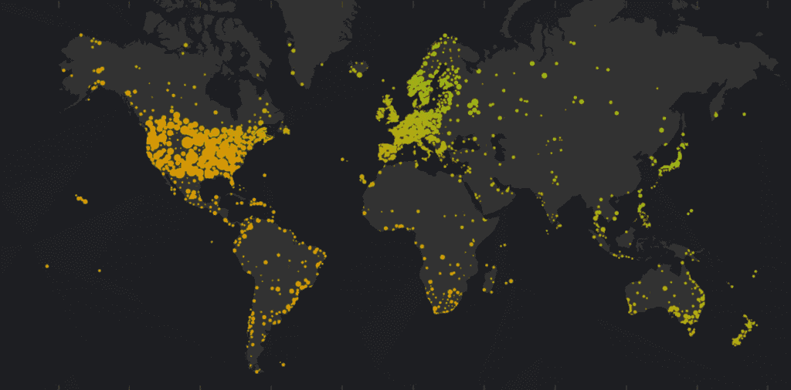

# 中尺度气象学定位天气预报

> 原文：<https://thenewstack.io/mesoscale-meterology-localizes-weather-forecasting/>

冬天会带来一些非常糟糕的暴雨——但是今年，至少美国的一个州，纽约，会有一种新的方式来迎接它们的到来。

根据[最近在 The Verge](http://www.theverge.com/2016/10/31/13440952/extreme-weather-forecasting-new-york-mesonet-warning-system) 上的一篇文章，该州正在测试一个系统 [Mesonet](http://nysmesonet.org) ，该系统将能够填补该国主要天气跟踪系统中缺失的空白。

故事从一个悲惨的故事开始，故事发生在 2011 年灾难性的八月的一天，当时飓风艾琳来袭。“我们知道天在下雨，”国家气象局天气监测项目的监督员回忆道。"但是我们不知道雨下了多少，也不知道雨具体下在哪里."

据 the Verge 报道，几周以来,[国家飓风中心](http://www.nhc.noaa.gov/)一直在用精密的雷达和卫星跟踪飓风艾琳,“虽然它仍然距离东海岸数百英里，但他们可以相当准确地预测它的移动。但一旦艾琳到来，气象学家就无法判断每分钟或每个县的情况有什么不同。

谦逊的普拉茨维尔(Prattsville)人口 700 人，坐落在纽约市以北 150 英里的“树叶偷窥之乡”，被暴雨和大洪水袭击，但该州的应急人员“似乎和他们在城里一样步履蹒跚。”一名妇女被告知“船来了，然后一架直升机在路上，然后直升机终究不会来了。后来，她得知她听说的第一艘船翻了……”

据 the Verge 报道，最终飓风艾琳(以及 10 天后袭击的热带风暴李)造成了 10 亿美元的损失。"只有 2001 年 9 月 11 日的恐怖袭击在恢复成本上能与风暴相媲美."

如果像预测的那样，全球变暖最终会带来极端天气，那么做出更好的预测将变得更加重要。ClimateWire [指出](http://www.eenews.net/cw/2016/08/18)“仅在过去的一年里，灾难性的暴雨袭击了西弗吉尼亚州、德克萨斯州、俄克拉荷马州、南卡罗来纳州，现在是路易斯安那州……”

但幸运的是，科学家们已经开始思考这个问题。两年前，美国国家科学院在 2009 年发表的一篇论文中推荐了一个“全国性的网络网络”该论文指出，有很多人在监测天气，但“因为没有一个全国性的网络将这些系统连接在一起，数据收集方法不一致，公众的可访问性有限。”

The Verge 总结了其最有趣的观察结果之一:“尽管国家气象局气象学家使用的雷达、卫星和超级计算机擅长于大图预测，但它们只能提供有限的、低分辨率的特定地点的地面情况信息……降雨、风和湿度等数据是以混乱、非标准化的方式从一个州收集到另一个州的，使用的是一个缺乏协调的网络大杂烩。”简而言之，美国在跟踪“中尺度”天气——较小城市或州级的天气系统——方面有所欠缺。

即使是飓风…

“你的计算结果和你输入的观察结果一样好，”论文的作者之一告诉 the Verge。显然，我们需要的是一种可以观察天气的*物联网*。纽约现在正在将该论文的建议付诸实施，在全州范围内建立他们自己的广泛的大气监测站网络，以填补覆盖范围的空白，并补充来自卫星的“大画面”。

该系统是在 Oklahoma 的 Mesonet 的早期实现上建模的。事实上，自 20 世纪 80 年代初以来，俄克拉荷马州一直是美国天气观测领域最重要的先驱之一，当时该州的首席气象学家肯·克劳福德“尤其对最近的几次严重洪水感到烦恼，由于缺乏数据，几乎没有什么有意义的东西可说。”

甚至在那个时候，日本已经有了一个自动气象观测站系统，克劳福德感到很尴尬。他所在的州依靠的是由‘插在雨量计上的棍子’组成的监测站……读数是手动获取的，通常是由经常犯印刷错误的老年志愿者获取的。

克劳福德在 1994 年建立了一个 Mesonet 系统，它的好处是显而易见的。在 1999 年的龙卷风中，这些数据导致了一个购物中心在被拆除前几分钟的疏散。克劳福德仍然被认为是“Mesonet 之父。”

有了联邦应急管理局 3000 万美元的拨款，纽约州现在正计划连接 126 座瞭望塔——所有这些塔之间的距离都在 30 英里以内。相比之下，在 2011 年，只有 27 个观测站，而且“大多数都在机场，不能准确地代表该州多变的天气或地形，”根据 the Verge 的说法——而且他们每小时只传输一次数据。

相比之下，“新网络将每五分钟向众多气象学家、应急管理人员和私营部门合作伙伴发送一次数据。当它完成时，纽约的全州天气网络将是全国最先进的——特别适合应对与气候变化相关的各种极端事件。目前，它正在建设中，计划在年底前全面投入使用，”The Verge 报道。

文章对州应急管理办公室进行了有趣的描述(该办公室位于“一个冷战时期的掩体内，被建造成在发生核攻击时作为州政府的临时行动基地。”)记者还参观了纽约州立大学校园内奥尔巴尼地下设施中的“Mesonet 指挥中心”。来自该州 Mesonet 塔的 49 个直播信号同时被输入一个 7 x 7 的电网。此外，还有六个塔，他们收集的所有数据最终都会传输到国家气象局和纽约应急管理办公室。

《The Verge》的记者参观了 Mesonet 的一座 30 英尺高的塔——坐落在高速公路部门拥有的财产上——这是 17 座配备了特殊“垂直剖面技术”的塔之一，可以捕捉天空中整整 6 英里的温度、湿度和风活动数据。

“到目前为止，纽约只依赖于三个站点的大气剖面，”文章解释道，“长岛、布法罗和奥尔巴尼的发射站每天发射两次高空气象气球。”如果你只想知道明天是否是晴天，这就足够了，但是“如果你想知道未来 12-24 小时内飓风或飑线是否会影响一个地方或地区，你需要有这种更高分辨率的观测数据。”

即使只有这 17 座塔也能产生影响——因为它们在持续测量——然后报告数据。2009 年那篇论文的作者指出，“当你每五分钟进行一次剖析，那将会给你一个非常准确的整个国家的图像…”。“当你知道上个小时天气是如何变化的，你就可以预测下一个小时会发生什么。”

“这就像每五分钟看一次窗外全州 125 个地方。”

这些塔还收集基本数据，如风速、降雨量和大气压力，以及更不常见的数据，如地面的温度和湿度。

当然，其他州也将受益于收集到的其他天气数据。他们也不是唯一关注天气的人。2013 年,《纽约时报》发表了一篇关于天气爱好者的文章,“个人气象站……技术越来越复杂，但越来越容易设置和使用。”

价格在 150 美元到 2500 美元之间，它们配备了从气压计和温度计、风速计和湿度传感器在内的一切，业余爱好者可以将他们的数据贡献给国家海洋和大气管理局的[公民天气观测项目](http://wxqa.com/)，或者成为由 [WeatherUnderground](https://www.wunderground.com/) 主持的[个人气象站网络](https://www.wunderground.com/weatherstation/overview.asp)的 20 多万贡献者的一部分。

更敏感的设备也是可用的——但是要小心假阳性。“虽然有智能的雨水收集和测风设备，它们依靠声波的中断来获得总数，但传统的旋转风杯、风向标和雨量计往往不太容易受到错误的干扰，就像一只非常吵的蟋蟀。”

但具有讽刺意味的是，就在纽约自己的全州 Mesonet 即将投入运行之际，它的有效性受到了质疑——至少对于某些种类的预测来说是如此。“2010 年由国家海洋和大气管理局的 Stanley Benjamin 共同撰写的一项研究得出结论，Mesonet 观测‘对 3 或 6 小时对流层低层的风预报影响很小或没有影响’，”据当地新闻站[报道。他们还指出，另一项分析(也是本杰明的合著者)发现，当谈到温度预测时，Mesonet 数据“增加的很少”](http://www.nbcnewyork.com/news/local/New-York-State-Mesonet-Weather-Detection-System-Can-It-Really-Predict-Disaster-Governor-Cuomo-392808941.html)

尽管如此，Mesonets 有利于实时报告——以及在较小范围内收集数据。“这可能会对非常短期的 30 分钟预报产生影响，”本杰明承认道

The Verge 的文章以一个大胆的预测结束:到 2016 年底，2011 年困扰应急响应的信息缺口将基本消除。Mesonet towers 将为应急管理办公室提供持续更新的全州气象状况，这样，如果情况突然恶化，应急管理人员将准确知道时间和地点。”

<svg xmlns:xlink="http://www.w3.org/1999/xlink" viewBox="0 0 68 31" version="1.1"><title>Group</title> <desc>Created with Sketch.</desc></svg>