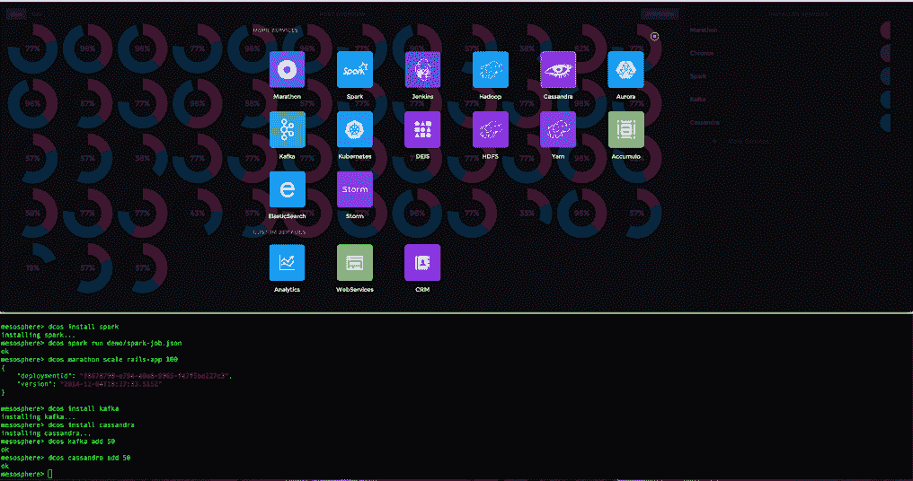

# Mesosphere 从 Khosla Ventures 融资 3600 万美元，用于构建数据中心操作系统

> 原文：<https://thenewstack.io/mesosphere-develops-a-data-center-operating-system-and-raises-36m-from-khosla-ventures/>

Mesosphere 将加速其数据中心操作系统的开发，它在由 Khosla Ventures 领投的一轮融资中获得了 3600 万美元的资金，Khosla Ventures 是硅谷最受尊敬的风险投资 FIM 之一。6 月，Mesosphere 在 Andreessen Horowitz 领导的一轮融资中筹集了 1000 万美元。

在过去的六个月里，这家公司获得了相当多的关注。这在一定程度上是因为创始人的血统，他们是 Twitter 和 Airbnb 等互联网规模运营背后的建筑师。但这也是随着 Docker 越来越受欢迎，人们对容器产生新兴趣的结果。

Mesosphere 诞生于 Mesos，[数据中心知识](http://www.datacenterknowledge.com/archives/2014/09/22/mesos-cluster-management-co-creator-leaves-twitter-for-mesosphere/)在 9 月份将其描述为大约五年前诞生于加州大学伯克利分校 AMPLab 的分布式系统内核。Benjamin Hindman 当时是伯克利的一名博士生，在今年秋天加入 Mesosphere 之前，他在 Twitter 工作了四年。他是 Apache Mesos 项目的最初创建者之一。

Mesosphere 的数据中心操作系统(DCOS)旨在将数据中心视为一台巨型计算机。中间层的差异来自于他们对待数据中心的理念。它支持的机器并不多。运行在数据中心内部的应用程序更是如此。这颠覆了企业模型。多年来，一位 IT 主管会构建硬件，然后在其上运行软件，将所有这些服务器和大盒子视为宠物。在当今世界，应用程序是第一位的。硬件被抽象化了，更像牲口一样对待。如今，这种比较经常被用来解释在当今以应用程序为中心的数据密集型世界中，必须如何对待现代数据中心。Apps com 优先。

> 数据中心是一个虚拟的围栏。资源被集中起来，应用程序被启动，就像操作系统在电脑上工作一样。

Mesos 能够扩展应用程序的数量和大小，以及不同类型的工作负载所需的计算、存储和其他资源。它的核心在内核中，内核执行主要功能，例如为应用程序分配资源。

现代操作系统通过各种组件向用户和应用程序提供服务。这些组件一起工作，提供一个完整的系统。在传统的操作系统中，组件是分开的，以提高可靠性、安全性和可维护性。在 DCOS，组件是分布式的和冗余的，以提供高可用性。DCOS 将资源分配给应用程序，而不是手动分配负载。这使得 DCOS 能够实现高数据中心利用率，并为应用程序提供稳定的性能。

用户界面是中间层 DCOS 的一个较新的、值得注意的方面。

中间层 DCOS 有一个现代的设计，这是分布式基础设施环境的开发者工具和管理服务所期望的。对设计的关注在其监控功能中显而易见，该功能提供数据中心运行状况和性能的高级视图，识别容量问题，提供应用程序调整和扩展建议，以及检测系统故障的能力。

Mesos DCOS 的其他主要功能:

*   Init 系统，也称为马拉松，它决定启动哪些应用程序。它可以根据需求扩展网络、消息和其他功能。Mesos 作为一个框架来启动其他应用程序和框架。它的 API 启动和停止其他应用程序。
*   Cron，也称为 Chronos，是 DCOS 的调度程序。
*   服务发现功能在数据库、web 服务器和其他后端组件从一个节点移动到另一个节点时跟踪它们。
*   中间层 DCOS 使用 Hadoop 作为其分布式文件系统。Mesosphere 高管表示，Hadoop 允许用户运行需要更大容量、性能和可靠性的应用程序。这些都是企业客户的主要需求。
*   谷歌 Kubernetes 是马拉松的替代选择，客户可以在 Mesos 上跑步。根据 Mesosphere 的说法，如果存在竞争需求或用户需求，马拉松和 Kubernetes 可以在一个集群中同时运行。
*   在 Mesos 中，应用程序被称为框架。在 Mesos 中，输入到注册表中的框架可以通过一个命令安装。这意味着客户可以运行 Spark、Cassandra、Kafka 和 Yarn 的传统应用和框架。所有这些都是众所周知的开源服务，旨在分布式基础设施上运行。
*   DCOS 支持红帽、Debian、Ubuntu 和 CoreOS。据该公司称，DCOS 可以用于私人数据中心的虚拟或裸机节点，或 AWS(亚马逊网络服务)、GCE(谷歌计算引擎)和 DigitalOcean 云服务上的云实例。

Mesos 有谷歌的支持。上周在 DockerCon 收到了 Docker 的祝福。中间层现在是 Docker 生态系统中的一等公民。现在，该公司还得到了科斯拉的资金支持，科斯拉以与投资组合公司合作开发良好的商业实践而闻名。

会有障碍。像 Twitter 这样的互联网规模的公司需要 Mesosphere 提供的东西，但这些公司很少。此外，与类似的技术有很多重叠，例如 Kubernetes 和 Cloudsoft 的 Clocker 等服务，以及某种程度上 Cloud Foundry 的 [Diego 框架](https://thenewstack.io/docker-on-diego-cloud-foundrys-new-elastic-runtime/)。

正如我们在今年秋天早些时候所写的:“迭戈解决的编排问题使其可以与谷歌 Kubernetes 和 Mesos 等平台相媲美。Kubernetes 和 Diego 都运行在 [etcd](https://thenewstack.io/about-etcd-the-distributed-key-value-store-used-for-kubernetes-googles-cluster-container-manager/ "About Etcd, the Distributed Key-Value Store Used For Kubernetes, Google’s Cluster Container Manager") 上，这种配置技术也是 CoreOS 用来管理其服务器部署操作系统的技术：

Mesos 只是一个通信基础设施和协议，用于支持跨分布式资源的调度。Diego 做到了这一点(不可否认更具体)以及更多:容器化、日志聚合、路由、健康管理等等。构建在 Mesos 之上的框架，比如 Marathon，更能直接与 Diego 相提并论。

还有几个新进入市场的公司，如 [Tutum](https://thenewstack.io/tutum-offers-docker-container-management/) 。最终用户也在开发他们自己的编排技术来管理他们的 Docker 部署。

但 Docker 通过将工作重点放在开发人员和他们开发的应用程序上，帮助放松了企业思维。Docker 从未真正讨论过“云”。相反，Docker 高管将讨论如何使用容器来加速应用程序开发。因此，客户现在更多地考虑如何抽象他们的硬件，以便他们可以在被视为牲畜而不是宠物的基础设施上更快地开发应用程序。

Pivotal、Cloudsoft 和 New Relic 是新堆栈的赞助商。

<svg xmlns:xlink="http://www.w3.org/1999/xlink" viewBox="0 0 68 31" version="1.1"><title>Group</title> <desc>Created with Sketch.</desc></svg>