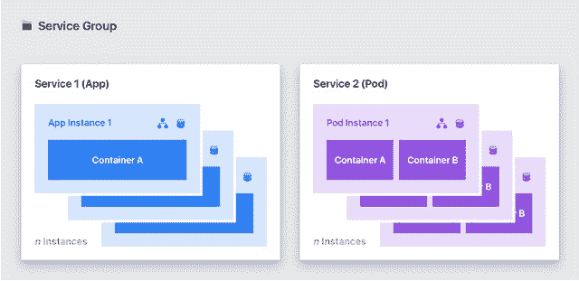

# Mesosphere 做了一个大的生态系统游戏，增加了“Pods”和一个服务应用商店

> 原文：<https://thenewstack.io/mesosphere-makes-big-ecosystem-play-adding-pods-apps-store-services/>

[Kubernetes](/category/kubernetes/) 最近试图争夺容器/工作负载协调市场的核心， [Mesosphere](https://d2iq.com/) 周二宣布，其[数据中心操作系统](https://mesosphere.com/product/) (DC/OS)的商业版本 1.9 将包括两个毫不掩饰的竞争特性。一个是支持一种叫做 *pods* 的自我管理的服务器集群。

第二个是令人大开眼界的开源服务市场，可以直接从 DC/OS 内部的控制台获得，称为宇宙服务目录。将 Universe Service Catalog [ *见上图* ]视为与 Mesosphere 的堆栈理念的直接连接，它将包括持久数据服务，以及包括 Jenkins 在内的 CI/CD 平台。

## 市场经济

“如果你看看其他平台正在发生的事情——特别是公共云提供商——每个人都在让开源变得可访问，但他们是根据自己的条件做的，”Mesosphere 的首席营销官彼得·瓜根蒂在与新堆栈的对话中说。“公共云内部经常发生的情况是，他们采用开源软件，并以他们的名字来称呼它，但它在幕后仍然是开源的。

“然而，我们在这里试图做的是揭露生态系统，”瓜根蒂继续说。“如果你真的仔细看看，公共云和私有云基础架构与开源的结合，真的是我们在过去十年中创新爆炸的根源…所以它不仅仅是能够访问这些项目。能够接触到这些*公司*

最近几周，[云原生计算基金会](https://www.cncf.io/)——最初是围绕 Kubernetes 成立的——一直在[兑现其 2015 年的承诺](https://thenewstack.io/cncf-adds-googles-grpc-remote-call-project-big-tent/)—[围绕可扩展服务交付培育一个有凝聚力的堆栈](https://thenewstack.io/cncf-host-coredns-boosting-big-tent-service-discovery/)。现在，Mesosphere 提出了一个相反的论点，即更多的老牌公司可能比一群初创公司更有能力提供强大的服务堆栈，所有企业都需要加入堆栈是一个很好的介绍词。

Mesosphere 产品营销副总裁 Ed Hsu 向我们讲述了一个故事，在最近的开发者大会上，他问与会者是否使用过 Spark、Cassandra 或 Kafka。大多数人都举起了手。然后，他展示了一个视频剪辑，其中一个数据服务是通过 DC 操作系统的新门户使用“一键式”过程安装的。

“我问房间，你安装这些服务的体验是这样的吗？我总是能得到巨大的笑声，”许说。“因为对于大多数了解这些技术的开发人员来说，很难让这些东西运行起来。他们甚至没有让它们在同一个集群上运行；它们运行在不同的集群中，因为这些分布式系统从未被设计成相互共享。”

包含一种“应用程序市场”可能会使 DC/OS 更具特色——可与基于云的容器分级环境相媲美，如亚马逊的 [EC2 容器服务](https://aws.amazon.com/ecs/)。Hsu 和 Guagenti 承认，Mesosphere 有兴趣吸引更多的财富 1000 强客户；对于他们中的每一个人，通常都是首席信息官——他的观点更容易受到照片而不是代码样本的影响——做出购买决定。

## 服务舱

到目前为止，中间层的马拉松调度程序(现在是 DC/OS 的一部分[)已经利用了一个叫做*服务组*的概念。这是一种围绕一组服务包装名称空间的方式，以便策略引擎可以在每个用户级别上控制对服务的访问。然而，它的名字相当笼统，暗示着它可以有更多的用途。](https://thenewstack.io/mesospheres-data-center-operating-system-now-includes-scheduler-orchestrator/)

从 1.9 版本开始，DC/OS 利用这个概念来支持*pods*——共享资源的相关容器的分组。在这种情况下，它们是由服务组名称控制的资源。

“pod 不会取代服务组，”公司博客周二解释道。“它们为部署应用程序添加了另一个抽象概念，这些应用程序也可以在服务组中使用。因此，现在您[*拥有了 T14 构建服务组的灵活性，该服务组同时包含单容器应用程序和多容器 pod。”*

一个未来的考古学家，单独分析中间层在文件中的语言选择，可能会得出结论，它是豆荚概念的唯一发明者。今天没有人有这样的印象，当然中间层的代表也没有任何借口。

尽管如此，这篇博客文章继续解释说，DC/OS pods 可能被用作 *sidecars* ，或者容器化应用程序倾向于频繁使用的服务包，例如消息队列客户端和 SSL 加密。这个概念[在几年前](http://blog.kubernetes.io/2015/06/the-distributed-system-toolkit-patterns.html)在 Kubernetes 领域结出了果实，目的完全相同，并且它几次被质疑违背了分布式系统的最终目标:复制和附加服务，而不是分发它们和管理它们的通信。

但是 Mesosphere 的文章揭示了重要的一点:如果组织要采用分布式系统环境，他们需要一种方法来带来以前时代的单片客户机/服务器应用程序。他们希望他们的必要资源就在附近，就像他们都被装在古老的 200MB 硬盘上一样。

我问 Ed Hsu，DC/OS 的 pods 是否会采用类似于 Kubernetes 的委托代理系统，即利用 *kubelets* 作为代理，负责管理各自 pods 中容器的状态。他的回答表明，中间层并不认为这样的授权系统符合 DC/OS 的架构。。。暂时如此。将会有一条通过 DC/操作系统 API 建立的与 DC/操作系统舱的通信线路。

在计算的历史上，从来没有一个完整的市场心甘情愿地围绕着任何一家厂商或任何一个平台聚集在一起。随着分布式系统被开源所主导，即使是平台主导的出现也是不被认可的，尤其是被主导平台所认可。因此，在这个市场上，多种选择已经形成，任何人都不会感到惊讶。

[云本地计算基金会](https://www.cncf.io/)和[中间层](https://d2iq.com/)是新堆栈的赞助商。

<svg xmlns:xlink="http://www.w3.org/1999/xlink" viewBox="0 0 68 31" version="1.1"><title>Group</title> <desc>Created with Sketch.</desc></svg>