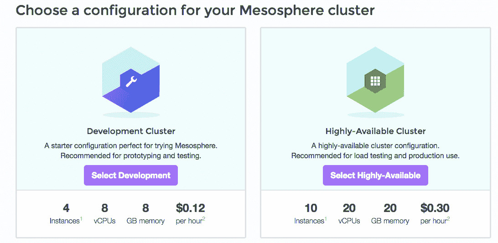
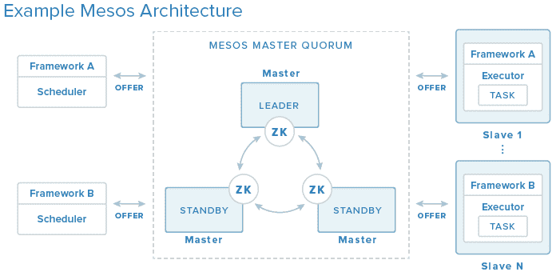

# 数字海洋现在支持中间层，无需 DevOps Hell 即可扩展和管理应用

> 原文：<https://thenewstack.io/mesosphere-now-supported-on-digital-ocean-for-scaling-and-managing-apps-without-devops-hell/>

DevOps 是个讨厌鬼。它会扰乱你的组织，迫使你不得不面对这一切:

DigitalOcean 联合创始人米奇·怀纳(Mitch Wainer)表示，为了减轻规模扩张带来的痛苦，DigitalOcean 今天宣布支持[中间层](http://mesosphere.com/)，以此来抽象互联网规模应用程序带来的日益增加的复杂性。Mesosphere 是由 Andreessen Horowitz 投资 1000 万美元的编排服务，它基于 Apache Mesos，Twitter 最初开发该服务是为了实现基础设施的自动化。今天，Apache Mesos 已经面向大众。易贝、Airbnb、网飞和 HubSpot 也在使用 Mesos 软件。

中间层现在可供所有数字海洋用户使用。DigitalOcean 为那些想尝试一下的人提供了一个开发者集群。其标准产品是高可用性集群。

【T2

在启动集群之前，只需输入您的公共 SSH 密钥和客户机 ID。

正如 Nancy Gohring 在新堆栈中所写的，Mesos 管理机器集群，根据需要自动扩展应用程序。它需要在每台机器上安装少量软件——该软件使用零处理能力和“可忽略不计”的内存，这与主调度程序相协调。每台机器上的软件向调度程序报告虚拟机或裸机服务器的容量信息，调度程序将作业分配给可用的机器。它可以自动扩展各种作业，包括 Hadoop 数据库、运行 Ruby on Rails 的节点和 Cassandra。

以下是 DigitalOcean 对 Mesos 架构的看法:

Mesosphere 的联合创始人兼首席执行官 Florian Leibert 表示，Mesosphere 正在押注 DigitalOcean 是一家吸引不断增长的面向开发人员的企业的提供商，这些企业将使用 Mesosphere 来部署高度可扩展的服务，这些服务不需要在以后的某个时间点进行重构。

> 缺省情况下安装的 Mesosphere 和 Mesosphere 的马拉松提供了一种抽象，允许开发人员在类似 PaaS 的环境中部署和扩展任何 Linux 工作负载，而没有任何典型的 PaaS 开销。

Leibert 说，预计第一批业务将是运行传统的 web 规模的工作负载，包括典型的 Ruby、Node、Python 和 Java 应用程序，以及通常驱动 web 服务和移动设备的 API。“但我们也预计，在与他们的 web 应用程序相同的集群上运行分析工作负载(如 Spark 和 Storm)的开发人员会大幅增加。”

在戈林之前的报道中，451 Research 的分析师杰伊·莱曼(Jay Lyman)表示，Mesos 可能对那些试图在内部创建类似 AWS 的环境的企业最具吸引力。AWS 提供了一些自动缩放工具。但许多企业仍不愿在公共云基础设施上运行一切。同时，他们不想阻止他们的开发人员利用 AWS 等公共云中的可用功能。他们希望在自己的私有云上提供这些功能。

但是，世界上的新公司都是从云服务开始的，自动扩展是中间层的重要议程。

Leibert 说，集群的自动扩展是许多客户要求的，DigitalOcean APIs 使这一点可以很容易地添加。他们还希望在同一个中间层集群上提供更多完整打包的堆栈，涵盖主要用例，如 ElasticSearch、Kafka、HDFS、Storm 和 YARN，以及面向 web 和移动的工作负载。

DigitalOcean 是新堆栈的赞助商。

特色图片[通过](https://www.flickr.com/photos/nasamarshall/8413576883/in/photolist-doRZct-dPtMhp-7dgvdH-7deRED-6EM8uA-oag373-oBHoNy-oNg3SH-9yx36b-ovRNdh-ey8cUs-ow4TVX-fdxUor-oafkg6-85Uy5h-ey73vz-ezZos3-afcJQ7-oDsjzM-6miHRr-eHLAHK-oD8sa7-fbRbnG-c1c7AY-ezWfer-9YXseM-dj6weU-85UxXf-9vxQst-iChUzG-iChZMH-iChf4H-iChpAh-iChZyM-iChWj3-iCi1Gi-iChUrf-iChUfy-iChfJF-iChYuT-8896V3-9vxQpZ-iChSJY-cmWt7J-cJaBaj-9vASYN-885W3g-85UxV5-a1bZ9F-eUVM78/) Flickr 知识共享。

<svg xmlns:xlink="http://www.w3.org/1999/xlink" viewBox="0 0 68 31" version="1.1"><title>Group</title> <desc>Created with Sketch.</desc></svg>