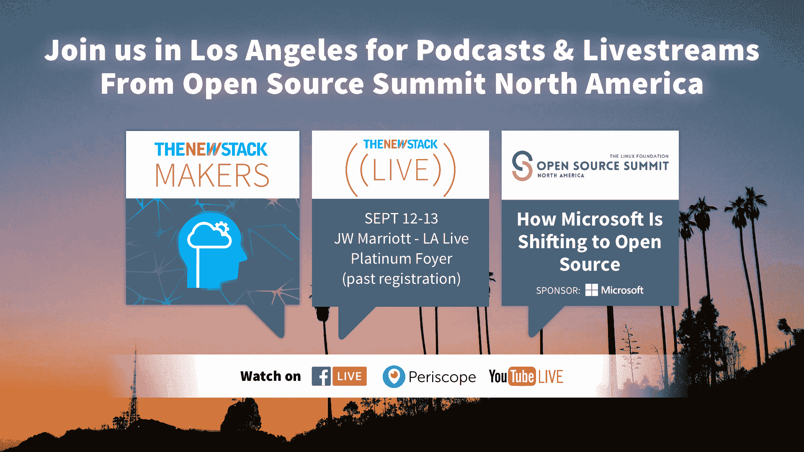

# 中间层带着 DC/操作系统的测试版回到了 Kubernetes

> 原文：<https://thenewstack.io/mesosphere-returns-kubernetes-beta-dcos/>

在退出 Kubernetes 项目一段时间后， [Mesosphere](https://mesosphere.com/) 在其 DC/OS 容器平台上为数据密集型应用程序提供测试版 Kubernetes。的确，一些客户已经在 DC 操作系统上运行 Kubernetes，但是随着[DC/操作系统 1.10](http://www.prnewswire.com/news-releases/mesosphere-launches-kubernetes-beta-on-new-dcos-110-empowers-developers-with-freedom-of-choice-across-container-orchestration-and-data-services-300514972.html) 的发布而宣布的这项服务，与其他任何服务一样容易使用——一键集群安装。

据联合创始人兼首席技术官[鸢·克纳普](https://twitter.com/superguenter?ref_src=twsrc%5Egoogle%7Ctwcamp%5Eserp%7Ctwgr%5Eauthor)称，Mesosphere 是早期 Kubernetes 项目的最大贡献者之一，但由于缺乏稳定的 API 而暂停了这项工作。

他说，这有点像脑部手术，让它保持足够稳定的状态，以便提供给客户。相反，该公司专注于构建核心的 DC 操作系统及其 SDK，而其他公司则更全面地构建 Kubernetes。

他说，现在使用它的 SDK，它可以提供一个稳定的产品——它是未改变的上游 Kubernetes。

它将支持 Kubernetes 和它自己的 Marathon orchestrator，它在 [DC/OS 1.8](https://thenewstack.io/mesospheres-data-center-operating-system-now-includes-scheduler-orchestrator/) 中直接将其移植到系统中。它把这一举动框定为给顾客提供更多的选择，现在向更受欢迎的技术“低头”。

该公司之前已经声明，它的目标是[允许任何或所有调度程序](https://thenewstack.io/mesospheres-data-center-operating-system-now-includes-scheduler-orchestrator/)在 DC/OS 平台上不受阻碍地运行，包括 Kubernetes，并使它们的运行更加无缝。

Knaup 说，马拉松用于世界上一些最大的集装箱集群，并使用更简单的运营模式。它还可以用于传统工作负载。

一些世界上最大的银行和电信公司是中间层的客户。新的堆栈先前强调了威瑞森的经历。

与此同时，Kubernetes 引入了一些令人困惑的概念，如[入口](https://kubernetes.io/docs/concepts/services-networking/ingress/)。然而，Kubernetes 仍然广受欢迎，许多公司试图消除其运营复杂性。

首席营销官彼得·瓜根蒂说:“不关注最流行的技术是愚蠢的。

该公司的目标是让它在 DC 操作系统上像 Spark、Cassandra、TensorFlow、Hadoop 等一样容易使用。

Knaup 说:“我们希望在规模上把所有这些联系在一起。将 Kubernetes 与 DC/操作系统覆盖网络、默认安全性和大数据应用的其他功能相结合，“如果我们能够以可扩展、容错的方式提供这些功能，我认为这将非常有价值。”

它的目标是那些希望向开发者提供 Kubernetes 即服务的提供平台运营商。

在一篇[博客文章](https://mesosphere.com/blog/kubernetes-dcos/)中，Knaup 指出:

*   Kubernetes 可以在共享的 DC/操作系统集群上与生产级数据服务并行运行。
*   在这种“受管理的 Kubernetes”模型中，中间层 DC/OS 将允许您同时运行多个不同版本的 Kubernetes 集群。

Kubernetes on DC/OS beta 将于 9 月 11 日星期一在 https://dcos.io/install/发售。

“这进一步证明了容器管理和编排软件市场的特点是混合使用，Kubernetes 是明显的领导者，但许多其他项目和供应商也广泛使用，”451 Research 分析师 Jay Lyman 说。

他指出，Mesos 存在的时间更长，与马拉松调度程序以及大数据应用和数据服务技术有着密切的联系，包括 Hadoop、Cassandra、Spark 和 Kafka。

“虽然使用容器的企业利用 Kubernetes 是很常见的，但他们利用它与其他技术集成或一起使用也很常见，如 Apcera、CoreOS、Nomad、Rancher、Swarm 或亚马逊、谷歌和微软的公共云容器服务。…我们看到越来越多的供应商支持越来越多的容器管理和编排选项，使这种混合使用永久化。”

同时，[DC/操作系统 1.10](https://mesosphere.com/blog/dcos-1_10-kubernetes/) 版本扩展了它在以下方面的功能:

*   **安全性**，包括定制认证机构集成和基于文件的秘密，支持运营商安全运行多租户服务和应用，安全共享数字证书。
*   **升级**，包括轻松备份和恢复应用程序配置、执行数据服务的实时升级以及自动验证 DC/操作系统升级的能力。
*   **联网**，带边缘负载均衡器。高性能 L4/L7 入口负载平衡器可以轻松地将 DC/操作系统集群内部的任何应用或服务向外界公开。
*   另外还有一个**增强服务 SDK** ，可以轻松地将新服务添加到 DC/操作系统目录中。DC/OS 1.10 现在认证生产就绪数据服务，包括 Apache Spark、Apache Cassandra、Apache Kafka、Elastic、HDFS、Confluent Kafka 和 Datastax DSE。

Apcera、CoreOS、Google、Mesosphere 和微软是新堆栈的赞助商。

<svg xmlns:xlink="http://www.w3.org/1999/xlink" viewBox="0 0 68 31" version="1.1"><title>Group</title> <desc>Created with Sketch.</desc></svg>