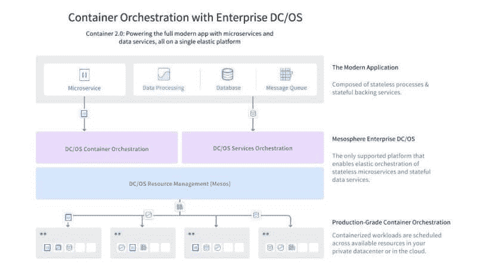

# Mesosphere 的“容器 2.0”统一了无状态和有状态工作负载

> 原文：<https://thenewstack.io/mesospheres-container-2-0-unites-stateless-stateful-workloads/>

关于有状态的基于容器的应用程序与无状态的应用程序的可行性的争论早已尘埃落定。在真实的多租户生产环境中，应用程序需要访问持久的数据存储和卷。让开发人员跳来跳去——甚至是开源的、设备无关的、标准化的陷阱——以便他们可以发送消息或在键/值存储或日志文件中记录条目，这是很荒谬的。

Mesosphere 已经找到了一种方法来管理有状态和无状态的容器工作负载，以及甚至不使用容器的工作负载，所有这些工作负载都在同一个共享基础架构上，使用 DC/OS (Mesosphere 的数据中心操作系统)——商业版和开源版。

诀窍是允许一些分布式程序处理它们自己的调度。容器编排器，如 [Kubernetes](/category/kubernetes/) 和 [Docker Engine](https://thenewstack.io/docker-engine-1-12-will-come-built-orchestration-capabilities/) ，使用单一的“单片”调度器， [Florian Leibert](https://www.linkedin.com/in/florianleibert) ， [Mesosphere](https://d2iq.com/) 的首席执行官在一篇博客文章中提到。他写道:“由于没有一个调度程序可以针对所有工作负载进行优化，用户最终会受到非最佳操作限制，包括被迫为每个服务创建单独的集群。”

为此，Mesosphere 与一些公司合作，允许他们将自己的调度程序连接到 DC/OS，包括管理 Apache Kafka 的 Confluent 和管理 Apache Cassandra 的 Datastax。该公司还扩大了与 Lightbend 的现有合作伙伴关系，以扩展 Lightbend 微服务调度程序，使其与 DCOS 合作。

该公司开始推广这种编排风格，即工作负载在不使用插件的情况下与持久卷进行通信，称为“容器 2.0”

“在同一个集群上运行多个调度程序——同时在共享节点上运行多租户——是最大限度地提高资源利用率和适应广泛的 Container 2.0 工作负载的唯一方法，”Leibert 写道。

## 加快里程表

阿帕奇梅索斯和阿帕奇卡夫卡之间没有内在的不兼容；从黑暗时代(2014 年)开始，开源项目[就在前者](https://cwiki.apache.org/confluence/display/KAFKA/Launching+Kafka+with+Apache+Mesos)上托管后者。但是在容器化的环境中，如果容器中的应用程序不认为它是一个一致的实体，那么建立有状态的消息流或提交日志就没有多大意义。

Confluent 最近发布了其实现 Kafka 0.10 的 [3.0 商业版](https://www.confluent.io/blog/announcing-apache-kafka-0-10-and-confluent-platform-3-0)。Confluent 的目标是将其 Enterprise 3.0 平台作为任何形式的客户端都可以通过访问的实时数据流的中央存储库。随着该版本的发布，合流和[中间层](https://d2iq.com/)联合宣布将支持 3.0

Kafka 可以很好地掌握与流分析组件(如 Apache Spark)和行存储模型数据库(如 Cassandra cluster)无缝交互的容器化环境的关键，而无需重新设计容器引擎，也无需为这些其他组件构建一些奇怪的容器系统。

“我们拥有所有这些系统——Cassandra、Spark 等等——它们组成了 DC/操作系统，不仅仅是调度容器，”Leibert 在对新堆栈的后续采访中说。"它们实际上扩展了容器 1.0 的概念."

但是正如 Leibert 向我们解释的那样，中间层努力这么早转动众所周知的里程表背后的意义是象征着思维方式的改变。

他指出，使用标准配置管理环境中的分析和消息传递，一次只能识别一个 Kafka 实例。向外扩展实例需要重新配置它，这是一个脚本练习。他说，有了 DC 操作系统中的融合企业，放大或缩小一个卡夫卡实例就变成了一个命令。

## 卡夫卡式的

因此，我们问 Leibert，如果它现在只是一个命令，就像任何其他 DC/操作系统命令一样，那么这个命令不能是自动化的吗——或者更具体地说，作为自动响应事件或条件的脚本或策略的一部分？

由于 Kafka 能够在任何时候报告自己的容量，CEO 回答说，一个脚本可能确实被用来发送一个适当的放大命令；或者，可以向可以手动执行命令的操作员发送警报，而不会导致停机。他讲述了自己在 AirBnB 的经历，在那里，为一台服务器扩展 Kafka 意味着拆除那台服务器。

[![When choosing a container orchestration tool, 68 percent of respondents said the ability to manage long-running applications is critically important. Fifty-nine percent also said load balancing capabilities is extremely important. Less important is persistent storage, with only 38 percent saying it is extremely important. Although the ability to use stateful storage is essential to running many types of workloads, respondents to The New Stack’s survey have already started production use of containers without it. Thus, many likely believe that while it can solve problems, it is not an essential capability. Similarly, it is not surprising that only 11 percent say handling non-container workloads is extremely important since much early production uses of containers are occurring in greenfield cloud-native environments.](img/c13da755ac7867c052eb2878f898df70.png)](https://thenewstack.io/tns-research-present-state-container-orchestration/)

在选择容器编排工具时，68%的受访者表示管理长时间运行的应用程序的能力至关重要。59%的人还表示负载平衡能力极其重要。不太重要的是持久存储，只有 38%的人认为它极其重要。尽管使用有状态存储的能力对于运行多种类型的工作负载是必不可少的，但新堆栈调查的受访者已经开始在生产中使用没有有状态存储的容器。因此，许多人可能认为，虽然它可以解决问题，但它不是一种必要的能力。同样，只有 11%的人认为处理非容器工作负载极其重要也就不足为奇了，因为容器的许多早期生产使用都发生在绿地云原生环境中。(劳伦斯·赫克特)

“每当我们想升级它时，我们必须停止它，进行配置更改，然后重新启动它，”他说。“这通常意味着日志可能会丢失，我们必须在事后进行大量的工程设计，以确保这些日志不会丢失。更棘手的是，如果您想预先添加另一个代理，或者向 Kafka 添加容量，您必须进入几乎每个节点并更改配置。有了我们，您可以在运行过程中进行这种改变。我们已经配置了节点，所以我们可以在那里动态地启动一些新的东西。”

他说，在 DC 操作系统出现之前，一个 10 节点的 Kafka 集群是一个物理实体，如果不装入一台新机器，安装 Linux，安装 Kafka，然后改变 10 个现有节点的配置，你就无法向其中添加另一个节点。在容器化时代的开始，这些节点配置过程变得更加自动化，但问题是，它们仍然存在。

现在，添加节点只需在该节点(物理或虚拟)上安装 DC/操作系统，并使系统能够将其吸收到现有框架中，而无需手动重新配置。Leibert 解释说，Kafka 已经被设计为当一个新的经纪人加入集群时，只需改变他们的流 id，就可以接受经纪人之间的流重新分配。因此，流工作负载可以作为节点添加过程的一部分重新分配，也不会出现停机。

> Mesosphere 正致力于一个编排框架，在这个框架中，容器的格式对于系统的管理来说不太重要。

Leibert 告诉了我们另一个关于他的一个客户的故事:一家主要的全球电信公司，其共享基础设施在数千个节点上运行 Cassandra、Kafka 和 Mesosphere Marathon。与"[无服务器架构](/category/serverless/)"类似，该电信公司在不停机的情况下动态升级其 Kafka 集群的能力可以被视为"无容器架构"。是的，有容器，就像有服务器一样。但是谁在乎呢？

“此外，他们还在运营一项消费者服务，”莱伯特解释道，“这需要从提供网络流量到收集日志，通过 Kafka 传输这些日志文件，然后对它们进行 Spark 分析，然后将分析汇总保存在 Cassandra 数据库中。”

## 国情咨文

然而，Leibert 希望我们采取的信念(或许反过来也是逻辑)的飞跃是，在一个同时维护持久流和数据库的系统中，容器如何编排的本质在某种程度上改变了容器实际上是什么的本质(如果不是格式的话)。

“我们试图确保每个人都明白，容器本身，以及它们今天被大多数其他系统编排的方式——容器 1.0——实际上只与无状态应用程序有关，”他说。“DC/操作系统能做的远不止这些——它不仅仅是无状态容器。这些有状态的工作负载共同生活在同一个共享基础架构上。”

事实上，Mesosphere 正在致力于一个编排框架，在这个框架中，容器的格式对于系统的管理来说不那么重要。在最近对该公司创始人兼首席架构师 Ben Hindman 的采访中，他提醒我们，Mesosphere 将于 9 月份支持 Windows 容器，届时微软将发布 [Windows Server 2016](http://arstechnica.com/information-technology/2016/07/windows-server-2016-coming-in-september-with-new-servicing-for-nano-server/) 。

Hindman 说，在采用 Windows 容器和为微软 Hyper-V hypervisor 制作的工作负载时，新 Apache Mesos 1.0 的贡献者可以更容易地添加对不同类型工作负载包的支持。他的意思不仅仅是新的。

“如果在 2016 年，我们给[*统一*]集装箱增加运行虚拟机的能力，我不会太惊讶，”Hindman 告诉新堆栈。“把它想象成一种图像格式，就像你有 Docker 图像作为图像格式和 **appc** 图像一样。我可以想象我们还会得到类似虚拟机的东西。我认为，这可能就是你将看到的这种东西在 Mesos 中的演变方式。”

2016 年剩下的时间不多了，所以如果项目中的某个人还没有走得很远的话，欣德曼会提出这种可能性是值得怀疑的。

DC/操作系统与马拉松相结合，可以同时协调虚拟机管理程序耦合的工作负载和容器化的工作负载，这将真正改变去年这个时候[流传的 Mesos 的价值主张](http://www.enterprisetech.com/2015/02/23/apache-mesos-emerges-as-datacenter-os/)。虽然 Mesos 早于 Docker 的崛起，但在 2015 年，Mesos 被认为是虚拟机的替代品，因为 Mesos 将工作负载视为“弹性的”。一些人将 Mesos 吹捧为文化革命的先驱，就像弗朗兹·卡夫卡自己一样，最终将开发者从野蛮的官僚机构的束缚中解放出来，将 VMware 抛在一边，向它告别。

别忘了，Hindman 对 Mesos 的设计一直是基于两级调度器的。第二层总是承诺在*任何*类型的打包工作负载和资源管理器之间提供一个抽象层。

Florian Leibert 解释说:“两级调度程序的概念允许你为特定的框架赋予特定的优先级，这就是 Twitter 和许多其他公司今天以这种多租户方式运行数据中心的方式。”“你给卡夫卡一定的优先权，你可能给 Spark 或者 Hadoop MapReduce 一定的优先权。一旦它接近某个阈值，例如 90%的利用率，它将不会允许您运行任何 Spark 作业，直到利用率下降，以确保 Kafka 可以继续运行。”

Hindman 的建议开启了一个非常真实的可能性，即 Mesos 可以以同样的方式为基于 VM 的工作负载提供弹性。如果是这样的话，那么“容器 2.0”作为一种思考工作负载控制和分区的新方式就有了一个可行的论据——特别是，作为一种少考虑*多考虑*的方式。

Mesosphere 是新堆栈的赞助商。

专题图片:[弗朗兹·卡夫卡头部的动态雕塑](http://www.art-vibes.com/art/david-cerny-kinetic-head-of-franz-kafka/)，位于布拉格的一个城镇广场，由 David CERN 创作，通过 Wikimedia Commons 授权。

<svg xmlns:xlink="http://www.w3.org/1999/xlink" viewBox="0 0 68 31" version="1.1"><title>Group</title> <desc>Created with Sketch.</desc></svg>