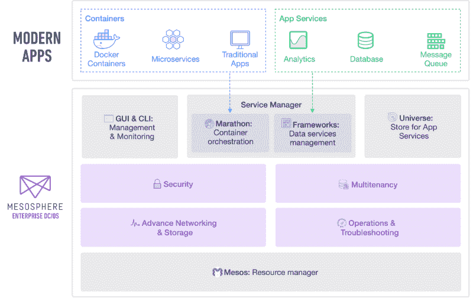

# Mesosphere 的数据中心操作系统现在包括一个调度器和协调器

> 原文：<https://thenewstack.io/mesospheres-data-center-operating-system-now-includes-scheduler-orchestrator/>

[开源软件的指导原则](https://thenewstack.io/containers-container-orchestration/)之一，尤其是在基础设施领域，是“包含电池但可更换”的原则，该原则认为用户和实现者应该始终有明确的可插拔组件选择。这是定义新堆栈空间中许多公司的“不可知论”的一部分——例如，[曼特，他的整个用例](https://thenewstack.io/swinging-pendulum-container-orchestration/)是基于灵活性和可互换性。

2014 年，Docker Inc .因其革命性的系统基础架构方法而受到称赞，这在当时与 VMware 围绕虚拟机管理程序驱动的虚拟机的堡垒心态形成了鲜明对比。“我不认为有任何危险，”[当时写给黑客新闻](https://news.ycombinator.com/item?id=8700466)的一名撰稿人，“只要一切都是开放和可互换的，即使你喜欢 Docker(格式)，你也可以避开 Docker(公司)。”

## “默认”或“其他”

今天，随着 [VMware 允许其技术被 Docker](https://thenewstack.io/vmware-integrated-containers-may-introduce-docker-enterprise/) 注入，Docker 已经将其自己的编排管理器捆绑到其核心[容器运行时引擎](https://thenewstack.io/dockers-plan-dominate-enterprise-data-center/)中。尽管将 Swarm orchestrator 集成到 Docker 版并不排除实现者使用 Kubernetes、Rancher 或 Marathon 来代替，但拥有 Swarm 可以让选择 Swarm 变得有争议——正如本文中的所假设的那样，选择[——“不需要动脑筋。”](https://thenewstack.io/dockers-plan-dominate-enterprise-data-center/)

当关于 Docker 创造力的争论正在进行时，Mesosphere 做出了类似的举动。对于 1.8 版本的数据中心操作系统(DC/操作系统)，Mesosphere 选择将其 Marathon orchestrator 直接移植到系统上，将其公开为“DC/操作系统服务”

“其结果是，”Mesosphere 的 Derrick Harris 在一篇公司博客文章中写道，“用户可以直接从主 DC/操作系统仪表板访问服务管理和容器编排(由后端的马拉松提供支持)——通过他们熟悉和喜爱的同一个 DC/操作系统用户界面。”

“我们总是与 DC/OS 进行马拉松式的合作，”Mesosphere 创始人兼 Mesos 联合创始人 [Ben Hindman](https://www.linkedin.com/in/benjamin-hindman-880b219) 在谈到新堆栈时解释道。“我们在这里真正做的是，我们说，我们不仅希望有一个默认的马拉松，而且我们希望默认的 DC/操作系统控制平面从 API 的角度，从 UI 和 CLI 的角度集成马拉松。也就是说，我们还想确保我们可以交换一些东西，并使用他们想要的任何其他 API，他们可以运行其他马拉松或[极光](http://aurora.apache.org/)或任何其他你今天可以运行的调度程序。

“我认为这与 Docker 和 Swarm 的情况有所不同，”Hindman 继续说道。“我们以前并不是没有推出这种产品，我们也没有对其进行烘焙，因此您无法运行不同的调度程序。我们只是为 DC/操作系统提供了一个 UI 组件和一个 CLI 组件，它们可以直接与我们在 Marathon 中称之为根调度程序的组件进行对话。”

## 避免开关的开关

Hindman 解释说，在 DC 操作系统的早期版本中，它的用户界面可以让用户一键进入马拉松。如果你喜欢在事物之间来回翻动，那会被认为是方便的。在 1.8 版中，由根调度程序管理的任务(无论是什么任务)无需单击即可在 UI 中显示。

“完全诚实地说，我认为我们也将为你在上面运行的所有框架和调度程序做这件事，”他继续说。“因为我们有来自 Mesos 的所有信息，我们可以非常干净地整合这些信息。这就像当网络公司做分析时，他们发现购买一个产品需要五次点击而不是两次点击，或者需要五次点击而不是两次点击才能到达内容。我们能做些什么让它点击两下吗？”

马拉松和[节拍器](https://dcos.github.io/metronome/)框架，随着[版本 1.8](https://dcos.io/releases/1.8.0/) ，分别成为 DC/OS 服务和 DC/OS 作业。Metronome 是作为一个调度库开发的，特别是针对“一次性任务”，或者真正短暂的可以过期的容器；相比之下，典型的编排会让这样的任务重新启动。虽然有人将 Metronome 与 Chronos 进行了比较(Chronos 是 Mesos 的另一个 **cron** 调度程序)，但 Metronome 调度程序具有与 Marathon 共享相同代码库的优点。

例如，Hindman 提供了一个分析管道，其特点是一系列相互依赖的并发任务。如果一个任务失败，依赖于该任务的管道的其余部分应该被中断，而不是重新启动。虽然 Apache Chronos 可以处理这种调度方式，但他说 Metronome 可以利用 DC/OS 平台内置的安全功能。

“‘日程安排者’有时候对我来说是个很难用的词，”亨德曼承认道。“当我在伯克利的时候，我们用‘调度程序’这个词，我们只是学者，用这个词没什么大不了的。如今，人们会说，‘哦，一个*调度*，就像卡夫卡一样！这太疯狂了，你为什么需要卡夫卡？这也是我们越来越多地使用“框架”这个词的原因之一。"

访问控制、认证和授权是 Hindman 挑选出来的对 DC/操作系统发展至关重要的安全因素。在启动时将*机密*传递给容器(例如，非公共参数)一直是个问题。一些开发人员实际上已经重新构建了整个容器映像，将秘密作为文档嵌入到文件系统中——如果注册表遭到破坏，文件系统被侵入，这将是一种危险的情况。Hindman 指出，DC/OS 1.8 使用 SSL 来加密平台组件之间的所有通信，尽管如何或是否加密容器之间的通信仍将取决于开发人员。

他说，这仍然是 Mesosphere 的目标，使任何或所有调度程序/框架能够在 DC/OS 平台上不受阻碍地运行，包括 Kubernetes。但是 DC 操作系统新内置服务的运行环境将会看起来(至少对用户界面的用户来说)更加无缝。

## 避免完全不同的开关

几个月前，Ben Hindman 和我们谈及时，他讨论了作为容器生态系统一部分的*插件*如何变得无关紧要。他描绘了一幅画面，描绘了一个 orchestrator 如何能够以这样一种方式实现容器之间的联网，即容器引擎不需要临时拼凑来实现它。

从理论上讲，插件是一种组件，借用一句话来说，它可以巧妙地(也许是无缝地)“包含”在容器引擎或编排器中。除非这种纳入会显得自私自利。

DC/OS 1.8 现在为一个容器分配一个 IP 地址。该地址可以通过 IP 地址管理器(IPAM)或 VxLAN 来分配，但 VxLAN 不是唯一的方式。或者，DC/操作系统支持通过虚拟 IP (VIP)地址将多个节点作为一项服务进行寻址，当服务安装在调度程序中时，可以自动创建一个唯一的名称。正如 Hindman 解释的那样，“我们可以分配不一定来自网络覆盖的 IP，就像我们分配覆盖一样容易。。。这些 IP 可能能够通过网络基础架构进行动态调配，而组织的数据中心已经具备了这些基础架构。”他引用了 [Juniper Networks 的 Contrail](http://www.juniper.net/us/en/products-services/sdn/contrail/) 作为现有 SDN 平台的一个例子，DC/OS 可能会与该平台集成。

假设在这样一个系统中创建一个扩展的需求不是完全人为的，那么它就是一个扩展可以执行的工作类型。

“无论如何，一个组织可以拥有网络基础设施，”Hindman 解释道，“能够动态地分配一个不属于网络的 IP[*地址*]。但无论如何，开发人员可以不必再担心支持方面的事情，而是专注于他们实际分配到的 IP。”

对软件平台无缝性的追求一直是最受称赞的“创新”形式之一。据说，改善客户体验的一部分是[消除服务 A 和服务 b 之间的点击次数](http://www.cmswire.com/customer-experience/connecting-the-customer-experience-one-app-at-a-time/)。

但是[这是一个非常熟悉的论点](http://betanews.com/2009/01/19/the-ec-s-latest-objection-is-it-time-to-unbundle-ie-from-windows/)，这就是为什么任何种类的平台组件“捆绑”或“搭售”都会引发一个道德问题。可悲的是，当[有人将这个问题发挥到极致](http://techrights.org/2015/08/26/dcos-microsoft-trap/)时，我们有时会为质疑每一件小事而感到羞愧，以免被误认为阴谋论者。然而，让一个市场变得更加开放和透明，并不会降低它的竞争力。当开放被定义为提供选择，而选择改变了——即使是出于最技术性的原因——我们应该知道为什么才是公平合理的。

事实是，在技术领域，从来没有，将来也不会有什么是“一目了然”的

[思科](https://blogs.cisco.com/tag/mantl)、 [Docker](https://www.mirantis.com/software/docker/kubernetes/) 和 [Mesosphere](https://d2iq.com/) 是新堆栈的赞助商。

特征图片:本·辛德曼。斯科特 m 富尔顿的照片。

<svg xmlns:xlink="http://www.w3.org/1999/xlink" viewBox="0 0 68 31" version="1.1"><title>Group</title> <desc>Created with Sketch.</desc></svg>