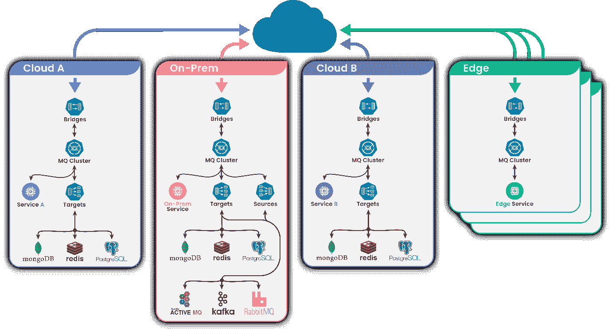
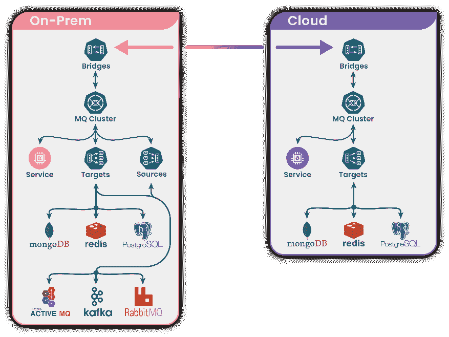
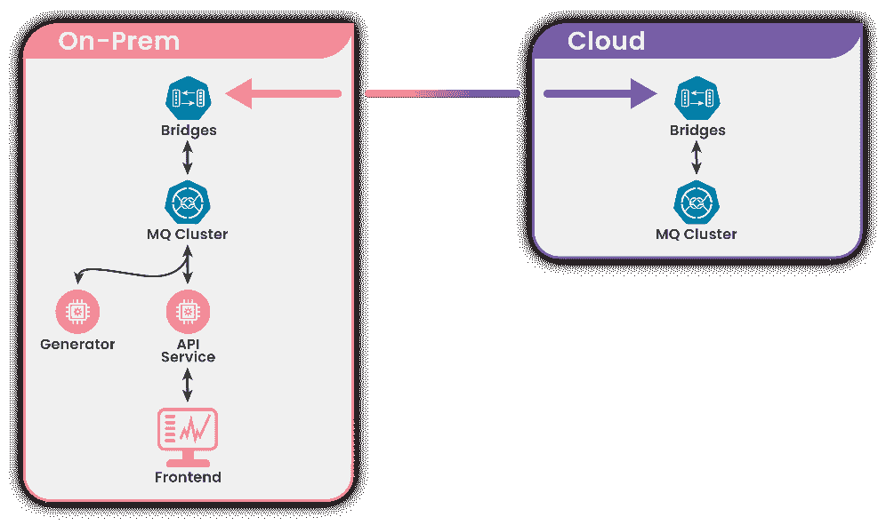
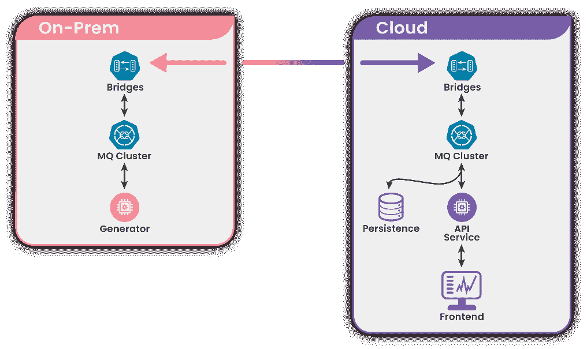

# 混合 Kubernetes 云环境中的消息传递连接

> 原文：<https://thenewstack.io/messaging-connectivity-in-a-hybrid-kubernetes-cloud-environment/>

[Cloud Native Computing Foundation](http://cncf.io/)赞助了这篇文章，期待虚拟 [KubeCon + CloudNativeCon 北美 2020–虚拟](https://events.linuxfoundation.org/kubecon-cloudnativecon-north-america/)，11 月 17-20 日。

 [廖尔纳巴特

Lior 是 KubeMQ 的技术负责人和产品架构师。作为一名拥有 20 多年软件风险投资和产品开发经验的连续技术企业家，他带来了云原生专业知识和实践经验。14 年前，Lior 创建了 Tradency(金融交易技术)，并自成立以来一直担任首席执行官。此前，他曾在 DSPG，阿尔法细胞和 TdSoft 的关键管理职位。Lior 拥有以色列特拉维夫开放大学的数学和计算机科学学士学位，以及宾夕法尼亚大学沃顿商学院的 AMP 学位。@lior_nabat](https://www.linkedin.com/in/liornabat/) 

混合云是一种强大的 IT 架构，由市场领导者提供支持，并被许多企业组织使用，它将公司的内部私有云服务和第三方公共云服务连接到一个灵活的基础架构中，用于运行组织的应用程序和工作负载。

混合云背后的原理是公共云和私有云资源的混合，它们之间有一定程度的协调。这使组织能够灵活地为每个应用程序或工作负载选择最佳云(并随着环境的变化在两种云之间自由移动工作负载)。它还使组织能够比单独使用公共云或私有云更有效、更经济地满足其技术和业务目标，如安全性、合规性、可扩展性和弹性。

高效管理跨应用程序和数据的消息传递连接是任何混合云战略的关键组成部分。无论是连接来自多个软件即服务(SaaS)提供商的应用、将部分应用迁移到微服务，还是将基于 Kubernetes 的解决方案与传统应用集成，连接性都是确保混合生态系统的组件快速可靠地协同工作的关键。

现代消息传递平台应该提供完整的混合基础设施透明性，并支持微服务级别的集成。当在混合环境中构建基于 Kubernetes 的高级技术解决方案时，部分微服务部署在一个环境中，其余部署在另一个环境中，以创建一个利用两个环境优点的统一解决方案。

在本文中，我们将讨论创新的消息平台如何使来自多个环境的微服务能够以提供速度、灵活性、安全性和规模的方式相互通信。

## **在混合云环境中构建基于 Kubernetes 的解决方案**

我们发现，利用微服务和 Kubernetes 进行容器编排的企业看到了混合部署模型的价值。尽管如此，当他们开始规划混合部署时，问题还是出现了。我们遇到的主要问题通常是处理复杂性和风险。

企业希望了解如何管理和运营内部和云环境，如何确保环境始终相互同步，以及如何以安全性为核心来构建环境。如果没有一个支持多集群的统一 Kubernetes 本地消息平台，构建混合云基础架构几乎是不可能的，因为通信复杂性将成为实现稳定、可靠和可扩展的混合云解决方案的关键瓶颈。

因此，无论您在哪里运行应用程序，都应该构建一个 Kubernetes 本地消息传递平台来简化 Kubernetes 的部署。这样，使用 Kubernetes 的原生消息平台作为其容器平台的企业不仅可以从企业级 Kubernetes 解决方案中受益，还可以从支持混合云解决方案的原生能力中受益。从消息平台控制中心，企业开发人员可以轻松地创建和管理多个基础设施 Kubernetes 部署。

现代消息平台考虑到了这一点。现代消息传递平台是一种基于消息的架构，它使来自多个环境的微服务能够相互通信，并构建一个混合基础架构解决方案。部署这样的消息传递平台为混合环境(包括多云、内部和边缘环境)提供了灵活的连接，由企业级消息代理和消息队列提供支持，具有现成的连接器、网桥和控制中心。一个混合就绪的消息传递平台还应该运行在围绕 Kubernetes 编排和管理的容器构建的企业软件上，以使部署体验尽可能自动化和简化。

图 1:使用 MQ 集群、桥和连接器(目标和源)部署在混合云环境中的解决方案

为了支持所有部署之间的可移植性，现代消息传递平台提供了桥梁，这是跨云环境、内部部署和边缘桥接、复制或聚合 Kubernetes 集群的完美方式。这种平台还提供了一组丰富的连接器，可以在集群内将微服务与云 web 和外部服务即时连接起来。

## **如何将微服务从内部成功迁移到混合部署**

现代消息传递平台应支持企业逐步迁移其当前的微服务，并在不中断服务的情况下无缝地动态迁移到混合云解决方案。

使用现代消息平台提供多集群支持，允许从本地微服务到云微服务的双向通信。这种设置使得两个不同的 Kubernetes 环境可以作为一个解决方案。多集群设置确保企业可以安全、透明、无停机地将服务从内部环境逐渐迁移到云环境(反之亦然)。此外，使用消息传递平台源和目标连接器还支持从具有遗留消息传递系统的单一环境到高级 Kubernetes 混合解决方案的逐步迁移。

图 2:使用现代消息传递平台部署在混合云环境中的解决方案

## **将财务软件从单一内部部署转移到混合云部署**

让我们看一个例子，一家运行财务软件的企业如何将应用程序从内部部署迁移到基于 Kubernetes 的混合云解决方案。

我们重点介绍的公司提供复杂的实时投资软件。为了在这个用例中保持简单，我们将把重点放在应用程序中负责向前端 web 客户端发送实时报价流(实时股票价格)的部分。该用例显示了将部分微服务从内部环境转移到云的过程，同时通过使用现代消息传递平台服务器、其连接器和桥来保持两个环境的同步。

## **设置混合云 Kubernetes 环境**

该公司选择了三家最受欢迎的供应商之一作为其公共云提供商，并使用企业软件创建了一个 Kubernetes 集群。然后，该公司使用其来自市场的运营商，一键部署现代消息平台集群，然后通过部署现代消息平台桥实现多集群支持。两个环境现在都已连接。消息可以从一个环境传递到另一个环境，在它们之间创建完美的同步。现在，设置已经准备好将微服务从内部环境迁移到公共云，并建立混合解决方案。

图 3:内部环境和云环境之间的同步示例

## **将服务从内部迁移到公共云**

接下来，API 服务和前端服务从内部部署转移到公共云上运行；两者都连接到消息平台。这些服务可以在公共云中相互通信，也可以通过现代消息传递平台的多集群连接与本地运行的服务通信。现在，价格是从内部环境接收的，而前端客户端则从云环境反映价格。该公司拥有完全同步的混合云解决方案。

在这种模式下，两种环境作为一个环境协同工作，越来越多的服务可以在不停机的情况下逐渐从内部迁移到云。

图 4:通过现代消息传递平台连接的两种环境的混合状态

## **结论**

创建混合云解决方案并不需要充满复杂性。当使用企业就绪平台和现代消息传递平台时，您可以更轻松地创建具有企业级保证的混合环境。一个现代化的消息传递平台支持环境之间的连接，并确保服务传输是无缝的，并根据公司的需求进行管理。

*要了解更多关于 Kubernetes 和其他云原生技术的信息，请考虑参加 11 月 17 日至 20 日在 T4 举行的 [KubeCon + CloudNativeCon 北美 2020 大会。](https://events.linuxfoundation.org/kubecon-cloudnativecon-north-america/)*

云计算原生计算基金会和亚马逊网络服务是新堆栈的赞助商。

通过 Pixabay 的特征图像。

<svg xmlns:xlink="http://www.w3.org/1999/xlink" viewBox="0 0 68 31" version="1.1"><title>Group</title> <desc>Created with Sketch.</desc></svg>