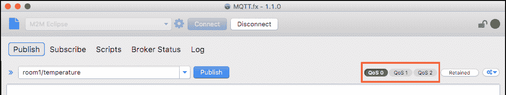
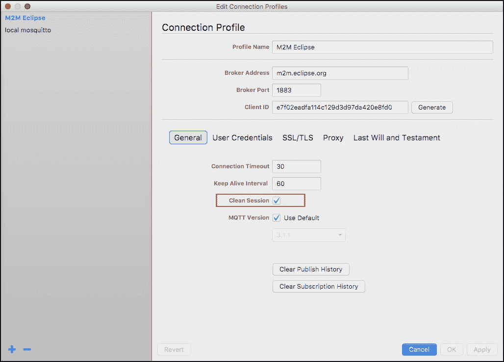
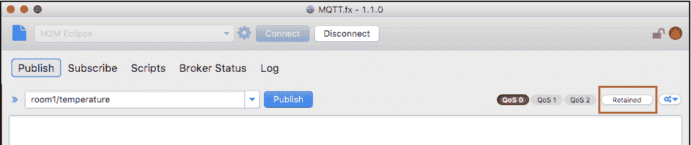
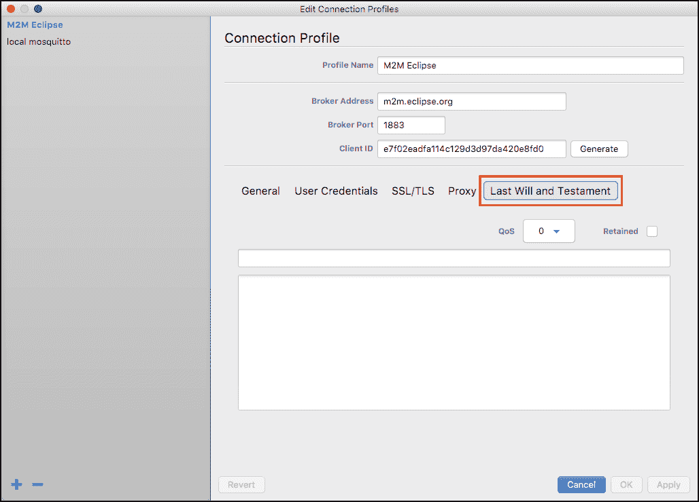

# MQTT 协议的消息可靠性和持久性

> 原文：<https://thenewstack.io/messaging-reliability-persistence-mqtt/>

MQTT 是机器对机器(M2M)和物联网应用程序的首选协议。基于[发布/订阅模式](https://www.youtube.com/watch?v=frGy-nGoGUY)，它简化了设备之间的连接。我们[以前的一篇文章](https://thenewstack.io/mqtt-protocol-iot/)介绍了 MQTT 的基础知识。在这一部分中，我们将介绍 MQTT 架构如何确保消息得到传递，以及当事情进展不顺利时它提供了哪些选项。

MQTT 是一个轻量级协议，它使用发布/订阅模式将感兴趣的各方相互连接起来。它通过将发送者(发布者)与接收者(订阅者)分离来实现这一点。发布者向一个中心主题发送消息，该主题有多个订阅者等待接收该消息。发布者和订阅者是自治的，这意味着它们不需要知道彼此的存在。如果您对 MQTT 的运行感兴趣，那么就在您的机器上设置代理和客户机。MQTT 上的[最后一篇文章](https://thenewstack.io/mqtt-protocol-iot/)详细介绍了安装和配置环境的步骤。

## 了解服务质量(QoS)

MQTT 可能是一个轻量级协议，但是它用于一些需要可靠消息传递的复杂场景。客户端可以配置不同级别的服务质量(QoS ),以确保可靠的消息传递。因为它是规范的一部分，所以 MQTT 代理应该实现这个特性。

与其他面向服务的环境类似，MQTT 中的 QoS 是代理和客户机之间的一个协议或契约级别。当双方都同意某个特定的 QoS 级别时，这就意味着代理接受了该契约。

MQTT 中有三个级别的 QoS:

*   QoS 0:最多一次交付。
*   QoS 1:至少一次交付。
*   QoS 2:恰好一次交付。

### QoS 0:最多一次交付

这是客户机和代理使用的默认服务质量级别，它不保证消息的传递。在 MQTT 中，消息传递依赖于网络能力和连接性。预期订阅者会确认收到，并且预期发布者不会重试传递。消息可能会到达订阅方，也可能根本不会到达。在网络可靠并且偶尔丢失消息是可以接受的环境中，QoS 0 是首选。例如，当多个温度传感器每 10 秒发布一次消息时，丢失几个不会对系统产生太大影响。

### QoS 1:至少一次交付

这种服务质量确保消息至少到达接收者一次。用户也可能多次收到相同的消息。他们需要实现处理重复消息的逻辑。订阅者向代理确认收到消息，代理将停止重试传递。QoS 1 用于有保证的消息传递非常重要的场景。多次收到相同的消息是可以接受的，但至少应该发送一次。此 QoS 级别在定期报告关键设备或系统状态的远程监控场景中进行配置。这是最常用的 QoS 级别。

### QoS 2:恰好一次交付

QoS 2 提供最高质量的服务，在这种情况下，消息的丢失或重复都是不可接受的。它伴随着与可靠的服务质量相关的开销的增加。虽然这可能是最可靠的 QoS，但也是最慢的。对于要求保证消息传递的特定客户端，应该谨慎使用 QoS 2。它用于不能丢失消息或接收重复消息的关键任务场景。架构师和开发人员应该意识到使用 QoS 2 时的性能权衡。对于大多数部署，QoS 1 就足够了。

了解订阅主题的每个客户端可以请求不同级别的 QoS 是很重要的。MQTT 代理可以为订阅相同主题的每个客户机维护不同的 QoS 级别。因为客户机(发布者和订阅者)在 MQTT 中是自治的，所以它们可以使用彼此独立的不同 QoS 级别。发布者可以使用与订阅者完全不同的 QoS 级别。

如果您使用 [MQTT.fx](http://mqttfx.jfx4ee.org/) 工具作为客户端，您可以为发布者发送的每条消息配置 QoS。

## 坚持

尽管 MQTT 不是一个成熟的面向消息的中间件，但它支持消息的持久性。当处理在受限环境中运行的客户端时，这个特性变得非常重要。

每次客户机连接到 MQTT 代理时，它都会启动一个新的会话来订阅或发布主题。如果连接丢失，该过程将重新开始，客户端将建立一个新的会话。此过程可能会干扰系统的性能，尤其是处理能力较低且连接断断续续的客户端。这就是 MQTT broker 的持久性特性有所帮助的地方。

当客户机连接到 MQTT 代理时，它可以将‘Clean Session’标志设置为 false，表示即使在客户机断开连接后，代理也应该保留会话信息。然后，代理开始为该客户端持久化会话。每个会话都包含详细信息，例如客户端订阅或发布的主题、客户端脱机时发送的 QoS 1 和 QoS 2 消息，以及客户端尚未确认的 QoS 2 消息。

如果将清理会话标志设置为 false，客户端将从离开的地方开始，而不是从空白开始。但是，代理如何知道它是同一个客户呢？连接到代理的每个客户端都应该有一个惟一的标识符。当客户机 id 与一个可用的持久会话匹配时，代理立即将该会话重新分配给客户机。因此，确保参与 MQTT 网络的每个客户机都有唯一的标识符是很重要的。

持久性在确保代理满足 QoS 1 和 QoS 2 方面也起着重要的作用。这个特性必须谨慎使用，因为它会干扰代理的性能。

在 MQTT.fx 中，可以通过单击选项中的复选框将 clean session 标志设置为 true。

## 保留的邮件

请记住，在 MQTT 中，客户机是自治的，不承认彼此的存在。这也意味着当订阅者连接到代理时，它不知道何时会收到消息。可能没有发布者向该主题发送消息，或者发布者可能长时间离线。

在某些情况下，发布者在新订阅者连接到代理后立即与所有新订阅者共享最后一条消息是有意义的。例如，当移动应用程序(发布者)向多个连接的灯泡(订阅者)发送带有亮度和颜色值的消息时，它希望新的灯泡设置为相同的值。因此，当一个新灯泡连接到 MQTT 代理时，它会收到所有其他灯泡都会收到的最后一条消息。这确保了现有订户和新订户的状态是相同的。

发布者可以指示代理将最后发送的消息传递给所有新订户。这是通过将保留标志设置为 true 来实现的。当代理获得保留的消息时，它知道必须将该消息推送给新的订阅者。这个特性对于让新订户快速了解与其他订户相同的状态非常有用。

使用 MQTT.fx 时，您可以在从发布者发送消息之前点击“保留”按钮。

## 最后的遗嘱(LWT)

客户突然与经纪人断开联系是很常见的。设备可能会断电或失去网络连接，从而被迫断开连接。在许多情况下，让其他客户端知道某个特定客户端突然结束了会话可能会有所帮助。

MQTT brokers 提供了一个强大的功能，叫做 LWT(last will and establishment ),它使客户能够主动选择一个主题和消息，当它断开连接时将被发布。感兴趣的客户可以订阅 LWT 主题，当客户被不恰当地断开连接时，他们会立即得到经纪人的通知。

例如，当移动应用程序(发布者)失去连接时，该应用程序控制的所有设备都会收到一条消息，提示该应用程序已离线。当移动应用程序获得连接时，它可以发布同一主题的保留消息，通知客户端它已在线。重要的是要知道，LWT 的主题和信息并不特别或保留。客户端可以像发布任何其他主题一样向其发布消息。

LWT 主题和消息提供了一种机制，让所有感兴趣的客户端了解特定客户端的状态。

单击 MQTT.fx 中的 LWT 选项来配置主题和消息。

AWS IoT 有一个称为[设备影子](http://docs.aws.amazon.com/iot/latest/developerguide/iot-thing-shadows.html)的有用功能，它有效地利用服务质量、保留的消息和 LWT 的概念来设置离线设备的状态。

<svg xmlns:xlink="http://www.w3.org/1999/xlink" viewBox="0 0 68 31" version="1.1"><title>Group</title> <desc>Created with Sketch.</desc></svg>