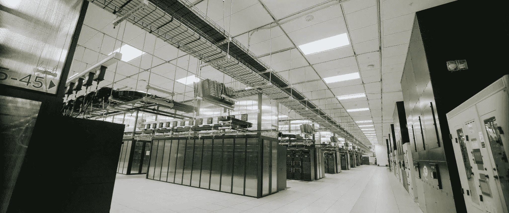
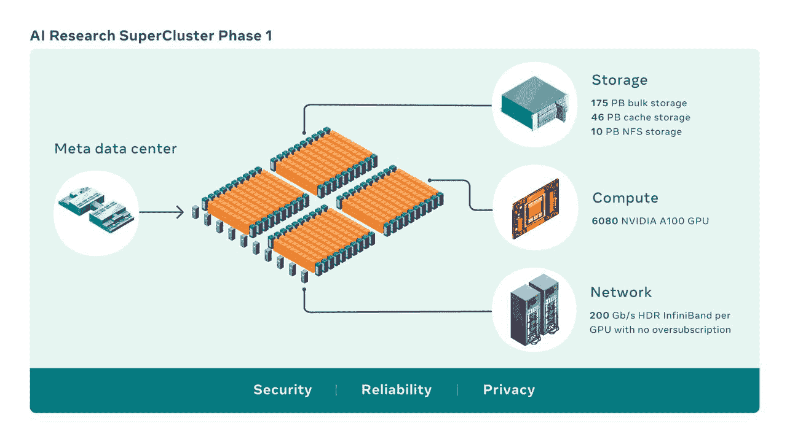

# Meta 为元宇宙建造大型人工智能超级计算机

> 原文：<https://thenewstack.io/meta-building-massive-ai-supercomputer-for-metaverse/>

脸书母公司 Meta 正在建造一台由 GPU 驱动的大型超级计算机，以运行其人工智能(AI)和机器学习驱动的工作负载，这些工作负载将是开发元宇宙[的关键。](https://thenewstack.io/meta-metaverse-developers/)

该公司已经将人工智能研究超级集群(RSC)的第一阶段放到了网上，公司研究人员已经开始使用它来训练大型机器学习模型，如自然语言处理 (NLP)和计算机视觉等领域，根据脸书人工智能研究(FAIR)的软件工程师 [Shubho Sengupta](https://www.linkedin.com/in/shubho-sengupta-340587/) 和 Meta 的技术项目经理[李凯文](https://www.linkedin.com/in/kevinkyuho/)在[撰写的博客文章](https://ai.facebook.com/blog/ai-rsc)。

目标是在 6 月前完成超级计算机，届时它将拥有 16，000 个 Nvidia Tensor Core A100 GPUs，芯片制造商 DGX A100 系统作为其计算节点，通过 InfiniBand 连接。它将提供一个缓存和存储系统，可以提供每秒 16tb 的训练数据，并将性能提升到[EB](https://thenewstack.io/high-performance-computing-2022-exascale-for-all/)。RSC 目前由 760 个英伟达 DGX A100 系统和 6，080 个 GPU 组成。

该系统将能够用数万亿个参数训练机器学习模型。RSC 将在 Meta 当时被称为脸书-在 2017 年建立一个系统五年后完成，该系统在一个单一集群中拥有 22，000 个来自英伟达的 V100 GPUs，每天运行 35，000 个培训工作。

森古普塔和李写道:“2020 年初，我们决定加快进度的最佳方式是从头开始设计新的计算基础设施，以利用新的 GPU 和网络结构技术。”“我们希望这个基础设施能够在大到 1 EB 的数据集上训练具有超过 1 万亿个参数的模型，为了提供规模感，这相当于 36，000 年的高质量视频。”

## **快速人工智能系统**

Meta 官员预测，RSC 将比 2017 年建造的 RSC 快 20 倍，运行 Nvidia 的集体通信库(NCCL)工具快 9 倍，运行大规模 NLP 工作负载快 3 倍。他们预测，一旦完成，该系统将是世界上最快的人工智能超级计算机。

[Intersect360 Research](https://www.intersect360.com/) 的首席研究官 Dan Olds 表示，根据他的计算，一旦完成，RSC 将拥有超过 1.1 亿个 GPU 核心，远远超过中国使用超过 450 万个 Matrix-2000 核心的加速器密集型天河-2A 超级计算机。天河-2A 在 2013 年至 2015 年间是世界上最快的超级计算机，并且仍然在【Top500 强榜单上排名第七。

“这太可怕了，比当今最大的 GPU 加速系统还要高一个数量级，”Olds 告诉新堆栈。“这将把加速器技术提高一个数量级，比我们以前见过的还要高。就全人工智能机器而言——这显然是它的未来——它再次比我们以前见过的任何机器大一个数量级。让一家私营公司来做这件事，也是一种突破。”

## **给开发者的教训**

Olds 表示，开发人员需要注意 Meta 和它的 RSC 超级计算机，以及 GPU 在未来计算中将发挥越来越大的作用。

他说:“对他们来说，这是……更大更好的系统。”。“他们将能够以前所未有的规模进行机器学习。对于一般的开发人员来说，它应该告诉他们的是，如果还没有变得非常明显的话，他们需要在 CUDA(英伟达在通用计算中使用 GPU 的平台)等方面拥有深厚和丰富的技能，不要在 AMD 的 MI 200 GPU 上睡觉，它现在提供的性能甚至比英伟达的 A100 更高。”

奥尔兹补充说，“GPU 战争正在进行，但开发人员将不得不利用这种力量来建立复杂的人工智能模型，并在适当的时间尺度内教授它们。”

## **第一阶段已经开始，更多阶段即将到来**

根据 Meta 的说法，RSC 的第一阶段不仅包括 100 个 GPU，还包括 175 Pb 的大容量存储，46PB 的高速缓存和 10PB 的 NFS 存储，以及一个 InfiniBand 互连，该互连可以为每个 GPU 提供 200GB/s 的带宽，而不会超额订购。奥尔兹表示，仍然有一些问题需要回答，包括该公司如何冷却这样一个庞大而强大的系统。

然而，考虑到超级计算机中的大量 GPU，“CPU 是什么以及有多少 CPU 核心并不重要，”他说。“已经不是 CPU 游戏了。已经有一段时间了，但这是一个加速器游戏。他们在今天的可能性的最边缘建造这个东西。”

“设计和建造像 RSC 这样的东西不仅仅是性能的问题，而是尽可能最大规模的性能，以及当今最先进的技术，”Meta 官员在他们的博客帖子中写道。所有这些基础设施必须非常可靠，因为我们估计一些实验可能会运行数周，并需要数千个 GPU。最后，使用 RSC 的整个体验必须对研究人员友好，这样我们的团队就可以轻松地探索广泛的人工智能模型。"

他们写道，持续的伙伴关系也很关键。企鹅电脑、Pure Storage 和 Nvidia 都与 Meta 合作建立了第一代人工智能基础设施。Penguin 现在正在帮助部署集群和设置控制平面的架构、硬件集成以及托管服务，Pure 提供了可扩展的存储解决方案，Nvidia 不仅提供了边缘系统、GPU 和 InfiniBand 结构，还提供了 NCCL 等软件堆栈组件。

## **疫情和芯片短缺增加挑战**

Meta 的采购经理乔治·尼兹尼克在 Meta 发布的视频中说，2020 年决定需要另一台超级计算机，但规划和建造它并不是一件容易的事情。

“人们不能简单地购买一台超级计算机并启动它，”尼兹尼克说。“RSC 是在极其紧迫的时间表下设计和执行的，没有传统产品发布周期的好处。此外，疫情和一个主要行业芯片供应短缺的打击恰恰是在错误的时刻。我们必须充分利用我们所有的集体技能和经验来解决这些困难的制约因素。”

根据森古普塔和李的说法，由于新冠肺炎的缘故，这个项目一开始是一个远程项目，只有一个简单的共享文档。从图形处理器到光学元件都很难获得，建筑材料必须根据新的安全协议运送。RSC 也是从头开始设计的，这意味着根据公司的需求创建新的约定。冷却、电源、机架布局和网络等数据中心设计问题有了新的规则，包括新的控制平面。

Meta 还创建了一个名为 AI Research Store (AIRStore)的存储服务，以满足高度可扩展的存储需求。

“为了优化人工智能模型，AIRStore 利用了一个新的数据准备阶段，预处理用于训练的数据集，”他们写道。一旦执行了一次准备，准备好的数据集可以用于多次训练运行，直到它过期。AIRStore 还优化了数据传输，以便最大限度地减少 Meta 数据中心主干网上的跨区域流量。”

## **对元宇宙的信仰**

新的超级计算机是 Meta 相信元宇宙的最新迹象——好像脸书把它的名字改成 Meta 还不够——Meta、[、Nvidia](https://thenewstack.io/omniverse-nvidias-ambitious-platform-for-the-virtual-world/) 、微软和其他人押注的混合现实世界将是商业和社会生活的未来，人工智能和机器学习将发挥关键作用。奥兹说，RSC 是“将这一愿景翻了一倍又三倍，并将他们需要的机器马力投入到他们的数据中心中”。

元宇宙怀疑论者奥尔兹表示，元宇宙是微软本月计划以 687 亿美元收购游戏公司动视暴雪(Activision Blizzard)和 Meta 正在开发 Oculus VR 技术的驱动力。

“如果我们真的找到了元宇宙的杀手级应用，那将耗费如此多的硬件和编程……这将推动我们的产业旋转，”这位分析师说。“但是如果没有这个杀手级应用，还有什么意义呢？他们将让这个系统忙于进行大量的机器学习，将他们的广告打磨到更高的费率水平，这将是一个非常大、非常大、非常胖的参考客户。这将为他们想做的每一笔交易提供空中掩护。

## **英伟达在服务器领域的地位上升**

Olds 说，对于 Nvidia 来说，作为该项目的中央计算技术提供商，该公司将与戴尔 EMC、惠普企业及其 Cray 业务、富士通和其他公司一起成为主要的服务器提供商。英伟达(Nvidia)正试图以 400 亿美元的价格收购 Arm，这遭到了美国和其他地方的监管机构以及一些在其芯片中使用 Arm 基础设施的竞争对手的强烈反对。

Nvidia 过去也使用过 Arm 的基础设施，可以再次使用。他说，它没有必要购买 Arm，并补充说，该公司“有足够的智力和资金来构建自己的 Arm 变体，就像富士通为 Fugaku(根据 500 强排行榜，世界上最快的超级计算机)所做的那样”。他们不必为了制造 Arm 而拥有 Arm。”

<svg xmlns:xlink="http://www.w3.org/1999/xlink" viewBox="0 0 68 31" version="1.1"><title>Group</title> <desc>Created with Sketch.</desc></svg>