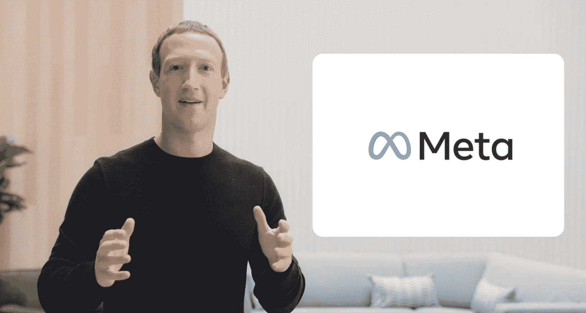

# Meta 和元宇宙:最好不是移动互联网 2.0

> 原文：<https://thenewstack.io/meta-metaverse-developers/>

这是 web 开发社区中出现新流行语的一年。“网络 3”和“元宇宙”是最受关注的两个，并且一直在推动社交媒体的讨论。在这两种情况下，不清楚这些术语在技术意义上是什么意思——但这在牛市中似乎无关紧要。我已经[研究了 Web3 的宣传](https://thenewstack.io/its-a-web3-world-now-how-the-hype-compares-to-web-2-0/)，所以现在我将注意力转向元宇宙的意义——特别是，开发者应该如何为此做准备。

早在 8 月份，我就问过:在元宇宙的做[开发商意味着什么？在我写那篇专栏文章的时候，脸书正开始更多地谈论它的元宇宙计划。但是我们谁也不知道脸书会很快将整个公司变成元宇宙，甚至将](https://thenewstack.io/metaverse-developers/)[更名为 Meta](https://tech.fb.com/connect-2021-our-vision-for-the-metaverse/) 。

## Meta 目前在做什么？

 [理查德·麦克马努斯

Richard 是 New Stack 的高级编辑，每周撰写一篇关于 web 和应用程序开发趋势的专栏文章。此前，他在 2003 年创立了读写网，并将其打造为全球最具影响力的科技新闻和分析网站之一。在 Twitter @ricmac 上关注他。](https://twitter.com/ricmac) 

那么 Meta 将如何建造元宇宙呢？虽然在这一点上很难确定技术细节，但我们可以通过查看 Oculus Quest 虚拟现实耳机(即将更名为 Meta Quest)的最新发布来获得一些想法。

最有趣的是，混合现实已经被[添加到 Oculus Quest 2 软件中](https://www.oculus.com/blog/mixed-reality-made-easy-messenger-calling-cloud-backup-and-more-in-the-newest-oculus-software-update/)——尽管它只对某些 iPhone 用户可用(稍后会有更多介绍)。此外，Meta 还在 Horizon Workrooms(其 VR 工作场所)中添加了 Facebook Messenger calling in VR、云备份和“定制你的周围环境”。所有这些特征都可以被视为迈向“元宇宙”的一小步

从技术角度来看，打造 Meta 的元宇宙的责任落在了 Andrew(“Boz”)Bosworth 身上，他将是 Meta 未来的首席技术官。在此之前，他领导了脸书的现实实验室，这是 Oculus 隶属的公司的一个部门。现在 Meta 正在全力以赴实现其元宇宙愿景，Bosworth 成为该公司的关键人物(可以说仅次于扎克伯格本人)。他的新[关于第](https://about.facebook.com/media-gallery/executives/andrew-boz-bosworth/)页说，他将领导“Meta 在 AR、VR、AI 和消费者硬件方面的努力，包括 Quest、Portal、Ray-Ban Stories 等。”

博斯沃思现在领导的事情清单表明，Meta 的元宇宙目前由一堆分散的、不完全连贯的产品和技术组成。毫无疑问，随着时间的推移，这些都会走到一起，但目前还是一团糟。例如，Oculus Quest VR 耳机与主要为视频通话设计的一种家用平板电脑 [Portal](https://portal.facebook.com/) 几乎没有共同点。然而，据推测，它们都将是元宇宙的关键产品，因为博斯沃思负责它们。

在[Meta 更名后不久接受《The Verge》采访时，博斯沃思被问及脸书新闻供稿(他共同发明的)将如何适应元宇宙。“在我想出如何为你排列内容之前，我需要为你准备内容，”他回答道。所以目前，Meta 甚至不知道元宇宙的*内容*会是什么样子。我们知道它不仅仅是 VR，还将包括 AR 和“混合现实”。但这是我们目前掌握的全部细节。](https://www.theverge.com/22752986/meta-facebook-andrew-bosworth-interview-metaverse-vr-ar)

## 移动互联网 2.0

从开发者的角度来看，马克·扎克伯格在 10 月底宣布的一个方面让我有理由担心 Meta 对元宇宙的概念。在宣布转向时，扎克伯格将元宇宙定位为“移动互联网的继承者”几乎与此同时，他谈到了互操作性将如何成为元宇宙的关键部分。这意味着用户将能够使用相同的技术(虚拟现实耳机、增强现实标准等)轻松地从一个元宇宙平台转移到另一个平台。

马克·扎克伯格宣布从脸书更名为梅塔。

问题是，移动互联网传统上一直受到互操作性差的困扰。就在今年，我写了一篇关于 iPhone 用户如何在 PWAs (渐进式网络应用)中受到功能限制的文章，因为苹果禁止 iOS 的外部浏览器引擎。对于 Android 用户来说，有时他们甚至无法获得最时尚应用的原生应用——在 Android 版本发布之前，Instagram [只在 iOS 上使用了 18 个月。Android 用户还需要等待一年多才能加入 Clubhouse，这是一款社交音频应用，今年早些时候曾风靡一时。](https://thenewstack.io/instagram-lite-is-no-longer-a-progressive-web-app-now-a-native-app-built-with-bloks/)

的确，正如我上面提到的，Oculus Quest 耳机的 Android 用户是当前移动互联网的受害者之一。Oculus Quest 软件的最新版本 v35 需要 iPhone XS 或更高版本才能使用混合现实功能。

关键是，移动互联网从来都不是完全互通的。除了技术差异，两大智能手机平台(iOS 和 Android)在某种程度上由两家相互激烈竞争的大公司(苹果和谷歌)控制。

在他的年度[创始人信](https://about.fb.com/news/2021/10/founders-letter/)中，扎克伯格写道，元宇宙“不会由一家公司创造”，而是“可互操作的，释放出一个比受当今平台及其政策约束的经济大得多的创意经济。”

这些都是安慰的话，但是考虑到互联网技术的历史，元宇宙很有可能要么是垄断，要么(像移动互联网一样)是寡头垄断。

## 开发者应该关注什么？

所以回到开发者和他们如何接近元宇宙。现实是，现在它完全是蓝天——所以唯一可行的方法是购买 Oculus Quest(或另一个非 Meta 的 VR 耳机或 AR 工具),并尝试为它创建一种“体验”或游戏。也可以在其他平台上进行实验——Niantic、Roblox、[、Nvidia](https://thenewstack.io/omniverse-kit-nvidia-metaverse-sdk/) 以及其他一些平台。事实上，其中许多替代品远比 Meta 目前的 VR/AR 产品和软件更成熟。

今天的元宇宙感觉就像 1992 年的万维网，当时蒂姆·伯纳斯·李和一小群学者试图找出它如何融入更广泛的文化。你不可能在 1992 年预测到像脸书和 Twitter 这样的公司，同样，你也不可能预测什么类型的元宇宙应用程序会在 10 年或 15 年后成为文化的一部分。正如博斯沃思指出的，“我们在网络上不得不开拓的许多想法不会被翻译，你必须彻底重新思考它们。”

我们只能希望元宇宙不要像移动互联网，而更像网络:开放、分散、不归任何人所有。但鉴于 Meta 的市场力量，未来很大程度上掌握在马克·扎克伯格和安德鲁·博斯沃思手中。

<svg xmlns:xlink="http://www.w3.org/1999/xlink" viewBox="0 0 68 31" version="1.1"><title>Group</title> <desc>Created with Sketch.</desc></svg>