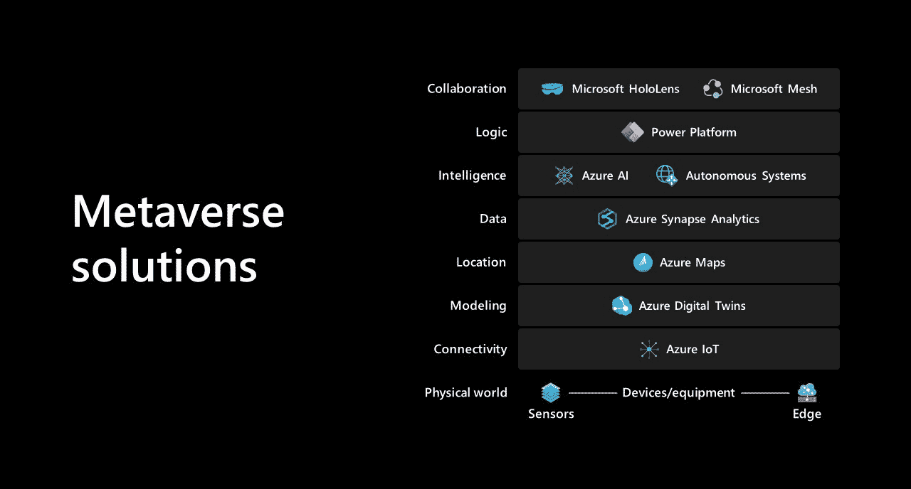
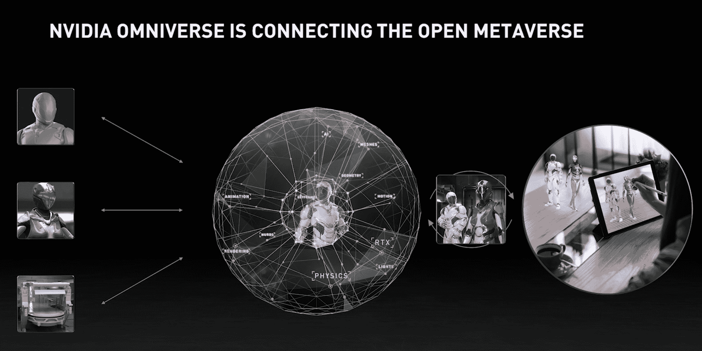

# 元宇宙对开发者意味着什么

> 原文：<https://thenewstack.io/metaverse-developers/>

上个月，脸书首席执行官马克·扎克伯格在接受《The Verge》采访时概述了他对 3D 版网络元宇宙的愿景。今年，我们已经收到了来自其他科技公司的一系列元宇宙新闻——从微软的“[企业元宇宙](https://www.linkedin.com/pulse/expanding-partner-opportunity-microsoft-cloud-satya-nadella/)，到英伟达的“[工程师元宇宙](https://venturebeat.com/2021/08/10/nvidia-opens-its-metaverse-for-engineers-by-adding-millions-of-blender-users-to-omniverse/)”因此，元宇宙是科技行业的最新流行语。但是在元宇宙做一名开发者意味着什么呢？它会是一个像网络一样的开放平台吗？还是会像手机 app 生态系统一样，被一两家公司控制？

 [理查德·麦克马努斯

Richard 是 New Stack 的高级编辑，每周撰写一篇关于 web 和应用程序开发趋势的专栏文章。此前，他在 2003 年创立了读写网，并将其打造为全球最具影响力的科技新闻和分析网站之一。](https://twitter.com/ricmac) 

实际上，在今天的环境下开发一个元宇宙应用程序意味着为许多不同的平台开发一个游戏或“体验”——从 Oculus Quest 和 HTC Vive 这样的 VR 系统，到 Roblox 和堡垒之夜这样的新兴虚拟世界，到 Playstation 和 Xbox 这样的游戏机，到移动应用程序，甚至是网络本身。还有同样多的[开发者](https://www.perforce.com/blog/vcs/virtual-reality-software-development)工具可供选择，比如 Epic 的[虚幻引擎](https://www.unrealengine.com/en-US/)、 [Unity](https://unity.com/) 、[亚马逊苏美尔](https://aws.amazon.com/sumerian/)、Autodesk 的 [Maya](https://www.autodesk.com/products/maya/overview) 以及开源的 [Blender](https://www.blender.org/) 。

因此，对于元宇宙的发展来说，这确实是一片绿地。与移动应用生态系统不同，现在还没有一两个主导平台。毫无疑问，脸书最终会成为那些占主导地位的元宇宙平台之一，尽管扎克伯格声称“我们将努力建立一个更加开放和可互操作的”系统。

在我们等待元宇宙平台生态系统在未来几年出现的时候，我想我应该看看当前三个贴上“元宇宙”标签的计划:微软的“元宇宙堆栈”(在今年的构建大会上宣布的)、英伟达的 Omniverse，以及在扎克伯格采访后几天由脸书副总裁兼 ar 副总裁安德鲁·博斯沃思宣布的“元宇宙产品组”。

特别是，我将关注开发人员如何参与这些平台，并潜在地帮助定义 3D 应用程序的未来。

## 微软的元宇宙堆栈

在 6 月份的 Build 大会上，微软首席执行官塞特亚·纳德拉在 T4 发表主题演讲时，他谈到了“随着数字世界和物理世界的融合，基础设施栈的新一层正在被创造出来:企业元宇宙”他引用了“元宇宙堆栈”，使开发人员能够“构建任何物理或逻辑的丰富数字模型”

来源:微软

有趣的是，微软的元宇宙概念在很大程度上是以现实世界为模型的。微软的《元宇宙》中没有虚拟人物——把这些留给 Roblox 或堡垒之夜(或《第二人生》)吧！).微软宇宙中所谓的“元宇宙应用”将由“数字双胞胎”支撑，在 Azure 博客上的另一篇文章中，数字双胞胎被定义为“任何物理或逻辑的丰富数字模型，从简单的资产或产品到复杂的环境。”

“数字双胞胎”的概念来自物联网(IoT)世界，这为微软的意图提供了广泛的线索。它希望提供一个平台，以数字方式绘制和监控现实商业环境中的一切——仓库、工厂、零售店等。这就像 3D 版的微软办公软件。

从开发人员的角度来看，像往常一样，微软几乎涵盖了一切——你可以将复杂的机器学习技术应用于数字双胞胎，或者使用微软的 Power 平台(其低代码工具集)在数字双胞胎数据的基础上构建一个简单的应用程序。

## 英伟达和 3D 的 HTML

在本周的在线 Siggraph 活动上，一个关于计算机图形的年度会议，Nvidia 宣布扩展其 Omniverse 平台。Omniverse 于 2019 年 3 月[推出，作为“一个开放的合作平台，简化实时图形的工作室工作流程。”从根本上说，它允许工程师们在构建一个物理产品上进行合作，通过一起工作来构建该产品的数字表示。所以它和微软有着相同的“数字孪生”哲学。](https://blogs.nvidia.com/blog/2019/03/18/omniverse-collaboration-platform/)

Omniverse 基于皮克斯开发的开源技术，名为[通用场景描述](https://graphics.pixar.com/usd/docs/index.html) (USD)。在 Siggraph 的演示中，Nvidia 公司 Omniverse 副总裁理查德·蔡秋凤将美元描述为“3D 的 HTML”他补充说，包括苹果在内的许多其他公司都支持美元。“就像从 HTML 1.0 到 HTML 5 的旅程一样，”他继续说道，“USD 将继续从今天的萌芽状态发展到虚拟世界的更完整的定义。”

在演示期间，蔡秋凤将 Omniverse 定位为“连接开放的元宇宙”——这表明 Nvidia 将 Omniverse 视为网络浏览器的 3D 等价物。

来源:英伟达

“用户可以通过工作站或笔记本电脑进出 Omniverse，”他继续说道，“允许他们传送到虚拟现实环境中。或者他们可以与 AR 结合，任何人都可以通过将 RTX 流式传输到他们的设备上来查看 Omniverse 上的场景。”( [RTX](https://en.wikipedia.org/wiki/Nvidia_RTX) 是 Nvidia 推出的高端专业视觉计算平台。)

开发者可以在 [Omniverse 开发者资源中心](https://developer.nvidia.com/nvidia-omniverse-learn-getstarted)了解如何构建“Omniverse 扩展和微服务”。有一个开发工具包，以及开始使用 USD 构建 3D 场景的提示。

## 脸书的出现

与微软和英伟达不同，脸书的元宇宙目前是 vaporware。公平地说，这是因为脸书刚刚宣布其元宇宙产品组。

安德鲁·博斯沃思在他的《脸书邮报》上宣布了这个团队，他指出，脸书目前的两个产品——[门户网站](https://portal.facebook.com/)(一种视频通话设备)和 Oculus 可以“将你传送到一个与另一个人在一起的房间，不管物理距离有多远，或者传送到新的虚拟世界和体验。”他将这描述为 metaverses 需要的“存在”类型，但补充说，脸书仍然需要建立“这些空间之间的结缔组织”

现在说脸书是否能够提供这种“结缔组织”(类似于脸书从 2007 年开始推广的术语“社交图”)还为时过早。但是，由于我们今天有这么多人使用脸书作为我们的主要社交网络——至少对于现实世界的家人和朋友关系来说是这样——脸书想要将社交网络扩展到虚拟世界是有道理的。

## 不要忘记开放的元诗句

开发人员今天可以测试微软和英伟达的元宇宙堆栈，或者跳入更有趣的元宇宙愿景，如 Roblox(它有一个活跃的[开发中心](https://developer.roblox.com/en-us/))。如果你希望你的元宇宙是非商业性的，也有开源平台。Mozilla Hubs 是基于浏览器的，所以你会使用像 Three.js 和 WASM 这样的网络技术。[开放的元宇宙操作系统](https://outlierventures.io/research/closer-look-at-the-open-metaverse-os/)是另一个开放平台，这一次利用了加密趋势(它使用 NFTs、分散治理等)。

不管你对元宇宙的哪一个版本感兴趣，我确信在未来的几年里，我们将走向网络的 3D 版本。随着 2D 网络在 20 世纪 90 年代和 21 世纪初的崛起，这将为开发者带来许多机会。因此，是时候进入并亲自体验这些新兴平台了。

<svg xmlns:xlink="http://www.w3.org/1999/xlink" viewBox="0 0 68 31" version="1.1"><title>Group</title> <desc>Created with Sketch.</desc></svg>