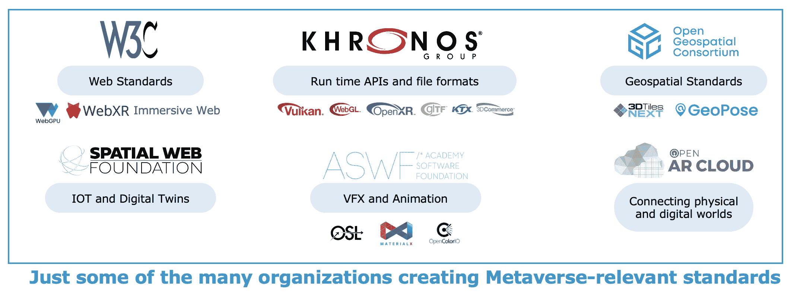
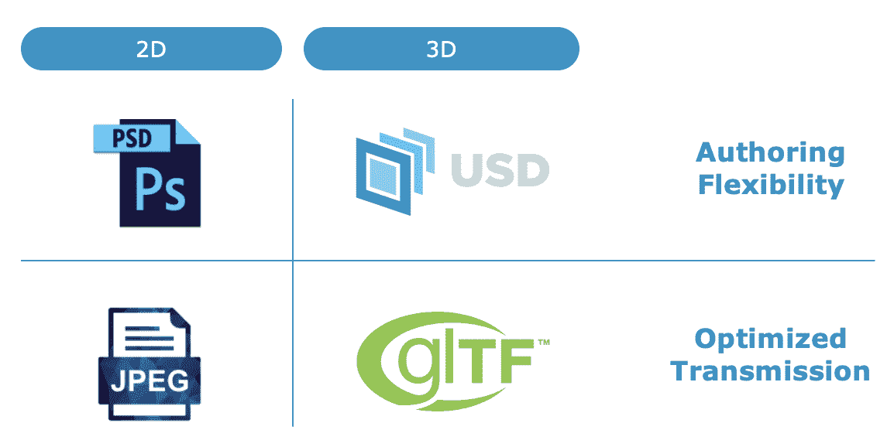
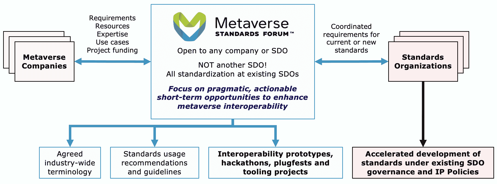

# 元宇宙标准论坛启动以解决互操作性问题

> 原文：<https://thenewstack.io/metaverse-standards-forum/>

互操作性——或缺乏互操作性——是新生的元宇宙产业中的一个关键问题。Khronos 集团旨在通过一个名为[元宇宙标准论坛](https://metaverse-standards.org/)的新开放标准讨论论坛来解决这个问题，该论坛于今天启动。该组织包括 3D 互联网领域大多数大公司的代表，包括 Nvidia、Meta、Epic Games、Unity、微软和万维网联盟(W3C)。

在今天发布之前，我采访了 Khronos 总裁兼 Nvidia 开发者生态系统副总裁 [Neil Trevett](https://www.linkedin.com/in/neil-trevett-748791/) 。Trevett 自 2001 年以来一直是 Khronos 的主席，并在 1997 年至 2005 年期间领导了 [Web3D 联盟](https://www.web3d.org/)。

在我开始与 Trevett 讨论之前，先快速了解一下 Khronos 的背景。这是一个自 2000 年以来就存在的行业联盟，为“3D 图形、增强和虚拟现实、并行编程、视觉加速和机器学习”开发低级 API。Khronos 已经通过创建和维护 glTF(一种 3D 图形文件格式，该组织称之为“3D 的 JPEG”)宣称要开放元宇宙技术 Khronos 还负责 WebGL (Web Graphics Library)，这是一个在浏览器中渲染 2D 和 3D 对象的 JavaScript API。

## 解决短期互操作性问题

Trevett 告诉我，Khronos 开始对元宇宙感兴趣，因为“在‘元宇宙’成为热门术语之前，我们所做的许多标准——在许多情况下，我们已经开发了许多年——都与元宇宙直接相关。面向原生应用和网络的 3D APIs、[面向 AR 和 VR 的 OpenXR](https://www.khronos.org/openxr/) 以及我们所做的文件格式都被元宇宙社区直接使用。”

> 元宇宙“将是网络连接的混合体，是网络的某种进化，混合了空间计算。”

Khronos 总裁 Neil Trevett

根据 Trevett 的说法，新的论坛将不会关注关于元宇宙在 10-20 年后会是什么样子的哲学辩论。然而，他认为元宇宙“将是网络连接的混合体，是网络的某种进化，混合了空间计算。”他补充说，空间计算是一个宽泛的术语，但这里指的是“真实世界的 3D 建模，特别是在通过增强和虚拟现实进行的交互中。”

“没有人真正知道这一切将如何走到一起，”特雷维特说。“不过没关系。就论坛的目的而言，我们其实不需要知道。我们关心的是有明确的、短期的互操作性问题需要解决。”

Trevett 指出，已经有多个互联网标准组织，当然包括万维网标准 W3C。当谈到发展中的元宇宙时，无国界医生组织试图做的是帮助协调他们。他说:“我们正在把标准组织聚集在一个地方，在那里我们可以相互协调，但也可以与试图使用我们标准的行业保持良好的密切关系。”

资料来源:Khronos 集团

## 作为网络进化的元宇宙

当我[探索](https://thenewstack.io/croquet-woos-javascript-devs-with-a-web-based-metaverse/)和[报道](https://thenewstack.io/babylon-js-hints-that-microsoft-metaverse-will-be-web-based/)2022 年的元宇宙技术栈时，这给我们带来了一个我一直以来最先想到的问题:在实现如此多的论坛成员公司声称他们想要的“互操作性”方面，网络将发挥什么作用？像 Meta 和微软这样的公司因为网络而成为成功的平台，然而 Epic Games 和 Unity 这样的公司在很大程度上把他们的业务建立在非网络技术上。那么，无国界医生组织是否将网络视为元宇宙的基础平台？

“重新发明一个与网络完全脱节的东西对我来说毫无意义，”特雷维特回答道。“网络已经如此普及，功能如此丰富。我并不负责(网络)，但你要发展我们已经拥有的东西，而不是试图创造全新的东西，这似乎是合理的。”

因此，无国界医生组织将把元宇宙视为网络的进化。尽管如此，特雷维特指出，“空间网络”将需要“新的协议和新的资产格式。”就像我们有 HTML 来描述 2D 的网页一样，他继续说道，“我们将需要 3D 图形的等价物，以及你可以在一种连接的意义上与 3D 图形交互的所有方式。”

Khronos 认为元宇宙标准论坛是“USD 和 glTF 之间有意义的行业标准合作的一个可能的滩头阵地机会”，这两个标准目前是两个独立的开放标准。

然后我提出了 3D 资产的互操作性，特别是虚拟角色。在最近的专栏中，我写了一组独立开发者和初创公司如何使用 glTF 和 VRM(基于 glTF 的 3D 化身标准)等技术构建他们自己版本的开放元宇宙，以实现互操作性。希望有一天，你能够使用某种链接机制——或“门户”——轻松地从一个虚拟世界跳到另一个虚拟世界。比如从 [Meta 的未来平台](https://thenewstack.io/meta-metaverse-developers/)变成 [Nvidia 的 Omniverse](https://thenewstack.io/nvidia-announces-expansion-of-omniverse-to-consumer-internet/) 。我问特里维特，他是否认为这是元宇宙的现实愿景？

“我认为这是一个值得努力的目标，”他回答道。“每个人都意识到这不是一个需要解决的小问题。但是如果我们不开始，我们永远也到不了那里。”

Trevett 认为一致性和持久性是创建头像标准的两个关键概念。

“元宇宙的大部分观念是[……]这一概念，即虽然你的个人身份——从隐私和数据的角度来看，但也可能从形象和外观的角度来看——你可以选择在元宇宙的各个空间中扮演一致的角色。这是你经常听到的目标。我认为你听到的元宇宙的关键词之一是坚持。你把某样东西放在虚拟世界里，两周后你回来时，它还在那里。”

然而，特莱维特再次警告说，这将需要“达尔文式的步骤才能实现。”在元宇宙标准论坛的指导下，元宇宙互操作性将随着时间的推移而发展。

## 不仅仅是另一个标准组织

Trevett 将新组织描述为“一个讨论论坛”，它“位于标准组织之上”。实际的标准工作将继续由现有的团体(如 Khronos)来完成。他说，新论坛“对所有人开放——欢迎任何组织加入——没有参与费，没有 NDA，也没有知识产权框架。”

资料来源:Khronos 集团

尽管不是一个标准团体，MSF 确实想帮助解决元宇宙工业的互操作性难题。为了解释这一点，Trevett 提供了一个所有开发人员都熟悉的比喻:砖块。

“我喜欢说我们正在烘烤互操作性的砖块，”他说。“我们还没有试图正确地设计或建造大教堂。我们不知道大教堂会是什么样子，但我们知道我们需要一些砖块。因此，我们可以在短期内做到这一点，并通过黑客马拉松和互操作性项目等方式加快这一进程。”

<svg xmlns:xlink="http://www.w3.org/1999/xlink" viewBox="0 0 68 31" version="1.1"><title>Group</title> <desc>Created with Sketch.</desc></svg>