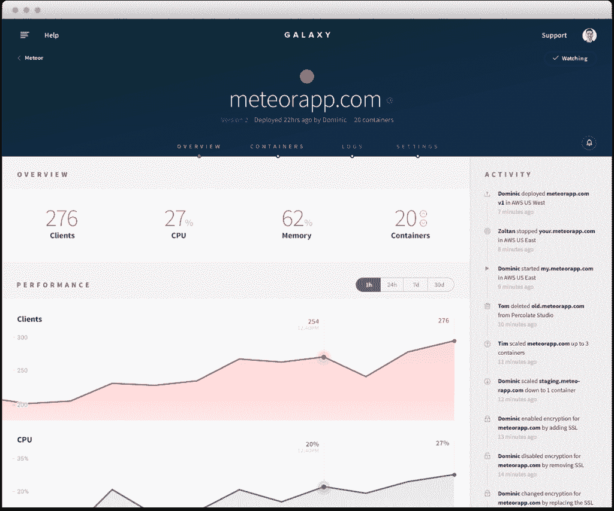

# Meteor Galaxy 将 JavaScript 应用程序容器化，用于全栈管理

> 原文：<https://thenewstack.io/meteor-galaxy-containerizes-javascript-apps-full-stack-management/>

在评估了包括 Kubernetes、Mesos 和 Docker Swarm 在内的编排技术后，Meteor 开发小组决定[与亚马逊](http://aws.amazon.com/solutions/case-studies/meteor-development-group/)合作，构建 [Meteor Galaxy](http://info.meteor.com/blog/announcing-meteor-galaxy) ，这是一个用于操作和管理 JavaScript 应用程序的云平台。

使用基于容器的架构，Galaxy 建立在亚马逊弹性计算云([亚马逊 EC2](https://aws.amazon.com/ec2) )和亚马逊 EC2 容器服务([亚马逊 ECS](https://aws.amazon.com/ecs/) )之上。

“如果你的目标是尽可能简单地构建应用程序，那么当你编写应用程序时，努力不能停留在水边，它必须包括在现代云环境中运行应用程序的挑战。这对现代开发团队来说相当困难，”Meteor 开发集团联合创始人 Matt DeBergalis 说。

在构建 Galaxy 的过程中，该公司处理了一系列问题，包括管理大量的容器、为客户提供高可用性、扩展以及为开发团队提供响应能力。

它需要云中的运行时来管理连接的客户端。

“我们对运行时调度有非常具体的定制需求，”DeBergalis 解释道。“我们使用 ECS 调度程序 API 来构建智能应用程序容器实例调度程序，并将默认 ECS 调度程序替换为我们的自定义调度程序。我们还优化了 Galaxy，以解决多租户平台的“噪音邻居”问题，在这种情况下，某些应用程序与同类应用程序相比消耗了过多的计算资源。这需要监控应用程序资源利用率，分析趋势，然后定义满足我们所有客户需求的容器配置。”

他说，容器的挑战不仅仅是在一个容器内运行一个单一的进程。

“真正有趣的是，当您想要在生产环境中管理大量的应用程序时。集装箱化的肮脏秘密是，对于大规模的生产使用来说，它仍然是非常非常早的。当你真正了解在云基础设施上的可靠设置中运行数千个容器需要什么时，你会遇到围绕容器本身的所有这些挑战。面对系统故障，您如何可靠地重启它们？如何以自动化的方式同时监控这么大的数量？如何收集容器的性能指标和日志信息？这是我们自己的开发商的一大绊脚石，”他说。

“在大规模生产中运行一个容器——这是一个很大的要求，”德贝加利斯说。

开发人员希望构建软件；他们不想为运行该软件而构建开发操作系统。“我们发现容器编排即服务的优势在于，它是解决您遇到的许多挑战的更简单、更快速的方法。有些简直让人抓狂，”德伯加利斯说。

他说，ECS 的集成点帮助公司更快地将 Galaxy 推向市场。

将自己标榜为使用 JavaScript 的全栈解决方案的 Meteor，旨在促进部分在移动设备或浏览器上运行，部分在云中作为一组 Node.js 进程运行的应用程序。这些部分通过网络套接字相互通信。当人们使用该应用程序时，数据从服务器推送到设备以更新屏幕。

Galaxy 专注于在云中大规模运行 Meteor 应用。

“这有几个部分，但最大的部分是你想安全地在单个容器内运行尽可能多的副本，并给人们一个简单的方法来扩大或缩小这个数字，然后你想能够管理每个活跃用户的网络连接-每个打开的浏览器标签或使用该应用程序的移动设备-直到一个特定的容器，”德贝加利斯说。

“因此，Galaxy 中的许多技术都是关于我们如何为每个传入用户选择最佳后端容器，当您拥有代表用户会话(可能是一小时甚至一天)的 web 套接字时，什么是正确的负载平衡——这与传统的 HTTP 应用程序非常不同。我们如何跟踪所有这些客户？”

他说，Meteor 允许你将更新的代码推送到用户的设备中，这需要服务器和客户端之间的仔细协调，而 Galaxy 允许这种情况发生，这样用户就不会注意到中断。

【T2

宜家是该框架的早期用户之一。

“当他们与合作伙伴坐下来开发应用程序时，他们不想为每个问题找出他们应该使用哪种技术。DeBergalis 说:“如今 JavaScript 发展如此之快，它如此分散，承担起决定一个堆栈的负担，组装一堆组件来完成所有这些事情最终比编写软件还要费力。”

“它不同于 Java 生态系统或。NET 生态系统中，你有那些约定，一个标准的做事方式。因此，使用 Meteor，当您在第一天坐下来编写应用程序时，您实际上是在编写代码，而不是决定您应该将哪个视图层的哪个版本附加到哪个 web socket 库的哪个版本等等。这就是我们所说的‘全栈’的含义:它解决了应用程序的所有部分，”DeBergalis 说。

## **改变航向**

Meteor 于 2012 年推出，已经从包括 Andreessen Horowitz 和 Matrix Partners 在内的投资者那里筹集了三轮3120 万美元。

创始人马特·德贝加利斯、杰夫·施密特和尼克·马丁最初打算创建一个旅游推荐网站。作为创业孵化器 Y Combinator 的一部分，他们构建了 Meteor 的原始版本作为其基础，并发现其他团队也在努力为他们的应用程序构建基础。然后他们意识到他们的框架比旅游应用更有价值。

Meteor 不需要开发者了解 Ruby 或 Python 等无数语言，只需要普通的 JavaScript。

该公司在 2014 年底发布了同名平台的 1.0 版本，并在 1.1 版本中增加了对 Windows 和 MongoDB 3.0 的支持。Meteor 支持 OS X、Windows 和 Linux。1.2 版本将 [ECMAScript 2015](http://www.ecma-international.org/ecma-262/6.0/index.html) 作为其官方语言，并在传统 Blaze 模板的基础上增加了对 Angular 和 React 视图引擎的支持，以及对移动应用开发的额外支持。12 月，它宣布了 Angular package 的 [1.3 版本。](http://info.meteor.com/blog/angular-meteor-1.3)

独立 [JavaScript 开发者 Ryan Burgett 在一篇博客文章中写道](http://blog.burgettweb.net/2016/02/25/a-breath-of-fresh-meteor/)Meteor 已经解决了开发者每天都要重新解决的问题。

“Meteor 有它的问题，但对于许多应用程序来说——即使在 Meteor 的当前状态下——也没有什么可以与之相比。您不需要担心 HTTP 调用、网络或 CRUD 抽象，也不需要担心缓存数据或手动设置间隔。那些都是给我照顾的！”他写道。

《发现流星》(Discover Meteor)的合著者、参与过其他 Meteor 项目的 Sacha Grief 阐述了他对 Meteor 问题的看法，包括尽管它使入门变得容易，但开发人员很快就遇到了复杂性的障碍。他认为该公司的一体化方法是一种负担。

“最近的 Blaze/React 辩论清楚地表明了这种差距:随着社区的一部分人将 Meteor 推向 React、Webpack 和 JavaScript 生态系统的其余部分，另一部分人正在绝望地失去最初使 Meteor 值得使用的东西，”他写道。

他力劝 Meteor 采用 React，引用 Meteor 作为服务器和客户端框架的优势。

当被问及 Grief 的基本原理时，DeBergalis 说:“在其最早的版本中，Meteor 框架是一个全有或全无的堆栈。与此同时，JavaScript 生态系统在过去 18 个月里发生了变化。”

“为了保持相关的 JavaScript 应用平台，Meteor 已经发展到支持其他流行的框架和工具(例如 Angular、React、npm)。与此同时，Meteor 将继续提供如何构建应用程序的官方指导，例如 Meteor Guide ，支持早期的技术，如 Blaze view layer，并让社区参与进来，”DeBergalis 说。

专题图片:[渡鸦瓦斯奎兹](https://www.flickr.com/photos/44206105@N06/)的[银河 NGC 60](https://www.flickr.com/photos/44206105@N06/5171449480/in/photolist-8SZ2L5-dqALdm-geAmoq-gzYp8-8Ksagq-6vMhnK-5YWbxe-aXXmWp-6e4Sqg-59CRVG-8bFccS-4JcJ4G-aXXmTB-rExVPP-nVTnGt-bHsJWB-kEPPt-bNsNxD-8XUKkT-4DYaFM-qJsF3e-dfRTuv-o7FJ8R-nugB4F-dcLtkC-eDRVZk-94Uchm-pFtA3D-8bBTYZ-6vMhiV-7ZU6pq-6vMhm6-vmupW-u2zwt-6M1mKd-nLZ2HS-96bQTK-8SyYpK-pN7nmE-hYjZ1X-btmb3h-qHLuKT-dWGZjJ-cT1z6d-buxVMY-dVDUML-bqY2XL-dWBmtK-buxWHE-dWGZ6U) ，授权**CC BY-SA 2.0T9。**

<svg xmlns:xlink="http://www.w3.org/1999/xlink" viewBox="0 0 68 31" version="1.1"><title>Group</title> <desc>Created with Sketch.</desc></svg>