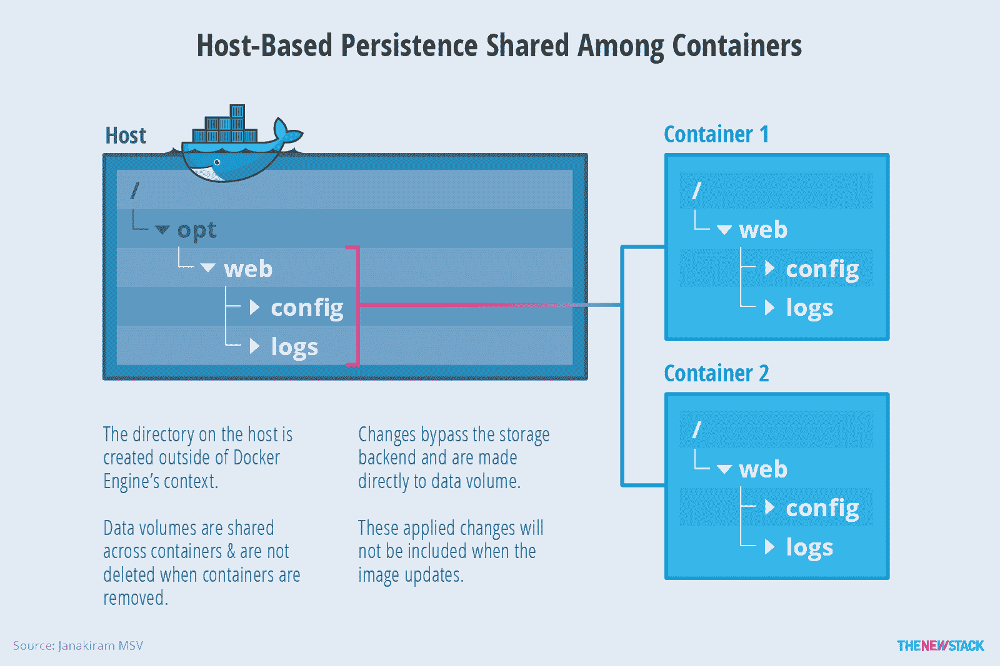
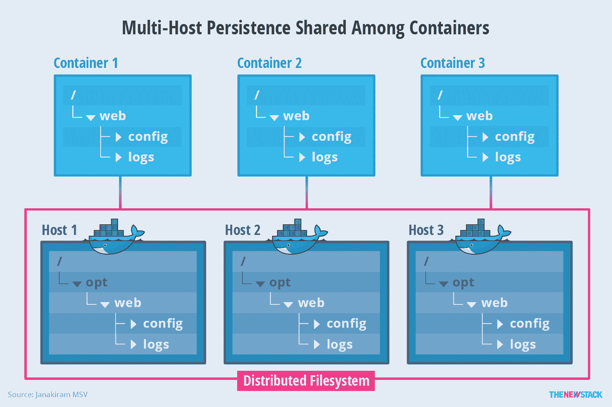

# 管理 Docker 容器的持久性

> 原文：<https://thenewstack.io/methods-dealing-container-storage/>

 [贾纳奇拉姆·MSV

贾纳奇拉姆·MSV 是贾纳奇拉姆&联合公司的首席分析师，也是国际信息技术研究所的兼职教员。他还是 Google 认证的云开发人员、Amazon 认证的解决方案架构师、Amazon 认证的开发人员、Amazon 认证的 SysOps 管理员和 Microsoft 认证的 Azure Professional。他之前的工作经历包括微软、AWS、Gigaom Research 和阿尔卡特朗讯。](http://www.janakiram.com/) 

几年前，当虚拟化引入 IT 管理员时，曾尝试将虚拟机(VM)作为部署单元进行标准化。每个新的构建和版本都会产生一个新的 VM 模板。最终，开发人员和管理员开始创建新的映像并调配虚拟机，这导致了一种称为“虚拟机蔓延”的现象每个模板和调配的虚拟机占用几千兆字节的存储，这导致存储管理效率低下。鉴于虚拟机映像的庞大规模，组织意识到为每个版本创建一个新的虚拟机模板是不现实的。

Docker 的目标之一是避免“虚拟机蔓延”这一陷阱 Docker 避免碎片图像陷阱的唯一方法是为其图像和容器采用不同的存储机制。

Docker 的另一个关键目标是分离文件系统，以在主机系统和容器之间建立隔离。这种隔离是容器化应用程序安全性的核心。为了满足这些需求，Docker 为图像和容器采用了一个[联合文件系统架构](https://en.wikipedia.org/wiki/Union_mount)。

联合文件系统通过将不同的目录和文件系统组合在一起来表示一个逻辑文件系统。每个文件系统都作为一个分支，成为一个单独的层。Docker 映像基于一个联合文件系统，其中每个分支代表一个新层。它允许根据需要构建和解构图像，而不是创建一个庞大的整体图像。

[cyclone slider id = " ebook-4-赞助商"]

Docker 使用现有的 Linux union 文件系统非常适合运行可以快速伸缩的应用程序。由于 Docker 容器是自包含的，因此可以在任何主机上启动，而不依赖于特定的主机。虽然这对于 web 规模的工作负载来说无疑是一个优势，但运行处理持久数据的有状态应用程序却是一个挑战。关系数据库、NoSQL 数据库、内容管理系统和大数据堆栈等工作负载要求数据的持久性和持久性。一些工作负载，如内容管理系统，也需要跨多个应用程序实例共享数据访问。

从注册表中提取 Docker 映像时，引擎会将所有相关层下载到主机。当从包含许多层的下载映像启动容器时，Docker 使用可用的 union 文件系统的[写时复制](https://en.wikipedia.org/wiki/Copy-on-write)功能，在现有的只读层上添加可写的“工作目录”——或临时文件系统。当 Docker 第一次启动容器时，这个初始读写层是空的，直到正在运行的容器进程对文件系统进行了更改。当从现有容器创建 Docker 映像时，只有所做的更改(已经全部“复制”到这个可写工作目录中)会添加到新层中。这种方法可以在没有重复或碎片的情况下重用图像。

当一个进程试图写入一个现有文件时，实现写时复制特性的文件系统在最顶层的工作层创建该文件的一个副本。使用原始图像图层的所有其他进程将继续访问该图层的只读原始版本。这项技术优化了映像磁盘空间的使用和容器启动时间的性能。

## 管理持久数据的策略

Docker 的分层存储实现旨在提高便携性、效率和性能。它针对跨不同环境存储、检索和传输图像进行了优化。删除容器时，写入容器的所有数据也会随之删除。

作为最佳实践，建议将数据从容器中分离出来，以保留采用容器化的好处。数据管理应该与容器生命周期截然分开。有多种策略可以为容器添加持久性。我们将评估 Docker 提供的现成选项，然后评估生态系统支持的场景。

### 基于主机的持久性

基于主机的持久性是容器中数据持久性的早期实现之一，它已经成熟到支持多种用例。在这种体系结构中，容器依赖底层主机来实现持久性和存储。该选项绕过特定的联合文件系统后端，以公开主机的本机文件系统。存储在目录中的数据在容器挂载名称空间中是可见的。数据在容器之外持久化，这意味着当容器被移除时它将是可用的。

在基于主机的持久性中，多个容器可以共享一个或多个卷。在多个容器写入单个共享卷的情况下，可能会导致数据损坏。开发人员需要确保应用程序被设计为写入共享数据存储。

数据卷可从 Docker 主机直接访问。这意味着您可以用普通的 Linux 工具读写它们。在大多数情况下，您不应该这样做，因为如果您的容器和应用程序不知道您的直接访问，这可能会导致数据损坏。

有三种使用基于主机的持久性的方法，它们的实现方式有细微的差别。

### 隐式每个容器存储

第一种机制将为请求基于主机的持久性的容器创建隐式存储沙箱。在创建容器的过程中，默认情况下会在主机上的 */var/lib/docker/volumes* 处创建目录。当正在运行的容器被删除时，Docker 引擎会自动删除主机上的目录。如果主机上的 Docker 引擎崩溃，该目录也可能变得不可用。要理解的关键是，存储在沙箱中的数据对其他容器不可用，除了请求它的容器。

图 1:使用容器主机的数据存储过于依赖稳定性，否则会妨碍容器的可移植性。

### 显式共享存储(数据卷)

如果需要跨运行在同一主机上的多个容器共享数据，我们可以选择第二种技术。在这种情况下，主机文件系统上的一个显式位置被公开为一个或多个容器中的一个挂载。当多个容器需要对同一个目录进行读写访问时，这变得特别有用。例如，运行 Apache web 服务器的容器可以将日志集中存储到同一个目录中，从而更容易处理日志。

图 2:即使容器被删除，共享主机持久性(称为数据卷)仍然可用。

因为主机上的目录是在 Docker 引擎的上下文之外创建的，所以即使在移除每个容器或者甚至停止 Docker 引擎之后，它也是可用的。由于这个共享挂载点完全不受 Docker 引擎的存储后端的控制，所以它不是分层的 union 文件系统方法的一部分。

这种技术是 DevOps 团队最常用的技术。在 Docker 中称为[数据量](https://docs.docker.com/engine/tutorials/dockervolumes/)，它具有以下优势:

*   数据卷可以跨多个容器共享和重用。
*   对数据卷的更改是直接进行的，绕过了引擎的存储后端映像层实施。
*   更新映像时，不会包括应用于数据卷的更改。
*   即使容器本身被删除，数据卷仍然可用。

### 共享多主机存储

虽然上面讨论的两种技术都提供了不同级别的持久性和持久性，但是它们都有一个主要缺点——它们使得容器不可移植。驻留在主机上的数据不会随容器一起移动，这在主机和容器之间建立了紧密的联系。

在生产环境中部署容器化工作负载的客户通常在集群环境中运行它们，其中多个主机参与提供所需的计算、网络和存储功能。这种情况要求分布式存储对所有主机可用，然后通过一致的名称空间向容器公开。

图 3:多主机持久性允许利用容器的可移植性进行数据存储。

共享文件系统，比如 Ceph、 [GlusterFS](https://www.gluster.org/) 、[网络文件系统(NFS)](https://en.wikipedia.org/wiki/Network_File_System) 等等，可以用来在每台运行 Docker 容器的主机上配置分布式文件系统。通过创建一致的命名约定和统一的名称空间，所有正在运行的容器都可以访问底层的持久存储后端，而不管它们是从哪个主机部署的。

共享多主机存储利用了分布式文件系统与显式存储技术的结合。因为挂载点在所有节点上都可用，所以可以利用它在容器之间创建一个共享的挂载点。

在生产环境中部署的编排引擎上运行的容器化工作负载可以在集群节点的子集上配置分布式文件系统。这些节点将被指定用于调度需要长期耐久性和持久性的容器。

编排引擎提供了一种在容器调度期间指定主机的机制。Docker Swarm 过滤器附带了[容器配置过滤器](https://docs.docker.com/swarm/scheduler/filter/)、[，它们](https://docs.docker.com/swarm/scheduler/filter/)定义了创建和运行容器时要使用的节点。在 Kubernetes 中，[标签](http://kubernetes.io/docs/user-guide/node-selection/)可用于在部署 pod 时定位一组节点。Kubernetes 还利用宠物集，这是一组对身份有更强要求的有状态 pod。

### 基于主机的持久性支持的典型操作

由于与核心容器引擎的紧密集成，基于主机的持久性是最容易配置的。开发或运营团队执行以下任务来启用基于主机的持久性—我们正在考虑此工作流的显式共享存储和共享多主机存储方案:

*   **创建卷:**这是在容器中启用持久性的第一步。它导致 Docker 引擎创建指向主机文件系统的指定卷。
*   **启动有状态容器:**在启动期间，持久卷与一个或多个容器相关联。
*   **备份数据:**存储在卷中的数据可以轻松备份到 tar 或 zip 文件中。参考 [Docker 文件](https://docs.docker.com/engine/tutorials/dockervolumes/#backup-restore-or-migrate-data-volumes)获取该过程的指导。
*   **迁移和恢复数据:**通过创建新的数据卷并解压缩文件，可以将备份的数据迁移或恢复到不同的主机上。
*   **删除卷:**删除关联容器后，数据卷不会自动删除；它们需要由运营团队手动删除。
*   **配置分布式文件系统(可选):**在多主机场景中，IT 可能需要配置一个共享文件系统，跨越多个物理或虚拟服务器。

### 使用基于主机的持久性的主要用例

对于以下情况，可以考虑基于主机的持久性:

*   **数据库:**写入卷比写入时复制层更快。这适用于运行关系数据库和 NoSQL 数据库。
*   **热挂载源代码:**在需要在主机和容器之间共享源代码的开发环境中，基于主机的持久性就派上了用场。因为容器访问的是与主机相同的版本，所以很容易在容器环境中进行调试和测试。开发人员在他们的普通 IDE 中工作，在他们的本地 Docker 主机上编辑文件，这些更改会立即反映在容器中。
*   **Master-Worker:** 在需要由充当主容器和工作容器的两个容器共享数据的场景中，应该使用基于主机的持久性。例如，由主容器聚合的数据由工作容器处理。

## 批量插件

尽管基于主机的持久性对于特定用例来说是 Docker 的一个有价值的补充，但是它有一个明显的缺点，就是限制了容器对特定主机的可移植性。它也没有利用针对数据密集型工作负载优化的专用存储后端。为了解决这些限制，Docker 中添加了卷插件，以将容器的功能扩展到各种存储后端，而无需强制更改应用程序设计或部署架构。

从 1.8 版本开始，Docker 引入了对第三方卷插件的支持。包括 Docker 命令行界面(CLI)、Compose 和 Swarm 在内的现有工具可以与插件无缝协作。开发者甚至可以根据 Docker 的[规范和指南](https://docs.docker.com/engine/extend/plugins_volume/)创建定制插件。

根据 Docker 的说法，卷插件使引擎部署能够与外部存储系统集成，并且数据卷能够在单个引擎主机的生命周期之外持续存在。客户可以从 Docker 附带的默认本地驱动程序开始，然后转向第三方插件，以满足特定的存储需求。卷插件还使容器化的应用程序能够与文件系统、对象存储、块存储和软件定义的存储接口。

截至 2016 年 6 月，Docker 支持十几个第三方卷插件，用于 [Azure 文件存储](https://github.com/Azure/azurefile-dockervolumedriver)、[谷歌计算引擎持久磁盘](https://github.com/mcuadros/gce-docker)、 [NetApp 存储](https://github.com/NetApp/netappdvp)和 [vSphere](https://github.com/vmware/docker-volume-vsphere) 。此外，像[牧场主车队](https://github.com/rancher/convoy)这样的项目可以同时提供对多个后端的访问。

### 卷插件架构的基础

Docker 附带了一个默认驱动程序，它支持基于主机的本地卷。当其他插件可用时，相同的工作流可以扩展以支持新的后端。这种架构基于 Docker 的“包含电池，但可更换”的理念第三方卷插件需要单独安装，它们通常附带自己的命令行工具来管理存储卷的生命周期。

图 4:第三方卷插件被用于 Docker 驱动程序的相同工作流程。

Docker 的卷插件可以支持与流行的文件系统、块存储设备、对象存储服务和分布式文件系统存储接口的多个后端驱动程序。

### 卷插件支持的典型操作

卷插件通常会安装一个守护程序，负责管理与存储后端的交互。命令行界面(CLI)形式的客户端与守护程序对话，以在卷上执行特定于存储的任务。CLI 支持的操作超出了 Docker CLI 可以执行的标准任务。

作为生命周期管理的一部分，卷插件客户端支持以下任务:

*   **创建调配的卷:**这一步包括创建设备，在从标准 Docker CLI 创建卷时可以访问这些设备。

*   **拍摄卷快照:**许多插件支持创建卷的时间点快照。这些增量快照仅包含自上次快照以来所做更改的增量，因此保持较小的大小。

*   **将快照备份到外部源:**可选地，卷插件工具支持将快照备份到诸如亚马逊 S3 和 Azure 存储的源。

*   **在任何受支持的主机上恢复卷:**插件通过恢复备份和快照，可以轻松地将数据从一台主机迁移到另一台主机。

[来自](https://clusterhq.com/flocker/introduction/) [ClusterHQ](https://clusterhq.com/) 的 Flocker 是首批与 Docker 整合的批量插件之一。称为数据集的 Flocker 数据卷是可移植的，可用于集群中的任何容器。它同时管理 Docker 容器和数据卷，使卷在集群中的不同主机之间移动时能够跟随容器。

Flocker 与 Docker Swarm、Kubernetes 和 Mesos 等主流编排引擎合作。它支持从亚马逊弹性块存储(EBS)、GCE 持久磁盘、OpenStack Cinder、vSphere、vSAN 等各种存储环境。

有许多开源卷插件支持各种存储后端。请参考 [Docker 的插件页面](https://github.com/docker/docker/)获取最新的可用插件列表。

### 批量插件的主要使用案例

批量插件面向通常在生产环境中使用的场景。以下列表强调了不同的使用案例:

*   **数据密集型应用:**由于卷插件具有专用存储后端的驱动程序，因此可以提供大数据处理和视频转码等数据密集型工作负载所需的性能。

*   **数据库迁移:**卷插件使得以快照的形式跨主机移动数据变得容易，这使得生产数据库能够在最短的停机时间内从一台主机迁移到另一台主机。通过这种方式，生产环境中的容器可以迁移到功能强大的主机或虚拟机上。

*   **有状态应用程序故障转移:**使用卷插件和受支持的共享存储后端(如 Amazon EBS)，客户可以手动将容器故障转移到新机器，并重新连接现有的数据卷。这支持有状态应用程序的透明故障转移。

*   **减少平均故障间隔时间(MTBF):** 借助通过共享存储后端连接的卷插件，运营团队可以通过将新的数据库容器附加到现有数据卷来加快集群恢复时间。这使得故障系统的恢复速度更快。

在下一节中，我们将进一步了解这个充满活力的生态系统提供的不同容器存储选择。

## 集装箱存储生态系统

由于存储是容器基础设施的关键组成部分，许多生态系统参与者已经开始专注于构建特定于容器的存储产品。

容器存储生态系统可以大致分为软件定义的存储提供商、专用设备提供商和数据块存储提供商。虽然有几十个实体从容器生态系统中提供存储解决方案，但我们将探讨每个类别中的一些主要参与者。

### 软件定义的存储提供商

容器在企业中的兴起催生了一种针对容器化工作负载进行优化的新型存储。现有的存储技术，如网络连接存储(NAS)和存储区域网络(SAN)，并不是为运行容器化的应用程序而设计的。软件定义的存储将这些传统类型的存储抽象化，以将虚拟磁盘展示给更现代的应用程序。

容器定义的存储是一种新型存储，是软件定义的存储的逻辑发展，软件定义的存储专为匹配容器的简单性、性能和速度而构建。容器定义的存储在商用硬件上运行，具有横向扩展数据块存储，其本身作为容器进行部署。它提供了每个容器的存储、分布式文件访问、统一的全局名称空间、细粒度的访问控制以及与集群管理软件的紧密集成。许多提供商通过在商品上销售这些服务或与云提供商的产品捆绑销售来赚钱。

将软件定义的存储用于容器的一个关键优势是能够虚拟化存储，这可能基于更快的固态硬盘(SSD)或磁盘。聚合不同的存储使 IT 能够利用现有的存储投资。一些容器定义的存储可以自动将 I/O 密集型数据集放在速度更快的固态硬盘上，同时将归档数据移动到磁盘上。这为在线事务处理(OLTP)等要求每秒高输入/输出操作(IOPS)的工作负载提供了合适的性能水平。

许多公司都在致力于将软件定义的存储与容器相集成，其中许多公司使用销售设备或存储即服务。 [Portworx、](http://portworx.com/) [Hedvig](https://thenewstack.io/hedvigs-software-defined-storage-and-the-test-to-dockers-plugin-system/) 、 [CoreOS Torus](https://thenewstack.io/coreos-launches-kubernetes-friendly-storage-system-torus/) 、 [EMC libStorage、](https://github.com/emccode/libstorage) [Joyent Manta](https://www.joyent.com/manta) 和 [Blockbridge](https://www.blockbridge.com/docker/) 都为开发者提供了对其软件的访问，而无需他们购买其他东西。StorageOS 、Robin Systems 和 [Quobyte](http://www.quobyte.com/containers) 都是不提供对其软件的非捆绑访问的公司。

### 存储设备提供商

计算、存储和网络的虚拟化推动了软件定义的基础架构的发展。像戴尔、VCE 和 Nutanix 这样的供应商开始发运在一个盒子中交付数据中心的设备。这些设备附带捆绑的虚拟机管理程序、存储和网络功能，以及协调虚拟基础架构的管理软件。

[cyclone slider id = " ebook-4-赞助商"]

随着容器成为一种流行的选择，一些初创公司正在构建设备，为容器化的工作负载提供端到端的基础设施。他们有专门为容器构建的融合基础设施，附带网络互操作性和持久存储。

Robin Systems 和 Portworx 是几家销售软件设备的软件定义存储提供商中的两家。 [Diamanti](https://diamanti.com/) 是基于容器的融合基础设施领域的先行者。它的设备装载了行业标准软件——Linux、Docker 和编排引擎选择——但它是独一无二的，因为它在硬件级别提供了容器网络。其他公司，如 [Datera](http://datera.io) ，提供存储设备作为集装箱用例的解决方案。

随着容器成为企业的主流，我们可以期待看到用于容器化工作负载的融合基础设施的兴起。容器解决了为云原生应用和微服务组装合适的技术栈的问题。

### 对象和块存储提供程序

当容器被部署在 web 级环境中时，运行容器的主要好处就实现了。利用公共云的客户通常依赖于对象存储服务，如亚马逊 S3、 [IBM Bluemix 对象存储](https://new-console.ng.bluemix.net/catalog/services/object-storage/)和 [Joyent Manta](https://www.joyent.com/manta) ，以及块存储设备，如弹性块存储(EBS)或[谷歌计算引擎(GCE)持久磁盘](https://cloud.google.com/compute/docs/disks/)。为了实现与基础设施的轻松集成，这些云提供商正在投资存储驱动程序和插件，为容器带来持久性。DevOps 团队可以在由对象存储支持的公共云中托管映像注册表。块存储设备为工作负载提供了性能和耐用性。

云提供商在存储驱动程序和插件方面的投资主要是为了运行托管容器管理服务或容器即服务(CaaS)产品。最近在 DockerCon 2016 上，Docker 宣布了对 AWS 和 Azure 的原生支持。这将加速对象和块存储的存储驱动程序的开发和优化。

## 摘要

存储是可行的企业容器基础设施的关键构件之一。尽管 Docker 使基于数据量添加持久性变得很容易，但生态系统正在将它推向下一个层次。卷插件是将容器与存储行业的一些最新创新相集成的重要一步。提供商使挖掘企业存储平台的力量成为可能。

在彻底改变了虚拟化市场之后，软件定义的存储将见证容器的巨大增长。将低成本磁盘与高级闪存和固态硬盘混合搭配的概念将有利于在生产中运行容器化工作负载的企业，例如用于支持认知计算服务的 [IBM FlashSystem](http://www-03.ibm.com/systems/storage/flash/) 阵列。这种组合可以使用现有的商用硬件来构建供云原生应用程序使用的存储池。

融合基础设施采用容器来提供为运行复杂工作负载而优化的交钥匙基础设施平台只是时间问题。依赖虚拟机管理程序和虚拟机的计算构造块正逐渐向容器转移。像 Diamanti 这样的供应商正在准备迎接由容器驱动的融合基础设施的新浪潮。

拥有强大存储基础设施的公共云提供商正在为容器做准备。对象存储、块存储和共享文件系统服务将获得专用的驱动程序和插件，以维护私有注册表中的映像，并在云中运行 I/O 密集型容器化工作负载。容器即服务还将推动对公共云存储本地驱动程序的需求。

<svg xmlns:xlink="http://www.w3.org/1999/xlink" viewBox="0 0 68 31" version="1.1"><title>Group</title> <desc>Created with Sketch.</desc></svg>