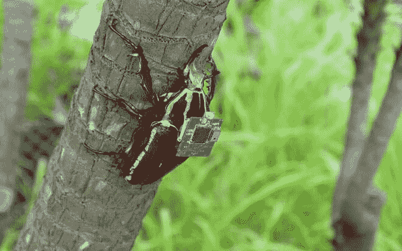
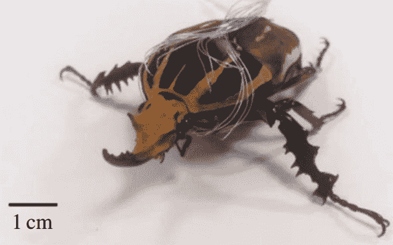

# 装有微芯片的飞行甲虫能智胜无人机

> 原文：<https://thenewstack.io/microchip-equipped-flying-beetles-outmaneuver-drones/>

在过去的几年里，遥控无人机的应用已经扩展到越来越多的军事以外的领域，从电影和摄影到农业，高风险的 T2 无人机比赛，甚至是 T4 可编程的事情。但是微芯片增强的活甲虫——由人类远程控制——可能很快就会加入这些已经熟悉的机械无人机的行列。

新加坡南洋理工大学(NTU)和加州大学柏克莱分校的科学家通过在巨型花甲虫的腿、视叶和飞行肌肉中植入微型电极，创造了一种昆虫-机器人混合体。

使用无毒的蜂蜡作为各种胶水，一个 1 厘米见方的微处理器连接到它的背部，伴随着内置的无线接收器和 3.9 伏的微型锂电池。无线电信号通过这些电极发送到这些电极，以控制甲虫的行走步态，速度，以及发射，着陆和悬停在空中的能力，有效地调节身体不同部位的运动。

通过重新排列施加的刺激信号来执行不同的行走步态。研究小组在一个封闭的房间里研究了这种经过改造的甲虫的机动性，房间里设置了八个三维运动摄像机来捕捉运动数据。通过改变刺激序列的持续时间，他们控制了步频，从而控制了甲虫的行走速度。

## 敏捷生物机器人

体长 3 英寸，重量只有 8 克，相对较轻的巨型花甲虫是这项工作的完美人选；由于体积小，它的强度不成比例，能够携带麦克风和热传感器等额外设备。

因为不需要额外的工程来保持这些甲虫“生物机器人”在空中，它们比它们的机械对手更灵活，甚至需要更少的人工干预。研究人员在他们发表在*当代生物学*上的[论文](http://rsif.royalsocietypublishing.org/content/13/116/20160060)中解释道:“与人造腿机器人不同——人造腿机器人需要制造、组装和集成许多微小部件、传感器和致动器——昆虫-计算机混合机器人直接使用活昆虫作为自然界的现成机器人平台。”。

综上所述，这些品质使得这些微小的昆虫电子人比无人机更容易操纵，这使得它们在紧急情况或灾难情况下以及监视方面具有不可估量的价值。

“这项技术可能被证明是遥控无人机的一种改进的替代方案，因为它可以进入以前无法进入的区域，”NTU 助理机械和航空航天工程教授 Hirotaka Sato 和主要作者告诉[电讯](http://www.telegraph.co.uk/news/science/science-news/11485231/Flying-beetle-remotely-controlled-by-scientists.html)。“例如，它可以用于搜索和救援任务，因为它可以进入倒塌建筑物的小角落和裂缝，以定位受伤的幸存者。”

## 制造成本低

由于大多使用现成的组件，该系统的生产成本也相对较低，每台成本仅为 7 美元，这使得这些生物机器人成为一种具有成本效益的替代品。此外，科学家们发现，即使在他们的微芯片背包和电极被移除后，转基因甲虫也可以毫无问题地活到 5 至 6 个月的完整寿命。

研究小组对鞘翅目肌肉功能的新认识促进了这项研究，鞘翅目肌肉位于昆虫的翅膀之间。

“自 19 世纪以来，甲虫的鞘翅目肌肉被认为只在折叠翅膀方面起作用，”佐藤说。“我们的无线系统允许我们记录自然、自由飞行中的神经肌肉运动，通过这样做，我们发现这块肌肉也用于转向和转弯。”

除了这一发现有助于团队进一步提高甲虫旋转运动的精确度，随着无线系统[电力传输](https://thenewstack.io/delivering-power-with-wi-fi-signals-to-the-next-billion-devices-no-batteries-required/)的最新发展，该团队预计有一天该系统可能会被建成无电池的。

“未来，整体钻机甚至可能不使用电池。它可以由可持续来源提供动力，例如从周围的无线电波中提取的能量，”Sato 解释道。

遥控动物并不是什么新鲜事，让电子甲虫成为现实的科幻想法也很棒。但是这一成就确实引发了一些伦理问题，更不用说任何人都有可能滥用这项技术。毕竟，谁想让巨型甲虫来监视它们呢？

图片:南洋理工大学和加州大学伯克利分校。

<svg xmlns:xlink="http://www.w3.org/1999/xlink" viewBox="0 0 68 31" version="1.1"><title>Group</title> <desc>Created with Sketch.</desc></svg>