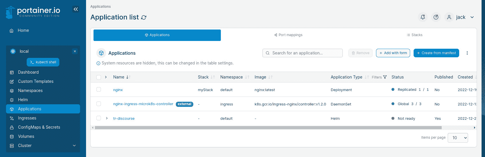
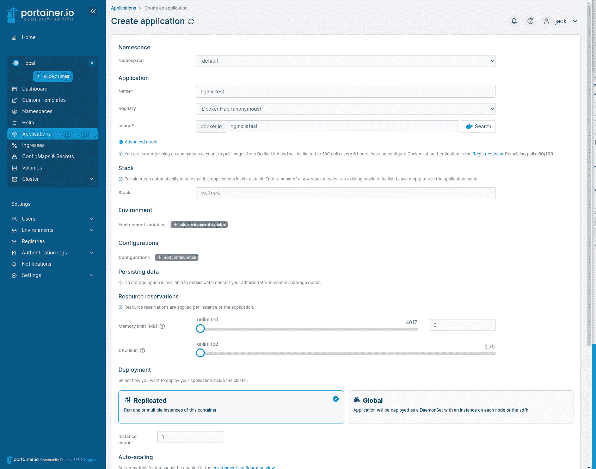
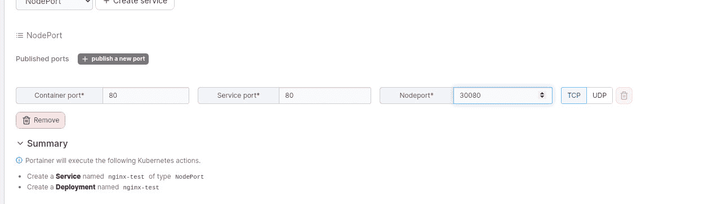
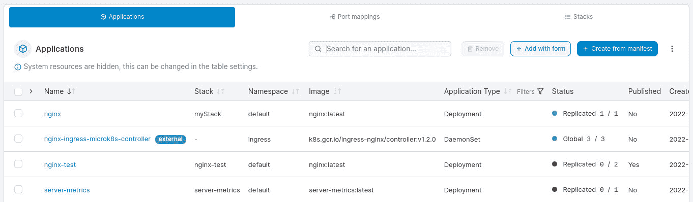
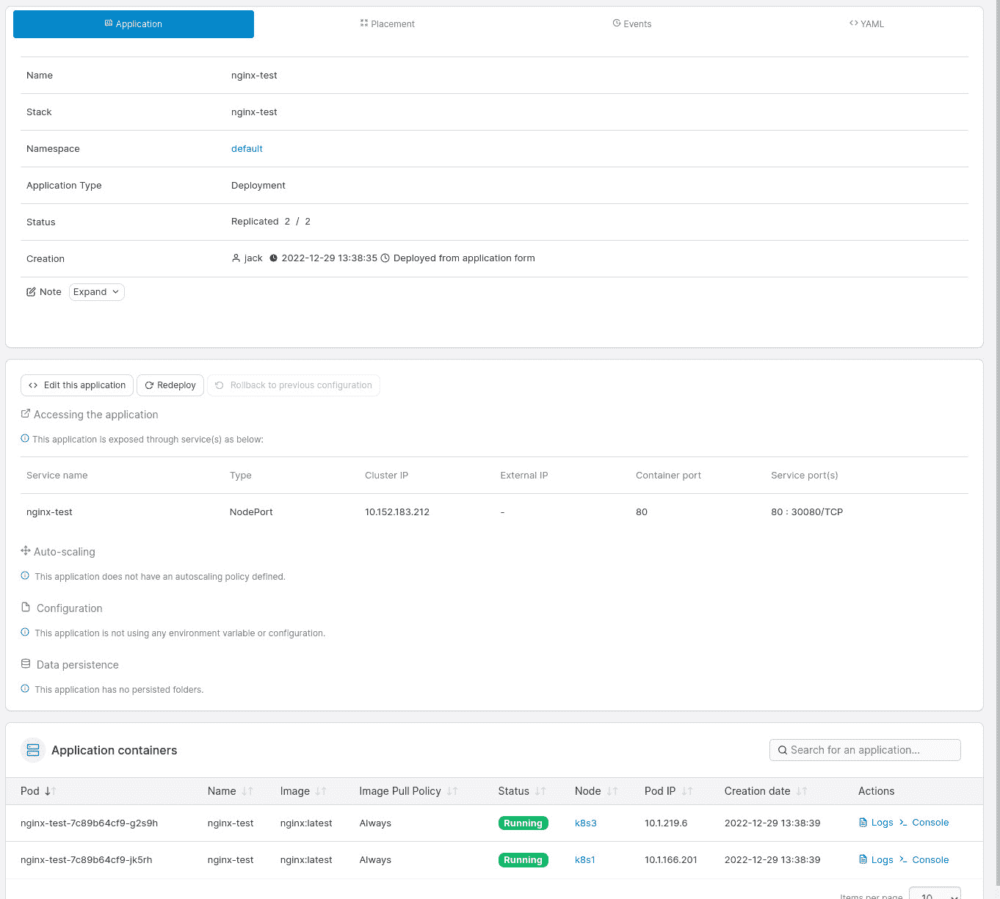
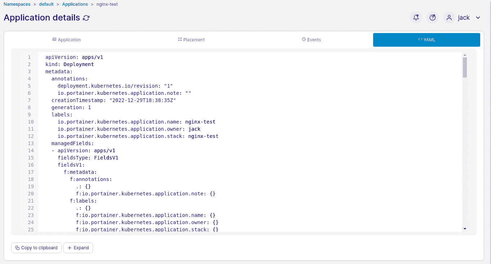

# MicroK8s 和 Portainer 是在 Kubernetes 上部署应用程序最简单的方法

> 原文：<https://thenewstack.io/microk8s-and-portainer-is-the-easiest-way-to-deploy-an-application-on-kubernetes/>

任何第一次尝试与 Kubernetes 合作的人都明白这有多复杂。不仅创建 Kubernetes 集群[是一个挑战](https://thenewstack.io/what-does-it-take-to-manage-hundreds-of-kubernetes-clusters/)，部署应用程序也是如此。有这么多活动部件，这项技术可以胜过任何对其工作原理没有深刻理解的人。

然而，有捷径可走。其中一个捷径是将 [Portainer](https://www.portainer.io/) 部署到 [MicroK8s 集群](https://microk8s.io/docs/clustering)。我已经在[之前的教程](https://thenewstack.io/kubernetes-101-deploy-portainer-to-a-microk8s-cluster/)中演示过了。你为什么要走这条路？简单。MicroK8s 不仅是部署 Kubernetes 最简单的方法之一，而且 Portainer 还为管理 Kubernetes 部署提供了最强大和用户友好的 GUI 工具之一。

借助 Portainer/MicroK8s 组合，您可以轻松使用:

*   自定义模板
*   名称空间
*   舵
*   应用程序
*   入口
*   配置映射和机密
*   卷
*   簇
*   用户
*   环境
*   注册
*   认证日志
*   通知

为什么不想使用这种方法将应用程序部署到 Kubernetes 集群中呢？对于任何一个刚刚进入 Kubernetes 世界的人来说，你肯定想走这条阻力最小的路。几分钟之内，您就可以启动并运行 Kubernetes 集群，并为部署做好准备。

因此，随着 Portainer/MicroK8s 组合的启动和运行，让我们看看将第一个容器部署到 Kubernetes 集群有多容易。

## 要求

为此，您只需要一个至少包含三个节点的 MicroK8s 集群和一个启动并运行的 Portainer。同样，这个过程在上面的链接中有概述，所以请确保在继续之前处理好这个问题。

## 部署您的第一个应用程序

打开 web 浏览器，并将其指向 *http://SERVER:30777* 或 *https://SERVER:30779* (其中 SERVER 是集群中控制器节点的 IP 地址或域)。

登录后，选择本地环境，然后点按“应用程序”。在生成的窗口中(图 1)，您将看到当前正在运行的任何应用程序的列表(可能只有一个，nginx-ingress-micro k8s-controller)。点击右上角附近的添加表单。

图 Portainer Kubernetes 应用程序窗口列出了所有部署的应用程序。

对于那些不熟悉创建 Kubernetes 清单的人来说，前者是最简单的。一旦您对 Kubernetes 部署有了更多的了解，您就可以走清单路线了。不过，在此之前，请坚持使用表单选项。

在出现的窗口中(图 2)，您将开始制作您的应用程序。

图 2:用于部署应用程序的 Portainer Kubernetes 表单。

我将通过部署一个简单的 NGINX 应用程序来演示(因为谁不喜欢简单的 NGINX 容器呢)。选择默认的名称空间，然后给应用程序起一个名字，比如 nginx-test。

在 Image 字段中，键入 nginx:latest，并确保选中 docker.io。接下来，向下滚动并配置内存和 CPU 限制，以满足您的需求。如果您知道应用程序需要扩展，那么您会希望同时升级这两个单元。只要确保你明智地配置这些。不要把太多的系统资源交给一个应用程序。

接下来，更改复制的实例数。如果希望将 NGINX 容器复制到两个节点，请在 Instance Count 中键入 2。如果希望它复制到三个节点，请键入 3。

在发布应用程序下，选择节点端口，然后单击创建服务。然后将要求您填写容器端口、服务端口和节点端口(图 3)。节点端口向集群外部公开服务。如果不设置节点端口，您将无法从容器外部访问您的应用程序。关于节点端口需要注意的一点是，它必须在 30000-32767 范围内。您可以将其留空，系统会为您分配一个端口。

图 3:为新应用程序配置节点端口。

配置好节点端口后，滚动到窗口底部并单击 Deploy Application。Portainer 将着手部署您的容器。然后您将看到您的应用程序被列出，新的应用程序处于部署状态(图 4)。

图 4:我们的测试应用程序现在正在部署。

一旦红点变成绿色，应用程序就成功部署了。根据发布到的节点数量，这可能需要一些时间。您可以点击容器条目来获得更多的状态信息(图 5)。

图 5:我们的 NGINX 测试正在运行，并且已经成功复制到两个节点。

这个设置非常酷的一点是，您可以返回到应用程序细节，单击 YAML 选项卡，并查看应用程序的清单(图 6)。这是了解 Kubernetes 清单是如何编写的好方法。

图 6:我们的 nginx-test 应用程序的清单。

您甚至可以将清单复制到剪贴板，粘贴到编辑器中，并在 Portainer 之外继续学习 Kubernetes。

这就是用 MicroK8s 和 Portainer 部署您的第一个 Kubernetes 应用程序是多么容易。没有比这更容易的了。

<svg xmlns:xlink="http://www.w3.org/1999/xlink" viewBox="0 0 68 31" version="1.1"><title>Group</title> <desc>Created with Sketch.</desc></svg>