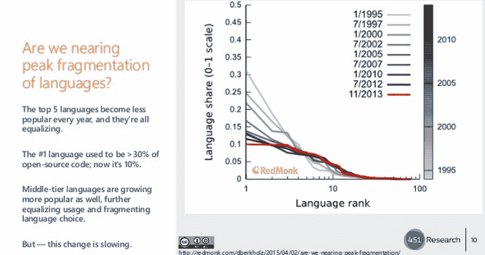
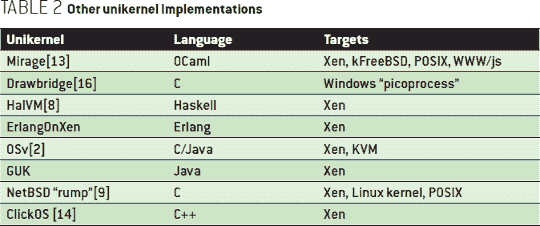

# 微服务是真实的，云却不是

> 原文：<https://thenewstack.io/microservices-are-real-the-cloud-not-so-much/>

从西雅图到丹佛的飞机上无线网络无法工作。的确是。TXT 时间。至少我可以在一个文本文件上为我的“云”曲目介绍写点东西，这个文本文件是科技领域最好的会议之一。在 OpenStack 度过了两天之后，我在不列颠哥伦比亚省的温哥华开始了这一天，open stack 是一个发展如此迅速的组织，以至于他们有 6000 人参加了他们的会议。

【T2

在温哥华，我采访了云软的邓肯·约翰斯顿-瓦特(Duncan Johnston-Watt)，他是我们在 New Stack 的赞助商之一，以及另外两位作家/分析师: [Ben Kepes](http://www.diversity.net.nz/) 和 [Paul Miller](http://cloudofdata.com/) ，他们都是《福布斯》的撰稿人、分析师和咨询顾问。

话题转到了保罗、本和我的工作上。我们讨论了作家带给这个新堆栈世界的观点。当然是工作上的谈话，但它帮助我思考，根据我与人们关于“云”世界的所有对话，我可以分享什么。

这一切的结果是什么？接下来是一个探索我在 Gluecon 上演讲的“云”的构造。从那以后，我在某种程度上根据会议上讨论的部分内容进行了补充。

## 云不存在

首先，让我们按照思考云的标准方式来分解事物。云是一个隐喻，用来理解复杂、快速和分布式基础设施上的服务和软件的复杂性。它不是 AWS，也不是 OpenStack，也不是大型银行拥有的虚拟化数据中心。

我们真正拥有的是私有数据中心的孤岛。一些比另一些更有效率，但是它们在很大程度上仍然是孤立的，这种情况看起来不会很快改变。

更高效的数据中心越来越以应用程序为中心。但实际上，这些操作与大多数开发人员所熟悉的虚拟化操作相比并没有太大的不同。开发人员在管理虚拟机的服务上运行应用程序。虚拟机从物理服务器或集群启动和管理。这些是人们操作的机器。在这些机器上工作的人所做的工作几乎与过去二十年中所做的工作相同。

这些变化，新的思维，来自于开发者和新一代的运营团队，他们大规模地管理应用程序。效率更高的服务提供商已经通过在他们已经建立的基础设施上提供服务来适应。他们已经认识到，如果基础设施效率低下，人们无法管理机器和服务。机器需要完成这项工作，以便可以部署和管理多个服务。

但是光是跟上就有很多工作要做。要跟踪和分析的东西太多了。例如，451 Research 的 Donnie Berkholz 在 Gluecon 的演讲中指出了编程语言是如何分裂的:

以下是他的完整演示:

随着虚拟化环境中抽象层的增加，复杂性也随之增加。但是以虚拟机为中心的方式越来越有效。例如，Mirage OS 体现了 unikernels 的概念，uni kernels 是作为高级语言编写的专用操作系统内核，充当单独的软件组件。这是根据阿尼尔·马达瓦佩迪和大卫·j·斯科特去年的一次谈话。这里是他们引用的其他一些正在开发的单核。根据 Donnie 的观点，请注意列表中显示的语言数量:

有趣的是，正如我们在本月早些时候写的，Drawbridge 是一种[虚拟化驱动的隔离机制](http://research.microsoft.com/en-us/projects/drawbridge/)，由微软研究院创建，最初是作为一种测试机制构建的。它的设计使得被其创造者称为“picoprocesses”(“微服务”听起来太像该公司的商标)的进程能够在通过 API 远程寻址的最小化内核上运行。起初甚至没有意识到，微软正在创建一个容器化的架构。

## 房子里的机器人

这就把我们带到了容器和它们所代表的以应用为中心的象征意义上。容器是承载在机器上的进程。但是那会带来什么变化呢？毫无疑问，这是一个更深层次的复杂性，因为生产中的容器数量将比虚拟机多一个数量级。接下来是要考虑的编排、底层网络、存储管理方式以及必须处于宇宙中心的监控。

随着复杂性的增加，对机器编程软件的需求也越来越大。这些机器仍然需要人来维护，但这难道不是机器人最终将完成的任务吗？检查仪器、组合仪表的健康状况等。机器人可以做到这一点，对不对？软件也将成为网络和存储器，机器人将被编程为当数据在机器之间传递时知道它们在说什么语言。这太复杂了，人类无法理解。没有多少人能做机器做的工作，更不用说翻译数据了。我们了解到，数据中心只需要几个人就可以运行。需要管理的是编排。

这让我想起了 Scott Fulton 写的一个关于 Google 的 Borg 和他们选择不虚拟化的故事:

“Borg 的绝大部分工作负载不在虚拟机内运行，”Borg 团队写道，“因为我们不想支付虚拟化的成本。”

该团队没有详细说明成本构成，但很有可能他们指的是 1)额外的虚拟机管理程序层，这导致 2)两个独立规模的复杂分工，限制了整体系统的可扩展性，更不用说 3)采购、支持和维护必要硬件的资金成本。

这个应用程序，以及它的容器编排，给出了为什么微服务经常在与技术专家的对话中被讨论的许多原因。阿德里安·科克罗夫特在 Gluecon 的主题演讲中讨论了从虚拟机到容器的发展，与虚拟机相比，容器可以在几秒钟内部署几分钟或几小时，而虚拟机可以在几分钟内部署几周。AWS Lambda 甚至更短暂，几毫秒内响应，几秒内存活。

越来越明显的是，效率和复杂性不可避免地成对出现。更重要的是，问题变成了谁来处理这种复杂性？是人类管理机器，还是机器人管理机器的复杂性以及它们如何通信？

<svg xmlns:xlink="http://www.w3.org/1999/xlink" viewBox="0 0 68 31" version="1.1"><title>Group</title> <desc>Created with Sketch.</desc></svg>