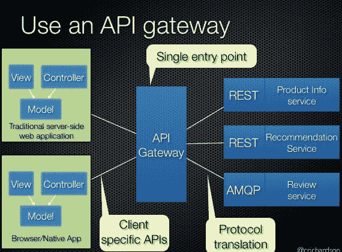
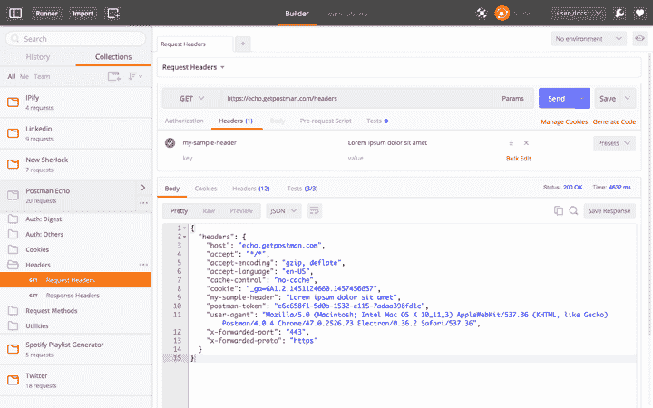
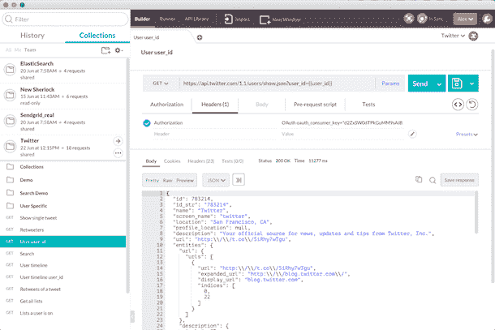

# 微服务需要强大的 API 管理

> 原文：<https://thenewstack.io/microservices-calls-robust-api-management-tools/>

随着[微服务方法](https://thenewstack.io/microservices-changed-matter/)在应用开发中变得越来越普遍，API 操作或 API Ops 越来越被认为是企业和初创公司的必备技能。

微服务架构将服务和资产分解成离散的、可组合的单元。它们使用 API 相互通信和连接。这反过来意味着开发团队需要建立他们的 API 设计和创建技能(这需要测试和其他运营任务)，以及像安全性这样的外包功能。

它还需要一个 API 网关服务来管理内部到外部环境之间的 API 流，所有这些都需要测试工具来映射 API 如何调用和响应，以确保微服务可组合性的流程中没有故障。

因此，API Ops 应运而生，它允许企业专注于 API 设计，加入外部功能，运行工作流测试，以及管理网关任务。

## API 操作和外部功能

[身份和用户管理服务](https://www.linkedin.com/in/alexsalazar) [Stormpath](https://stormpath.com/) 的首席执行官 Alex Salazar 表示，在过去的六个月里，他越来越多地听到客户询问微服务。Stormpath 通过可以直接集成到应用程序中的 API 提供身份访问和用户管理服务。

“对我们的客户来说，这真的很简单，”Salazar 说。“他们正在构建现代应用程序。这意味着他们几乎总是要构建 API。他们要么通过移动应用中的 API 公开服务，要么将应用作为一系列捆绑到 API 中的微服务推出。”

Salazar 说，在复杂的应用程序开发中，开发团队不想在内部培养复杂的安全技能。

> “如果你第一次就把你的 API 弄错了，修复它的代价是非常昂贵的”——Alex Salazar。

“开发团队在问，如何保护端点，如何进行速率监控？Salazar 说:“微服务架构中的大多数程序员都面临着不得不从头开始做这件事的需求，所以他们正在寻找可以直接投入的工具。“他们试图移动得更快；团队害怕在这方面出错。像谷歌或脸书这样的大型基础设施公司自己有能力做到这一点，但对于其他人来说，建立自己的认证和用户管理系统是一笔巨大的支出。”

Salazar 说，与微服务和 API 合作的开发团队知道重点需要放在他们的 API 设计上:“如果你第一次就把你的 API 弄错了，修复它真的很昂贵，”他说。这就是为什么外包安全措施的兴趣越来越大。

Salazar 表示，全球转向微服务意味着所有行业的开发团队都必须学习如何构建和管理 API:“一年前，我们的情况是，人们只想将我们插入他们的应用程序中，”他说。“他们只是想要一个典型的登录用户界面。但是大约 15 个月前，我们开始被问到，你有一个很棒的 API，你能告诉我们关于构建 API 的一些事情吗？现在，在过去的六个月里，话题已经转移到人们向我们寻求反向代理，我们知道这意味着他们正在寻找一个 API 网关。”

CloudFoundry 的创始人之一、[微服务. io](http://microservices.io) 网站的作者 Chris Richardson 写道[微服务设计模式需要一个 API 网关](http://microservices.io/patterns/apigateway.html)。

“微服务提供的 API 的粒度通常与客户的需求不同，”他解释道。“微服务通常提供细粒度的 API，这意味着客户端需要与多个服务进行交互。例如，需要产品详细信息的客户需要从大量服务中获取数据。”API 网关为所有客户端创建了一个入口点。

上图:http://microservices.io/patterns/apigateway.html[的 API 网关模式，作者 Chris Richardson](http://microservices.io/patterns/apigateway.html)

这就是 API 操作问题发挥作用的地方。看到 Stormpath 在微服务架构中被用作身份和用户认证流程的增长，Salazar 与 API 网关和管理服务提供商 3scale 建立了[新的合作关系。他们的新合作关系意味着 Github 上现在有一个简单的代码片段，允许开发人员将完整的身份层集成到他们的 web 和移动应用程序中。](https://www.3scale.net/partners/stormpath/)

Salazar 说，他在过去三年中看到的整个行业的主要变化是从公共 API 转向越来越多地使用内部 API。“现在的区别是，所有行业的每个人都在开发软件，让他们的业务服务或产品在线上与客户互动。”

即将于 5 月 18 日至 19 日在芬兰坦佩雷举行的北欧养蜂日的组织者之一 Jarkko Moilanen 表示，这种例子正是 API Ops 成为会议主题之一的原因。(*完全披露:我为 [APIdays 媒体博客](https://medium.com/@APIdays)供稿。*)

“目前，任何不断发展的服务业务都基于几乎毫不费力的可扩展解决方案，这些解决方案通过 API 相互连接，”Moilanen 说。“DevOps 有助于自动化服务开发，但需要大量自行安装和维护的服务。目前，趋势是完全基于 API 的服务设计、部署和维护。API Ops 是一个旨在确定最佳实践和工具的社区。最终，从设计、更新和管理到任何 API 的淘汰，所有阶段都可以自动化，良好的 API 运营将有助于实现这一点。”

## 用于全微服务工作流测试的 API Ops

在过去的六个月里， [Abhinav Asthana](https://twitter.com/a85) 见证了作为微服务架构一部分的外部和内部 API 使用的增长。作为 API Ops 工具 [Postman](http://getpostman.com) 的首席执行官和创始人，他将他们的产品从浏览器插件转变为更全面的生命周期工具，旨在帮助开发人员更好地理解 API 在应用工作流中的使用方式。

该工具已被希望将其 API 作为微服务使用的内部团队所采用，被希望在集成 API 产品之前对其进行测试的外部开发人员所采用，据 Abhinav 称，该工具甚至允许企业在其架构图中更好地定义微服务组件的边界。

Asthana 说:“Postman 从浏览器中的 REST 测试工具演变成适合整个 API 生命周期的东西。“开发人员通常希望集成一大堆内部和外部 API，但效率低下的情况比比皆是。”

Postman 允许用户运行带参数的 API 查询，以便更好地理解他们将收到什么样的数据响应。

Postman 最近创建了一个名为“ [Collections](https://www.getpostman.com/docs/collections) 的特性，它允许用户在一个地方整理他们需要的关于他们正在使用的 API 的所有信息。Asthana 说，API 消费者在创建他们的工作流时，通常需要咨询各种媒体，这些工作流可能包括 API 调用、一些数据转换，然后在后续的 API 查询中使用这些数据。

邮递员收藏

“每个 API 发布者都提供教程、博客文章和文档。这并不是说这些工作流没有被创建，只是工作流设计没有以可共享的形式发布，”Asthana 说。

我最近采访的一位银行业架构师在使用亚马逊的 API Gateway、 [Lambda](https://thenewstack.io/aws-lambda-is-a-step-towards-creating-a-new-normal/) 和 DynamoDB 时描述了这种情况。虽然他称赞亚马逊的文档，但当他试图集成一个在三个服务之间移动数据的工作流时，困难出现了。他举了一个例子，使用 Amazon API Gateway 中的控制台，导入他用 Lambda 创建的 API。但是当试图调用 API 时，Lambda 返回了一个错误消息。知识缺口发生在集成两个 Amazon 服务时，没有意识到他需要将 Lambda 令牌添加到控制台工作流中。

这正是 Postman 可以帮助解决的问题，它让最终用户将来自各种 API 的所有文档和测试工具捆绑到一个集合中，包括他们的笔记，以便可以与他们的内部团队共享，他们可能正在构建这样一个概念验证的应用程序。

“创建一个工作流程会有很多摩擦，”Asthana 说。他再次指出微服务的主导地位影响了开发团队的 API 集成和工作流需求。“在某些情况下，开发团队将公共 API 与内部 API 结合使用:我们不坚持它只是私有或公共的，或者只使用一种类型的规范格式。我们建议你可以任意组合 API，这完全取决于他们的团队。我们看到一些团队将 Slack 与 ElasticSearch、Github 和吉拉结合起来:所有这些我们都可以在 Postman 内部测试。目标是让人们流畅地从公共场所转移到私人场所。对我们来说，单元是一个集合:一组请求。这是扩展到所有用例的格式。”

## API Ops 改善外部开发者关系

像 Postman 这样的工具也被用来鼓励 API 消费者成为 API Ops 社区的一员。例如，Postman 有“在 Postman 中运行”按钮，可以帮助 API 提供者将测试工具直接集成到他们的文档页面中，就像鼓励消费者使用 API Changelog 小部件来跟踪 API 变化一样，或者使用[停止灯](http://stoplight.io)按钮来克隆 API。

百思买 API 团队副产品经理[Anna-Maria Bliss](https://bestbuyapis.github.io/api-documentation/)说[我们的高级产品经理将‘Run in Postman’按钮带到我们的团队进行潜在的试验。“这似乎是最小的努力，我们认为这将符合我们的开发者战略。”](https://www.linkedin.com/in/annabliss)

Bliss 很快承认开发者-消费者在评估他们的 API 时需要使用 API Ops 策略。“我们的查询语法有点古怪——它不是标准的，”她解释道。“您可以构建不同类型的查询来获得不同的产品细节，我们一直在努力关注我们如何进行文档记录，并鼓励将其解析出来，并将 API 查询分解为顶级信息。现在有了 Run in Postman，开发人员看到了更深入的东西，这就像查询样本代码，样本代码比文档更深入，更有吸引力。”

布利斯表示，在推出“邮递员跑步”的当天，开发者的参与度“有所上升”，但现在看到互动的大幅上升还为时过早。

布利斯说:“我们希望 Postman 能够收集查询，为新开发者提供一系列全面的查询，例如，在你的房子里建造完美的家庭影院或游戏室。”“那么，获取产品和商店信息的最佳方式是什么呢？如果你想建立一个页面，你可以访问查询包，这样你就可以看到我们是如何调整这些查询并将其应用于该用例的。”

与此同时，像 Cronofy T1 这样的初创公司也在他们的开发者页面上提供 Run in Postman 服务。Cronofy 提供了一个 API，允许用户以双向、始终同步、实时集成的方式维护任何日历应用程序。首席执行官兼创始人[亚当·伯德](https://www.linkedin.com/in/adambird)说，他们想看看为他们的开发者-消费者改善 API Ops 机会是否能增加转化率。

Bird 正在思考如何将像 Postman 这样的 API Ops 工具与文档结合使用，以提高开发人员的理解能力。“复制和粘贴样本代码是许多开发人员开始掌握 API 的方式，”Bird 说。“通过让我们的错误报告识别何时使用了安全令牌等文档占位符，我们可以更有效地指导新开发人员如何成功使用我们的 API。”Bird 表示，由于该工具的可用性，他们已经看到开发人员从试用帐户转向成功集成的“显著改善”。

## API Ops 帮助定义微服务架构

虽然微服务架构正在引领对更多内部和外部 API 的需求，但同时，API Ops 的使用可以帮助企业更好地培养微服务思维。

Abhinav 表示，使用 Postman 集合正在帮助许多企业更好地理解各种服务的自然域边界，以及如何将它们捆绑在一起作为一组微服务。“迄今为止，企业将他们的文档分开保存，将他们的代码样本分开保存，并且这些工具中有许多是分散的。集合把所有这些放在一起。这无疑是在帮助企业思考他们的微服务，并帮助开发人员思考如何组织微服务和运行微服务的机器。”

Salazar 说，围绕微服务设计的这种组织反馈循环使 API 变得必不可少，但同时也减少了它们本身作为最终游戏的概念化。“由于移动和微服务的优势，微服务专注于构建和管理小组件，而不是单一的应用程序，你会看到团队真的很难将他们的 API 与他们的移动产品集成，或者在他们的微服务之间集成，”他说。

“对于移动和微服务来说，API 已经变得越来越普遍。他们不再是目标；它们是发布应用程序的垫脚石。”

<svg xmlns:xlink="http://www.w3.org/1999/xlink" viewBox="0 0 68 31" version="1.1"><title>Group</title> <desc>Created with Sketch.</desc></svg>