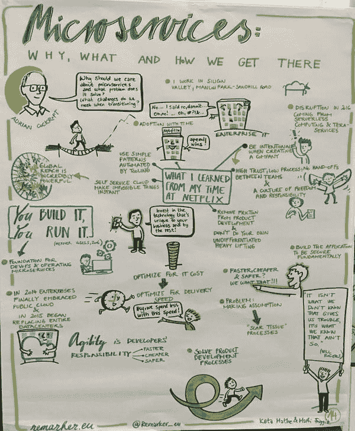

# 微服务的变化及其重要性

> 原文：<https://thenewstack.io/microservices-changed-matter/>

微服务的概念是由更快开发应用程序、更具弹性并为客户提供良好体验的需求推动的。这个概念等同于在简单的商用基础设施上运行软件的向外扩展的自动化系统。容器提供的经济效率将使微服务成为 2016 年的一大主题。

对快速应用程序开发的需求影响着整个组织，以及它如何看待其业务的历史组织方式。微服务带来的新实践意味着需要小团队以一种自顶向下方式工作的公司不熟悉的方式迭代工作。这意味着彻底改变企业的运作方式。

现在，容器生态系统正成为应用架构和微服务新思维的核心主题。

Battery Ventures 的技术研究员艾德里安·科克罗夫特指出，微服务有一些基本原则需要考虑。首先，现在构建软件的成本更低了，而容器让它变得更加实惠。Docker 在每个人的路线图上——从软件供应商到最终用户，都在试图弄清楚如何使用容器——因为它们可以加速软件交付。但这也意味着系统需要在应用程序级别进行测试，这意味着对开发、部署和管理应用程序有不同的要求。

阿德里安·科克罗夫特在 OOP 软件架构会议上的微服务演讲，由[评论者](https://twitter.com/Remarker_eu)渲染成卡通形式。

例如，对于处理范围不断扩大的服务和堆栈的公司来说，监控比以往任何时候都更加重要。为了解决问题，公司必须分析数据日志——这些日志可能跨越潜在的短暂节点和多个服务。这种对细粒度监控和更好工具的需求有助于从业者更好地理解这些构建模块如何影响应用所依赖的潜在的数十种微服务。

那么什么有效呢？它从组织和 API 开始:一个基于微服务的产品团队和一个独立的基于后端的平台团队，它们之间有一个 API，在这里进行 API 调用，基础设施一致地做出相应的响应。

[微服务](http://martinfowler.com/articles/microservices.html)被定义为一种松散耦合的、面向服务的架构，具有有界的上下文。它允许更新，而不需要了解其他一切是如何工作的。服务是跨组织构建的，所有权停留在一个地方。微服务架构更多的是作为系统间的点对点调用。您必须拥有灵活的消息格式；不管版本如何，一切都还正常。这意味着在构建微服务架构时，您需要一些工具来配置、发现、路由流量以及观察和构建系统。

IBM 的 [Andrew Hately](https://www.linkedin.com/in/ahately) ，IBM 云实验室的杰出工程师和首席技术官，提供了一个背景，十五年前，人们可能每周检查一次他们的银行余额。随着时间的推移，互联网允许人们检查他们的余额，并且进一步扩大了这种可访问性，智能手机可能推动了最大的变化。如今，人们可以即时查看账户上的每一笔支出。这种速度和即时性意味着，企业必须以过去五到十年社交网络和搜索公司开发服务的相同规模来开发服务。

Hately 说，企业必须处理员工、客户、系统和所有可能想象到的组合之间的持续互动——完全连接且随时可用。这意味着业务流程的重新发明，要求一切都相互关联。如果你不尝试，没有办法快速推出新功能，那么你的收入会受到影响，你也会变得无关紧要。

“仪器是至关重要的，”哈特里说。

Hately 说，数百个网站都不支持代码。反馈进来了，消费者在下一组测试用例中使用它。这种严格的开发过程提供了一种公司运作的方式。也是思考微服务的一种方式。DevOps 的 ops 端将完成这项工作。如果您有一小段代码，并为它定义了度量标准，您可以将它细分为成功和失败的部分。

基于消费者以及他们自己的内部团队的反馈和成功，IBM 结合了来自敏捷、DevOps、精益和其他迭代过程的最佳实践，创建了名为 [IBM Bluemix Garage Method](https://www.ibm.com/devops/method/) 的企业方法论。IBM Bluemix Garage 方法将企业解决方案的可靠性和可测试性与关于大规模质量的最新开放社区最佳实践相结合，使创新可重复，创建连续交付管道，并在云平台上部署。对于任何人来说，这都是一个有价值的开放资源，可以提高个人、团队和整个组织的 DevOps 技能，所有这些都具有符合治理的管理和监控能力。

## 围绕软件的合同

第一代容器管理平台正在支持这些加速的开发过程。

Docker 公司产品高级副总裁 [Scott Johnston](https://thenewstack.simplecast.com/episodes/scott-johnston-docker-the-speed-of-development-and-delivery) 说，在 Docker Compose 中，工具是由微服务推动的。YAML 文件充当描述不同组件的清单。Compose 允许开发人员以抽象的方式描述多容器应用程序。它可以描述 web 容器、数据库容器、负载平衡器以及它们之间的逻辑连接。它不需要网络或存储实施。

引擎场的[马特·布彻](https://thenewstack.io/deis-aims-extend-kubernetes-platform/)说，微服务是一种围绕软件的契约。有些人会认为它们是正确完成的面向服务的架构(SOA)。开发者希望有用、功能丰富和优雅。它将软件开发回归到它的 Unix 根源，即把一件事情做得很好。在 Unix 中，命令的输出是任意的。微服务更具契约性，因为它展示了如何非常好地做一件事，但也展示了它如何与环境交互。如果运行良好，这与一个好的 Unix shell 脚本所能完成的工作类似。

例如，Kubernetes 清单文件格式作为一个契约。清单提供了关于所需资源、卷定义、存储需求等的详细信息。这是一份强有力的 DevOps 式的合同。它告诉开发人员和操作专业人员应该期待什么。并不是这种中世纪风格的开发人员和操作人员的关系迫使开发人员将代码扔到墙外。

[cyclone slider id = " ebook-2-赞助商"]

清单可能包含关于应用程序的元数据，加上关于其特定版本的描述性参数，还可能包含多个清单。这可能是实例、pod 清单、复制控制器或服务定义，以及组成文件的已知资源位置。可以为图表中包含的组件定义任意标签。

“应用程序开发人员的生活已经够艰难了，”Butcher 说。“还有一个典型的问题，我称之为‘翻墙’，即开发人员负责在生产中运行所有这些东西，开发人员负责构建这些东西，总有一个移交过程，这个过程往往会变成翻墙。”

Butcher 说，当开发人员构建容器时，抽象层提供了一定程度的保证，即这些容器在生产阶段和开发阶段的运行方式基本相同。这已经减轻了 DevOps 专业人员的许多头痛，他们了解容器的基本仪器。集装箱化已经提供了这种保证水平，但像 Engine Yard 的新服务 Helm 这样的产品可以帮助进一步正式化这种关系，通过将它作为一种合同在团队之间呈现——这种合同不是“扔过墙”，而是直接穿透它。
从虚拟机和单片到容器再到微服务

Joyent 首席技术官布莱恩·坎特里尔表示，容器为云原生架构提供了基础，与传统的虚拟化相比，容器象征着一种新形式的应用架构。基于硬件的虚拟化或传统虚拟机曾经在大型计算机上进行计算。虚拟机为运营团队提供了一种方式来管理 Cantrill 所说的“病态肥胖”的大型单体应用程序，以及硬件定义的企业架构。虚拟机位于底层之上，承载操作系统的负载。然而，容器创造了一种新的更灵活的抽象。

“这款应用程序开始了速成节食，”坎特里尔说。

如今，复杂性来自于从虚拟机和单片到容器和微服务的转变。各公司都在为如何实现这一转变而努力，因为这需要对应用程序架构、基础架构和整个组织本身进行不同的思考。

Cantrill 说，Joyent 的开源服务 Triton T1 的目标是简化和加速公司向容器和微服务的过渡。它允许开发人员简化架构。您只调配容器，从不调配虚拟机。您可以获得微服务指南，并在几秒钟内完成部署，因为您不必进行网络配置等工作。

Cantrill 表示，Joyent 是 Docker Compose 的粉丝，因为它可以与单个 Docker 引擎对话，这是由 Triton 实现的 Docker 远程端点，可以虚拟化整个数据中心。它允许快速、轻松地启动完整、有弹性的运营服务。“这是大趋势，”坎特里尔说。

VMware 首席技术官 [Kit Colbert](https://thenewstack.simplecast.com/episodes/kit-colbert-vmware-integrating-containers-and-infrastructure) 从如何沿着容器之旅前进的角度来看待市场。VMware 一直专注于运营领域。它现在正在开发一种方法来满足新出现的开发人员及其需求，但作为一个基础设施提供商。

对于 VMware，该公司将自己视为基础架构提供商，而不是以应用程序为中心、以体系结构为导向的公司。Colbert 看到客户对 Cloud Foundry 感兴趣，但其他人希望采用 DIY 方法。VMware 正寻求通过 VSP here Integrated Containers(VIC)和 Photon platform 支持应用技术。

为了适应使用容器的客户，vSphere Integrated Containers(VIC)使容器化的工作负载成为 VSP here 上的一等公民。VIC 适合开发过程的运行方面，并将虚拟化最有价值的方面之一应用于容器:灵活、动态的资源边界。借助虚拟化，VMware 将商用硬件转变为简单、可替代的资产。同样，通过在虚拟机中应用 Docker 端点，vSphere Integrated Containers 创建了具有完全动态边界的虚拟容器主机。结果是一个支持传统和基于微服务的应用的基础设施，IT 和开发人员都可以访问。

相比之下，VMware 的 Photon 平台专门面向云原生应用。Photon Platform 由一个最小的虚拟机管理程序和控制平面组成，专注于为微服务提供速度和规模。Photon Platform 还通过 API 为开发人员的易用性而设计，为他们提供了一个自助服务平台，用于供应应用程序并最终加快部署。

从 VMware 的角度来看，运营团队也在努力加快部署速度。现在更多的是关于数字体验，或者软件如何更具功能性，而不是其他任何东西。这类似于我们在智能手机上查看应用程序的方式。该提供商可能以扬声器的出色声音而闻名，但该服务的应用程序是否实用？

“我能依靠它吗？”科尔伯特问道。公司必须想出如何开发应用程序来服务客户，因为客户一直在寻找高质量的应用程序。公司需要弄清楚这一点，以便更快地行动。对于许多已经构建了虚拟化基础架构的客户来说，他们希望通过这种更快的应用程序开发流程来应对组织挑战。

## 微服务时代的发展

软件开发是迭代的，需要持续的反馈循环才能工作。这就是 IBM Bluemix Garage 方法等工具所提供的。但是大多数组织的工作模式不同于开发人员的工作模式。开发人员的工作方式与销售、营销、财务等部门的人员不同。他们按照计划和时间表工作。在软件开发中，过程更多的是迭代的，而不是自顶向下的。

Pivotal 首席技术专家迈克尔·科特(Michael Coté)说:“我不知道该怎么称呼这种情况，但现实世界和软件世界的阻抗不匹配。Coté认为，弄清楚软件开发是如何工作的似乎是自相矛盾的，但它确实阻止了人们试图理解一台巨型机器和一份文件中的一切是如何工作的。通过遵循软件开发的原则，组织可以找到自己的方式，而不是拘泥于一个计划。

Coté说，做微服务没有单一的方式。借助微服务，您可以获得运行时和架构弹性。微服务基于简单的原则来构建真正复杂的东西。你能创造的概念越简单，你能做出的东西就越复杂。

但是当复杂性转移到其他地方会发生什么呢？借助 Pivotal，该平台可以管理复杂性。它取消了选择，因此客户不必考虑网络、操作系统等。它允许客户将复杂性放在应用程序堆栈的顶部，这样他们可以更好地为最终用户区分他们的产品。

“我们正在见证技术行业的又一个复兴时刻，”Hately 说。

同样，IBM Bluemix Garage Method 旨在从开发人员那里抽象出复杂性，目的是让他们更高效，让他们更好地享受他们实际要做的工作。所有这些努力使得企业在技术和文化层面都发生了巨大的变化。

<svg xmlns:xlink="http://www.w3.org/1999/xlink" viewBox="0 0 68 31" version="1.1"><title>Group</title> <desc>Created with Sketch.</desc></svg>