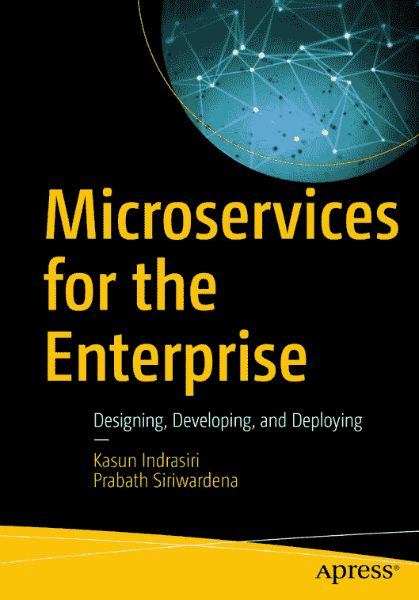
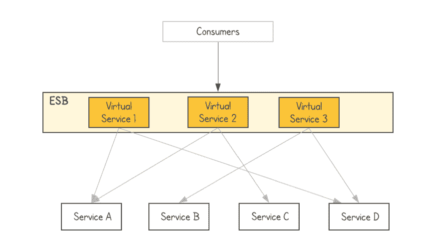
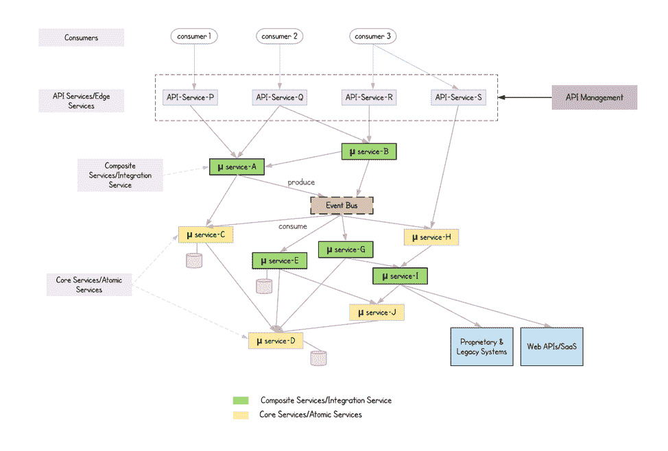

# 《企业的微服务》:一本关于现实世界挑战的书

> 原文：<https://thenewstack.io/microservices-for-the-enterprise-a-book-about-real-world-challenges/>

[WSO2](https://wso2.com/) 赞助本帖。

 [Kasun Indrasiri

Kasun 是 WSO2 的集成架构总监，也是微服务架构和企业集成架构的作者/传播者。他已经为企业和*编写了*微服务，开始 WSO2 ESB* 。他是 Apache 委员会成员，曾担任过 WSO2 Enterprise Integrator/ESB 的产品经理和架构师。Kasun 也是 O ' Reilly Software Architecture Conference San Jose，GOTO Chicago 2019 的演讲人，并且是大多数 WSO2 会议和旧金山湾区微服务会议的定期演讲人。此外，他还为 InfoQ 和 InfoWorld 以及新的堆栈做出了贡献。在他的成就中，Kasun 创建了硅谷微服务、API 和集成会议，这是一个位于湾区的供应商中立的微服务会议。*](https://wso2.com/) 

微服务架构可能是现代软件架构拥挤的领域中最流行的架构模式。因此，几乎所有的企业都在实践或尝试采用微服务架构。虽然一个小的绿地创业公司更容易实现微服务架构，但在现实世界的企业中引入和实践微服务是一项艰巨的任务。学习微服务基础知识的好书很少，但它们几乎没有讨论为现代企业实现微服务的真正挑战。

这就是我们决定写一本关于微服务的新书的确切原因，书名恰如其分:“面向企业的[微服务。”](https://www.amazon.com/Microservices-Enterprise-Designing-Developing-Deploying/dp/1484238575)

在所涵盖的主题中，我们讨论了以厂商中立的方式在现代企业软件应用程序中构建微服务的关键挑战和解决方案。微服务基础通过企业软件架构中的用例来解释，读者也可以通过运行数百个代码样本来尝试。

与为您的企业构建微服务相关的一些关键概念包括:

*   集成微服务，取消中央企业服务总线(ESB)；
*   为你的服务选择最佳的服务间通信技术；
*   使用 Docker、Kubernetes 和 CI/CD 工具进行部署；
*   服务网格的作用；
*   拥抱云原生生态系统(CNCF 项目)；
*   分散的数据管理；
*   微服务的安全模式:
*   微服务的 API 管理和治理；
*   与现有整体系统的共存和连接。

大多数现有的书籍和其他在线资源只是浏览这些概念，而没有从企业软件应用程序的角度深入研究它们。我们在书中对这些概念给予了很大的重视，尤其是用整个章节来涵盖真实世界的用例。

例如，有很多关于“消除 ESB 并构建智能端点和哑管道”的讨论，但是几乎没有关于这样做的适当指导方针。在我们的书中，我们深入探讨了集成不同应用、数据和服务的企业用例，并将这些用例转换为基于微服务的用例。如图 1 所示，ESB 被用作连接包含大量业务逻辑的一切的集中式单片软件应用程序。此外，它支持多种集成风格和通信协议。

企业服务总线集中集成了所有不同的服务、系统和数据。

当您转向微服务架构时，您必须消除这种单一的 ESB 层，但在每个服务级别实现相同的功能(图 2)。由于基于微服务的应用由多个独立但相互连接的服务组成，因此构建这些服务之间的交互非常关键。服务开发人员需要处理大量的网络通信，以及不同的通信风格、协议和模式。因此，识别不同的服务类型并选择最佳技术来构建它们是非常重要的。我们可以进一步扩展这样的用例，以支持 API 管理、分散数据管理、启用安全用例等等。

微服务集成主动请求-响应通信和异步事件驱动通信。

此外，我们在这种分散架构中必须处理的一些复杂性是现代微服务架构模式(如服务网格)诞生的关键驱动力之一。所有这些概念都在书中用专门的章节和用例进行了详细的讨论。

以下是我们蓬勃发展的一些关键优势:

 [普拉巴斯·西里瓦德纳

Prabath 是身份传播者、作者、博客作者和 WSO2 身份管理和安全副总裁，在为全球企业(包括许多财富 100 强/500 强企业)设计和构建关键身份和访问管理(IAM)基础架构方面拥有超过 11 年的行业经验。作为一名技术布道者，Prabath 已经出版了五本书和五篇博客，涉及区块链、PSD2、GDPR、IAM 和微服务安全等多个主题。他是硅谷 IAM 用户组的创始人，这是旧金山湾区最大的 IAM 聚会。](https://wso2.com/) 

*   简明的、企业用例驱动的方法来解释基本原理；
*   用于实施微服务的供应商中立的同类最佳技术。(这本书涵盖了一些广泛使用的前沿技术和模式，如用于容器本地部署的技术:Docker、Kubernetes、Helm、消息标准和协议:gRPC、HTTP2、Kafka、AMQP、OpenAPI、GraphQL 等。、微服务集成和组合技术、服务网格:Istio、Linkerd、微服务弹性模式:断路器、超时、隔板等。、安全标准:OAuth 2、JWT、OpenID Connect、OPA，将 API、事件和流与微服务结合使用，并使用日志记录、度量和跟踪来构建可观察的微服务。
*   最先进的模式和技术，如服务网格、Istio
*   关于消除 ESB 和构建使用哑管道连接的智能端点的指南(从应用程序集成的角度看微服务)；
*   经过行业验证和战斗测试的微服务模式；
*   关于 Kubernetes 和服务网格的专门章节:使 Kubernetes 成为事实上的部署选择，并通过服务网格进一步扩展它；
*   广泛覆盖 CNCF 项目(Kubernetes、etcd、Prometheus、Fluentd、Envoy/Istio、gRPC、OpenTracing、Jaeger、Linkerd、Helm、Open Policy Agent)并提供实际使用案例；
*   来自旧金山湾区微服务社区的见解:书中解释的用例灵感来自现有的微服务实施，如网飞、谷歌和作者在旧金山湾区参加的各种聚会和会议。

我们想邀请所有的微服务和云原生爱好者阅读[书](https://www.amazon.com/Microservices-Enterprise-Designing-Developing-Deploying/dp/1484238575)并分享反馈。我们希望听到您的反馈。

<svg xmlns:xlink="http://www.w3.org/1999/xlink" viewBox="0 0 68 31" version="1.1"><title>Group</title> <desc>Created with Sketch.</desc></svg>