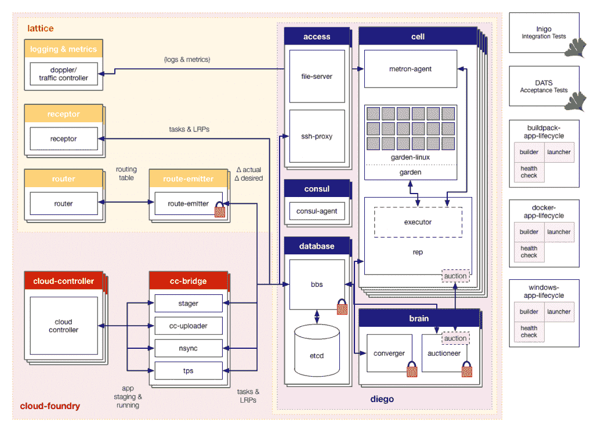

# Cloud Foundry 的 Lattice 和 Diego 简化了微服务

> 原文：<https://thenewstack.io/microservices-made-easier-cloud-foundrys-lattice-diego/>

微服务最近已经成为软件开发和运营界的热门话题。随着越来越多的软件开发团队考虑使用微服务，编排大型容器组以同时运行多个服务的需求变得至关重要。

在 9 月份的 SpringOne 2GX 上，Cloud Foundry 平台工程师 Matt Stine 谈到了 Cloud Foundry 的 [Diego](https://github.com/cloudfoundry-incubator/diego-release) 与 Lattice(两者都是开源的)如何合作，以提供一种新的简化方法来管理 Cloud Foundry 环境中的微服务。

Diego 为基于容器的工作负载提供调度。它可以用于管理单个任务和长时间运行的进程(LRP ),甚至是那些无限期运行的进程，比如数据库系统。Lattice 是一个轻量级的、基于集群的工作负载管理器。Lattice 还包括[日志收集器](https://docs.pivotal.io/pivotalcf/devguide/deploy-apps/streaming-logs.html)，用于编译运行容器的健康和状态日志。

这些组件共同构成了一个用于管理大量微服务的完整平台，没有陡峭的学习曲线。

## 行动的智囊

网格集群由运行独立容器(称为单元)的虚拟机组成。这些单元是分布式系统，可用于在一个容器内执行任务，并由 Diego 控制的软件监控，该软件称为大脑，能够将工作负载调度到单元上，并协调它们的功能。

所有细胞都受到大脑的监控，以确保服务持续运行。性能不佳或完全失败的单元会在其他地方重新平衡其工作负载，以确保整体系统正常运行时间保持一致。Diego 使用一个公告板系统(BBS)来跟踪反映系统当前运行情况的基线，以及在生产中构建、测试或运行应用程序所需状态的一组规范。

大脑有一种不同寻常的分配工作负荷的方法。它根据系统中可用的资源将特定容器的工作负载拍卖给单元。这个功能被称为拍卖人，它为细胞提供了投标运行任务或 LRP 的权利的机会，从而成为任务的代表。

bid 是一个报告行，基于虚拟机 CPU 提供的可用资源。然后，拍卖人从格子中收集出价，用一种独特的算法进行评分，并根据这些变量选择获胜者。获胜的单元运行工作负载。

图为:迭戈概览。

单元代表受到限制，因为他们只能运行任务 API 告诉他们的内容。指令通过 JSON 格式的消息传递。单元代表与执行器通信，然后执行器运行所请求的动作。

Lattice 与名为 [Garden、](https://github.com/cloudfoundry-incubator/garden)的容器编排器配合得很好，后者适用于那些运行基于 Linux 的系统。Garden 用 Go 编写，它为用户提供了使用基于 Linux 的后端使用 [BOSH 部署花园容器的能力。](https://github.com/cloudfoundry-incubator/garden-linux/)

由于 Garden 是一系列 Go 接口，在部署第一个 Garden 容器之前，在 Linux 上运行它需要一些主动设置。 [BTRFS Tools](https://packages.debian.org/sid/btrfs-tools) 使得设置回送变得简单，允许开发者构建并测试他们的花园容器的功能。

为了进一步增强一个人的开发栈，可以提供一个[管理员 RootFS](https://github.com/cloudfoundry/stacks) 。Warden 是容器管理的一个关键组件，因为它提供了一个简单的 API 来处理实例化环境。Diego 与 Garden API 紧密配合，协调运行在容器中的名称空间和流程。要求工作负载的特定任务不知道它正在 Linux 上运行，这使得在利用 VM 环境进行开发时设置变得简单。

Cell 代表可以要求 Garden 以独立于任何特定平台的方式在容器上运行任务。Lattice 在旋转容器之前更深入地研究了围绕要运行的任务的细节，这允许 Lattice 集群的层从其他层中独立出来。这为开发人员带来了更大的灵活性，因为开发人员可以更新要运行的任务或分配新的 LRP，而无需更改单独的名称空间。

## Lattice 和 Diego 工作负载管理

当任务被提交给 Diego 时，BBS 会尝试尽可能地将集群的期望状态与当前集群的实际状态进行匹配。

当事件被安排，迭戈的接收器通知 BBS 期望的工作量。单元代表通知 BBS 实际的工作量，并捕获和存储其他事件。当运行多个微服务时，有时事件需要更长的时间来运行，或者返回用户数据。Lattice 使用轮询来评估系统的状态，以便尽可能好地协调工作负载的期望状态和当前的实际操作状态。

大脑的另一个功能，称为聚合器，它的工作是使工作负荷的实际状态尽可能接近理想状态。它还通知单元代表可以停止的任务，同时指示拍卖人开始联系单元代表对新工作负载进行投标。

## 按比例使用晶格

作为一个容器调度器，Lattice 不仅适用于较小的实例，还可以用于部署多个集群，方法是使用 [Terraform](https://terraform.io/) ，这是一个用于配置和启动大规模基础设施部署的工具。

使用 Lattice 和 Diego 需要设置一个虚拟机。如果不在 Lattice 命令行界面中工作，开发人员可以使用 X 射线。CF dashboard 以可视化方式构建特定的集群。x 射线将显示那些有工作负荷启动的集装箱的脉冲单元。负载平衡将在不同的容器之间共享。

随着更多的电池被启动，可用电池的数量将超过所需电池的数量。Lattice 还允许用户部署单个集群，这样就不会有严格的访问控制占用用户为获得部署、调试或管理活动集群的许可而进行开发的时间。

Lattice 是一种使软件开发人员能够同时完成许多任务的结构，它是一组脚手架，用户可以在其上运行适用的微服务，包括大型服务器、面向用户的应用程序、NoSQL 或 SQL 数据库等等。根据用户的需求，Lattice 既可以用于企业级，也可以用于希望尝试使用微服务进行应用管理的小型团队。

特征图片:[保罗](https://www.flickr.com/photos/paulslab/)的[铬矾晶体](https://www.flickr.com/photos/paulslab/4385244497)在 [CC BY-SA 2.0](https://creativecommons.org/licenses/by/2.0/) 下获得授权。

<svg xmlns:xlink="http://www.w3.org/1999/xlink" viewBox="0 0 68 31" version="1.1"><title>Group</title> <desc>Created with Sketch.</desc></svg>