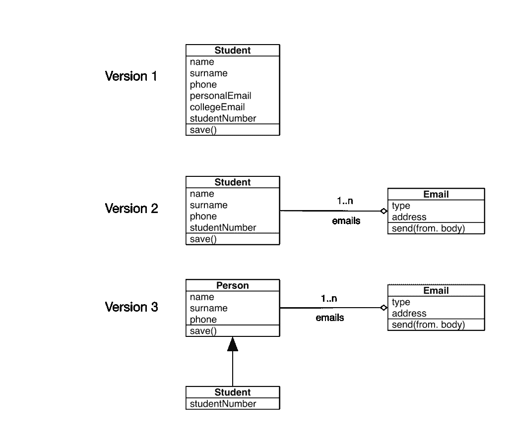
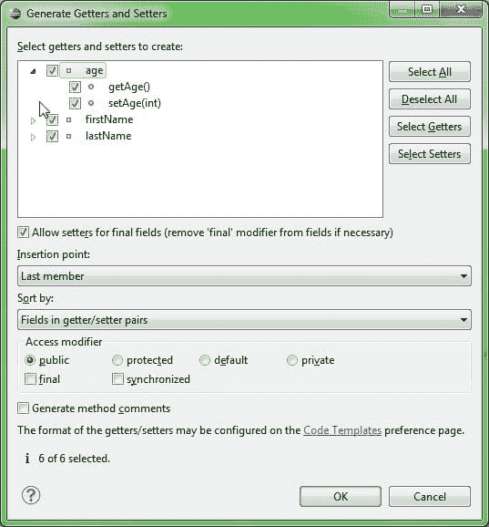
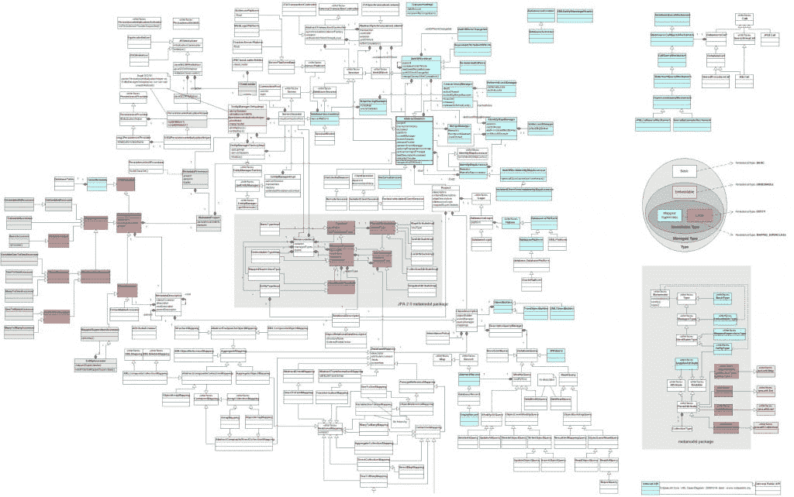
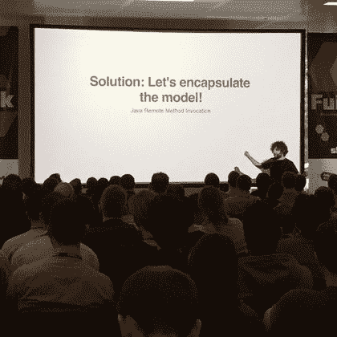
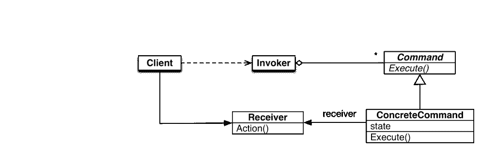
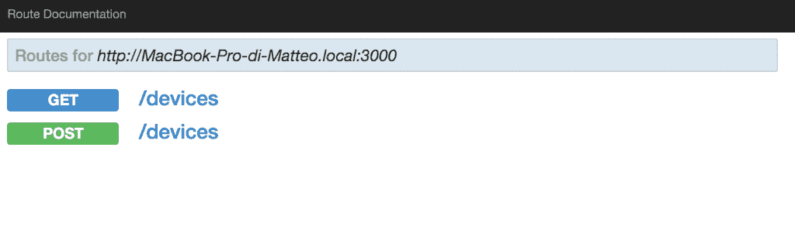
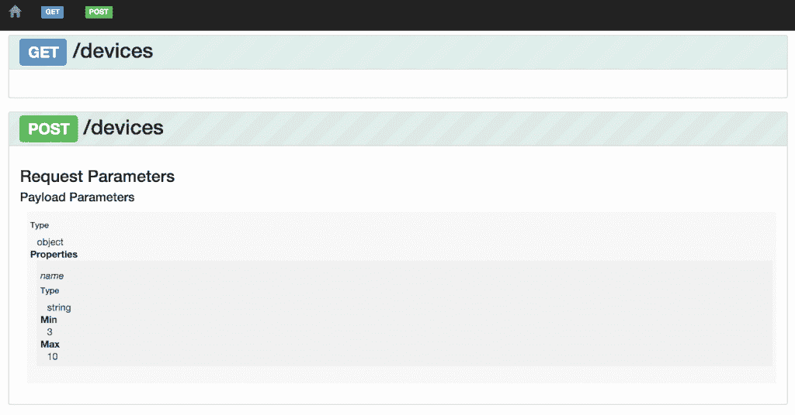

# 如何用 Node.js 做微服务

> 原文：<https://thenewstack.io/microservices-node-js/>

编者按:

[Matteo Collina](https://www.linkedin.com/in/matteocollina)

nearForm 的软件架构师将在

[Node Interactive](http://events.linuxfoundation.org/events/node-interactive)

下周在俄勒冈州的波特兰。我们问他对微服务优势的看法，以及 nearForm 如何实现它们。

马特奥·科利纳

Matteo 拥有 9 年的软件行业经验，是全球 Node.js、物联网和开源软件社区的知名人物。他在 2010 年开始使用 Node.js，到目前为止，已经发布了近 150 个 Node.js 模块。他还是《JavaScript:最佳实践》一书的合著者(FAG 米兰，2013)。

曾几何时，我在父亲的腿上学编程(没错，那时候我还小)。那时候，我并不太担心建筑。我只是想写视频游戏，这样我就可以玩了。后来，我在大学学习软件工程、数据库和编程，多年来，我的教授们多次重复一个例子。

第一年，他们让我写一个学生类对象。在我的工程课程中，当我们学习统一建模语言(UML)时，他们让我为大学的 IT 系统建模。在我的数据库课程中，我们讨论了实体-关系模型和同一个大学 IT 系统的相关查询。下面的例子使用了这个系统。(所有开发人员都知道，UML 是有史以来最漂亮的编程语言……)

[](https://thenewstack.io/wp-content/uploads/2015/12/Figure1.png)

学生班。

任何大学制度的第一个版本都是学生班。一个学生类包含一个名字，一个姓氏，一些电子邮件地址，它有保存自己的关键责任。我大学的教授不会因此给我一个好分数。事实上，我将不得不迭代到版本 2，分离出一个电子邮件类(它负责发送电子邮件！)然后通过引入 Person 类迭代到版本 3。

我们的 Person 类是任何模型-视图-控制系统(比如 Ruby on Rails、Django、Loopback、Spring MVC)的关键组件:模型。模型可以被保存、加载和持久化；他们对开发人员隐藏数据库。我们开发人员不喜欢数据库，所以我们试图将它们包装在我们可以轻松使用的良好抽象中。在过去的二十年里，我们更喜欢用对象和类来建模我们的应用程序，但是我们应该提醒自己什么是对象。

在软件中，对象由状态和它们的行为组成。在大多数语言中，这些行为被实现为字段和方法。字段(或属性)包含状态，方法(或函数)执行依赖于对象内部状态的操作。一个类只是一个对象类型的规范:学生类的所有实例将共享相同的属性和方法。

对象为开发人员提供了五个主要工具:封装、访问器、抽象、继承和多态。封装极其重要，事实上我们根本不需要对象——我们可以只使用闭包。访问器对于访问封装的值非常有用。我相信当我还是一名 Java 开发人员时，我花了几周时间来编写访问器向导。

访问器对于提供计算值是必要的，但是通常很难分布(我们应该序列化值还是不应该？那是 JSON.stringify 挑的吗？).继承、抽象和组合导致了 UML 术语中的大量类图；然而，那些图很少传达类之间正在进行的交互，以及在那里捕获了什么业务逻辑。

[](https://thenewstack.io/wp-content/uploads/2015/12/Figure2.jpg)

在 Eclipse 中创建 Java 访问器。

围绕对象这个概念实现了几个系统之后，就可以确认对象真的好了。然而，对类之间的交互进行建模会导致系统变得非常复杂难以理解。事实上，围绕类的推理使得分布式系统极其复杂；它们很难移除，并且很难提供对运行在不同内存空间(或进程)上的实例的引用。过去，我们开发了 Java RMI、CORBA、SOAP(也称为死星)以及某种程度上甚至 REST。

[](https://thenewstack.io/wp-content/uploads/2015/12/Figure3.jpg)

一个巨大的类图

我在上一段中提到的所有远程技术都有相同的基本原理:有一个公共 API 可以通过网络获得，客户端向它发送消息。API 有好有坏。好的 API 是文档的一种形式，而坏的 API 是为了分发软件的唯一目的而创建的。我坚信，为了写代码而写代码，纯粹是技术债。这对我们的成品没有什么价值。事实上，我是一个懒惰的开发人员，我认为没有代码比任何代码都好(因为我们不需要维护它！).我建议大家[观看这个演讲](https://vimeo.com/108441214)。

也许我们做错了。我们一直在设计模型和类，但也许我们应该对消息和交互建模。创造了术语“[面向对象编程](https://en.wikipedia.org/wiki/Object-oriented_programming)的艾伦·凯(Alan Kay)说:“制造伟大且可增长的系统的关键更多的是设计其模块如何通信，而不是它们的内部属性和行为应该是什么。”

[](https://twitter.com/Cianomaidin/status/659016995363508224)

设计消息交换而不是类可以让我们更清楚地表达代码的商业价值。事实上，上图代表了一个只有很少职责的库:以一般的方式存储、获取、更新和删除一个实体。过去，我用那个巨大的图书馆来坚持我的学生模型。

我们如何定义 2015 年和(即将)2016 年的一个消息？我们可以想象它由地图、数组、字符串和数字组成——换句话说，是一个 JSON。然而，JSON 并不完整，因为它排除了二进制数据和数据流。JSON 目前是通过网络发送数据的行业标准，但是我们可以使用 msgpack 之类的替代方法来处理二进制数据。这里显示了一个消息的例子:

```
{
  person:  {
    name:  'Matteo'
    surname:  'Collina'
  }
}

```

事实上，我们可以使用 Node.js 回调样式轻松实现该消息的接收者:

```
recipient(message,  function  (err,  result)  {
  console.log(err,  result)
})

```

我们如何知道谁是接收者？我们可以设计一个类似于 Java RMI 或 death* service registries 的系统，但是这些方法在实践中都行不通。一个完全不同的解决方案是将该消息的意图编码在消息本身中:

```
{
  role:  'person',
  cmd:  'save'
  person:  {
    name:  'Matteo'
    surname:  'Collina'
  }
}

```

因此，我们已经定义了我们的信息。现在我们需要实现作用于消息并产生一些输出的逻辑。这是四人组的[命令模式的直接实现。我们的回调充当接收者，选择正确接收者的逻辑是调用者。我们可以使用一个巨大的开关/case 或者一个巨大的 if/else 来实现。但是我们可以做得更好:我们可以使用模式匹配:](//books.google.com/books?id=6oHuKQe3TjQC&redir_esc=y)

[](https://thenewstack.io/wp-content/uploads/2015/12/Figure7.png)

UML 的命令行模式。

模式匹配是函数式和声明式语言中常用的一种技术；比如 Erlang 和 Prolog 中的 core。非函数式语言中的模式匹配很棘手，但是在 nearForm，我们开发了两个库来做这件事:patrun 和 bloomrun。下面是一个如何使用 bloomrun 的示例。

```
var  i  =  bloomrun()

i.add({  cmd:  'save'  },  function save  (arg,  cb)  {
  alert('saving '  +  JSON.stringify(arg))
 cb(null,  true)
})

var msg  =  {
  cmd:  'save',
  person:  {  
    name:  'matteo'
  }
}

i.lookup(msg)(msg,  console.log)

```

我们将这种编写软件的方式称为微服务，我们为它编写了自己的框架:Seneca.js. Seneca 具有多种传输方式，从裸 TCP 到总线。它允许你构建一个整体，然后将它拆分成多个进程，而无需编写任何支持远程访问的代码。

在 Seneca 中，我们可以开始编写一个简单的脚本来调用它自己(参见这里的代码)。这是一段简单的代码，它将“设备”——有名称和属性的东西——存储在一个假的内存数据库中。不需要复杂的 ORM。这段代码并不真正可重用，所以我们可以把它拆分成一个 Seneca 插件(参见代码[这里](https://github.com/mcollina/we-are-not-object-oriented-anymore-demo/blob/plugin/devices.js)和[这里](https://github.com/mcollina/we-are-not-object-oriented-anymore-demo/blob/plugin/standalone.js))。事实上，我们可以使用 Seneca 的远程功能在网络上公开它并远程调用(参见此处的[和此处的](https://github.com/mcollina/we-are-not-object-oriented-anymore-demo/blob/standalone/client.js)和)。更重要的是，由于 [Chairo](https://www.npmjs.com/package/chairo) ，它与[哈比神](http://hapijs.com/)高度集成，因此我们可以通过标准的 REST 调用[来提供微服务，从而改善与其他团队的沟通](https://github.com/mcollina/we-are-not-object-oriented-anymore-demo/blob/hapi/server.js)。

最后，我们可以使用 lout [自动创建 API 文档](https://github.com/mcollina/we-are-not-object-oriented-anymore-demo/blob/master/server.js):
[](https://thenewstack.io/wp-content/uploads/2015/12/Figure41.png)[](https://thenewstack.io/wp-content/uploads/2015/12/Figure5.png)
在 FullStack 伦敦和 MuCon 大会上，我做了一个现场演示，大家可以在这里观看。此处有滑梯板[。](https://github.com/mcollina/we-are-not-object-oriented-anymore-demo)

<svg xmlns:xlink="http://www.w3.org/1999/xlink" viewBox="0 0 68 31" version="1.1"><title>Group</title> <desc>Created with Sketch.</desc></svg>