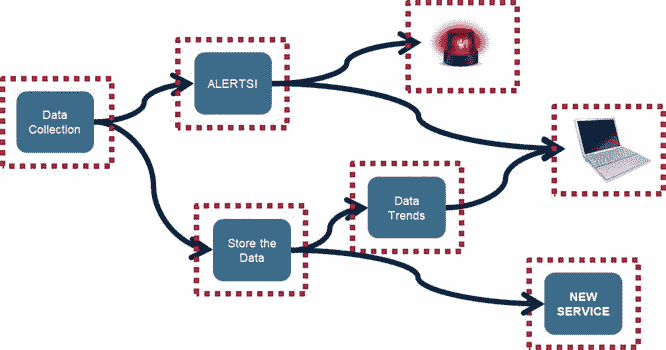

# 为什么在容器中运行的微服务需要一个流平台

> 原文：<https://thenewstack.io/microservices-running-containers-need-streaming-platform/>

 [保罗·柯蒂斯

保罗·柯蒂斯是 MapR 的首席解决方案工程师。微服务架构受益于容器的灵活性，可方便、可预测地部署应用程序，而持久、高性能的消息流使两者都能更好地工作。](https://mapr.com/) 

软件开发的最新趋势导致更多地使用[微服务](/category/microservices/)和[容器](/category/containers/)现在使得一些经过验证且非常流行的架构不适合当今的许多应用。

公平地说，这些体系结构中的一些，比如进程间通信(IPC)和共享内存，对于能够在单个服务器上运行的应用程序来说仍然工作得非常好。而其他的，比如面向服务的架构(SOA)和表述性状态转移(REST)，对于许多需要分布在多个服务器上的应用程序来说已经足够好了。

但是，对于越来越多的应用程序被实现为容器化微服务的编排管道，需要一种更强大、更通用的服务间通信技术。这项新技术必须满足两个目标:超越传统架构每秒 100 或 1000 个事务或事件的限制；并轻松实现微服务架构的诸多优势。

本文探讨了微服务所需的数据管道中遇到的一些潜在陷阱，并评估了流平台作为一种专为容器化微服务构建的新技术。

## 数据管道陷阱

理想情况下，每个微服务都可以以完全独立的方式开发，而不直接依赖于任何其他微服务。事实上，正是这种独立性使微服务成为如此强大的架构，因为它使独立的软件开发团队能够使用任何最有效的开发环境来持续地——并且独立地——优化他们各自的服务。

执行良好的微服务架构的优势包括更高的敏捷性和可伸缩性、简化的开发和测试环境、新功能和增强功能的集成破坏性更小，以及更精细的服务监控和故障排除。

容器已经成为运行微服务的理想技术。通过最小化或消除开销，容器可以有效地利用可用的计算和存储资源，使它们能够为任何应用中所需的所有微服务提供最佳性能和可扩展性。容器还使微服务的开发不需要专用的开发硬件，几乎在所有情况下都只需要一台个人电脑。

问题是:与传统架构相比，在容器中运行的微服务对服务间通信的需求要大得多，这可能会带来各种问题，从较高的延迟导致的低性能，到数据或状态丢失导致的应用程序级故障。这种潜在的缺陷或多或少地困扰着每种传统体系结构，它们都在努力扩展容量和/或吞吐量，以应对数据量和速度的持续增长。

即使是相对简单的物联网应用程序也需要多个服务同时相互通信。

考虑图中所示的典型物联网(IoT)应用。正在收集的数据必须同时采用两条不同的路径，一条用于实时警报，另一条用于历史分析，然后汇集到一个通用仪表板上。如果没有服务间通信的有效和一致的方法，这个简单的例子就有破坏服务级独立性的危险，无论涉及的任何服务发生变化，或者添加新的服务。

冒着过于简化的风险，在不同的服务之间传递数据和/或消息有两种基本方法:排队和发布-订阅。通过排队，数据由一个服务发送，由另一个服务接收，这提供了良好的安全性并保留了事务状态，但可能会使其难以扩展或实施，即使是像这种用于物联网的简单应用程序。通过发布/订阅(pub/sub ),数据从发布服务进行广播或流式传输，从而使多个订阅服务可以同时使用该流。

此外，让不同的微服务使用有状态的消息或事件的能力需要在管道中移动的数据类型和结构上有一定的灵活性。发布/订阅流平台不强制任何特定的数据类型或模式，这种不可知论使得软件开发者能够选择最适合他们的应用或服务的任何数据类型和/或结构。

这两种基本方法最近结合起来，创建了一个分布式流媒体平台，以安全和可扩展的方式支持多个发布者和订阅者，并且易于与容器化的微服务架构一起使用。

## 吻:用溪流保持简单

“分布式流媒体平台”一词最早用于描述 Apache 基金会的 Kafka。这个开源软件的贡献者，通常在博客中使用，将它描述为具有三个重要的能力:

1.  以类似于消息队列或消息传递系统的方式发布和订阅消息流。
2.  以容错方式存储或保持消息流。
3.  实时处理出现的流。

表征这些能力的另一种方式是让流媒体平台变得活跃、持久和高效的三个 P。无处不在意味着任何微服务都能够在流中发布数据和/或消息，并且任何微服务都能够接收或订阅任何流。持久化意味着不需要每个微服务都确保它发布的数据流被正确存储。这有效地使流媒体平台成为一个记录系统，所有数据都可以根据需要轻松复制和重放。*高性能*意味着所涉及的轻量级协议能够在每个容器化的微服务中每秒处理 150，000 条记录，并且这种吞吐量可以通过添加更多容器来水平扩展。

发布/订阅流平台的一个主要优势是所有通信的“解耦”特性。这种分离消除了发布者跟踪(甚至知道)任何订阅者的需要，并且使得任何和所有订阅者都可以访问任何发布的流。结果是能够添加新的发布者和订阅者，而没有任何中断任何现有微服务的风险。

应用层管道是通过简单地将多个微服务链接在一起而创建的，每个微服务订阅它执行指定服务所需的任何数据流，并且可选地，发布它自己的流以供其他微服务使用。扩展应用程序以处理更大的数据量，只需为微服务造成的任何瓶颈启动额外的容器。

它的简单性使得流媒体平台如此强大:

*   提供能够支持最苛刻应用的单一解决方案，
*   利用单一 API 进行“订阅”和“发布”，
*   支持任意对任意连接，同时保持微服务之间的独立性，
*   提供与容器的兼容性以促进缩放而无需创建新图像，
*   运行可靠，最大限度地减少问题，从而减少故障排除的需要。

在上面的物联网示例中，流媒体平台由连接容器化微服务的箭头表示。请注意每个微服务如何能够发布和/或订阅多个微服务，以及如何在不中断任何现有服务的情况下添加新服务。还要注意“流数据”和“流平台”之间的区别，后者很容易适应前者，就像本例中微服务对所有“事物”进行的数据收集一样。

其中最具挑战性的应用是面向消费者的 web 服务，一个分布式流平台最近成功用于一个特别苛刻的应用中，该应用要求每小时处理高达 2000 万个事务，并在三个地理位置分散的数据中心(一个在现场，两个在云中)之间进行 100%透明和无损的故障转移。该应用程序是通过在所有三个数据中心中运行的相同 Docker 容器映像之间并发流动的流，以及由底层文件系统提供的双向主对主数据库同步来实现的。

## 入门指南

分布式流平台在字面上和象征上都是实现微服务架构承诺所需的“缺失环节”。它将消息传递、存储和流处理结合在一个轻量级的解决方案中。它提供了容器化微服务所需的普遍、持久和高性能的连接。它非常容易使用“愚蠢简单”的 API 来读写流。

通过将容器化微服务架构的优势与流平台提供的简单而强大的消息传递相结合，组织将能够极大地提高构建、部署和维护数据管道所需的灵活性，从而实施要求最苛刻的应用程序。

这项技术非常有前途，现在各种商业产品正在将流媒体平台与其他理想的功能(如数据库、共享存储、文件系统复制和安全性)一起集成到他们的架构中。结果是通过开放 API 实现了针对容器化微服务架构而优化的完整解决方案。

开始的一个好方法是使用 Kafka 或包含流媒体平台的商业解决方案进行试点。虽然流媒体平台在分布式环境中运行良好，但最初可以将试点限制在一台服务器上，以最大限度地降低复杂性，然后根据需要扩展到本地集群或云中的多台服务器。如果试验是为了转换一个现有的应用程序，最好替换所有的服务间通信，比如那些使用 RESTful API 的通信，一次一个，也是为了最小化复杂性。

有了试点应用的典型选择，对于这种强大而又易于使用的技术，应该很快就能熟练掌握流媒体平台。

<svg xmlns:xlink="http://www.w3.org/1999/xlink" viewBox="0 0 68 31" version="1.1"><title>Group</title> <desc>Created with Sketch.</desc></svg>