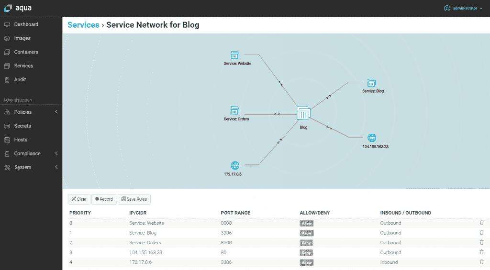

# 微服务安全:可能不是你想的那样

> 原文：<https://thenewstack.io/microservices-security-probably-not-what-you-think-it-is/>

这篇文章是探索微服务基础的系列文章的第四篇。请每周一回来查看更多的分期付款。

如果你正在阅读这篇文章，那么你现在可能已经知道微服务是如何在构建或部署应用程序时，作为一种优雅的方式来打破单一架构的束缚。但是除了像网飞这样几年前就开始探索这个领域的先行者之外，微服务对你的组织来说可能是相对较新的东西。对许多人来说，防范网络攻击是一个更大的未知数。

微服务在安全方面有优点也有缺点。通过它们各自的 API，微服务可以单独重新配置和更新，而不会中断可能依赖许多微服务运行的应用程序。然而，微服务也为每个应用程序提供了许多独立的 API 和端口，当然，这也为入侵者提供了许多尝试访问应用程序的机会。虽然微服务在应用程序中的隔离和独立结构使它们更容易防御(下面将详细说明为什么会这样)，但微服务也带来了它们自己单独的安全挑战。

“大多数组织中最容易受到攻击的目标是应用程序层，攻击者知道这一点。因此，微服务既让这个问题变得更难，也让维护者更容易，”T4 twist lock T5 的首席技术官约翰·莫雷罗(John Morello)说，“更难，因为随着应用程序的分解，网络相互依赖的数量增加，大多数开发团队本身并不完全了解他们应用程序的连接网络。”

我们从领先的微服务和安全专家那里收集了关于在考虑网络安全时要记住什么的见解，无论您是已经处于一个主要的微服务转换项目中，还是刚刚开始尝试。

## 容器混淆和权力

微服务和容器安全有时会被错误地互换使用，尽管它们是两回事。这可能部分归因于大多数企业在容器上运行微服务的方式。例如，根据 Enterprise Management Associates 的一项研究，63%的受访企业在容器上运行微服务，而另外 30%的企业正计划在未来 12 个月内这样做。当然，与此同时，微服务可以被限制在一个虚拟服务器中，就像它们可以在一个容器中一样。

容器和微服务之间的混淆也可能与容器安全协议如何帮助防止容器内微服务的潜在漏洞有很大关系。

Twistlock 的 Morello 说，事实上，由于微服务经常在容器中运行，它们可以从一些架构优势中受益。“相对于传统系统，容器是声明性的、可预测的和最小化的，”Morello 说。“这意味着现代安全平台可以自动学习这种网状结构并实施它，因此即使存在大量的互连，它们也可以在更少的人工参与下得到更好的划分和控制。”

> 根据分析公司 McKinsey 的调查，最近接受调查的 100 多家公司中有整整 78%在迁移到云时没有重新配置他们的安全工具。

Morello 说，测量和比较观察到的网络行为与微服务预测模型的能力是容器化架构提供的一个关键优势。“虽然理论上可以为传统的非集装箱化服务创建一个参考模型，但这在实践中几乎不可能大规模实现，”Morello 说。“很少有开发人员真正理解复杂应用中的所有网络依赖关系，更少有人有时间手动将这些交互编入外部系统，并随着应用的发展随时维护这些定义。容器使机器学习这些网络流变得切实有效，这一事实是一个基本的安全优势，使更严格定义的、应用定制的网络策略能够大规模使用。”

[MapR](https://mapr.com/) 产品管理总监 [Suzy Visvanathan](https://www.linkedin.com/in/suzyvisvanathan/) 表示，无状态特性可以增加部署和管理微服务的灵活性，也可以应用于容器环境中的微服务安全性。“微服务需要是轻量级的，并根据业务事件和所需的环境以灵活敏捷的方式执行。微服务还需要共享数据的能力，以推动特定用例所需的操作和分析，”Visvanathan 说。“支持这一点的最有效、最安全的方式是通过底层数据结构，该结构可以支持所需的数据访问，同时提供强大的安全性和访问控制。”

Visvanathan 说，将微服务容器化并通过 [Kubernetes](https://thenewstack.io/kubernetes-deployment-security-patterns-ebook-now-available/) 进行管理就是这样一种方式。“每个微服务都保证安全访问，无论微服务在哪里执行，访问方法和安全性都是一致的，”Visvanathan 说。

由于其设计，容器可以作为微服务的优秀安全边界。“容器使您能够将安全性应用于每个单独的服务，这使它们成为微服务的理想选择。不管是什么应用程序，把它放在一个容器里都会增加一层安全性，”[码头](https://www.docker.com/)的高级软件工程师[大卫·劳伦斯](https://www.linkedin.com/in/endophage/)。“我们看到企业间的一个共同趋势是将传统应用程序容器化，因此，除了成本效益和向混合云环境的可移植性之外，还能立即获得强化安全性的好处。”

## 微服务服务清单

考虑到运行在微服务上的应用程序的底层配置与整体架构的底层配置有很大不同，标准的网络安全实践当然是不够的。然而，安全实践要赶上微服务在行业范围内的部署可能还需要一段时间。云部署可以作为一个例子来说明为什么会出现这种情况。

根据分析公司 McKinsey 的调查，最近接受调查的 100 多家公司中有整整 78%在迁移到云时没有重新配置他们的安全工具。同样，调查中列出的企业中的大多数安全标准对于云网络来说是不可持续的。虽然报告中没有提供有关微服务项目的数据，但由此可以推断，至少有一定比例的公司没有针对微服务改进其内部安全实践和协议。

[CloudPassage](https://www.cloudpassage.com/) 的首席技术官[卡森·斯威特](https://www.linkedin.com/in/carsonsweet/)说:“传统的单片应用程序可以在大型容器模型中交付，将应用程序从传统的单片架构转移到微服务需要完全的重构。“正如许多企业在尝试构建私有云时了解到的那样，仅仅因为一项新技术很热门，并不意味着就有足够的工程人才。就微服务而言，需要真正了解微服务的开发人员、QA 工程师和基础设施架构师。”

使用 Aqua 安全防火墙监控微服务点。

Aqua Security 的产品营销副总裁 Rani Osnat 表示，微服务因此涉及应用交付、部署和保护方式的重大变化。关键的安全考虑包括:

*   **动态代码交付和更新:**通过自动化测试，必须检查代码，以确保它在漏洞、恶意软件、硬编码秘密等方面表现出可接受的风险。“老办法是选通一个版本，停下来测试一段时间，等等。不会飞，”奥斯纳特说。
*   **工具:**当使用一套新的管理工具(如 Kubernetes)部署微服务应用时，这一点尤为重要。Osnat 说:“围绕这些工具的知识差距导致了在身份验证、授权、强化和其他最佳实践方面的错误。“我们在这里谈论的是基本卫生。”
*   **从主机环境中抽象:**由于现有的端点和服务器安全工具不具备充分监控微服务所需的访问权限和粒度，可见性和控制成为问题。“因为微服务可以在不同类型的基础设施之间快速扩展和缩减；跟踪他们是一个挑战，”奥斯纳特说。“基于基础设施的方法注定会失败，你必须在部署微服务之前找到一种保护微服务的方法。”
*   **网络:**在寻求保护网络漏洞时，微服务代表了两个世界的最佳选择，因为微服务本质上暴露了应用程序内部更深层次的网络。“机会在于，你可以在微服务级别保护应用，这将阻止攻击比以前更快地传播(在更小的半径内)，”Osnat 说。“另一方面，微服务网络更加复杂和动态，再一次使传统的网络安全工具变得不足。”

有人可能会认为过分热心的安全实践会造成瓶颈，因为应用程序之间的微服务共享被不必要地阻塞了。然而，Redis Labs 生态系统项目负责人 Dave Nielsen 表示，微服务永远不会太紧，尤其是随着合规性法规和政府安全要求变得越来越严格。为什么会出现这种情况的一个例子是欧盟即将生效的通用数据保护条例(GDPR ),该条例将在欧盟贸易区内实施更严格的数据共享限制。

如上所述，微服务安全性在许多方面代表了许多独特且特别困难的挑战。尼尔森说，例如，开发运维团队和安全团队必须特别警惕未经授权的数据访问和不安全的客户端连接，这些会导致中间人泄露和攻击。

“也就是说，在开发/测试阶段严格的安全性似乎有些过头了，”Nielsen 说。"但是在生产过程中，安全永远不够严密."

<svg xmlns:xlink="http://www.w3.org/1999/xlink" viewBox="0 0 68 31" version="1.1"><title>Group</title> <desc>Created with Sketch.</desc></svg>