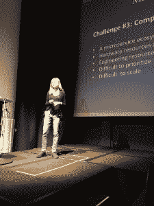
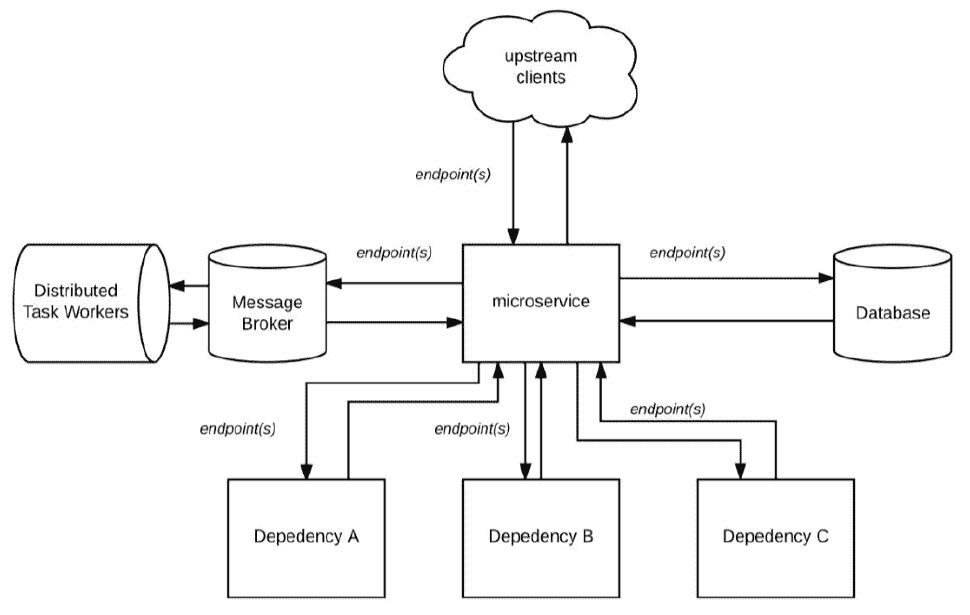
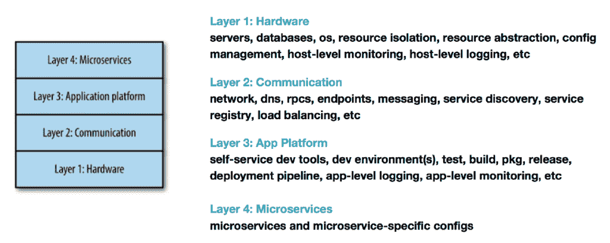

# 每个组织在实施微服务时都会面临的六大挑战

> 原文：<https://thenewstack.io/microservices-standardization-moving-monolith-microservices/>

Susan Fowler-Rigetti 在旧金山的微服务从业者峰会上

Stripe 公司的工程师 Susan Fowler-Rigetti 曾在优步工作，她说，每个组织在尝试大规模实施微服务架构时都会遇到六个问题。她上个月在三藩市的[微服务从业者峰会](https://www.microservices.com/summit/)上详细阐述了它们。

她说，如果你运行的微服务少于 100 个，你或许可以避免这些问题，但将服务扩展到任何更高的水平都会带来一系列问题，需要解决这些问题才能有效运行你的系统。

## #1:组织孤岛和蔓延

与[康威定律](http://www.melconway.com/Home/Conways_Law.html)相反，公司的组织结构将反映其架构。Fowler-Rigetti 说，因此，一家转向微服务的公司往往会以几个微服务团队各自为政而告终。此外，因为没有人知道其他团队在做什么，所以微服务之间没有标准化，最佳实践没有共享，导致技术蔓延。

“微服务开发人员和开发团队变得就像微服务一样，”Fowler-Rigetti 说。“他们非常擅长做一件事，而且只做那件事。”这对特定的团队来说很好，但是当开发人员想要改变团队时，这就成了一个问题。

Fowler-Rigetti 说，她听说有些开发人员已经换了团队，感觉他们好像换了一家公司，因为规则都不一样了。

## #2:更多失败的方式

演示中的这张幻灯片显示了微服务的复杂依赖性。

更大更复杂的系统意味着更多失败的机会，而系统也会失败。他们总会在某些时候这样做。部署了数百或数千个微服务，其中的每一个都可能是故障点。

## #3:资源竞争

Fowler-Rigetti 说，微服务组织就像生态系统，因为它们非常非常复杂，非常微妙。

无论是硬件还是工程资源都是稀缺且昂贵的。也很复杂。与独石不同的是，人们不能只是投入无限的硬件来解决问题或增加员工数量。她说，这在一开始可能行得通，但当你拥有几十个微服务时，它就无法扩展了。

当有数百或数千个微服务时，组织如何进行优先级排序？谁有优先权？谁做决定？

## #4:对微服务的误解

开发人员和管理人员中普遍存在误解，这对于脆弱的微服务生态系统来说非常危险。

最流行的神话是微服务是狂野的西部。你可以做任何你想做的事情，使用任何代码，数据库，编程语言等等。，只要你把工作做好，其他服务都可以靠你。这需要巨大的成本，因为系统最终可能不得不维护多个库和数据库版本。

另一个危险的神话是微服务是银弹，因为它们将解决你所有的问题。不，福勒-里盖蒂说。当微服务达到其扩展能力的极限时，它应该是公司拱门进化的一步——而不是作为一种摆脱工程挑战的方法。

## #5:技术蔓延和技术债务

当开发团队使用不同的语言、单独的基础设施和启动定制脚本来构建微服务结构时，组织最终会拥有一个巨大的系统，其中有一千种方法来做每一件事情。

最终可能会有成百上千的服务，其中一些正在运行，大部分被维护，一些被遗忘。“你有一些脚本运行在某个地方的一个盒子上，天知道在做什么，没有人想去清理它，”福勒-里盖蒂说。“他们都想建造下一个新事物。”

给你一个忠告:没有定制是可伸缩的。

## #6:天生缺乏信任

由于微服务生活在复杂的依赖链中，并且完全相互依赖，没有标准化或通信，因此没有办法确定依赖关系是否可靠。她说，没有办法知道微服务在生产流量方面是否可信。

## 走出混乱

如果你是一个正在向微服务转移的公司的开发人员，这些对你来说都不是新闻。那么如何走出迷宫呢？

福勒-里盖蒂说，第一步是从组织的各个层面获得认同。标准化不仅仅是最佳实践，也是微服务工作的关键。因此，需要在堆栈的所有级别采用和推动它。

接下来，该公司需要“在整个组织中保持所有微服务的高架构、运营和组织标准，而不是基于逐个服务，”她解释道。只有满足这些标准的微服务才被视为“生产就绪”

## 标准化的需要

微服务在堆栈中的首选位置。

Fowler-Rigetti 分享了上面的图表，从微服务的角度显示了微服务环境的级别。微服务团队需要工作的唯一级别是第 4 层[。](http://www.omnisecu.com/tcpip/osi-model.php)

她说，为了让微服务取得成功，其他一切都需要从它们中抽象出来。这将限制技术蔓延并增加责任。

> 很多人认为他们可以免费获得微服务的可扩展性，但当你达到一个疯狂的大规模时，这是不正确的。

接下来，需要对生产准备需求达成共识，这些需求需要成为工程文化的一部分。她说，工程师们经常将标准化视为障碍，但在微服务的新世界中，一切都属于复杂的依赖链，事实并非如此。

任何微服务或一组微服务都不应损害整个产品或系统的完整性。

## 什么使服务成为生产就绪的？

福勒-里盖蒂给出了一个清单:

*   稳定性
*   可靠性
*   可量测性
*   表演
*   容错
*   灾难准备
*   监视
*   文档

Fowler-Rigetti 更详细地研究了这些类别:

## 稳定性和可靠性

有了微服务，会有更多的变化和更快的部署，导致不稳定。她说，一个可靠的微服务是一个可以被其客户、依赖者和整个生态系统信任的服务。她认为稳定性和可靠性是联系在一起的，大多数稳定性需求都伴随着可靠性需求。在生产之前有几个阶段的开发管道就是一个很好的例子。

## 可扩展性和性能

Fowler-Rigetti 说，许多人认为他们可以免费获得微服务的可扩展性，但当你达到一个疯狂的大规模时，这就不是真的了。它们需要能够随着流量的增加而适当扩展。

有些语言不是为高效扩展而设计的，因为它们不支持并发、分区和效率。这使得用这些语言编写的微服务很难适当扩展。福勒-里盖蒂拒绝说出任何具体的语言，但他说，“我相信你能想到一些。”

她解释说，可伸缩性是一个微服务可以处理多少请求，而性能是服务处理这些任务的能力。一个高性能的微服务恰当地利用资源，高效地处理任务，并快速地处理请求。

无法随预期增长而扩展的微服务很可能会导致事件和停机急剧增加。延迟的增加导致可用性差。

## 容错和灾难准备

为了确保可用性这一最终目标，开发人员需要确保微服务发生故障的任何方式都不会导致系统崩溃。所以开发人员需要知道所有的故障模式，并在故障发生时有备份。

她说，强大的弹性测试是成功备灾的关键，包括代码测试、负载测试和混沌测试以及其他主动测试。每一个单一的故障模式都应该投入生产，看看它是如何幸存下来的。

鉴于微服务环境的复杂性和复杂的依赖链，失败是不可避免的。微服务需要能够承受内部和外部故障。

## 监测和记录

“我以一种可怕的方式发现，”Fowler-Rigetti 说，“对于微服务架构，系统的状态从一秒到另一秒都不会相同。如果你不知道系统的状态，你就不会知道系统什么时候会失败，而且它会失败，”她说。

始终显示系统状态的良好监控工具至关重要。停机的第二个最常见原因是缺乏良好的监控。

Fowler-Rigetti 认为，日志记录是监控的重要组成部分，因为你几乎不可能复制一个 bug。知道发生了什么的唯一方法是确保你记录了当时系统的状态。唯一的方法就是通过适当的记录。

这使得信任您的服务变得非常容易。

文档是每个开发人员的祸根，但它是至关重要的。它消除了技术债务，并允许来自其他团队的人或团队的新成员跟上速度。

*查看 Fowler-Rigetti 的书"[生产就绪微服务](https://www.amazon.com/Production-Ready-Microservices-Standardized-Engineering-Organization/dp/1491965975/ref=sr_1_1?s=books&ie=UTF8&qid=1487184502&sr=1-1&keywords=Production-Ready+Microservices)"以获得更多的智慧，包括详细的需求和前进的路线图。*

<svg xmlns:xlink="http://www.w3.org/1999/xlink" viewBox="0 0 68 31" version="1.1"><title>Group</title> <desc>Created with Sketch.</desc></svg>