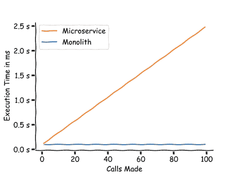
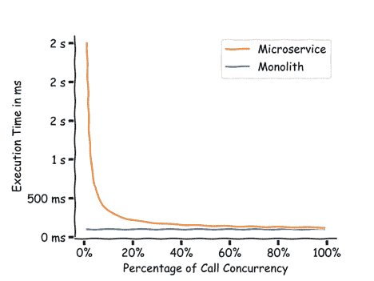
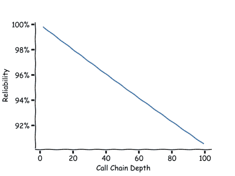
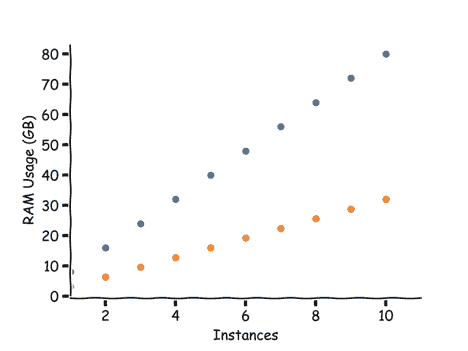
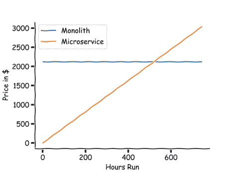
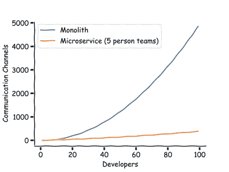
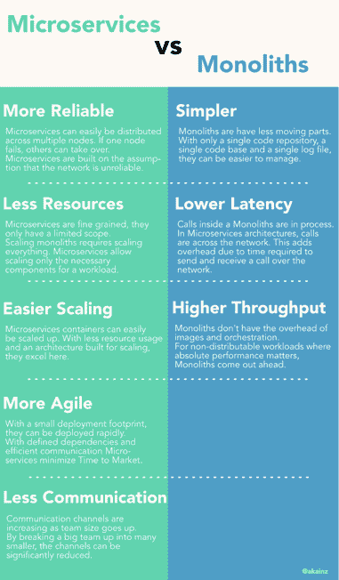

# 微服务与整体服务:操作比较

> 原文：<https://thenewstack.io/microservices-vs-monoliths-an-operational-comparison/>

 [亚历山大·坎因茨

亚历山大·坎因茨已经在里面呆了 20 多年了。Java、Python、JavaScript 和 Smalltalk 是他选择的编程语言。他关注的是企业，尤其是金融业。在他的职业生涯中，他曾在德国、美国、澳大利亚和泰国工作过。他很幸运生活在曼谷，一个他因其活力、多样性和人民而崇拜的城市。他写了自己的兴趣，包括数字化转型、微服务、Rest APIs 和 DevOps。](https://www.linkedin.com/in/kainz/) 

作为对这些所谓的整体架构的反击，微服务架构将业务流程分成多个独立的服务。

例如，在机票预订的上下文中，单一方法包括构建一个具有流程“预订机票”的软件

“订机票”涉及许多单独的过程。可能向航空公司预订机票，如果机票预订成功，向客户的信用卡收费并向客户发送确认信息。

在微服务架构中，各个进程被分解成独立的服务。在上面的例子中，服务可以是订票、卡支付和确认。现在，独立的服务通过定义的接口相互通信。

说微服务架构已经成为主流是一种保守的说法。在我的新闻提要中，我几乎看不到单片架构了——只有在关于从微服务回归单片架构的[文章](https://www.infoq.com/news/2020/04/microservices-back-again/)中。在本文中，我们将这两者对立起来。

两种软件架构风格进入擂台，一种将作为胜利者离开。

## 第一轮:延迟

说到微服务，有一个基本的物理定律在起作用。每当微服务通过网络调用另一个服务时，通过网络发送的字节数。这包括将字节转换成电信号或脉冲光，然后将这些信号转换回字节。根据[这个](https://github.com/Marcuccio/Network-overhead-in-microservices-architecture)环节，一个微服务调用的延迟至少是 24ms。如果我们假设实际处理需要大约 100 毫秒，那么总处理时间如下所示:

网络延迟—微服务与整体服务

理想情况下，所有的调用执行可以同时发生，并且不相互依赖。这被称为扇出模式。下图显示了随着越来越多的调用同时执行，总时间是如何下降的。

并发执行更多的调用意味着总执行时间下降

并行执行所有调用意味着服务将在最长的调用结束后返回给消费者。monolith 没有网络延迟，因为所有的调用都是本地的。即使在一个完美的并行世界中，monoliths 仍然会更快。解决这个问题的方法是减少调用链长度，使用扇出，并尽可能将数据保存在本地。如上所述，使用扇出模式也可以显著提高性能。但最终微服务在延迟方面无法超越物理。

对于 monoliths 来说，这是一个明显的胜利。

## 第二轮:复杂性

当考虑复杂性时，有许多因素在起作用:开发的复杂性，以及运行软件的复杂性。由于开发的复杂性，在构建基于微服务的软件时，代码库的规模会迅速增长。涉及多个源代码，使用不同的框架，甚至不同的语言。因为微服务需要相互独立，所以经常会有代码重复。此外，不同的服务可能使用不同版本的库，因为发布时间表不同步。对于运行和监控方面，受影响服务的数量非常重要。一块巨石只会自言自语。这意味着它的处理流程中有一个潜在的合作伙伴。微服务架构中的单个调用可以命中多个服务。这些可以在不同的服务器上，甚至在不同的地理位置。

在 monolith 中，日志记录就像查看单个日志文件一样简单。但是，对于微服务，跟踪问题可能涉及检查多个日志文件。不仅需要找到所有相关的日志输出，还需要按照正确的顺序将它们放在一起。微服务为每个呼叫使用唯一的 id 或跨度。这使得诸如 Elasticsearch 之类的工具可以跨服务找到所有相关的日志输出。Jaeger 等工具可以跨多个微服务跟踪和分析呼叫。

在 Kubernetes 集群中运行微服务时，复杂性会进一步增加。虽然 Kubernetes 支持自动伸缩等功能，但它并不是一个易于管理的系统。要部署一个 monolith，一个简单的复制操作就足够了。要启动或停止整块石头，通常一个简单的命令就足够了。另一方面，Kubernetes 不适合心脏虚弱的人。与整体架构相比，事务还增加了运行微服务架构的复杂性。跨越服务边界，很难保证数据同步。例如，一个实现糟糕的呼叫重试可能会执行两次支付。微服务架构可以通过使用诸如中央协调器之类的技术来管理这一点。然而，在整体架构中，事务很容易处理，甚至对开发人员是透明的。

就复杂性而言，另一个胜利属于独石。

## 第三轮:可靠性

由于 monolith 中的所有呼叫都是本地的，所以没有网络故障的可能。将此与微服务进行比较。假设一个微服务通过网络调用另一个服务，可靠性为 99.9%。这意味着 1000 个呼叫中有一个会因为网络问题而失败。现在，如果这个服务调用另一个服务，我们得到 99.8%的可靠性。对于深度为 10 个调用的调用链，我们的可靠性下降到 99%，这意味着 100 个调用中有 1 个失败。

随着呼叫链变长，可靠性下降

设计微服务架构时，假设网络会在某个点中断是很重要的。微服务提供了一些解决这个问题的方案。开源的 Spring Cloud 为 Java 提供了透明的负载平衡和故障处理。像 [Istio](https://istio.io/) 这样的服务网格可以实现多语言。网络问题在微服务架构中更经常发生，但由于这是意料之中的，所以它们被设计来处理这些问题。最重要的是，由于网络故障经常发生，微服务已经证明了他们处理这些故障的能力。这确保了在这些问题上没有隐藏的错误。

当微服务集群中的一个服务出现故障时，集群管理器将启动一个替代服务。这使得微服务架构具有高度弹性。网飞创造了一个叫做[混沌猴](https://github.com/netflix/chaosmonkey)的工具，它随机终止虚拟机和容器。这样，他们可以确保系统能够处理生产环境中的停机。独石当然也可以在集群中大规模运行。但是由于他们的规模，一个问题对他们打击更大。很难想象随机重启巨石柱来确保它们能够存活下来。另一方面，最可靠的软件是一个整体，例如工业控制器和飞机飞行控制。绝对有可能建立高度可靠的整体，但是在大规模和云中变得困难。

最终，微服务取得了胜利。

## 第 4 轮:资源使用

如果一个微服务调用使用相同的算法做相同的工作，它将总是比一个整体使用更多的资源。Docker 和虚拟机增加了开销。另一项基准测试发现，在 docker 容器中运行 using 时，连接数量下降了约 8%。映像编排也会消耗资源，日志聚合和监控也是如此。

然而，微服务允许我们更聪明地使用资源，聪明得多。因为集群管理器可以根据需要分配资源，所以实际的资源使用量可能会低很多。看看一个用 20%的代码完成 80%工作的整体，我们可以展示如果我们能够独立地扩展代码的“热”部分会发生什么。例如，如果单块的一个实例使用 8GB，两个实例使用 16GB，依此类推。让我们假设 20%的代码可以并行执行来完成繁重的工作。我们有一个 8GB 的实例，然后是内存使用率为 20%的微服务，即 1.6GB。这意味着两个实例的内存使用率为 9.6GB。下图显示了资源使用率的差异。

单片服务器比微服务需要更多的资源，因为有更多的实例在运行

在边缘情况下，单片服务器可以胜过微服务器。例如，如果一个呼叫传输大量数据。

但在大多数情况下，资源使用率较低，这是微服务的一大优势。

## 第 5 轮:可扩展性

有很多方法可以放大一个整体。可以运行多个实例，并相应地路由请求。或者可以运行多线程或使用非阻塞 IO。对于微服务架构来说，这三个方面都是正确的。但是正如在资源使用中所检查的，它们可以用更少的资源来完成。这意味着每个资源可以处理更多的连接。对于花费在资源上的资金，微服务提供了更多的吞吐量。此外，更精确的缩放是可能的。如果 monolith 正在使用所有的资源，那么处理更多连接的方法是调用第二个实例。如果一个微服务使用了所有的资源，那么只有这个服务需要更多的实例。由于微服务的资源密集程度较低，因此可以节省资源。由于缩放简单而精确，这意味着只使用必要的资源量。管理员可以根据需要让 AWS 或其他云提供商在线或离线。

例如，让我们假设一个 monolith 正在最大的 Amazon Web Services 实例上运行。 **m5.24xlarge** 实例提供了高达 96 个 CPU 和 384 GB RAM。目前的成本也很高，例如，每月 24/7 运行的成本为 2119.19 美元。同样的钱可以购买 12 个**c 5.2x 大型**实例，每个实例有 8 个虚拟 CPU 和 16GB 内存，全天候运行。但是大多数工作负载并不需要 24/7 的资源使用率。相反，资源使用量在特定时间达到峰值，在其余时间保持较低水平。下图显示了这 12 个较小的实例仅在一定时间内运行而不是全天候运行时的成本。

因为专用资源比按小时收费的资源便宜，所以单个实例在某个点上变得更便宜。本例中的时间跨度是 520 小时，或者如果实例 70%的时间都在运行，这个时间跨度大概是 520 小时。

比较 12 个按需微服务容器与一个专用大型整体容器的价格

由于微服务架构更加细粒度，扩展单个服务也更加细粒度。

对于精确的扩展和更好的资源利用，这对微服务来说是一个明显的胜利。

## 第 6 轮:吞吐量

让我们再看一个性能指标。绝对吞吐量。我们已经探讨了网络延迟和并行化之间的关系。吞吐量也存在同样的关系。在无法通过网络并发运行的工作负载中，monoliths 可能会提供更好的性能。数据需要在服务之间发送，而且所有的基础设施都会导致一定的开销。如果工作负载不能扩展到多个实例，一个整体可以提供更高的吞吐量。

由于工作负载高度本地化，并且没有容器、容器编排或服务网格带来的开销，这是 monoliths 的一个优势。

## 第 7 轮:上市时间

人们选择微服务架构的原因之一是上市时间。这是从对某个功能做出商业决策到该功能公开发布之间的时间。由于其尺寸和依赖性，整体式通常更难部署。另一方面，经常或连续部署微服务更容易。一个原因是变化的影响是高度本地化的。微服务应该只公开它们的接口，而不是它们的实现。这意味着开发人员可以在不修改相关服务的情况下更改实现。由于界面也是清晰的，并且可以版本化，因此对它的任何更改都应该有明确定义的影响。对于 monolith，面向对象的编程允许实现接口的分离。但是这需要一个高度自律的团队，不要被依赖于实现的诱惑所欺骗。

再者，微服务更容易测试。由于微服务只覆盖有限的功能集，因此依赖性也较少。有了更少的依赖，测试可以更快地编写和运行。第三，微服务的资源密集程度较低，并且是按规模构建的。这使得微服务可以无缝部署。微服务可以在一部分集群节点上启动。然后，用户可以陆续迁移到新版本。其他迁移策略包括同时运行旧版本和新版本。如果出现问题，这允许快速回滚到旧版本。微服务的细粒度架构允许更快、更健壮的部署。这减少了从想法到生产部署的时间。

微服务胜出。

## 第 8 轮:沟通

微服务往往以开发团队的规模来定义。例如，亚马逊有一个[“两个比萨饼规则”，](https://www.theguardian.com/technology/2018/apr/24/the-two-pizza-rule-and-the-secret-of-amazons-success)，在创建一个对应于大约 4-8 人团队规模的微服务所需的时间内，一个开发团队可以“被喂以两个比萨饼”。背后的想法是，沟通仅限于团队。团队只需要通过服务接口进行交流。

早在微服务理念诞生之前，Fred Brooks 就写了开创性的书[《神话人月》。](https://en.wikipedia.org/wiki/The_Mythical_Man-Month)这本书的一个要点是，沟通渠道的数量随着团队成员的增加而增加。两个人的团队，只有一个沟通渠道。四个人可以收看六个频道。第一个人和第二、第三和第四个人交谈。第二个人和第三和第四个人交谈，第三个人和第四个人交谈。通信通道数量的公式为 n(n1)/2。

一个有 20 名开发人员的团队有 190 种可能的沟通渠道。将这些开发人员分成两个团队大大减少了沟通渠道的数量。如果我们以 20 名开发人员的团队为例，将其分成四个微服务团队，每个团队有五个人，那么每个团队有 10 个沟通渠道。而四个团队之间的沟通渠道只有六个。沟通渠道总数为 46 个，大致是 20 人团队的四分之一。下图显示了一个大型团队与单个微服务团队的沟通渠道数量。

随着团队总规模的增长，整体通信渠道与微服务通信渠道

在大约 10 个开发者的情况下，微服务模式显示出比传统模式明显的优势。在 50 名开发人员的团队中，沟通渠道的数量几乎是这个数字的 10 倍。在如此规模的团队中工作过的每个人都可以证明，很多时间都花在了沟通上。单独召开一个有 50 名开发人员参加的会议将会是一次低效的练习。任何超过 10 名开发人员的开发项目都可以通过分成更小的团队来更好地完成。微服务是这方面的理想选择，因为它们沿着服务边界有定义良好的接口。

微服务的又一次明显胜利。

## 谁是赢家？

结果出来了。monolith 赢了两次，microservices 赢了三次。

然而，当看这张图表时，请记住这是相对的。例如，微服务只赢得团队规模超过 10 名开发人员的团队沟通。一个由五名开发人员组成的小型创业团队可能会被 monolith 很好地服务。整体式更容易管理，移动部件更少。一个专门的小团队也可以用 monolith 运行每日发布时间表。缩放仅与特定的使用量相关。如果产品每秒钟有几次点击，那么一整块就足够了。此外，如果调用在网络上移动大量数据，性能影响可能会很大，超过其他好处。微服务不是解决所有开发问题的灵丹妙药。以下是微服务架构可能非常适合的一些迹象:

*   要求全天候可靠性
*   扩展到超出几个请求
*   峰值负载和正常负载明显不同
*   10 多名开发人员
*   业务领域可以分成更小的领域
*   寿命较短的操作
*   操作可以表示为 REST 调用或队列事件。
*   没有严格的跨服务事务需求

最终，微服务将成为许多企业软件项目的有力选择。

<svg xmlns:xlink="http://www.w3.org/1999/xlink" viewBox="0 0 68 31" version="1.1"><title>Group</title> <desc>Created with Sketch.</desc></svg>