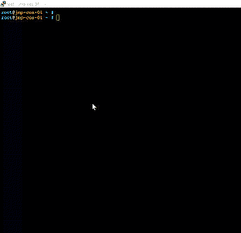

# 微软将英特尔的无状态容器化 Linux 添加到 Azure Marketplace

> 原文：<https://thenewstack.io/microsoft-adds-intels-stateless-containerized-linux-azure-marketplace/>

在另一个时代，微软可能会发布，或者至少是认可一个 Linux 用于它自己的基础设施，这将意味着一个针对信息技术本身的严重阴谋。但是，我们的世界在短短几年内发生了多么巨大的变化的最新迹象是，微软[周三宣布](https://azure.microsoft.com/en-us/blog/announcing-the-availability-of-clear-linux-os-in-azure-marketplace/)将在其 Azure 公共云市场中包括英特尔[的 Clear Linux OS](https://clearlinux.org/) ，使 Azure 成为第一个提供为英特尔 CPU 量身定制的 Linux 的公共云平台。

Clear Linux 加入了 RHEL、Oracle Linux、CoreOS、SUSE 的 SLES、 [Kali Linux](https://www.kali.org/) (一个受安全[渗透测试人员](https://www.concise-courses.com/security/penetration-tester-job/)青睐的发行版)、CentOS 和其他可通过 [Azure Marketplace](https://azure.microsoft.com/en-us/marketplace/) 获得的预配置包。

但与大多数其他发行版不同的是，Clear Linux 旨在用于容器化环境中的[部署](https://thenewstack.io/micro-os-suses-answer-container-os/)——具体来说，包括英特尔的 [Clear Containers](https://thenewstack.io/securing-containers-intels-clear-containers/) 、runc**container runtime 和[KVM hypervisor](http://www.linux-kvm.org/page/Main_Page)。**

此外，Clear Linux 被设计为在无状态环境中运行，特别是从一个容器中运行，其目标是在没有任何预先配置的情况下运行，尽管有管理员驱动的覆盖。

英特尔的 Clear Linux 文档阐明了这种情况:配置管理系统旨在自动执行管理员通常会采取的步骤，以构建一个可行的 Linux 实现。

使用 Clear Linux，一个实例可以在几秒钟内使用新内核重启。

从历史上看，Linux 一直是一个需要适应它在任何特定时间运行的工作负载要求的操作系统。这被认为是 Linux 的优势之一，使它能够被简化，这与 Windows Server 相反，Windows Server 的内核在每次启动时都会根据底层硬件(或虚拟机)的配置进行调整。

然而，在微服务环境中，这种优势对 Linux 来说是一个劣势，在这种环境中，数千个同时进行的配置操作要么是多余的，要么是非常复杂的。

因为微服务的容器无论如何都是短暂的，所以这种预配置很大程度上是不必要的是有争议的。所以 Clear Linux 是为非常短期的操作而设计的，省略了配置步骤，而是在有限的程度上依赖于*虚拟机配置*。Clear Containers 的 2.0 版本使用了 [QEMU，它最初被设计为一个翻译器](http://wiki.qemu.org/Main_Page)，用于在一类硬件上运行的程序，在另一类支持的 VM 中运行。这是运行操作系统的一种方式，就好像它是完全不同的操作系统中的一个应用程序。

关于 Clear Linux，QEMU 为应用程序提供了它在预配置的硬件或预配置的 VM 上运行时所需的支持，而容器中根本没有任何这样的配置。

因此，微软正在让通过 Azure 实现变得可行成为一个非常有吸引力，甚至可能是有竞争力的场景。在这里，任何应用程序(包括为特定 Linux 发行版开发的应用程序)都可以被支持它的服务所改编，在一个中立的容器内运行，以一种 Windows 的形式实现，并针对 Azure 的底层英特尔至强硬件进行优化。

然而，对这种情况的反驳同样令人信服。它来自资深分析师和长期英特尔观察家 [Kurt Marko](https://twitter.com/krmarko) ，他不相信这个场景代表了数据中心运营商积极寻找的环境。

“如果你正在为云部署构建容器化的应用程序，”Marko 周三告诉 New Stack，“我不明白你为什么不使用可用的原生容器服务——例如 Azure Container Service、AWS EC2 Container Service、Google Container Engine——而不是运行你自己的实例和容器运行时。

“Clear Linux 是对用于云操作系统实例的 Windows Nano Server 的一个很好的补充。”他接着说。“但我仍然相信，构建云原生、 [12 因素应用](https://thenewstack.io/12-factor-app-streamlines-application-development/)的开发人员将迁移到原生云服务，用于容器、事件驱动功能(无服务器)、数据库、Hadoop/大数据、机器学习等。，而不是运行他们自己的操作系统实例。我怀疑[*微软的*]Clear 支持更多地是为了提高 Linux 工作负载的性能和安全性，而不是作为一个自己动手的容器平台。”

正如 Dawn Foster 在周三(T1)为新堆栈所做的报告，英特尔对 Linux 内核的贡献占所有供应商对该平台贡献的近 13%，超过 Red Hat 近 5 个百分点。正是[微软在 2015 年末与 Red Hat 签订的历史性协议](https://thenewstack.io/red-hat-foresees-net-unifier-openshift-azure/)为 Windows 的制造商打开了大门，让他们接受 Linux 的存在，不仅在自己的服务器上，也在其支持环境中。

微软去年 11 月正式加入 Linux 基金会，有效地结束了前首席执行官史蒂夫·鲍尔默对该平台的公开争执。从技术上讲，这使得微软成为 Linux 的贡献者。我们想知道，除了明显的 Hyper-V 的 Linux 集成服务(LIS)代理之外，微软是否对英特尔的 Clear Linux 做出了任何值得注意的贡献。

微软发言人在周四早上发布了对新堆栈的回应:“Azure 中的每个 Linux 系统都使用 LIS 和 Azure Linux 代理，我们与所有这些发行版的供应商和生态系统合作。对于 Clear Linux，我们通常与英特尔合作进行各种内核和系统改进，以优化体验。”

CoreOS 和 Red Hat 是新堆栈的赞助商。

专题图片:[Giovanni Dall ' orto](https://commons.wikimedia.org/wiki/File:Civico_museo_di_storia_ed_arte_(Trieste)_-_Ancient_Roman_glasses_-_Photo_by_Giovanni_Dall'Orto,_May_30_2015_-_03.jpg)拍摄的古罗马玻璃器皿照片，在里雅斯特的 Civico Museo di Storia ed Arte[展出，获得维基共享许可。](http://www.museostoriaeartetrieste.it/)

<svg xmlns:xlink="http://www.w3.org/1999/xlink" viewBox="0 0 68 31" version="1.1"><title>Group</title> <desc>Created with Sketch.</desc></svg>