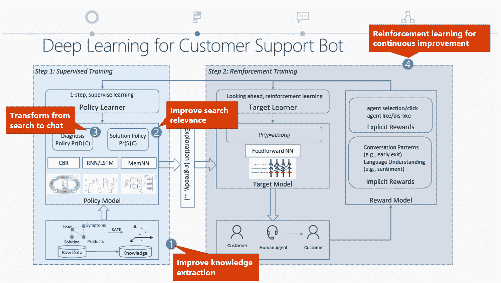
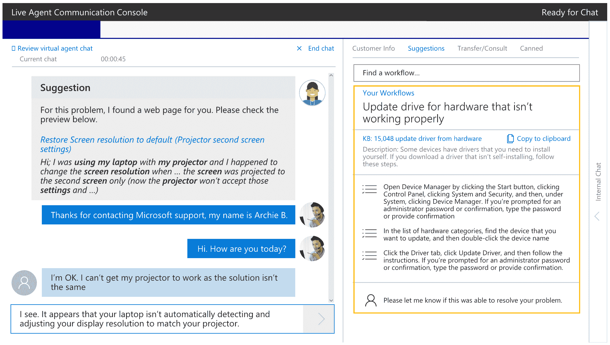
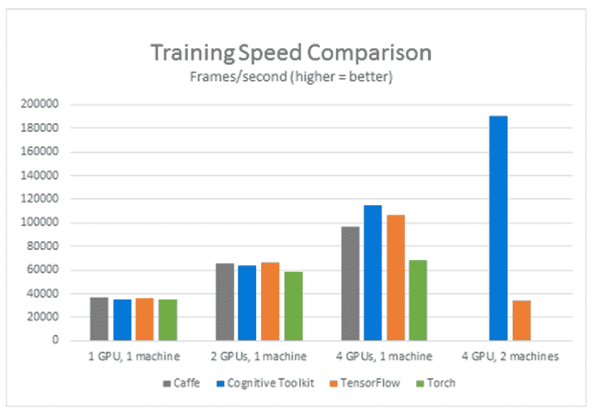
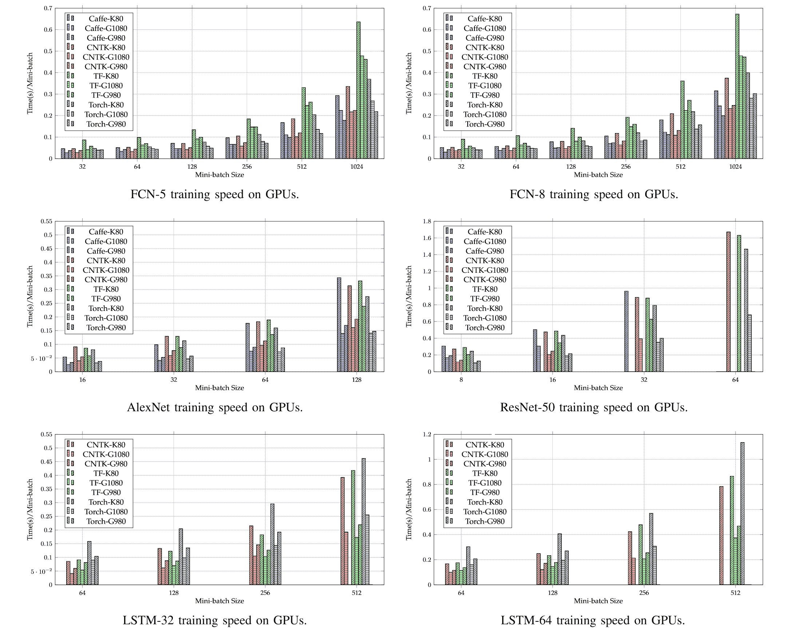

# 微软巩固 CNTK 工业级人工智能深度学习工具包

> 原文：<https://thenewstack.io/microsoft-adds-python-support-cntk-deep-learning-toolkit/>

由于其深度学习工具包，微软正在基于计算机的语音识别方面取得巨大进展。

就在今年 9 月，微软的一个研究团队在[总机语音识别基准](http://recognize-speech.com/acoustic-model/knn/benchmarks-comparison-of-different-architectures)上实现了 6.3%的错误率，这意味着该软件只错误地解释了它“听到”的所有单词的 6.3%。研究人员使用了一种称为长短期记忆的循环神经网络结构。

不到一个月之后，在一个 30，000 单词的库上进行训练，他们能够将错误单词的百分比降低到 5.9%，这与专业转录员在相同的电话录音中产生的错误单词的百分比大致相同。这是第一次计算机能够像人一样识别对话中的单词。

这是“一个历史性的时刻”，首席语音科学家黄说，他于 1993 年在微软成立了语音识别小组。

微软使用的深度学习算法可以在最近发布的微软 CNTK 库第二版中找到，该库以前被称为计算网络工具包[，但从第二版](https://blogs.microsoft.com/next/?p=58244)开始，现在被称为认知工具包

CNTK 2 的测试版提高了性能，让开发人员可以将它与 Python 和 C++一起使用，使其更广泛相关，并获得了一个新名称，以表明微软认为其深度学习框架已经为人工智能研究做好了准备。

“缩写保持不变，但名称反映了我们对认知计算和支持微软认知服务的更高期望。”

“微软的许多人工智能服务现在都是使用 CNTK 创建的。认知工具包是微软创造认知服务的秘密武器，如 Skype Translator 和许多其他人工智能突破，如语音识别，现在已经达到了人类对话语音的同等水平。”

Cognitive Toolkit 最初是一个语音识别框架，不仅使用常见的[GPU 来加速深度学习，而且不同寻常的](https://thenewstack.io/new-mapd-database-system-runs-gpus/)，让你利用多台机器上的多个 GPU 来进行分布式的大规模深度学习。这样，当您处理更大的数据集时，不会损失性能或准确性。

## 准备生产

黄说，随着版本 2 的推出，认知工具包从一个研究工具变成了可以在生产系统中使用的东西。“微软一直将其用于内部工作负载。使用 CNTK 创建的不仅仅是认知服务，还有许多其他生产就绪模型。这是一个经过商业验证的工具，它已经在大型生产系统中得到验证；它不仅仅是一个用来制造玩具问题的工具。”

Cortana 中的语音识别现在是使用认知工具包创建的，Cortana 团队表示，这将他们的生产率提高了近 10 倍。“在他们采用它之前，他们觉得自己是在开一辆大众汽车；换了之后，它就像一辆法拉利，”黄说。

微软的语音服务团队正在使用认知工具包，不仅用于语音识别，还用于创建更准确的声学模型，以便他们可以在聚会、公共汽车或开放式办公室等嘈杂的环境中理解你说的话。他们还使用长短期记忆，这些改进将在 Cortana 和 Skype Translator 中体现出来。

微软将 CNTK 从 Codeplex 上最初仅供学术使用的版本转移到 GitHub 上完全开源的原因之一是将其扩展到语音以外的其他工作负载——从图像识别开始——但不会失去令人印象深刻的性能。语音 API 和[微软认知服务](https://www.microsoft.com/cognitive-services)中的[自定义识别智能服务](https://www.microsoft.com/cognitive-services/en-us/custom-recognition-intelligent-service-cris)(一组 REST APIs，你可以调用它们在你的代码中使用预建的机器学习算法)都是用认知工具包构建的。CRIS 让您创建自己的定制声学模型，通过上传来自困难环境的样本以及转录。

Bing 使用认知工具包来发现搜索词中的“潜在联系”,以找到更好的结果——如果你键入“你如何制作南瓜派”,即使你没有键入，你也在寻找食谱。这种自然语言理解与语音识别截然不同，它需要大量的数据集来处理。

“没有其他解决方案能让我们如此容易地将学习扩展到 GPU 集群中的大型数据集，”Bing relevance 的首席软件开发工程师 Clemens Marschner 说。

自然语言理解也在推动微软正在试验的代号为 Skyline 的新客户支持系统。聊天机器人观察客户所说的话，并建议链接来解决问题；让 25%的试用用户修复他们自己的问题，而不是通常的 12%，这已经足够好了。如果人工代理需要介入解决一个复杂的问题，机器人会总结故障和迄今为止的对话，因此代理不需要再次询问所有相同的问题来惹恼客户。

## Python 和性能

用 Cognitive Toolkit 构建的大多数商业生产模型都是在 CNTK 1 中完成的，但黄指出，“内容是相同的——但我们在 CNTK 2 中有了新的灵活性。”

Cognitive Toolkit 的优势之一是你将深度网络——通常非常复杂——描述为具有输入和输出的有向计算图上的节点的方式；一旦你描述了一个网络，所有学习网络参数的计算都会自动进行。因为你不需要推导梯度或者手工编码变量之间的交互来反向传播，你可以通过组合简单的构建块来创建复杂的计算网络。

[CNTK 1.5](https://github.com/Microsoft/CNTK/wiki/CNTK_1_5_Release_Notes) 中引入的 [BrainScript](https://github.com/Microsoft/CNTK/wiki/BrainScript-Network-Builder) 网络描述语言，可以让你使用中缀运算符、嵌套变量、函数定义、递归函数调用、数组甚至 lambdas 来表达非常深的网络、波束解码等复杂结构。有一个标准组件库，涵盖了最先进的机器学习模型，如用于图像识别的[深度残差网络](https://arxiv.org/pdf/1512.03385.pdf)和用于注意力的[序列到序列](http://papers.nips.cc/paper/5346-sequence-to-sequence-learning-with-neural-networks.pdf)，以及用于深度学习训练的轻松输入文本和语音的阅读器。

现在你可以用 Python 调用所有这些，而不必使用 C++。

“这是过去 CNTK 的一个主要采用障碍，”他解释道。“用 C++做企业 AI；这不是问题，人们熟悉 C++。但是对于开源社区，我们需要 Python，这个测试版提供了原生 Python 支持。这是他们熟悉的语言。Python 更容易理解，更容易评估，它是一种解释性语言。通常，他们已经有了使用 Python 的现有代码，当他们添加深度学习时，他们只是想扩大他们所拥有的，而不是从 Python 切换到 C++。我们第一次以更平衡的方式带来了性能和易用性，因为它可以更有效地集成到其他环境中。”

Python 的支持将使强化学习变得更加容易(因为大多数强化学习库都是用 Python 编写的)。这是一种机器学习的方式，代理学习执行任务的最佳方式——从玩游戏到在空间中导航——使用试错法，并在做对时给予奖励。通常它被用作更复杂的机器学习系统的一部分；Microsoft 客户支持代理使用长短期记忆和其他受监督的深度学习方法，加上强化学习来不断改进其结果。回报可以是人类代理的明确反馈或客户的反应——如果他们感到沮丧，就离开聊天，或者如果信息有用，就感谢机器人。

使用 Python 可以获得同样的性能，使用 CNTK 2 可能会看到性能的提升。

“与之前的版本相比，在 NVIDIA DGX-1 T2 中，它在扩展到 8 帕斯卡 GPU 时提供了近两倍的性能提升，”NVIDIA 加速计算集团总经理伊恩巴克 T4 说。

黄指出，这取决于你升级的是哪个版本。“CNTK 1 几乎每个月都有更新。”1.5 版本引入了一种称为 [Block Momentum](https://ai.icymi.email/tag/block-momentum/) 的并行处理技术，这种技术显著降低了通信成本，因此您可以在跨多台机器的大量 GPU 之间扩展并行训练。在 64 个 GPU 的集群上，性能提高了 50 倍以上。版本 2 是对它的一个改进，尽管如果你已经在使用版本 1.8，性能的提高将是递增的。

然而，认知工具包的表现已经令人印象深刻。[香港浸会大学](http://www.hkbu.edu.hk/)的研究人员正在对最受欢迎的深度学习工具包进行常规基准测试——CNTK、Tensorflow、 [Caffe 和 Torch](http://arxiv.org/pdf/1608.07249v5.pdf) 测试流行的工作负载:全连接和递归神经网络以及两种[卷积神经网络](http://cs231n.github.io/convolutional-networks/)架构、 [AlexNet](http://vision.stanford.edu/teaching/cs231b_spring1415/slides/alexnet_tugce_kyunghee.pdf) 和 ResNet。

“CNTK 2 仍然是分布式深度学习最快的深度学习工具包，”黄声称，“我想强调一下分布式这个词。即使在单个 GPU 上，CNTK 也能在全连接和循环网络上提供最快的性能。在 AlexNet 上，毫不奇怪，Caffe 是最快的；在 ResNet 上，火炬是最快的。但是 CNTK，即使在单个 GPU 上，也是四个中两个最快的工具包。如果将它与 TensorFlow 进行比较，CNTK 现在在所有四种工作负载上都更快——Alex net、ResNet、循环网络和全连接网络，甚至在单个 GPU 上也是如此。当你扩展到一台机器之外时，这就是认知工具包真正发光的地方，因为许多其他工具甚至不能做到这一点；Caffe 只为一台有多个 GPU 的机器设计。CNTK 是性能最快的不可信深度学习网络工具。”

事实上，根据研究人员的说法，最新版本的基准测试表明，“CNTK 与 ResNet 上的 TensorFlow 和 Torch 不相上下”。"至于 RNNs… CNTK 实现了所有可用设置的最佳性能."

对于许多开发人员来说，获得那些多 GPU 系统的最简单方法将是使用英伟达特斯拉 K80 GPUs 的新 [Azure N 系列虚拟机](https://azure.microsoft.com/en-us/blog/azure-n-series-preview-availability/)；它们还在预览阶段，但是你已经可以在上面使用认知工具包了。“事实上，有了 Azure GPU，我们不仅支持 CNTK，还支持 TensorFlow、Torch 和 Caffe，”黄解释道。“如果你想在一台具有多个 GPU 的机器上运行一个小任务，你可以使用其中的任何工具，但是如果你想认真对待大数据，在多台机器上扩展到多个 GPU，CNTK 是唯一一个提供这种性能的工具。”

当 N 系列虚拟机正式上市时，将会有一个已安装认知工具包的图库映像，以及跨多个虚拟机横向扩展的更简单方法。“现在，您必须设置 CNTK 并在一台虚拟机上运行它；您可以管理多个虚拟机，但这很繁琐，您必须使用命令行。随着集成的完成，管理分布式行为将变得更加容易。一旦我们准备好推出整个服务，我们将依靠 [Azure Batch](https://azure.microsoft.com/en-us/services/batch/) 来简化日程安排。Azure GPU 和 CNTK 一起提供了灵活性和易用性；这将为整个人工智能社区提供一个强大的工具包，无论他们做什么，都可以放大人工智能。”

斯蒂芬·昆泽通过 [Unsplash](https://unsplash.com/?photo=v8SjXTTI0GA) 拍摄的特写图片。

<svg xmlns:xlink="http://www.w3.org/1999/xlink" viewBox="0 0 68 31" version="1.1"><title>Group</title> <desc>Created with Sketch.</desc></svg>