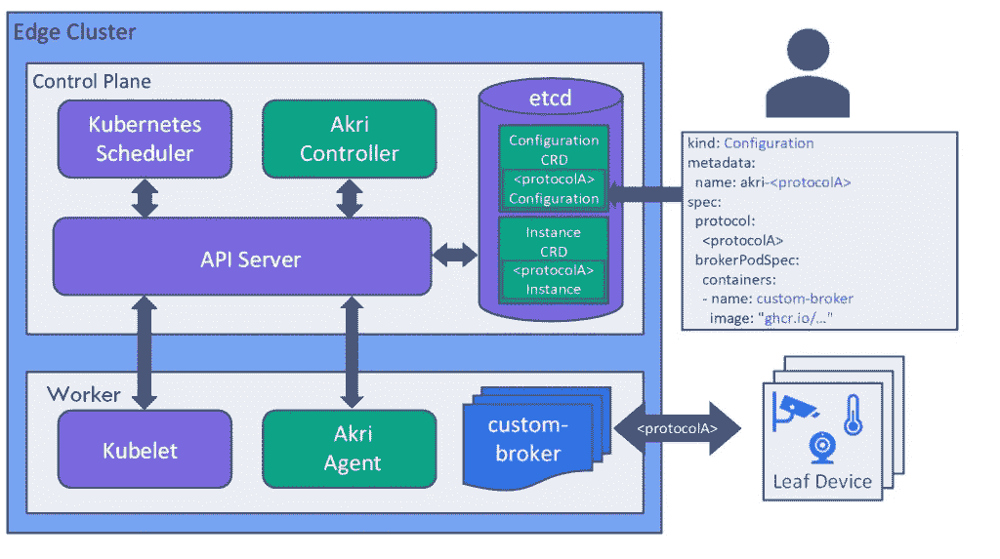

# 微软 Akri 将 Kubernetes 引入微型边缘“叶子”设备

> 原文：<https://thenewstack.io/microsoft-akri-brings-kubernetes-to-tiny-edge-leaf-devices/>

本周，微软发布了一个新的开源项目， [Akri](https://aka.ms/akri) ，该项目通过暴露边缘设备，如传感器、摄像头、控制器和微控制器单元(MCU)类设备，在边缘产生数据并执行操作，从而允许在边缘使用 Kubernetes。

虽然像 [K3S](https://k3s.io/) 这样的项目旨在[为边缘设备](https://thenewstack.io/ranchers-k3s-joins-cncf-sandbox-as-first-kubernetes-distribution/)提供全功能的 Kubernetes 实例，但 Akri 的目标是更小的设备，这些设备本身无法运行 Kubernetes。相反，Akri 提供了一个类似于容器网络接口(CNI)的抽象层，简化了检测叶设备、与它们通信以及调度工作负载的过程。

“如果解决方案架构师现在想要在 Kubernetes 集群中公开这些类型的设备，他们需要为每种设备提供非常具体的配置。微软首席软件工程师 [Jiri Appl](https://www.linkedin.com/in/jiriappl) 在一封电子邮件中写道:“针对这个问题的开发者也可以编写定制的解决方案来检测和使用每一个设备。“总的来说，这两种情况都不太具有可扩展性或可管理性，除此之外，跨多个节点扩展设备数据会成为一个更大的问题。我们希望开发一种解决方案，使这些设备的使用更简单，并创造更多的可重用性，以便开发人员可以利用彼此的才能。”

在发布 Akri 的博客文章中，微软简单地总结了这个项目的目的:“你命名它，Akri 找到它，你使用它。”为此，您需要告诉 Akri 要检测哪种类型的设备以及这样做所需的发现协议，然后 Akri 在每个节点上部署一个代理，该代理可以发现特定类型的叶设备，并将这些设备作为扩展资源暴露给 Kubernetes 集群。Akri 还根据设备类别和特定实例对设备进行分组，因此如果需要，您可以针对整个设备类别或特定设备。从那里，Akri 监控设备的可用性，相应地安排工作负载。

“Akri 使得向 Kubernetes 集群添加传感器、控制器和其他小型设备变得非常容易。使用 Akri，您不必担心设备连接到哪个节点。Appl 写道:“Akri 会自动部署一个知道如何处理设备的代理 pod，您可以在其上添加自己的定制代码来做任何您想做的事情。正如 Kubernetes 使扩展您的计算规模变得更容易一样，Akri 也使扩展您在边缘上的设备数量变得更容易。您可以添加更多设备，Akri 将自动发现并利用它们。”

在发布时，Akri 支持用于互联网协议摄像机的[开放网络视频接口论坛(ONVIF)](https://www.onvif.org/) 和用于直接连接到 Kubernetes 节点的设备的 [udev](https://en.wikipedia.org/wiki/Udev) ，但更多的发现协议，如蓝牙和 OPC UA，目前正在计划中。此外，该项目吹嘘其可扩展性，希望用户能在这方面有所帮助。虽然 Akri 本身是用 Rust 编写的，但 Appl 指出，部署到发现的设备上的工作负载可以用任何语言编写。

“这是 Akri 的第一天——我们很高兴开始构建 Akri 社区，从开发人员那里获得反馈和输入，并发展和改进项目。我们目前正在考虑为工业环境带来对 OPC UA discovery 的支持，并在我们的提案中考虑了其他想法。Appl 写道:“我们希望听到社区如何计划利用 Akri，以及 Akri 缺少哪些功能，以便对每个人都有用，”他敦促用户加入 [Akri Slack 频道](https://aka.ms/akri/channel)。

作为一个题外话，Akri 遵循 Kubernetes 的命名传统，其名称来自希腊语“edge”，尽管微软也指出它的双重用途是“Kubernetes edge 资源接口”的首字母缩写。

<svg xmlns:xlink="http://www.w3.org/1999/xlink" viewBox="0 0 68 31" version="1.1"><title>Group</title> <desc>Created with Sketch.</desc></svg>