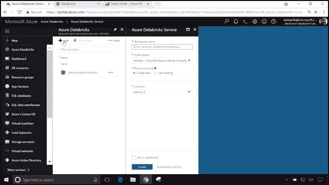

# 微软 Azure 首次推出“火花即服务”

> 原文：<https://thenewstack.io/microsoft-azure-debuts-spark-service/>

微软已经与 Apache Spark 分析平台的主要商业提供商 Databricks 合作，在 Azure 公共云上提供自助式 Spark 服务。

该平台的预览版于周三向公众发布，在周三上午在纽约市举行的 Connect()开发者大会(用括号括起来)上，微软执行副总裁斯科特·格思里(Scott Guthrie)在一系列产品公告的末尾做了介绍:

Guthrie 在活动前的新闻发布会上表示:“我们即将推出的 Databricks 服务将成为所有云供应商中的第一个 Spark 即服务。“它是与 Databricks 一起构建的，Data bricks 实际上是整个 Spark 生态系统的管理者，”Guthrie 在周三的 Connect()期间承诺了一个主要的在线演示，预计将与 SQL 数据仓库和 [Power BI](https://www.computerworld.com/article/2876300/microsoft-previews-free-updated-power-bi-business-intelligence-tool.html) 集成。

“在预览版中可用，Azure Databricks 已经针对 Azure 进行了优化，”微软的通信副总裁弗兰克·肖说，“结合了 Databricks 和 Azure 的最佳功能，实现了真正高效的开发人员体验，包括一键设置、简化的工作流程、交互式工作区，以及与丰富的 Azure 服务(如 Azure Cosmos DB)的本机集成。”

## 火花堵塞

[达布瑞克公司](https://databricks.com/)。是从开源的 Apache Spark 项目的发起人发展起来的商业公司。今天早上，Databricks 首席执行官兼联合创始人 [Ali Ghodsi](https://www.linkedin.com/in/alighodsi/) 告诉在线与会者，“我们听到了客户群的巨大需求。他们想要 Azure，他们想要安全性，他们想要合规性，他们想要 Azure 的可扩展性。他们已经问了很久了。

[从左至右]微软执行副总裁斯科特·格思里(Scott Guthrie)、Databricks 首席执行官阿里·高德西和 Databricks 工程师格雷格·欧文(Greg Owen)

微软周三发布的与 Spark 相关的公告没有被提及

[a cloud service map it published just two weeks ago](https://www.microsoft.com/en-us/download/confirmation.aspx?id=56124)

将 Azure 的产品套件在几个方面——包括数据库、分析和大数据——与亚马逊网络服务(AWS0。“火花”一词在该文件中被完全删除。

到目前为止，Azure 对 Spark 的支持一直是其 HDInsight 服务的一种[按需大脑移植，用内存中的 Spark 取代其原生 Hadoop MapReduce 流处理。与此同时，AWS 对 Spark 的主要支持来自于弹性 MapReduce 的系统附件](https://docs.microsoft.com/en-us/azure/hdinsight/spark/apache-spark-overview)，使客户能够直接从 AWS 管理控制台启动 Spark 集群。并且[谷歌的云数据处理器](https://cloud.google.com/blog/big-data/2016/06/google-cloud-dataproc-the-fast-easy-and-safe-way-to-try-spark-20-preview)(尽管名字很吓人)确实可以让托管 Spark 集群实例轻松加速。

因此，至少就 Spark 而言，Azure 需要迎头赶上。Databricks 软件工程师 [Greg Owen](https://twitter.com/gregorygowen) 可能一下子就完成了奇偶校验，向 Connect()观众演示了 Databricks 工作区如何从 Azure 门户内实例化[ *如上面的*所示*]。从那里，Owen 能够设计一个数据管道，从基于 Azure 的 [blob 存储](https://thenewstack.io/forget-file-system-future-scalable-cloud-storage-will-objects/)中提取数千万条活动记录，其中的对象是从混合的多个源集中抽象地寻址的。*

通过这种方式，在欧文的演示中，酒店可以从门票销售集团和剧院公司收集的数据中提取已知游客过去参加过的活动，作为设计定制激励计划的一种方式，以鼓励客户未来旅行。管道代码可以用 Python、R 或 Scala 编写，使用一个控制台，其功能似乎与微软流行的 [Visual Studio 代码](https://code.visualstudio.com/)跨平台工具共享。

使用 Python，Owen 能够插入来自 [Spark 的 MLlib 机器学习库](https://spark.apache.org/mllib/)的交叉验证代码，无需修改。“我们不需要重新发明任何轮子，”他说。“过去在另一个平台上可能需要几周甚至几个月的所有过程，现在我们可以在 Azure Databricks 上几分钟或几天内完成。”

## 端到端，到什么端？

从历史上看，微软倾向于通过展示其在某一类别中提供的大量产品来吹捧其在该类别中的优势(其中一些产品彼此之间并不总是那么不同)。有时，该公司忽略了如何将自己的产品结合起来使用的机会，这或许是一个无法预见的游戏规则改变者。

在最近的新闻发布会上，新堆栈要求微软官员提供一个例子，说明周五宣布的工具如何用于“端到端”场景，正如斯科特·格思里反复声明的那样。

Visual Studio [公司副总裁 Julia Liuson](https://www.linkedin.com/in/julia-liuson-6703441/) 回应道:“当我们考虑企业将其应用程序现代化到云环境时，我们看到的一个关键趋势是企业开始使用微服务将其应用程序分解为组件，这些组件可以真正利用[最新的 DevOps 实践](/category/devops/)，以真正加快向客户交付价值。利用云基础架构实现真正的超大规模，以接触到您想要接触的所有客户。

“当你考虑这一旅程时，你如何将整个应用组合在一起，”Liuson 继续说道，“需要非常强大的基础设施支持弹性云，一套强大的开发工具来帮助你和开发团队在这种微服务和 DevOps 实践的新开发方式中高效工作。我真的认为，对于我们 Visual Studio 家族和 Azure 来说，我们将拥有一套超级完整的工具来帮助开发者和开发团队完成这一旅程。”

Liuson 提到的一个工具是 Azure 容器服务的 AKS 版本(现在有一个“K”)的公开预览版。目前，托管的 Kubernetes 是 AKS 的默认编排器，Docker Swarm 和 Mesosphere DC/OS 现在作为“替代编排器”提供[微软在 10 月下旬公布了这个预览版](https://www.zdnet.com/article/microsoft-introduces-a-free-dedicated-azure-container-service-for-kubernetes/)，并承诺将成为相当于[谷歌容器引擎(GKE)](https://thenewstack.io/google-container-engine-quickly-integrates-kubernetes-1-8/) 的 Azure 版本，以及[最近宣布的 Pivotal 容器服务(PKS)](https://thenewstack.io/pivotal-container-service-hard-wires-cloud-foundry-kubo-google-cloud/) 。

Liuson 已经清楚地指出了 AKS 管理基于微服务的操作的能力，提出了 Azure Databricks 和 AKS 是否可以一起运行的问题——或者，在绝对完美的世界中，Databricks 是否可以在 AKS 上的 Kubernetes 管理的环境中进行。这是新堆栈向微软提出的一个问题，即使在本书出版时，微软仍在寻找合适的答案。

在所有无缝集成中，Databricks 服务(实际上是商业 Spark)可以在 Kubernetes 上运行，使用的架构是一名谷歌工程师已经在去年 6 月旧金山 Spark 峰会上成功演示过的。

同样在 Spark Summit 上，一位名叫 [Haohai Ma 的 IBM 开发人员解释了为什么一个基于容器的平台](https://www.youtube.com/watch?time_continue=9&v=A-5C_WsK8bM)——特别是一个与 Kubernetes 协调的平台——会对 Spark 环境有益。首先，马说，系统可以自动跟踪 Spark 的依赖项，并在它们的容器被挂载时使它们可用。其次，Kubernetes 可以强制限制提供给 Spark 执行者的 CPU 份额。第三，将实例完全包含在容器环境中也有效地隔离了 Spark 使用的文件系统(在许多情况下，它借用了 Hadoop 中的 HDFS)。

虽然 [Spark 自己的在线文档清楚地解释了](https://apache-spark-on-k8s.github.io/userdocs/running-on-kubernetes.html)Spark 平台如何在 Kubernetes 上运行，但这些说明的长度证明了这不是一个自助式过程。

## 无缝到极致

所以这种深度的婚姻不会没有最初的困难。与此同时，Azure Databricks 可能还有希望与一些本身可能无缝集成到 AKS 中的东西无缝集成。

这一希望来自微软项目经理斯科特·汉瑟曼。去年 9 月，Hanselman 录制了一段视频，展示了其 Cosmos DB 全球分布式数据库平台如何被触发，以自动响应无服务器 Azure 功能(微软的 AWS Lambda 版本)。目前，Azure Functions 被宣传为一种企业部署可伸缩功能的更简单的方式，而不必与 orchestrator 打交道。

虽然这样的场景似乎完全排除了 Kubernetes，但它确实指出了容器使用简单的 API 命令从 Cosmos DB 访问非常大的数据存储是多么容易。事实上，微软在 2016 年 7 月在[对新堆栈](https://thenewstack.io/azure-functions-serverless-computing-handling-iot-devices/)的采访中吹嘘了这一能力，当时数据库的预览版被称为“DocumentDB”

[为 Cosmos DB 构建 Spark 连接器](https://github.com/Azure/azure-cosmosdb-spark)的项目目前正在 GitHub 上进行。微软自己在周三向开发者提供了该项目的链接，在一篇博客文章中透露，这两个环境之间的数据交换直接发生在 Spark 的工作节点和 Cosmos 的数据节点之间，而不是一些较慢的中间管道。

如果一切顺利，这将是一个“端到端到端”的连接场景。但最终产品可能会以某种方式成为企业在全球范围内部署超大型数据结构的一种方式，根据 Scott Guthrie 的说法，在不使用 orchestrator 插件的情况下，在完全托管的容器化环境中，任何查询的保证延迟都不到一秒钟。至少在理论上，这种服务将把部署超大规模分析应用所需的时间和成本削减到仅仅几个小时和一个月的费用。

新堆栈的劳伦斯·赫克特为这份报告提供了研究。

<svg xmlns:xlink="http://www.w3.org/1999/xlink" viewBox="0 0 68 31" version="1.1"><title>Group</title> <desc>Created with Sketch.</desc></svg>