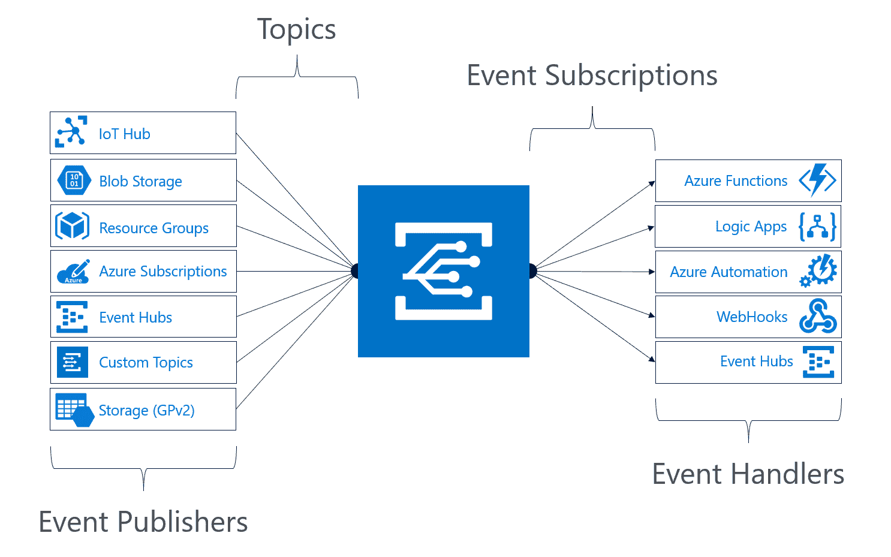
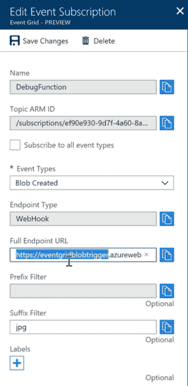

# 现在，微软 Azure 事件网格将无服务器功能、云服务

> 原文：<https://thenewstack.io/microsoft-azure-event-grid-goes-live/>

从单一应用转移到微服务、容器和 REST APIs 意味着应用内的通信和消息队列变得更加重要，但传统的轮询和发布订阅方法无法很好地处理这一点。无论是物联网、自动化操作还是无服务器功能，事件驱动的计算正在成为基础，而 [Azure Event Grid](http://azure.com/eventgrid) 服务的创建就是为了填补事件通信的这一空白，[微软 Azure Compute 产品负责人科里·桑德斯](https://github.com/coreysa)告诉新堆栈。

“随着应用变得越来越复杂，随着它们采用更多组件，随着它们跨越多个云和混合云，它们之间的通信需求变得越来越重要。桑德斯说:“以前通过轮询机制和监听器等实现这一点的方式非常麻烦，成本也很高，因此显然基于事件的解决方案是一条可行之路。

从长远来看，事件网格可能会超越云，成为 Azure Stack 事件处理的基础，特别是当 [Azure 功能已经在那里可用的时候](https://azure.microsoft.com/en-us/blog/general-availability-of-app-service-and-functions-on-azure-stack/)。例如，许多物联网系统需要使用边缘计算为远程和低带宽位置工作。“我们看到 Azure Stack 的主要场景是延迟敏感的边缘场景；这是我们今天看到的增长最快的使用案例，其解决方案侧重于计算和存储等，”桑德斯说。

## 发布和推送

自去年年中以来，事件网格一直处于预览阶段，提供了在 Azure 及更高平台上处理事件的主要方式；现在它已经在更多的地区上市了(最初是欧洲和亚洲，不久将会有更多的地区上市)，新的企业特性和更多的开发者工具。

Azure 事件网格服务集成。

事件由推送语义交付，因此应用程序不必不断轮询来寻找变化。事件网格支持来自关键 Azure 服务的事件，如存储、资源组、Azure 订阅和资源组:GA 版本添加了通用存储和 Azure IoT Hub 作为事件发布者，以及 Azure 容器注册表。这意味着事件网格在

但是事件不一定来自 Azure 服务；它们可以是任何事情，从推文到物联网设备更新、云供应、存储 blob 创建、新用户被添加到人力资源系统或生产线上的产品。

Sanders 解释说，芬兰工业处理服务提供商 Outotec 一直在使用事件网格的预览版来重新构建其混合集成平台。“他们有许多工厂、加工地点和生产线，他们使用[事件网格]来收集所有这些地点发生的事件，以便能够在 Azure 的服务上对它们做出反应。这为他们创造了重新思考如何构建服务的机会，而不必处理任何底层基础架构。”

## 进出天蓝色

事件处理程序订阅主题(发布者发送事件的端点)；处理程序还使用订阅按类型或发布路径过滤传入的事件。扇出将多个端点订阅到同一个事件，因此可以以不同的方式使用它。

现在该服务已经推出，交付 SLA 就是桑德斯所说的“以企业为中心”；"四个 SLA 和 24 小时重试期，适用于网格内的任何事件."

使用前缀和后缀过滤器在 Azure 门户中设置事件订阅。

原生 Azure 事件处理程序包括无服务器选项，如 Azure 函数、逻辑应用程序和“无代码”微软流服务，以及 Azure 自动化；Event Hubs 是一个新的处理程序，因为 preview 和 webhooks 处理向 Azure 之外的自定义代码和第三方服务发送事件。“这并不局限于 Azure 云，”桑德斯指出。“能够进来说‘我将运行定制代码，我将在任何我想运行的地方运行它，并利用事件网格’，这让我们很兴奋，因为我们觉得这带来了机会。这是一个非常常见的场景，客户进来后在 Azure 平台的一端使用事件网格，而在另一端使用自定义。有时候输入是自定义，输出是 Azure 函数；有时输入是 Azure 存储，输出是一些自定义事件处理程序——或者另一个云服务或本地系统。事件的处理和触发是等价的，无论是内部的还是外部的——这并不重要；事件网格对它们一视同仁。

许多事件网格客户正在构建物联网系统。“我们看到的两大场景是物联网和运营工作流。客户的使用一直非常关注功能使用，非常关注无服务器使用，以支持 IT 解决方案，一直到基础架构的运营和管理。在一些最常见的场景中，客户正在部署无服务器解决方案，这是对现有应用程序的附加，是对其他应用程序的丰富，而事件网格只是让这变得更加容易。”

物联网系统的事件数量往往要高得多，但在事件网格上运行的许多运营工作负载不会超过每月 100，000 个事件的免费级别。(在预展期间，该服务平均每周处理 3 亿次事件。)

编写使用事件网格的定制代码也变得越来越简单。Python、Nodejs、Go 和 Ruby 以及现有的 C#/都有[新的管理和数据平面 SDK](https://docs.microsoft.com/azure/event-grid/sdk-overview)。NET 支持，更多语言将于 2018 年晚些时候推出。

Sanders 告诉我们:“随着我们看到越来越多的客户开始寻求使用 Event Grid 构建更复杂的解决方案，他们需要能够以编程的方式来完成这项工作。”。“门户体验使它变得非常容易，但当你在更大的规模上做它时，比如说用 CI/CD 管道或作为整个应用程序部署的一部分来做，能够以编程方式做是很重要的，并且提供人们想要的任何语言一直是一个持续的目标。”

也更容易消费事件；不需要事件订阅者反序列化事件，它可以从事件模式存储中获取所有支持的事件类型的 [JSON 模式](https://docs.microsoft.com/en-gb/azure/event-grid/event-schema)。

[https://www.youtube.com/embed/p8ia7J4Y7tI?feature=oembed](https://www.youtube.com/embed/p8ia7J4Y7tI?feature=oembed)

视频

微软是这一新体系的赞助商。

<svg xmlns:xlink="http://www.w3.org/1999/xlink" viewBox="0 0 68 31" version="1.1"><title>Group</title> <desc>Created with Sketch.</desc></svg>