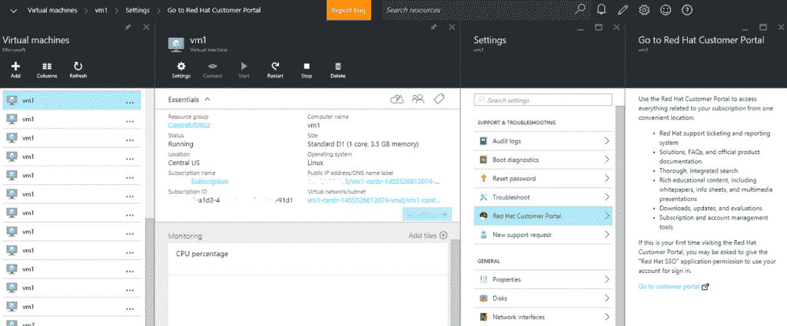

# 微软 Azure 现在提供 Red Hat Enterprise Linux，容器管理

> 原文：<https://thenewstack.io/microsoft-azure-now-offers-red-hat-enterprise-linux-container-management/>

红帽企业版 Linux 现在可以在微软 Azure 云平台上使用，这要归功于两家公司在 11 月份发起的合作。

“自从我们[在 11 月宣布我们的合作关系](http://www.redhat.com/en/partners/strategic-alliance/microsoft)以来，我们已经看到我们的客户希望将他们的红帽投资带到 Azure 的强烈兴趣和势头，”微软项目管理合作伙伴主任兼 Azure 团队项目经理 Corey Sanders 在一篇宣布支持的博客文章中说。

除了对 RHEL 的支持，微软还正式推出了 Azure Container 服务，[去年预演过](https://thenewstack.io/microsoft-launches-azure-container-service-mesosphere-dcos-drawing-distinction-google/)。

据微软称，目前 Azure 中超过 60%的图片是基于 Linux 的。微软客户正在使用红帽云服务。因此，如果微软和 Red Hat 看起来是奇怪的伙伴，那是因为客户要求更好的集成。

“客户也在寻找下一代功能，这种合作关系是实现这一目标的合理步骤，”红帽公司业务架构总监迈克尔·费里斯在电话采访中说。

这份声明中最有趣的部分是，Red Hat 和 Azure 的客户支持工程师将一起坐在华盛顿州的雷德蒙。桑德斯说，这种集成的支持和工程师的共同定位对合作伙伴关系的成功至关重要。

“这为客户提供了额外的选择，他们可以如何和在哪里消费图像，”费里斯说。“无论客户需要什么，我们都能以持续的方式提供支持和服务。”

两家公司计划一旦客户群支持，就将这种独特的安排扩展到其他 Azure 位置。

Red Hat Enterprise Linux 6.7 和 7.2 映像现已在所有 Azure 地区上线，但中国和美国政府除外。

微软也一直忙于将其他开源技术整合到 Azure 中。该公司将开始提供一套由 Bitnami 打包的经过认证的 Linux 镜像。它还开始支持由沃尔玛实验室开发的开源 OneOps 云管理软件[。](https://thenewstack.io/devops-walmart-way-newly-released-oneops-cloud-platform/)

开源软件在现已上线的 Azure 容器服务(T1)中也扮演着至关重要的角色，该服务基于(T2)Apache Mesos(T3)容器管理软件以及来自 meso sphere(DCOS)数据中心操作系统的开源组件。在去年 10 月 TNS 的一次采访中，微软 Azure 首席技术官 Mark Russinovich 指出，微软发现其客户对 Mesos 的兴趣比对 Kubernetes 更大，Kubernetes 是谷歌开发的另一个开源容器管理应用程序。

Azure 容器服务提供了一组 API 端点，可用于链接到容器编排工具，如 Docker Compose 或 Apache Mesos。该服务可以与其他 Azure 技术一起工作，如 Azure 资源管理器和虚拟机规模集。

TNS 执行主编 Joab Jackson 对本文有贡献。

Docker 和 Red Hat 是新堆栈的赞助商。

通过 Pixabay 的特征图像。

<svg xmlns:xlink="http://www.w3.org/1999/xlink" viewBox="0 0 68 31" version="1.1"><title>Group</title> <desc>Created with Sketch.</desc></svg>