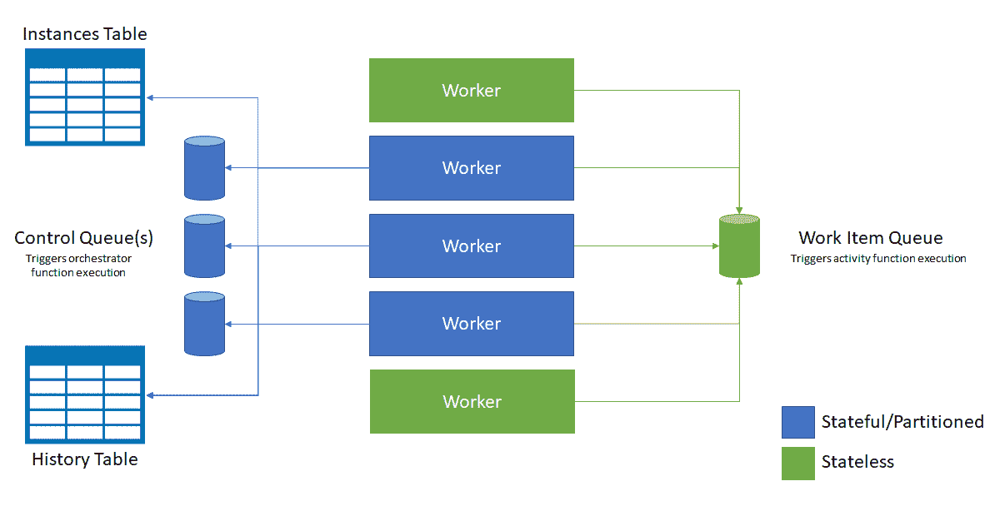

# 微软 Azure 的无服务器 JavaScript 持久功能

> 原文：<https://thenewstack.io/microsoft-azures-durable-functions-for-serverless-javascript/>

无服务器方法越来越受开发人员的欢迎，这些开发人员希望运行代码，而没有设置和维护代码运行环境的复杂性、成本或延迟。随着无服务器平台变得足够强大，能够吸引更复杂的开发，它们也获得了增加便利性的工具，如管理外部状态和长时间运行的操作。

由于无服务器平台是无状态的，开发人员不得不添加队列和数据库来存储几乎任何重要代码都需要的外部状态，通常使用 AWS DynamoDB 和 Azure CosmosDB 这样的键值存储。像 [architect](https://arc.codes/) 这样的框架通过内置 Dynamo 支持来简化这一点，微软的 [Azure Functions](https://azure.microsoft.com/en-us/services/functions/?&OCID=AID631184_SEM_k6TsqHJD&lnkd=Google_Azure_Brand&gclid=EAIaIQobChMI94Xx3dP22wIVDC5pCh39FgvxEAAYASAAEgL7avD_BwE&dclid=CJi6it_T9tsCFUtBDAodD8EJCw) 现在有自己的内置框架来定义代码中的工作流并协调调用其他函数，同时使用 Azure 存储队列和表存储在函数执行之间持久地存储状态。

微软的[耐用功能](https://azure.microsoft.com/en-us/resources/videos/azure-friday-durable-functions-in-azure-functions/)去年预演过，现在已经全面上市。作为开源 [Azure Durable Task](https://github.com/Azure/durabletask) 框架的扩展，使用 C#的 async/await 功能编写长期运行的持久工作流，Durable Functions 最初只支持 C#，但 JavaScript 和 Node.js 支持现在在 preview 中(以及 Java 等其他语言)。

使用 JavaScript 通过框架编写 orchestrator 函数需要 Azure Functions v2 运行时中的新语言可扩展性模型，该模型本身仍在预览版中，但在最新的 1.5 版持久函数中受支持。这也增加了对 JavaScript 编排中复杂对象参数的支持，而不仅仅是像数字和字符串这样的基本类型。

Orchestrator 函数是有状态的工作流，但它们仍然是用代码编写的；您不必创建 JSON 模式或使用图形化的工作流设计器。它们可以同步或异步地调用其他函数，并将这些函数的输出保存到局部变量中，因此您可以将它们用于函数链或更复杂的编排模式，如扇出/扇入或 MapReduce。Orchestrator 函数是具有 orchestrationTrigger 绑定的生成器函数；它们调用 activity 函数，这些函数看起来像标准的 Azure 函数，但有一个 activityTrigger 绑定。

它们也非常适合长时间运行的交互，因为在等待另一个函数或外部 API(甚至一个人)的响应时，函数不需要保持活动状态，也不需要充电。

Azure Functions 的高级项目经理 Jeff Hollan 告诉新的堆栈:“现实世界并不像函数执行那样简单。

他以一个网站为例，该网站希望发送账单到期提醒，并在账单过期时发送更多提醒。“很多正在使用功能的 Node.js 开发者都有网站，在幕后，他们需要说‘三天内去联系这些客户’。他们需要知道任务将会执行，并且至少执行一次，但是除非函数一直存在，否则你无法做到这一点。”

例如，您可以为一个编排使用持久函数，它向 500 个有账单要付的人发送一条文本消息，等待三天看他们是否付款，如果没有，则做其他事情。如果没有持久的函数，这种长时间运行的过程将很难建立。霍兰指出，在这些过程中，你会安排多个阶段的事情，比如“周五下午 5 点起床，做这个，然后等这个，然后做另一件事”。

持久功能包括用于与外部客户端协调长期运行操作的 API，如启动新的 orchestrator 函数实例的 REST 命令，以及公开 webhook HTTP APIs 以查询这些 orchestrator 函数的状态。长期运行的监控功能也可以轮询外部端点，一直运行到满足某个条件或计时器超时，并且您可以更改轮询间隔，例如通过实现退避算法。如果您等待的是一个人，orchestrator 函数可以在请求发送给他们时设置一个持久计时器，等待通过 webhook 通知此人已批准或拒绝请求，如果在设定的时间内没有收到回复，则上报。

在 C#中，持久函数使用 Await 运算符；在 JavaScript 中，您将工作流表示为一个生成器函数，在您希望代码等待状态返回的地方使用 yield。

出于性能原因，函数不存储它们的完整运行时状态。相反，每当 orchestrator 函数的代码到达 yield 关键字时，持久任务框架调度程序会自动将其进度检查到仅附加的执行历史中(存储在 Azure 存储表中)，因此如果出现崩溃或重新启动(或者函数被挂起)，可以重建本地状态，然后将消息添加到工作项队列以调度工作。此时，orchestrator 功能将从内存中卸载，因此，如果您使用的是消费计划，计费也会停止。

当 orchestrator 函数调用一个 activity 函数时，activity 函数通过 activityTrigger 从工作项队列获取消息，并将其响应发送到控制队列；orchestrator 函数通过 orchestrationTrigger 接收响应。这些队列是持久函数提供“至少一次”消息传递保证的方式。

当收到响应或计时器超时时(或者某个功能在崩溃或重启后必须重启)，orchestrator 会使用执行历史重新运行该功能，以重建本地状态，因此无需重新运行任何已完成的任务。这意味着 orchestrator 函数必须是确定性的，这样多次运行相同的代码每次都会产生相同的结果；将 IO 或随机数据等不确定性代码放入活动函数中。

要在 Node.js 中编写持久函数，您还需要 Node.js 库的[持久函数(适用于 Node.js 8.4.0 和更高版本)，它仍然在预览版中。当 orchestrator 函数到达 yield 关键字时，它期望一个解析 Task 或 TaskSet 对象的承诺，Node.js shim 库接受函数执行历史作为状态对象。然后，它将 Task 或 TaskSet 对象的操作附加到一个列表中，该列表返回给函数运行时，以便与函数的任何输出以及函数是否已完成一起添加到执行历史中。如果函数没有完成并收到另一个响应，库将以同样的方式返回。](https://github.com/Azure/)

## 耐久超越天蓝色

Azure Functions v2 运行时在。NET Core，它允许跨平台开发和托管，使得使用 [Azure Functions 核心工具](https://github.com/Azure/azure-functions-core-tools)在本地编写和测试[持久工作流变得更加容易，而不仅仅是在 Azure 上。](https://docs.microsoft.com/en-us/azure/azure-functions/functions-run-local)

这包括持久的功能。“持久功能可以在任何地方运行，包括在边缘，”Hollan 说。事实上，状态对于边缘开发更为重要，在边缘开发中，您的功能可能运行在资源受限的设备上，这些设备没有电池电量来等待长时间运行的流程完成，他预计持久功能将在物联网管理和设备生命周期编排中特别有用。

在自己的系统上运行持久功能通常仍然意味着连接 Azure 进行存储。“如果你想完全脱离(Azure)运行，那就更具挑战性了，因为你需要 Azure 存储，”Hollan 指出。来自 Azure SDK 的 Azure Storage Emulator 只能在 Windows 上运行，是为开发而非生产使用而设计的；[运行在 Node.js 上的 Azure](https://github.com/azure/azurite)，是 Azure Storage 的开源克隆。用于 Windows、Mac 和 Linux 的 [Azure Storage Explorer](https://azure.microsoft.com/en-us/features/storage-explorer/) 可与模拟器以及云 Azure Storage 配合使用，因此您可以在调试时看到任务中心的内容，这些任务中心对持久编排功能使用的 Azure 存储队列和表格资源进行分组。这也是查看编排执行历史的一种方式，尽管持久功能发送给 Azure Application Insights 的跟踪数据可能是监控编排的更好方式。

随着微软对智能边缘的关注，特别是现在 Azure IoT Edge 已经普遍可用，我们希望看到更多这些基本 Azure 服务的离线版本，持久功能将能够利用这些服务，使其成为一种编排长期运行任务的模式，这将在许多地方有用。

微软是这一新体系的赞助商。

通过 Pixabay 的特征图像。

<svg xmlns:xlink="http://www.w3.org/1999/xlink" viewBox="0 0 68 31" version="1.1"><title>Group</title> <desc>Created with Sketch.</desc></svg>