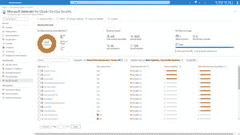

# 微软通过覆盖 CSPM devo PS 增强云安全

> 原文：<https://thenewstack.io/microsoft-bolsters-cloud-security-with-devops-cspm-coverage/>

微软通过两项新的预览服务扩展了其[Microsoft Defender for Cloud](https://azure.microsoft.com/products/defender-for-cloud/)安全平台—[Microsoft Defender for devo PS](https://aka.ms/defender4devops)和 [Microsoft Defender 云安全态势管理(Defender CSPM)](https://aka.ms/DefenderCSPM) 。

在本周举行的微软年度会议上，微软推出了新的 Defender 产品，以帮助开发人员减少安全漏洞和应对攻击，微软云安全公司副总裁肖恩·比思(Shawn Bice)说。这些工具针对的是没有考虑安全性的新代码和遗留代码。

“在微软，我们正以无限的心态对待云安全，”Bice 在一篇博客文章[中说。“在一个不断变化的世界中，我们使用威胁情报、人工智能和自动化来创建一个良性循环的信号，以更快地进化和应对不良行为者和事件。”](https://www.microsoft.com/security/blog/2022/10/12/introducing-new-microsoft-defender-for-cloud-innovations-to-strengthen-cloud-native-protections/)

## DevOps 的辩护人

Defender for DevOps 产品使组织能够在一个中央控制台中跨多个管道环境统一 [DevOps](https://thenewstack.io/category/devops/) [安全管理](https://thenewstack.io/category/security/)，支持 GitHub 和 Azure DevOps 等平台，并会推出更多平台。

“我们在 Defender for Cloud 中引入了新的创新，包括增强的安全状态管理，这将帮助您关注最关键的风险，并提供内置的多云安全建议，”微软首席执行官[塞特亚·纳德拉](https://www.linkedin.com/in/satyanadella/)在 Ignite 的主题演讲中说道。“新的 Defender for DevOps 可帮助您保护整个开发生命周期，并跨多个环境统一 DevOps 安全管理。”

此外，Defender for DevOps 与其他云安全工作相关联，以修复代码漏洞，并在整个应用程序开发生命周期中应用安全护栏，Bice 说。

该产品检查资源配置代码中的安全问题，并检查软件存储库中的漏洞。

“我们可以在不降低开发者现有管道速度的情况下做到这一点，”Bice 告诉 New Stack。“我们的真正目标是，通过连接到这些管道和代码库，识别和修复问题，让开发人员能够轻松扩展安全性，这可以被认为是一个流畅的动作。”

洛克菲勒资本管理公司显然需要这种工具。

洛克菲勒资本管理公司负责平台开发的董事总经理詹姆斯·拉杰什·文森特在一份声明中说:“如果我们向左转移，立即给开发者带来安全，代码部署将会加强保护。”。“将 [DevSecOps](https://thenewstack.io/6-devsecops-metrics-for-devops-and-security-teams-to-share/) 结果集成到 Microsoft Defender for Cloud 中，并拥有一个单一窗口，向我显示生产中的内容、代码质量以及即将进入管道的内容，这样我就不需要去多个地方和报告来扫描代码错误，这对我们来说将是无价的。”

## 专注于代码

Bice 表示，Defender for Cloud 在整个云应用程序生命周期中增强了安全性并降低了风险，因此组织可以一直受到保护 Defender for DevOps 从代码级别开始。DevOps 提供了能够立即解决代码问题的底层工具。

“有两个工具方面，”Bice 告诉新堆栈。“有一些连接器，如源代码管理系统(GitHub 和 Azure DevOps ),可以连接到 Defender for Cloud……这些连接器允许在安全和开发人员之间架起一座桥梁。第二，扫描利用了 GitHub 高级安全性的强大功能，以及针对 ADO [Azure DevOps] In Pipeline、IaC[[infra structure as Code](https://thenewstack.io/infrastructure-as-code-increase-security-scale-development/)]等的附加功能。”

事实上，IaC 和容器图像扫描有助于防止云错误配置进入生产环境。Defender for DevOps 与 [GitHub Advanced Security](https://aka.ms/advancedsecurity-blog) 集成，支持跨平台(包括 GitHub 和 Azure DevOps)的自动化工作流，促进 SecOps 和开发人员团队之间更强的协作。

Bice 告诉 The New Stack，“有相当多的网络不良行为者或民族国家或网络罪犯——无论你想如何描述——真正针对代码漏洞。“正如我们所知，这些坏演员在整个表面区域活动，但最近对代码本身的关注比我以前见过的，甚至比业界以前见过的都多。”

这是 Bice 在微软的第二次任职。他之前在该公司工作了 17 年，在重新加入微软担任云安全 CVP 之前，他还在 AWS 和 Splunk 工作过。

## 微软后卫 CSPM

Bice 表示，与此同时，Defender CSPM 以 Defender for Cloud 中现有的状态管理功能为基础，通过上下文云安全和攻击路径分析，帮助安全团队优先考虑和主动补救最关键的威胁。

“后卫 CSPM 做攻击路径分析，因为它背后有我们所说的安全图，”Bice 说。“它理解所有这些高度关联的数据。因此，当您对入口点进行分析时，您可以使用软件在幕后对此进行建模，以便您可以显示预测路径以及攻击者接下来可能会采取的行动。”

在解释安全图表时，Bice 指出，“在封面下面，有一个我们正在使用的图表数据管理系统。”他说，这项技术是团队内部的，不作为产品提供。

因此，在智能云安全图的基础上，Defender CSPM“通过自动部署的无代理扫描提供全面的可见性，以便跨多云环境进行实时评估，”Bice 在他的博客帖子中说。“Defender CSPM 将安全团队联系在一起，整合了云工作负载的洞察以及 Defender for DevOps 和 [Microsoft Defender 外部攻击面管理](https://www.microsoft.com/security/business/cloud-security/microsoft-defender-external-attack-surface-management) [的信号。](https://www.microsoft.com/security/business/cloud-security/microsoft-defender-external-attack-surface-management)客户可以使用主动攻击路径分析来减少高达 99%的建议噪音，并且只关注潜在攻击路径上最易被利用的漏洞，而不是筛选一长串易受攻击的资源。”

<svg xmlns:xlink="http://www.w3.org/1999/xlink" viewBox="0 0 68 31" version="1.1"><title>Group</title> <desc>Created with Sketch.</desc></svg>