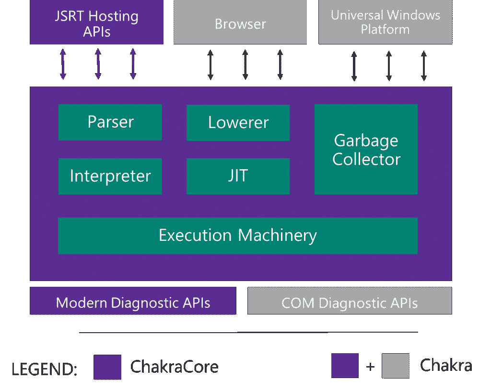

# 微软为 Node.js 准备替代 JavaScript 引擎

> 原文：<https://thenewstack.io/microsoft-chakra-javascript-engine-node/>

微软正在准备一个可以与 Node.js 一起使用的 JavaScript 引擎，它将为流行的运行时今天所依赖的 Google V8 引擎提供一个替代品。

虽然微软开发人员承认，到目前为止，这款名为 Chakra Core 的引擎还没有 V8 快，但它可能很快就会成为运行下一代 ARM Thumb-2 处理器的物联网(IoT)设备的高级替代品，V8 还不支持这种处理器。

Chakra Core 还提供了限制功率、内存和 CPU 消耗的功能，这将有助于基于节点的应用程序在资源受限的物联网设备上更有效地运行，微软高级项目经理 Arunesh Chandra 表示，他在本周在俄勒冈州波特兰举行的 Node.js 互动会议上详细介绍了该引擎。

上周末，微软宣布将于明年年初[发布](https://blogs.windows.com/msedgedev/2015/12/05/open-source-chakra-core/)Chakra Core 的源代码。Chakra Core 是 Chakra JavaScript 引擎的一个版本，用于微软的浏览器，但没有特定于 Windows 的绑定。

当 Chakra Core 开源时，Chakra 团队正计划向节点维护者提交一个 pull 请求，要求 Chakra 被整合到上游，如果被接受，将为用户提供下载基于 Chakra Core 的节点代码的能力。

钱德拉解释说，去年 5 月，微软首次表现出对将 Chakra 引入 Node 的兴趣。Chakra 被移植到用于 [Windows 10 物联网核心](https://blogs.windows.com/buildingapps/2015/08/10/hello-windows-10-iot-core/)的 ARM 处理器上运行，可以在 Raspberry Pi 2 和 MinnowBoard Max 等设备上运行。因此，开发团队创建了一组垫片，可以拦截 V8 API 调用，并将它们重新路由到 Chakra，这反过来允许他们创建一个在 ARM Thumb-2 设备上运行的 Node 版本。

作为运行基于服务器的应用程序的 JavaScript 运行时，开源 Node.js 正得到越来越广泛的使用。据 Node Foundation 称，目前每月下载量超过 200 万次。然而，Node 的核心依赖于其核心的单一 JavaScript 引擎， [Google V8](https://developers.google.com/v8/?hl=en) 。

微软认为，Node 及其生态系统将通过提供多种 JavaScript 引擎而受益。无论如何，谷歌在过去偶尔会对 V8 更新的发布方式和时间表现迟钝。从长远来看，多个引擎也可以提高节点性能，因为多方都在竞争最快的引擎。

钱德拉承认，要使查克拉核心完全准备好节点生产任务，还需要做更多的工作。调试能力是有限的。Node 上的性能与 V8 不太一样，许多为特定的 V8 调用编写的节点包也不兼容。

从好的方面来说，查克拉已经提供了一些独特的优势。它提供了对 JavaScript 更全面的支持，支持 ECMAScript 2015 的大部分(JavaScript 2015 的基础)，甚至支持 Async 函数等 ECMAScript 实验特性。Chakra 还有一套 API 来控制资源使用，V8 目前没有提供，允许 Chakra 在占用空间非常小的设备中使用。

Chandra 说:“(Chakra Core)的想法是与社区合作，尽可能多地为 Node.js 做出贡献。我们完全致力于这项技术，并在开放的环境中工作。”。

<svg xmlns:xlink="http://www.w3.org/1999/xlink" viewBox="0 0 68 31" version="1.1"><title>Group</title> <desc>Created with Sketch.</desc></svg>