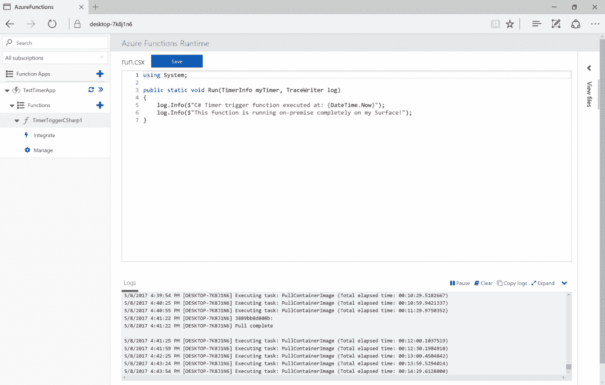
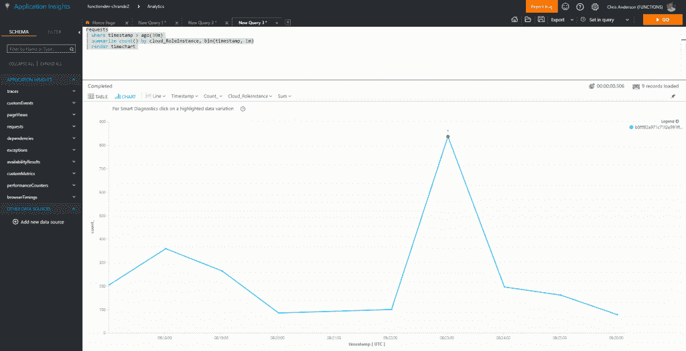

# 微软首次推出供内部使用的 Azure 功能，将遥测技术添加到云版本中

> 原文：<https://thenewstack.io/microsoft-debuts-azure-functions-house-use-adds-telemetry-cloud-version/>

微软发布了一个版本的无服务器服务，Azure Functions，可以完全在企业防火墙后运行。

Azure Functions Runtime 打包在一个运行在 Windows Server 2016 或 Windows 10 上的容器中，提供了一个与 Azure 类似的[编程模式](https://aka.ms/azafrdocs)，允许开发人员创建组件和运行批处理作业，而无需担心底层基础设施的要求。微软在本周举行的 [Build](https://build.microsoft.com/) 用户大会上发布了该软件的预览版。

比如说，这款软件可能对一名商业分析师很有价值，他可以利用存储在分析师自己电脑上的数据，利用这项服务进行大量的数据分析工作。

微软编程经理 Chris Anderson 在接受新堆栈采访时说:“无服务器的美妙之处在于，它真的可以帮助你去除所有曾经碍事的东西，让你直接着手解决你的问题。”。

运行时有两个组件:管理角色和工作角色。管理角色充当门户，将工作分配给可用的工作人员，这些工作人员可以是专用服务器，甚至是具有备用容量的台式计算机。主机将需要 Windows Server 2016 或 Windows 10 Creators 更新。

## **APM 来到无服务器**

除了引入其[无服务器软件](/category/serverless/)的本地版本，微软还为基于云的 [Azure 功能](https://azure.microsoft.com/en-us/services/functions/)配备了更多支持工具，以适应该技术的生产使用。

该公司加强了对 Azure 功能的监控支持。该公司的[应用洞察](https://azure.microsoft.com/en-us/services/application-insights/)应用性能监控(APM)服务现在完全支持 Azure 功能的监控。可以通过 Applications Insights 门户查看指标，它可以与其他被监控的服务放在一起，也可以通过 Azure Functions 自己的门户查看。

用户可以指定将捕获哪些性能指标，以及捕获的频率。几乎实时地报告指标。对于作业执行，Application Insights 将捕获作业的平均持续时间、正在执行的作业总数、每秒失败次数以及总资源消耗。该服务还将报告运行时抛出的任何异常。

用户可以自定义他们看到的指标，根据指标编写查询，设置可以在日志中捕获的跟踪，甚至设置警报系统。他们可以在检查一个作业和所有作业之间切换。就像现在，依赖性无法被监控。

展会上还介绍了其他支持工具。

该公司在 [Visual Studio Marketplace](https://marketplace.visualstudio.com/) 发布了一个扩展，名为 Azure Functions tools for Visual Studio 2017，供开发人员在他们正常的典型 Visual Studio 2017 开发工作流程中编写和调试 Azure 函数代码。

微软还提供了一个“快速选项”，用于直接在 [PowerApps](https://powerapps.microsoft.com) 和 [Flow](https://flow.microsoft.com) 中发布基于函数的 API，这两个工具都为企业用户提供了一种构建内部应用和工作流的简单方法。这项工作遵循了早期通过 [OpenAPI (Swagger)](https://blogs.msdn.microsoft.com/appserviceteam/2017/03/30/announcing-functions-swagger-support/) API 框架公开功能的支持工作。

此外，该公司还提供了一套模板，允许函数从微软的[公共数据服务](https://powerapps.microsoft.com/en-us/guided-learning/learning-common-data-service/) v(CDS)中访问数据，该服务将多个来源的业务数据聚集在一个地方。例如，开发人员可以编写一个从 CD 中提取数据并可以从 PowerApps 中调用的函数。

Azure Functions“将计算商品化，就像我们在亚马逊的朋友用 S3 将存储商品化一样，”微软合作伙伴项目管理总监 Nir Mashkowski 说。“现在，你可以在自己的车库里创业，以低廉的价格构建云级分布式后端。”

通过 Pixabay 的特征图像。

<svg xmlns:xlink="http://www.w3.org/1999/xlink" viewBox="0 0 68 31" version="1.1"><title>Group</title> <desc>Created with Sketch.</desc></svg>