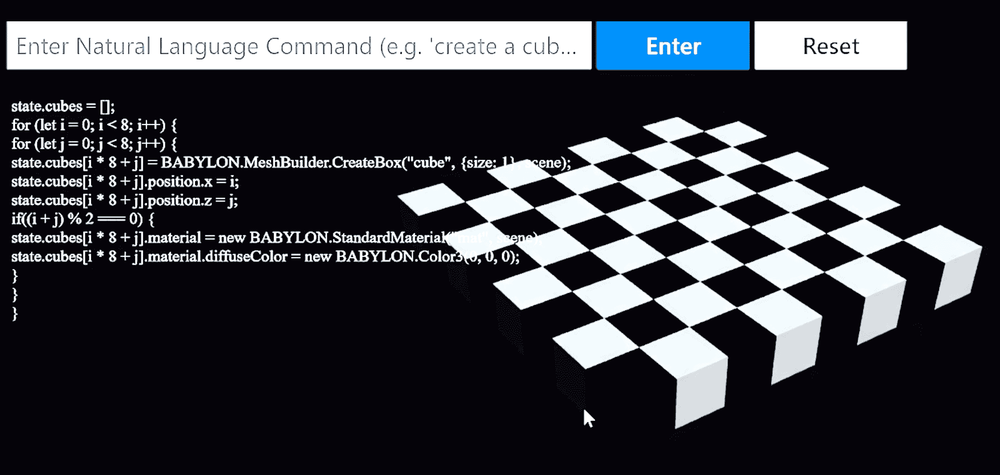
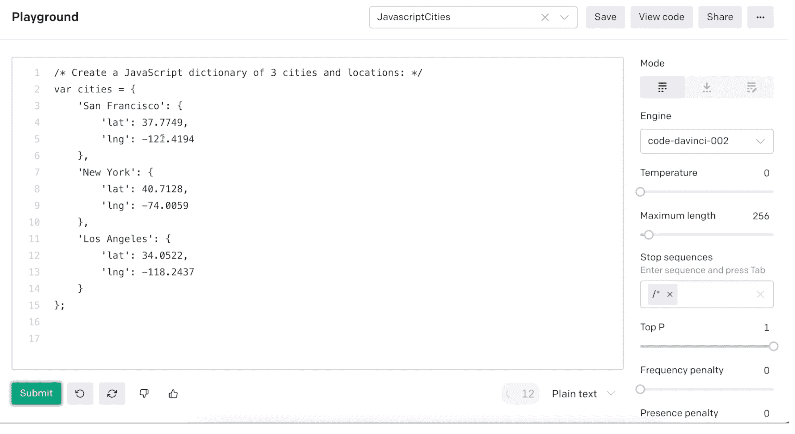

# 微软在构建时演示人工智能开发，使用 OpenAI Codex

> 原文：<https://thenewstack.io/microsoft-demos-ai-development-at-build-using-openai-codex/>

在本周的微软构建大会上展示的更有趣的技术之一是 [OpenAI Codex](https://openai.com/blog/openai-codex/) ，这是一种机器学习模型，可以将自然语言翻译成“跨越十几种编程语言”的代码。在题为“[人工智能开发工具的未来](https://mybuild.microsoft.com/en-US/sessions/36f45246-5974-48be-b487-fc0ae7177993)”的主题演讲中，微软首席技术官[凯文·斯科特](https://twitter.com/kevin_scott)表示，“Codex 让我们使用自然语言来表达我们的意图，而机器承担了将这些意图转化为代码的责任。”

你没听错:机器为你编码！这可能是编程模式转变的开始。它无疑将低代码趋势带到了另一个层面，因为现在你可以(潜在地)使用人工智能软件来让一个应用程序存在。

斯科特还称 Codex 为“人类想象力和任何带 API 的软件之间的翻译器”这意味着 Codex 不仅可以被开发者使用，也可以被普通用户使用。在稍后的主题演讲中， [Ryan Volum](https://www.linkedin.com/in/ryan-volum-67959482/) (一名直接为 Scott 工作的微软工程师)将这一点说得更加清楚。他首先在 Babylon.js 中展示了 Codex 创建太阳系 3D 模型的演示，这是我最近介绍的微软 3D 开发工具。“有了这样的能力，”Volum 评论道，“我们设想像 Codex 这样的模型将不仅赋予开发者，也赋予创造者。”

Babylon.js 与 Codex。

## OpenAI 和微软的合作结出硕果

根据微软的一篇博客文章，Codex“源自 GPT-3，OpenAI 的自然语言模型，它是在来自互联网的数十亿字节的语言数据上训练出来的。”Codex 是 GPT-3 的一个版本，它接受了“来自 GitHub 软件库和其他公共来源的代码”的训练 Codex 模型可以通过 OpenAI API 获得，也可以通过微软名为 [Azure OpenAI Service](https://azure.microsoft.com/en-us/services/cognitive-services/openai-service/) 的版本获得。

OpenAI 由埃隆·马斯克(Elon Musk)、萨姆·奥特曼(Sam Altman)等人于 2015 年末创立，并于 2019 年 7 月与微软达成[商业合作关系](https://news.microsoft.com/2019/07/22/openai-forms-exclusive-computing-partnership-with-microsoft-to-build-new-azure-ai-supercomputing-technologies/)。到目前为止，最著名的 OpenAI 产品是 DALL E 2，这是一种遍布社交媒体的人工智能图像生成服务。

但是，尽管 DALL E 2 获得了所有的关注，OpenAI 技术对开发者的潜在影响也同样重要。

在 Build 的[开幕主题演讲](https://mybuild.microsoft.com/en-US/sessions/68db9504-7c75-4a73-8562-dbbd669a3e1f)中，微软首席执行官塞特亚·纳德拉谈到了一家名为 CarMax 的企业客户如何“使用 Azure OpenAI 服务，根据成千上万的客户评论生成新的营销内容，否则需要几年时间才能总结出来。”后来在 Build 上，微软[宣布](https://blogs.microsoft.com/ai/azure-openai-service-helps-customers-accelerate-innovation-with-large-ai-models-microsoft-expands-availability/)Azure open ai 服务“现在在受限访问预览版中可用”

在自己关于 Codex 的博客文章中，OpenAI 表示“微软的 Azure OpenAI 服务为开发者提供了对 Codex 和我们其他模型的访问，如 GPT-3 和嵌入，以及内置于微软 Azure 的企业级功能。”

## GitHub Copilot 更新

自去年 7 月以来，Codex 已被集成到 [GitHub Copilot](https://copilot.github.com/) 中，微软在构建时提供了更新。

Copilot 是 Neovim、JetBrains 和 Visual Studio 代码的扩展，根据微软的说法，它用于根据程序员的现有代码“建议额外的代码行和功能”。此外，开发人员可以“用自然语言描述他们想要完成的事情，Copilot 将利用其知识库和当前上下文来提出一种方法或解决方案。”

虽然微软没有明说，但很明显，个人开发者可以决定他们有多信任 Copilot 为他们编写代码。

自从去年作为技术预览版发布以来，微软称 GitHub Copilot“今天推荐了大约 35%的流行语言代码，如 Java 和 Python。”微软在 Build 上宣布，GitHub Copilot 将于今年夏天全面上市。

## 如何建立法典解决方案

对于那些想要深入 Codex 开发的人来说，Ryan Volum 和他的微软工程师同事 Jon Malsan 在 Build 举办了一场会议，展示如何使用 Codex 开发应用程序。他们展示的主要技术被称为“提示工程”，Volum 解释说这是一种“从这些模型中哄出新行为”的方法但他也讨论了其他选择，如“微调”，即你“带来一堆特定于你的领域的数据，然后用它重新训练模型。”虽然微调目前还不能用于 Codex，但它是一个计划中的未来功能。

法典的演示。

你可以在[开放游乐场](https://beta.openai.com/playground)自己玩抄本。虽然 Codex 对开发人员来说仍然非常新，但看看这种新形式的人工智能辅助编程在未来几年将如何发展将是有趣的。

<svg xmlns:xlink="http://www.w3.org/1999/xlink" viewBox="0 0 68 31" version="1.1"><title>Group</title> <desc>Created with Sketch.</desc></svg>