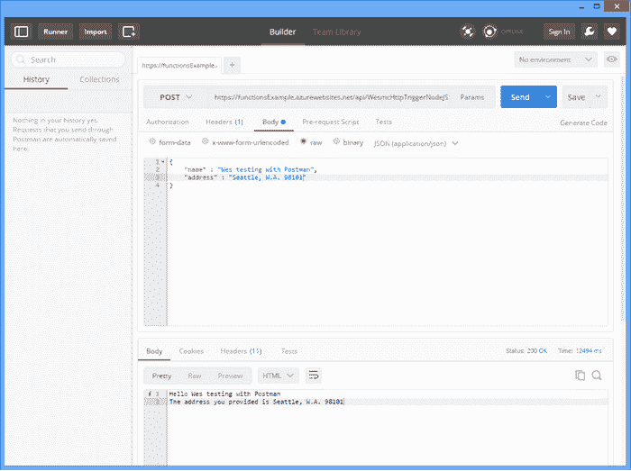

# 微软凭借 Azure 功能跃入无服务器计算领域

> 原文：<https://thenewstack.io/microsoft-draws-line-sand-azure-functions/>

无服务器计算有望彻底改变应用程序开发，提供更具响应性、以数据为中心的敏捷基础设施的优势。使用无服务器技术部署和构建应用程序，可以让开发人员花更少的时间关注服务器维护或扩展问题，而将更多的时间放在对用户至关重要的功能上。

自从两年前推出 AWS Lambda T1 以来，其他顶级云供应商也推出了他们的无服务器产品，IBM OpenWhisk 和 T2 Google Cloud Functions T3。开发者社区想知道微软是否会进入无服务器计算领域。

## 输入 Azure 函数

周四在微软年度[构建大会](https://build.microsoft.com/)，[上宣布的 Azure Functions](https://azure.microsoft.com/en-us/documentation/articles/functions-overview/) 是微软的开源无服务器计算产品。Azure Functions 是为支持企业级开发和物联网而构建的，具有在容器中运行的事件驱动的短期服务，以及旨在改善各种级别的开发人员体验的大量功能。

“该技术使开发人员无需提供服务器或机器映像，即可轻松部署算法来处理间歇到达的数据。IDC 软件开发研究项目主管阿尔·希尔瓦在一份声明中说:“开发者所要做的就是根据一个记录在案的应用模型提供代码片段，以处理输入并产生输出。

Azure 功能仪表板

有了 Azure，开发人员可以用各种语言创建函数，同时还能在 Bash、批处理和直接从 Windows PowerShell 中编码。这种方法与市场上的其他无服务器产品大致相同:AWS CLI 还允许开发人员在 Bash 中编码，能够根据需要编写用户数据外壳脚本来执行功能。Google Cloud Functions 目前仍处于 alpha 测试阶段，它允许开发人员用 JavaScript 编写代码，并在 Node.js 运行时环境中部署他们的功能。

然而，Azure Functions 从竞争对手中脱颖而出，至少目前如此，因为它为用户提供了不仅用 Node.js 和 Python，而且用 PHP、Java 甚至微软自己的 C#编写函数的能力。Azure 函数在 JSON 中配置和绑定，节点和 JavaScript API 可用于导出函数和发送/接收绑定。

## 使用 Azure 函数完成更多工作

Azure Functions 旨在让开发者能够响应当今应用开发生命周期的敏捷步伐。除了为用户提供多种语言进行编码，Azure Functions 还提供了轻松扩展功能的能力，而没有与空闲虚拟机相关的成本。

“MBaaS、PaaS、CaaS 都是关于无状态计算的。云的未来是无服务器计算。Janakiram & Associates 首席分析师贾纳奇拉姆·MSV 表示:“AWS Lambda、Azure 和谷歌云功能等服务将成为 Web、移动和物联网应用的首选后端。

微软 Azure: Web 应用创建

Azure Functions 为开发者提供了两种扩展功能的方式，一种是选择[应用服务计划](https://azure.microsoft.com/en-us/documentation/articles/azure-web-sites-web-hosting-plans-in-depth-overview/)，另一种是新发布的动态服务计划。应用服务计划提供分层定价结构，而动态服务计划将功能动态分配给一个实例，这意味着开发人员只需在使用计算资源时支付费用。对于那些运行短命微服务的人来说，这是一个意义重大的优惠。Hilwa 说:“随着 Docker 等容器技术的出现，将此类事件作为暂时工作负载进行处理的想法变得更加普遍，这种技术允许快速启动具有预配置执行环境的容器来执行短期计算。

用 Postman 测试 Azure 函数

Azure Functions 还允许已经在使用 Azure 平台的开发人员轻松地将功能集成到他们现有的[基于 Azure 的工作流](https://azure.microsoft.com/en-us/documentation/articles/functions-create-an-azure-connected-function/)，由其他 Azure SaaS 产品、内部系统和服务中发生的事件触发。用户可以快速创建事件处理功能、webhooks，并跨云平台集成 Azure 功能。

无论一个人的企业是刚刚开始使用无服务器计算，还是已经利用了它的许多好处，Azure Functions 都是当今开发人员可用的许多产品的有力竞争者。那些有兴趣尝试 Azure 功能的人可以通过访问微软 Azure 网站并注册一个账户来免费体验。

通过 Pixabay 的特征图像，通过[微软](https://azure.microsoft.com)的嵌入图像。

<svg xmlns:xlink="http://www.w3.org/1999/xlink" viewBox="0 0 68 31" version="1.1"><title>Group</title> <desc>Created with Sketch.</desc></svg>