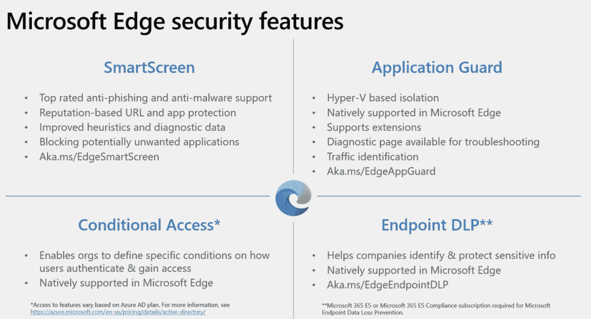
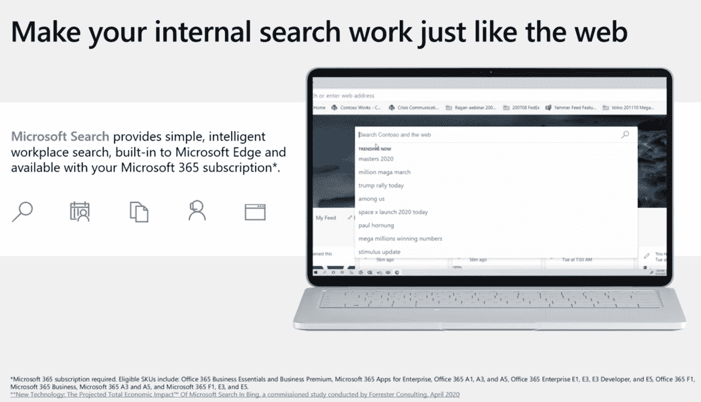
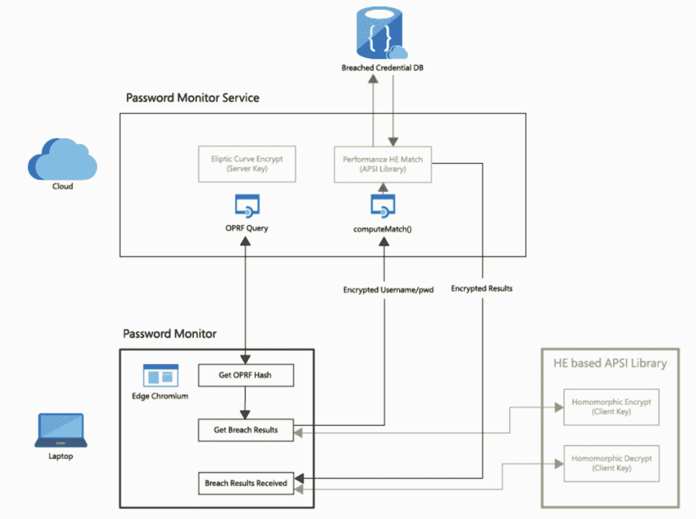

# 微软 Edge 成为谷歌 Chrome 的竞争对手

> 原文：<https://thenewstack.io/microsoft-edge-emerges-as-google-chrome-competitor/>

就在一年多前，微软推出了一款新的网络浏览器，旨在取代其长期运行且经常引发争议的 Internet Explorer 产品。这款新浏览器名为[微软 Edge](https://www.microsoft.com/en-us/edge) ，以基于谷歌开源浏览器引擎 [Chromium](https://www.chromium.org/Home) 而闻名。尽管放弃了大部分专有的浏览器软件，微软仍然在浏览器市场上竞争。本月早些时候，在年度开发者大会 [Ignite](https://myignite.microsoft.com/home) 上，微软宣传了 Edge 的[安全特性](https://myignite.microsoft.com/sessions/e6450bfb-4db9-491e-87d2-0bf2fbf5f1d1?source=sessions)，并在此过程中特别提到了谷歌 Chrome。此外，微软发布了新的 Edge 功能，如[垂直标签](https://www.theverge.com/2021/3/4/22313433/microsoft-edge-vertical-tabs-startup-boost-features)。

 [理查德·麦克马努斯

Richard 是 New Stack 的高级编辑，每周撰写一篇关于 web 和应用程序开发趋势的专栏文章。此前，他在 2003 年创立了读写网，并将其打造为全球最具影响力的科技新闻和分析网站之一。](https://twitter.com/ricmac) 

这是否意味着浏览器大战将在未来几年再次爆发？也许吧，但如果是这样，这就不会是一场控制底层技术的战争(就像 20 世纪 90 年代网景和微软之间的浏览器大战一样)。这一次将是关于**用户体验**——在微软的情况下，Edge 的目标用户主要是企业用户。正如我将在本专栏中解释的那样，商务人士的用户体验受到他们的雇主订阅哪些云和办公软件的影响。

但是，如果有一场新的浏览器战争，这将类似于一对兄弟姐妹的战斗。Chrome 和 Edge 有着相同的 DNA——它们都使用 Blink 渲染引擎和 V8 JavaScript 引擎，用户界面也很相似(除了一些例外，比如 Edge 中新的垂直标签)。总的来说，渲染技术是平等的——当然，这要感谢谷歌早在 2008 年就开源了 Chromium。

尽管如此，两家浏览器厂商之间的竞争在两个关键领域开始升温:**安全和隐私**。

## 安全性和 Windows 集成

安全是由微软 Edge 首席项目经理[科琳·威廉姆斯](https://www.linkedin.com/in/colleen-williams-5066b73/)主持的 Ignite 会议的主题。特别是 Windows 用户的安全性。

“在 Windows 10 上，Edge 比谷歌 Chrome 更安全，”Williams 说，并配有一张幻灯片，链接到关于 Edge 安全性的[文档](https://docs.microsoft.com/en-us/DeployEdge/ms-edge-security-for-business)。那篇文章首先指出，因为 Edge 是用 Chromium 构建的，所以它“与谷歌 Chrome 共享相同的精心设计和测试的安全架构和设计”。然而，文章接着指出，“微软 Edge 的安全故事并没有就此结束。”除了防范网络钓鱼和恶意软件，Edge 还“原生支持 Windows 10 上的硬件隔离。”还提到了对微软 365 安全和 Azure AD 条件接收的原生支持。

来源:微软 Ignite

Edge 之所以能够“原生支持”所有这些微软 office 和云安全功能，是因为它们都与 Windows 集成在一起。这是一个与 Internet Explorer 本身一样古老的故事——只是现在的焦点不再是浏览器如何与操作系统绑定，而是它与微软 365(微软的一套办公软件服务)和 Azure(其云平台)的连接。现在，操作系统集成只是故事的一部分，因为我们生活在一个软件即服务的世界。

微软认为，Edge 对其商业用户来说更安全，不是因为 Windows 本身，而是因为它能够更好、更安全地运行微软 365 应用程序。

Williams 后来在她的 Ignite 演示中展示了与 Microsoft 365 的进一步集成，其中有一个名为 Microsoft Search 的功能，该功能“内置于 Microsoft Edge 中，可通过您的 Microsoft 365 订阅获得。”在未来几年，我们可能会看到更多的办公服务被“内置”到边缘。

来源:微软 Ignite

这里值得注意的是，对于开发人员来说，在 Windows 上测试 web 应用程序时，Edge 可以有类似的集成优势。一位 Edge 用户[通过 Twitter](https://twitter.com/yessiwebto/status/1369821802147450880) 告诉我:

*“我尽可能使用 PWA(渐进式网络应用),当我安装 PWA 时，我总是使用原生网络引擎。所以在 Windows 上，我用 Edge。这是最快的，但更重要的是，它出现在操作系统对话框中，如“删除应用程序”和电池/数据使用报告。”*

请注意操作系统集成。虽然这为开发者带来了出色的用户体验，但毫无疑问，他们也在所有其他主流浏览器上测试他们的应用程序。

## 隐私

当微软 Edge 88 于今年 1 月发布时，微软强调了它的“内置强密码生成器”和一个名为密码监视器的新功能，该功能提供了“黑暗网络扫描”在另一篇[微软研究文章](https://www.microsoft.com/en-us/research/blog/password-monitor-safeguarding-passwords-in-microsoft-edge/)中描述如下:

*“如果用户保存的密码被第三方破解，该功能会通知用户。所有这些都是在确保微软不会知道用户密码的情况下完成的。”*

来源:微软研究院

密码监控技术使用一种称为同态加密(he)的加密技术，微软将[定义为“一种特殊类型的加密技术，允许对加密数据进行计算，而不需要访问秘密(解密)密钥。”](https://www.microsoft.com/en-us/research/project/homomorphic-encryption/)

不出所料，谷歌 Chrome 团队在同一周宣布了自己的新密码管理功能[——具体来说，是内置在其浏览器中的升级密码管理器。](https://security.googleblog.com/2021/01/new-year-new-password-protections-in.html)

我应该补充一下，Mozilla 的 Firefox，网景的开源后代，自 2019 年起就有了这种隐私功能[。因此，微软和谷歌都相对较晚实现这一功能。](https://techcrunch.com/2019/03/26/mozillas-free-password-manager-firefox-lockbox-launches-on-android)

## 那么，Edge 相对于 Chrome 有机会吗？

正如我们在网络浏览器的历史中所看到的，这个市场的赢家往往是由商业因素而非技术因素决定的。微软比任何公司都清楚这一点，在第一次浏览器大战中，它用 Windows 的力量击败了 Netscape。但谷歌学得很快，在 2008 年进入浏览器市场时，微软还在固步自封，没有创新。然后谷歌利用自己的市场力量——在网络平台上，而不是下面的操作系统层——成为今天的主导浏览器(它目前拥有大约 66%的桌面市场)。

然而，尽管只有一年的历史，微软 Edge 在浏览器市场份额上正在取得进展。Statcounter 目前的份额约为 8%，与 Firefox 持平，仅次于 Safari 的 10%。它最近的增长几乎肯定是由于它作为 Windows 10 的一部分被自动安装和更新。因此，微软正在回归其将浏览器整合到 Windows 生态系统的老把戏。这一次的不同之处在于，微软不再在软件市场占据主导地位；事实上，它在搜索和移动领域远远落后于谷歌。也就是说，微软在办公软件和云计算领域仍然有很大的影响力——这两个领域越来越紧密地交织在一起。可以说，它在这两个领域都领先于谷歌(当然是在办公软件领域，尽管它在云计算领域更接近谷歌)。

在浏览器市场，很明显的是，在未来几年，谷歌 Chrome 比微软 Edge 失去的要多得多。很有可能 Edge 很快就会成为仅次于 Chrome 的第二名，并蚕食 Chrome 在桌面市场的份额。如果微软的核心企业用户开始在**的工作和家庭中使用 Edge，那么，我们可能会面临一场战斗！具有讽刺意味的是，如果发生这种情况，微软将为此感谢谷歌的技术。**

通过 Pixabay 的特征图像。

<svg xmlns:xlink="http://www.w3.org/1999/xlink" viewBox="0 0 68 31" version="1.1"><title>Group</title> <desc>Created with Sketch.</desc></svg>