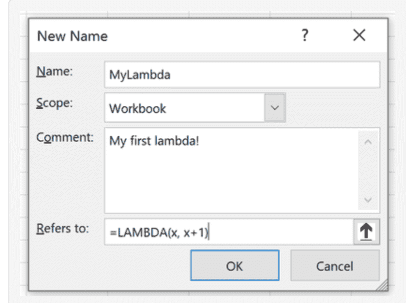
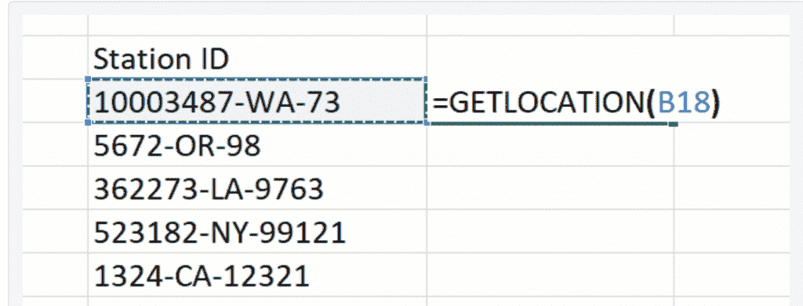
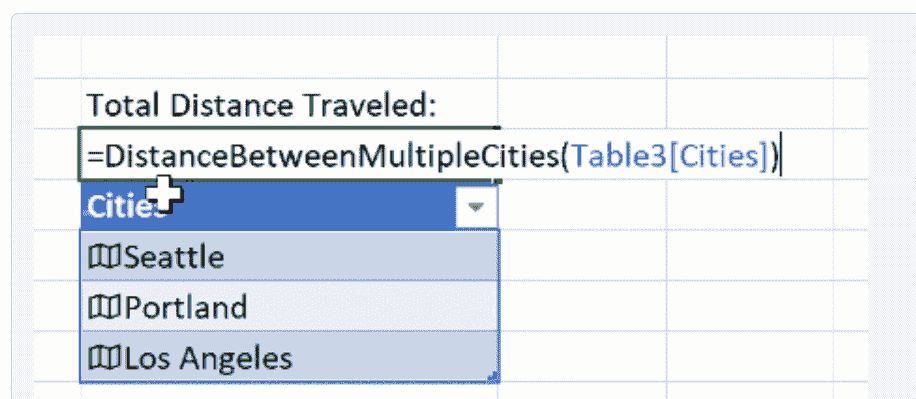

# Microsoft Excel 成为一种合适的编程语言

> 原文：<https://thenewstack.io/microsoft-excel-becomes-a-programming-language/>

它可能是仍在广泛使用的最古老的软件。34 年前，就在苹果推出第一代 MAC 电脑三年后，微软发布了其熟悉的 Excel 电子表格应用程序的第一个版本，最初是丹·布里克林的 VisiCalc 的粗略复制。快进到未来，爱尔兰时报在 2017 年指出，微软首席执行官塞特亚·纳德拉称 Excel 是微软最重要的消费产品，指出它拥有超过 7.5 亿用户。

因此，当世界上最大的公司之一增强其办公软件套件的一个关键组件时，感觉几乎是历史性的——然而毫无疑问，Excel 已经升级了一个主要的新功能。

微软的研究人员认为，由于引入了一个名为 LAMBDA 的新功能，他们现在终于将 Excel 转变为一种成熟的编程语言。“有了 LAMBDA，Excel 就变成了*图灵完全*。原则上，你现在可以用 Excel 公式语言编写任何*计算，”一个微软博客宣称。*

《Visual Studio》杂志上的一篇新文章[解释道:“图灵完整性是成熟编程语言的试金石”。它补充说，“早期的社区反应令人鼓舞”，并指出微软研究人员正在热情地设想熟练的 Excel 用户创建“对他们的同事无缝显示 Excel 的一部分，他们只需调用它们。”](https://visualstudiomagazine.com/articles/2021/01/27/excel-lambda.aspx)

让我们来看看这些变化，以及它们预示着 Excel 作为一种编程语言的未来。

## 用 Excel 编程

Excel 用户的大部分工作都是使用公式来完成的——在公式中，单元格的输入以等号开头，后面跟着某种计算(" =A2 + B2 ")。微软的博客称公式是世界上使用最广泛的编程语言——然而它总是被限制在预先定义的选项范围内。为了推出自己的定制功能，用户不得不使用微软的另一种基于宏的编程语言 Visual Basic for Applications。(或者，[从 2018 年](https://www.mrexcel.com/products/excel-javascript-udfs-straight-to-the-point/)开始，[JavaScript](https://www.infoq.com/news/2018/06/microsoft-excel-js-functions/)——当然还有微软的 JavaScript-superset[TypeScript](https://docs.microsoft.com/en-us/office/dev/add-ins/excel/custom-functions-parameter-options?tabs=typescript)。)

在 POPL 2021 的一段视频中，微软资深研究员[西蒙·佩顿·琼斯](https://www.microsoft.com/en-us/research/people/simonpj/)指出，Excel 的终端用户实际上是在使用 JavaScript 实现功能，一位高级首席研究员和一位高级首席研究经理在[的微软研究博客文章](https://www.microsoft.com/en-us/research/blog/lambda-the-ultimatae-excel-worksheet-function/)中重申了这一点。“编写 Excel 公式的用户数量比世界上所有 C、C++、C#、Java 和 Python 程序员的数量加起来还要多。”

[https://www.youtube.com/embed/tfz4jdwsEaQ?feature=oembed](https://www.youtube.com/embed/tfz4jdwsEaQ?feature=oembed)

视频

但是现在，所有这些用户都可以编写实际的程序，而无需离开 Excel 公式的世界。更具体地说，用 Excel 编写的公式现在可以“包装”在一个命名的 LAMBDA 函数中，然后可以从电子表格中的任何地方调用它。是的，它支持递归编程，所以你甚至可以从你的命名函数中调用你的命名函数。

这些名字是在 Excel 公式工具栏中的“名称管理器”选项中提供的。就像 git 一样，用户可以在创建函数时输入注释。

正如微软高级研究员[杰克·威廉姆斯](https://www.linkedin.com/in/jack-williams-6a064333)在 POPL 2021 上描述的，“在 Excel 中，现在可以构建真正的、成熟的编程体验……我们现在可以开始构建看起来像真正程序的东西。”

博文提供了一个例子:一个值包含函数名的单元格。

最终显示在该单元格中的值是指定函数的输出，而该函数的参数是…另一个单元格的地址。

或者，函数也可以[接受数组](https://techcommunity.microsoft.com/t5/excel/lambda-examples-distance-between-two-cities/m-p/1952946)(保存多个值)作为其参数——因为 Excel 在 2018 年 9 月开始添加在 Excel 中定义数组的[功能。](https://support.microsoft.com/en-us/office/dynamic-array-formulas-vs-legacy-cse-array-formulas-ca421f1b-fbb2-4c99-9924-df571bd4f1b4)

一个函数也可以发送一个数组作为它的返回值，它的值“溢出”到多个单元格中。在 POPL 的视频演示中，Williams 编写了一个可以立即生成日历的函数。)

Excel 的博客文章承诺将来会有更多的数组操作函数出现。微软的研究博客甚至承诺，该公司正在研究“数组处理组合子的有效实现，如 MAP 和 REDUCE ”,用于命名函数的输出。

Excel 的项目经理 Chris Gross 暗示对未来有更高的期望。“我很乐意看到我们为调试和编写公式添加急需的工具，”他在评论中写道。"类似于你用伟大的 IDEs 得到的东西."

## 2004 年的一个梦

对西蒙·佩顿·琼斯来说，这代表着一个长期梦想的实现。在 POPL 2021 的演讲中，这位长期的微软研究员和函数式编程倡导者讲述了早在 2004 年访问微软 Excel 团队的故事。“我了解到 Excel 就像一艘超级油轮。它有很高的价值。它的质量非常大。它由人数少得惊人、超负荷工作的工作人员操作。所以改航线不容易！”

但 10 年后，他发现其中一名中层项目经理，“我提到的那些友好、善于接受的人，后来被提升为 Excel 的大老板……突然之间，我们开始得到高级管理人员对这些想法的认可。”更重要的是，要有工程支持来实现它。

微软的研究博客称这个新的 LAMBDA 特性是“一个质的转变，而不仅仅是一个增量变化。”命名 Lambda 函数为程序员提供了高质量的类似语言的“可组合性”和“可重用性”的属性，尊重良好编码的一个长期原则，即不重复工作。

一个命名函数甚至可以成为电子表格中另一个命名函数的一部分。但是，根据研究博客的帖子，这仅仅是更复杂结构的开始。它最终设想了“工作表定义的函数”,其中几个不同的函数，每个都在不同的单元格中定义，共同用于定义一个更大的函数。

有趣的是，表定义函数的概念是在 2003 年与 Jones 合著的一篇研究论文中首次描述的。“我们的案例研究是不寻常的，因为它强调了编程语言洞察力可以应用于通常不被认为是编程语言的产品，”琼斯[写道](https://www.microsoft.com/en-us/research/publication/a-user-centred-approach-to-functions-in-excel/)。

同样在 POPL 2021 上，来自微软剑桥研究院的高级研究员[阿德维特·萨卡尔](https://www.microsoft.com/en-us/research/people/advait/publications/?lang=fr_ca)设想了额外的单元格用于注释代码和添加格式装饰。“我们将编程语言设计视为一门研究学科，其目标是创造更有用的人机界面，”萨卡尔曾说。

去年，Sarkar 与人合作撰写了一篇论文，设想了一个名为 Gridlets 的新 Excel 概念，其中可以复制和粘贴选定的单元格，允许重用一组公式，最终提供一种面向对象的工作表定义函数。网格可以一次又一次地被实例化，每个网格都有自己独特的参数或“属性”，而原始父网格中的变化将传播到其子网格。

这是微软剑桥研究院“Calc Intelligence”团队的工作，他们的既定目标是将 Excel 提升为一种编程语言。目前它只对“办公室内幕”项目的[测试频道](https://insider.office.com/en-us/join/windows)成员开放。Excel 的产品负责人布莱恩·琼斯在 POPL 2021 的发布会上回忆道，尽管在这个程序中，热切的用户抱怨他们推出这个程序的速度不够快。威廉姆斯说这个功能引起了很多人的兴趣。“甚至在 LAMBDAs 发布的前几周，YouTube 上就有几十万次观看的视频。探索电子表格和高阶函数式编程如何共存并产生独特体验的空间真的很大。”

微软 Excel 博客上的帖子最后承诺，LAMBDA 函数只是开始，并补充道“加入我们的旅程。”

* * *

## WebReduce

<svg xmlns:xlink="http://www.w3.org/1999/xlink" viewBox="0 0 68 31" version="1.1"><title>Group</title> <desc>Created with Sketch.</desc></svg>