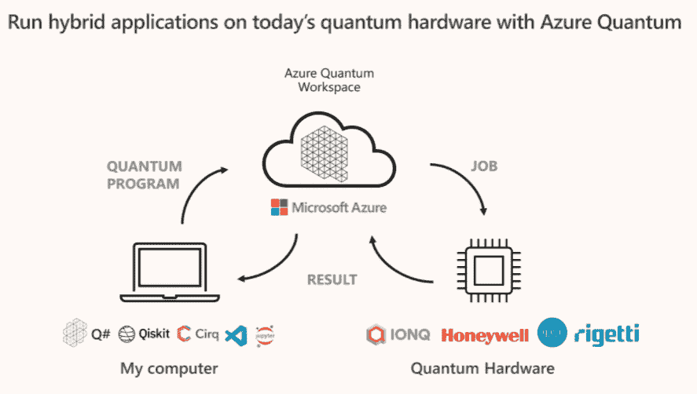

# 微软扩展 Azure 量子云服务

> 原文：<https://thenewstack.io/microsoft-expands-azure-quantum-cloud-services/>

微软基于云的量子计算业务正在扩展其提供给企业和其他组织的硬件和软件功能，这些企业和组织希望探索新兴的量子计算领域。

该公司正在与[量子计算](https://thenewstack.io/robots-learn-faster-with-quantum-technology/)芯片和软件提供商 [Rigetti Computing](https://www.rigetti.com/) 合作，让那些使用[微软 Azure Quantum](https://azure.microsoft.com/en-us/services/quantum/) 量子云服务的用户可以使用这些系统。一旦在 2022 年第一季度上市，组织将能够通过利用各种量子软件框架对 Rigetti 计算机进行编程。

微软和 Rigetti 上个月宣布这一消息的几天前，这家企业软件和云巨头的官员表示，他们正在与国际咨询公司毕马威(KPMG)合作，使用他们可以通过 Azure Quantum 访问的量子优化技术来解决业务问题。

“优化问题存在于许多行业，使用传统方法往往难以解决，而传统方法可以加速优化，”微软量子业务总经理 [Krysta Svore](https://www.linkedin.com/in/krysta-svore-a8920542/) 在[博客文章](https://cloudblogs.microsoft.com/quantum/2021/12/02/microsoft-and-kpmg-collaborate-to-build-industry-optimization-solutions-using-azure-quantum/)中写道。“在经典计算机上模拟这些量子效应导致了在经典硬件上运行的量子优化(QIO)算法的发展。这些算法使研究人员、开发人员和解决方案提供商能够从当今经典硬件上的量子方法中受益，提供比传统方法更快的速度。”

## **量子创新升温**

微软及其技术合作伙伴的声明是量子计算领域创新和产品加速的最新例证，这个领域自 20 世纪 80 年代以来一直被谈论，但近年来取得了重大进展，不仅受到了微软、谷歌和 IBM 等一系列老牌供应商的欢迎，也受到了越来越多寻求市场牵引力的初创公司的欢迎。

最近，该领域的领导者之一霍尼韦尔的量子业务与初创公司 [Cambridge Quantum](https://thenewstack.io/lambeq-a-toolkit-for-quantum-natural-language-processing/) 合并，成立了一家名为[Quantum](https://thenewstack.io/new-company-quantinuum-offers-quantum-based-encryption/)的新公司，目标是提供广泛的软硬件产品和服务组合。

微软的新闻也关注了云在推进量子计算工作中的作用。微软不是唯一一家在该领域开展云业务的供应商。 [IBM](https://www.ibm.com/cloud?utm_content=inline-mention) 、[谷歌](https://thenewstack.io/googles-quantum-computer-can-exponentially-suppress-errors/)、[亚马逊网络服务](https://aws.amazon.com/?utm_content=inline-mention) (AWS)和阿里巴巴都是提供不同程度的云接入量子计算服务的超大规模公司，并且已经谈论了更加雄心勃勃的目标。

例如，谷歌今年早些时候宣布计划在 2020 年前推出一个商业量子系统，该系统将运行大规模计算而不会出错。

## **云作为使能因素**

根据全球市场观察，全球量子市场预计到 2028 年将超过 50 亿美元，而云是其中的一个关键驱动力。云领域占 2020 年量子计算支出的 75%以上，云提供的更广泛的设备上的量子计算访问将继续是推动市场扩张的另一个因素。

获得基于云的量子技术也使公司能够开发软件平台、库和工具包，当它们可用时，将能够在量子系统上运行。

## **广泛的可访问性将是关键**

Endpoint Technologies Associates 首席分析师罗杰·凯(Roger Kay)表示，云是 quantum 的一个良好计算模型的原因有很多，包括让它更容易获得。Kay 告诉 The New Stack，很少有组织能够负担得起在内部安装、部署和运行这些系统。除了这些系统的价格之外，它们内部的量子位需要保持在极低的温度下，这意味着许多量子计算机需要大规模的冷却系统。

另一个问题是缺乏精通量子计算的人才，这与网络安全和数据科学等领域类似的技能短缺相呼应。

凯说，云将是“几乎每个人”的首选方式。“没有其他更好的方法了。…为了产生一批量子程序员，他们需要习惯这些工具，看看它们能做什么。玩玩模板，尝试一些东西，然后开始尝试用工具解决他们自己的实际问题，只是扩展编程模型。”

## **蔚蓝量子力求灵活**

[Azure Quantum 的首席项目经理 Fabrice Frachon](https://www.linkedin.com/in/frachon/) 本周在一篇[博客文章](https://cloudblogs.microsoft.com/quantum/2021/12/06/azure-quantum-open-flexible-and-future-proofed/)中写道，微软正在努力确保开发者在创建他们的软件时，可以在云环境中利用广泛的平台、语言和其他工具。引入 Rigetti 系统将通过提供供应商基于 gate 的超导处理器和使用量子中间表示(QIR)来实现低延迟和并行执行，增加云环境的灵活性。

“Azure Quantum 提供了最好的开发环境，可以同时为多个平台创建量子算法，同时保留为特定系统调整相同算法的灵活性，”他写道。“你可以从许多编程语言中选择，如 Qiskit、Cirq 和 Q#并在多个量子系统上运行你的算法。”

微软和 Rigetti 都是新 QIR 联盟的创始成员，该联盟是 Linux 基金会赞助下的一项联合努力，旨在帮助推动互操作性，减少量子计算领域的开发工作。

## **微软和毕马威**

微软与毕马威的合作是 QIO 在该领域更大努力的一部分，旨在使研究人员和其他人能够使用由 CPU、GPU、现场可编程门阵列(FPGAs)和其他传统芯片驱动的经典系统来解决现在的量子挑战。

微软的 Svore 写道:“优化问题存在于许多行业，使用传统的方法来加速优化通常很难解决。”“在经典计算机上模拟这些量子效应导致了在经典硬件上运行的量子优化(QIO)算法的发展。这些算法允许研究人员、开发人员和解决方案提供商从当今经典硬件上的量子方法中受益，提供了超越传统方法的速度。”

像毕马威这样的合作伙伴可以利用 Azure Quantum 中的优化工具来帮助开发这些算法。据微软称，这家咨询公司有一支致力于量子相关技术的团队，正在与客户合作开发未来的量子计算技术，并将新兴能力应用于当前的商业问题。

Azure Quantum 和毕马威之间的最初合作项目将针对优化金融服务组合和电信车队服务的基准解决方案。

<svg xmlns:xlink="http://www.w3.org/1999/xlink" viewBox="0 0 68 31" version="1.1"><title>Group</title> <desc>Created with Sketch.</desc></svg>